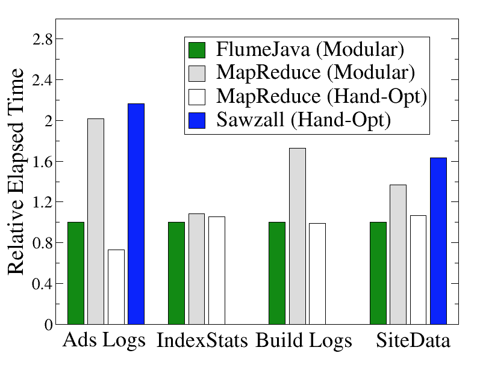

## 概述

本文不是一篇Beam的入门文档，不会介绍Beam的基本概念；而会主要探讨Beam的表达力，Beam的性能，以及Beam目前在业内的使用情况。面向的读者是那些想使用Beam作为自己公司操作大数据的统一API，但是还有所顾虑的人们。

## 表达力

### 离线

Beam里面有两个核心原语：

- ParDo: 来处理通用的基于单条数据的计算: 每条需要处理的数据会被喂给用户提供的指定的一个函数(Beam里面的@ProcessElement), 然后输出0个或者多个输出。
  - 我们平常熟悉的Filter, AppendColumn等等都可以通过ParDo来实现。
  - ParDo的语义涵盖了Hadoop中Map-Shuffle-Reduce的Map，Reduce
- GroupByKey: 用来做Grouping的操作。
  - 我们平常熟悉的Count, Sum, Min等等都可以通过GroupByKey来实现。
  - Group的语义涵盖了Hadoop中Map-Shuffle-Reduce的Shuffle

既然`Map-Shuffle-Reduce`这三个关键语义都被Beam涵盖了，你觉得它的表达力如何？

### 实时

对于GroupByKey操作，在实时场景下会有所不同：实时场景下我们不知道什么时候应该完成对某个key的group。因此GroupByKey被扩展成了更通用的: GroupByKeyAndWindow。这里的Window通常是按照时间来划分的，比如“小时窗口”，“5分钟窗口”。当窗口结束的时候，我们就认为GroupByKey说需要的所有的数据到到达了，因此可以完成这个操作。

通过引入Window原语，（离线情况下有一个默认的全局window），我们把GroupByKey这种聚合操作在离线和实时层面也统一了。

#### 数据延时

而在实际业务中，数据的到达时间往往不会严格按照窗口规定的时间按时到达:

- 数据可能晚来，导致实时计算的数据不准确
- 窗口可能画的太大，延迟太高

Beam提供了Trigger的机制来解决上述的两个问题。

> 总结一下, Beam的模型支持了ParDo, GroupByKey, Window等核心概念，通过这些概念的任意组合就可以表达我们在离线、实时业务中遇到各种问题。Beam还提供了Trigger的机制来让我们可以在准确性和时间延迟之间做平衡。

关于Beam表达力的进一步信息可以参见参考资料[3]。

## Beam的表达力能涵盖底层引擎(比如ODPS， Spark, Hadoop)的所有功能么？

我就这个问题咨询了一下Beam的开发者: Google的Beam开发者Frances Perry, 他给出的回复是:

> Beam的表达能力的集合既不是所有底层引擎能力的交集(那样的话，API的能力太受限了), 也不是所有底层引擎能力的并集（那样的话那也太理想太激进了）。
>
> Beam是要站在所有数据处理的最前端（数据处理人直接面对的那一层），把表达数据逻辑所需要的“模式”(比如Beam里面的Windowing, Trigger)封装出来，包成API。而把具体的一些实现细节功能点隐藏掉(比如Storm里面的Bolt, Spark里面的DataFrame等等)。

因此Beam作为一种数据处理的API, 其实**只需要关心模式，而不关心细节的功能点**。

当然这并不意味着Beam的API从设计的第一天起就可以表达*所有*的数据计算逻辑，Beam的API也是不断演进的，比如最近就准备加入一个新的叫做[Stateful Processing](https://beam.apache.org/blog/2017/02/13/stateful-processing.html)的新特性。但是既然已经那么多公司在使用Beam了(详见本文最后一节)，说明目前用它表达绝大部分数据处理的场景已经不是问题了。

关于作者的详细回复可以看参考文献: [2]。

## Beam Pipeline的性能

由于目前关于Beam性能方面的资料比较少，我去研究了它的前身FlumeJava性能相关的资料。因此下面的论述的主体都是FlumeJava, 但是因为Beam是从FlumeJava演化而来的，因此这些性能相关的结论对Beam也适用。

### 理论分析

#### 延迟求值

为了获得更好的性能，FlumeJava内部对并行的操作使用了**延迟求值**的优化。我们代码中对于并行操作(各种Transform)的调用并没有真正的去执行那个操作，而只是简单的把这些对数据的操作以及对应的参数记录了下来。这些被记录下来的操作串联拼接在一起就组成了一个DAG状的执行计划。

通过生成执行计划，而不是直接运行用户编写的Pipeline, **使得Beam(FlumeJava)有机会可以对这个执行计划进行各种优化 -- 优化之后会比你手动优化之后的任务要更高效！**

#### 执行计划的优化

在真正执行之前，Beam会对这个执行进行一些优化, 比如`ParDo`操作的的合并

通过ParDo的合并，可以减少任务的步数，这样在生成底层引擎任务的时候，比如Hadoop的时候，会生成比较少的MapReduce, 更少的MapReduce意味着更少的IO, 更好的性能。

其它的优化措施还有`MSCR(把一个ParDo, GroupByKey, CombineValues, Flattern操作合并成一个MapReduce)`, `MSCR合并`等等。

### Benchmark

图中Ads Logs, IndexStats, Build Logs, SiteData是Google内部的几个用来做性能测试的几个不同的场景，这几种场景分别用FlumeJava, MapReduce, 以及手工优化过的MapReduce来编写的。可以看出，FlumeJava与经过手工优化过的MapReduce的性能是差不多的。

关于这个性能测试的更详细的信息见参考资料[4]。

## Beam在目前业界的使用情况怎么样?

1. Google: Beam在Google的前身是FlumeJava, FlumeJava是Google内部并行数据计算的主要Java API（参考资料[4]）。
2. Spotify: 他们在生产环境使用Beam, 实时和离线的场景都有，他们目前感觉Beam在离线计算方面比实时要成熟。（参考资料[1]）
3. Cisco: 准备在生产环境中使用Beam，runner会采用Google Dataflow Service，一开始会以实时任务为主。（参考资料[1]）
4. Talend准备把Beam作为他们产品的中间层能力，这样可以让在支持各种底层计算引擎（CDH Hadoop， HDP Hadoop， Spark等等 ）的时候公用代码，减少维护各种不同底层引擎升级带来的痛苦（原文是: versions updates are really painful）（参考资料[1]）

## 参考文献

1. [Question and Answers with the Apache Beam Team](http://www.jesse-anderson.com/2016/07/question-and-answers-with-the-apache-beam-team)
2. [Google的Beam开发者Frances Perry关于Beam表达力的回复](https://lists.apache.org/thread.html/415a7845ee6166d4ab9e97244002387d59d3ce2320062f240ee3b6b9@%3Cuser.beam.apache.org%3E)
3. [Dataflow Model论文](https://static.googleusercontent.com/media/research.google.com/en//pubs/archive/43864.pdf)
4. [FlumeJava: Easy, Efficient Data-Parallel Pipelines](http://pages.cs.wisc.edu/~akella/CS838/F12/838-CloudPapers/FlumeJava.pdf)
5. [Stateful processing with Apache Beam](https://beam.apache.org/blog/2017/02/13/stateful-processing.html)