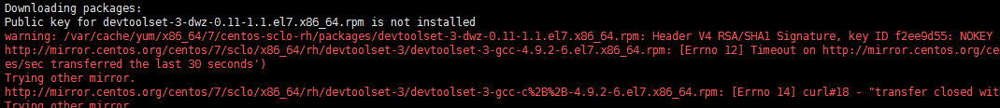
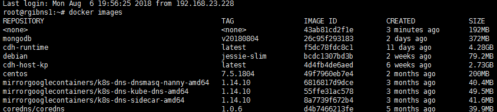

## 目标

在centos中装一个支持python算法库的软件

## Dockerfile

要求创建一个python3.5的环境，能够支持fbprophet，由于fbprophet必须要高版本的gcc库支持，因此这里我们将使用最新版的gcc来编译python。

```sh
FROM centos:7.5.1804
MAINTAINER pengxingxiong@ruijie.com.cn
# install wget
RUN yum install -y wget
# replace yum repos
RUN mv /etc/yum.repos.d/CentOS-Base.repo /etc/yum.repos.d/CentOS-Base.repo.backup \
    && wget -O /etc/yum.repos.d/CentOS-Base.repo http://mirrors.aliyun.com/repo/Centos-7.repo \
    && enabled=0 \
    && yum clean all \
    && yum makecache
# Install c/c++ development tools
RUN yum install -y centos-release-scl 
RUN yum install -y devtoolset-3-toolchain
RUN scl enable devtoolset-3 bash
RUN printf "\nsource scl_source enable devtoolset-3\n" >> /root/.bashrc
RUN printf "\nsource scl_source enable devtoolset-3\n" >> /home/$BUILD_USER/.bashrc
ENV PATH /opt/rh/devtoolset-3/root/usr/bin:$PATH
# install python init dependents lib
RUN yum install -y make \
    && yum install -y tk-devel \
    && yum install -y openssl-devel \
    && yum install -y bzip2-devel \
    && yum install -y expat-devel \
    && yum install -y gdbm-devel \
    && yum install -y readline-devel \
    && yum install -y sqlite-devel
# Install Python
ADD Python-3.5.2.tgz /usr/local
RUN cd /usr/local/Python-3.5.2/ \
    && ./configure --prefix=/usr/local \
    && make \
    && make install \
    && pip install --upgrade pip \
# install python dependents
RUN && pip3 install pystan \
    && pip3 install fbprophet \
    && pip3 install pymongo
```


### 遇到的坑

1. 利用好缓存，因为每个软件都从国外下载，较慢，因此根据功能来安排层次。docker的每一条指令都是一个层，有的时候可以将下载软件功能都连成一条指令。这样下次调试的时候这个指令层就可以直接复用了。

2. 减少空行，空行在docker中会报警告。

3. gcc->python的安装时发现运行到命令`scl enable devtoolset-3 bash`后，产生的gcc无法被下一层使用，会导致python的`./configure`命令找不到c编译库。因此要想办法让gcc的配置固化。这里主要的方法是：

   1. 使用环境变量命令来将gcc固化，结合`ENV`，但是问题在于gcc不像java那样好配置；

   2. 将gcc命令写入到启动命令脚本`.bashrc`中，也就是代码中的：

      ```sh
      RUN printf "\nsource scl_source enable devtoolset-3\n" >> /root/.bashrc
      RUN printf "\nsource scl_source enable devtoolset-3\n" >> /home/$BUILD_USER/.bashrc
      ```

   3. `ADD`命令会默认将压缩包解压，所以注意一下在容器内部是直接存在文件夹的；同时也要考虑文件夹是否存在会导致文件夹的目录有变化，最好的方式确保容器中有这个目录。


#### 善用缓存



在一些国外的源下载时经常就网速不佳，下载很长时间，一种好的办法是将要下载的软件都写在一个RUN指令中，这样，当发现非下载的步骤错误时，软件的缓存不会被破坏，而继续使用。

#### 清除缓存

主要是指无用的`<none>`镜像，这些镜像主要是制作镜像过程中产生的中间镜像，当最终镜像制作成功后可以删除。



```sh
# 清除无标签的镜像，即表现为<none>
docker images|grep none|awk '{print $3 }'|xargs docker rmi
```

