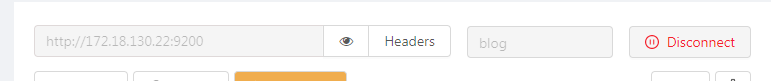

# 安装最新版本的ElasticSearch

```shell
docker run -p 9200:9200 -d -e "discovery.type=single-node" --name elasticsearch elasticsearch:7.0.0
```

其中-d表示在后台执行，一般情况下为了可视化的需要，会再安装一个工具软件

```shell
docker run -p 1358:1358 -d appbaseio/dejavu
```

该工具dejavu可以在[dejavu网址](https://github.com/appbaseio/dejavu/)获取。

工具使用方法：

先用postman创建一个索引，如下：

```shell
curl -H 'Content-Type:application/json' -XPUT http://localhost:9200/blog/article/1 -d '
{
      "id": "1",
      "title": "New version of Elasticsearch released!",
      "content": "Version 1.0 released today!",
      "priority": 10,
      "tags": ["announce", "elasticsearch", "release"]
}'
```

然后在dejavu首页查询这个索引：



然后就可以连接上了。