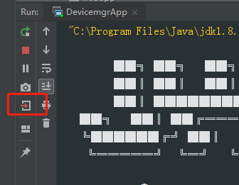
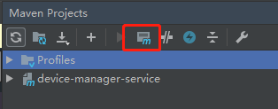
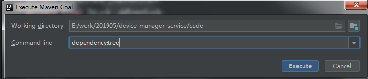
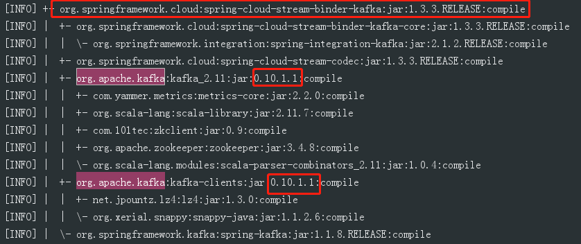

# 内存泄露调试

```shell
17-May-2019 20:39:51.714 WARNING [http-nio-18181-exec-116] org.apache.catalina.loader.WebappClassLoaderBase.clearReferencesThreads The web application [terminal-manager-service] appears to have started a thread named [ZkClient-EventThread-864-rgonc1:2181,rgonc2:2181,rgonc3:2181] but has failed to stop it. This is very likely to create a memory leak. Stack trace of thread:
```


内存泄露关键字：

```shell
This is very likely to create a memory leak
```

## kafka使用的版本问题

从tomcat的内存泄露日志查看发现存在大量的zkclient调用。

在微服务中，尝试在servlet容器关闭的时候打印线程池的调用。

```java
@Component
public class ServletContextLTest implements ServletContextListener {
    @Override
    public void contextInitialized(ServletContextEvent sce) {}

    @Override
    public void contextDestroyed(ServletContextEvent sce) {
        ThreadPoolUtils.closeExecutor();
				 System.out.println(Thread.getAllStackTraces().keySet());
    }
```

然后正常退出服务



程序会打印以下线程栈中所有的key结果：




输入dependency:tree（如果是maven独立工具，那么在项目pom.xml目录下输入mvn dependency:tree）



然后就能够发现以下依赖关系



kafka版本号为0.10，该版本直接调用zookeeper的2181端口，且每次会创建多个连接对象，在发生内存泄露时，还会导致zookeeper的连接数达到上限，造成zookeeper不可用，带来组件的稳定性问题。


# tomcat重启后会删除guard文件

165.41环境中tomcat在系统reboot或者启动两次tomcat时会主动删除guard文件夹。

```shell
cat /etc/rc.local
```

tomcat的启动脚本为startup.sh，观察tomcat日志，存在以下错误：

```shell
02-Apr-2019 06:07:02.625 INFO [http-nio-18181-exec-5] org.apache.catalina.core.ApplicationContext.log Manager: list: Listing contexts for virtual host 'localhost_ibnsapps'
Exception in thread "guard-Executor-5" Exception in thread "guard-Executor-10" java.lang.IllegalStateException: java.io.FileNotFoundException: /user/rgonc/RG-ONC-2.1.0/RG-ONC_2.1.0-Web/ibnsapps/guard/WEB-INF/lib/faux-pas-0.8.0.jar (No such file or directory)
Exception in thread "guard-Executor-4" 	at org.apache.catalina.webresources.AbstractSingleArchiveResourceSet.getArchiveEntry(AbstractSingleArchiveResourceSet.java:101)
	at org.apache.catalina.webresources.AbstractArchiveResourceSet.getResource(AbstractArchiveResourceSet.java:256)
	at org.apache.catalina.webresources.StandardRoot.getResourceInternal(StandardRoot.java:281)
	at org.apache.catalina.webresources.Cache.getResource(Cache.java:62)
	at org.apache.catalina.webresources.StandardRoot.getResource(StandardRoot.java:216)
	at org.apache.catalina.webresources.StandardRoot.getClassLoaderResource(StandardRoot.java:225)
	at org.apache.catalina.loader.WebappClassLoaderBase.findClassInternal(WebappClassLoaderBase.java:2209)
	at org.apache.catalina.loader.WebappClassLoaderBase.findClass(WebappClassLoaderBase.java:816)
	at org.apache.catalina.loader.WebappClassLoaderBase.loadClass(WebappClassLoaderBase.java:1261)
	at org.apache.catalina.loader.WebappClassLoaderBase.loadClass(WebappClassLoaderBase.java:1121)
	at ch.qos.logback.classic.spi.LoggingEvent.<init>(LoggingEvent.java:119)
	at ch.qos.logback.classic.Logger.buildLoggingEventAndAppend(Logger.java:419)
	at ch.qos.logback.classic.Logger.filterAndLog_0_Or3Plus(Logger.java:383)
	at ch.qos.logback.classic.Logger.error(Logger.java:538)
	at io.github.jhipster.async.ExceptionHandlingAsyncTaskExecutor.handle(ExceptionHandlingAsyncTaskExecutor.java:76)
	at io.github.jhipster.async.ExceptionHandlingAsyncTaskExecutor.lambda$createWrappedRunnable$1(ExceptionHandlingAsyncTaskExecutor.java:70)
	at java.util.concurrent.ThreadPoolExecutor.runWorker(ThreadPoolExecutor.java:1142)
	at java.util.concurrent.ThreadPoolExecutor$Worker.run(ThreadPoolExecutor.java:617)
	at java.lang.Thread.run(Thread.java:745)
Caused by: java.io.FileNotFoundException: /user/rgonc/RG-ONC-2.1.0/RG-ONC_2.1.0-Web/ibnsapps/guard/WEB-INF/lib/faux-pas-0.8.0.jar (No such file or directory)
```

该日志主要是提示guard的文件不存在，从BUG复现来看：

```shell
操作步骤：
1，-E物理机，安装2.0发布版本，运行正常，断电
2，恢复供电后，WEB无法登陆，经确认WEB挂在guard守护服务；
3，从日志查看guaid文件夹包被删除，无法自驱启动(已等待超过2个小时)
4，手动停止WEB然后启动，可正常启动。(shutdown.sh后startup.sh)

PS：相同现象在虚机ISO启动时也偶尔出现。
复现条件： 即控制器启动后，会出现一定概率WEB启动失败
```

这里的断电是指reboot（系统重启），观察控制器所在服务器节点的系统启动文件

```shell
cat /etc/rc.local
```

**rc.local**文件的内容为：

```shell
export LANG=en_US.UTF-8
export JAVA_HOME=/user/rgonc/RG-ONC-CAMPUS-CLOUD_1.55/jdk1.8.0_102
export JRE_HOME=${JAVA_HOME}/jre
export CLASSPATH=${JAVA_HOME}/lib:${JRE_HOME}/lib
export PATH=${JAVA_HOME}/bin:${JRE_HOME}/bin:${PATH}
/user/rgonc/patch/ufw.sh
# 启动ntp时钟服务器
/etc/init.d/ntp start
# 时钟同步
/usr/sbin/ntpdate -u 192.168.5.40
/user/rgonc/RG-ONC-CAMPUS-CLOUD_1.55/RG-ONC-Controller/bin/run start
/user/rgonc/RG-ONC-CAMPUS-CLOUD_1.55/RG-ONC-CAMPUS-CLOUD-Web_2.0/bin/startup.sh
sleep 15; crontab /etc/crontab
exit 0

```

在135.141环境中rc.local文件中还有对补丁包的升级：

```shell
# 检查升级包
/user/rgonc/RG-ONC-2.1.0/RG-ONC_2.1.0-Web/webapps/config/WEB-INF/classes/scripts/patchupgrade.sh rebootdeal
```

**ufw.sh**文件内容如下：

```shell
#!/bin/bash

ufw enable
ufw default allow outgoing
ufw default allow incoming
ufw deny 1099
ufw deny 8009
ufw deny 1830
```

**patchupgrade.sh**文件主要是对升级包的处理，检查升级包和当前环境是否匹配等。

缺失的文件faux-pas属于包problem-spring-web，如下所示。

```shell
[INFO] +- org.zalando:problem-spring-web:jar:0.24.0-RC.0:compile
[INFO] |  +- org.zalando:problem-violations:jar:0.24.0-RC.0:compile
[INFO] |  +- org.zalando:problem-spring-common:jar:0.24.0-RC.0:compile
[INFO] |  +- org.apiguardian:apiguardian-api:jar:1.0.0:compile
[INFO] |  +- com.google.code.findbugs:jsr305:jar:3.0.2:compile
[INFO] |  +- org.zalando:problem:jar:0.21.0:compile
[INFO] |  +- org.zalando:jackson-datatype-problem:jar:0.21.0:compile
[INFO] |  +- org.zalando:faux-pas:jar:0.8.0:compile
[INFO] |  \- javax.validation:validation-api:jar:2.0.1.Final:compile
```

从其他环境来看该包文件完整不缺失，另外从BUG复现步骤来看，是在reboot后出现异常，因此可以排除打包不完整的问题。

从tomcat的startup和shutdown脚本来看，也不存在删除文件的功能。

从tomcat的日志中能够发现guard一直在启动

```shell
05-Apr-2019 22:22:11.320 INFO [http-nio-18181-exec-11] org.apache.catalina.core.ApplicationContext.log Manager: start: Starting web application '/guard'
05-Apr-2019 22:22:11.320 INFO [http-nio-18181-exec-11] org.apache.catalina.util.LifecycleBase.start The start() method was called on component [StandardEngine[Catalina].StandardHost[localhost_ibnsapps].StandardContext[/guard]] after start() had already been called. The second call will be ignored.
05-Apr-2019 22:22:26.343 INFO [http-nio-18181-exec-10] org.apache.catalina.core.ApplicationContext.log Manager: list: Listing contexts for virtual host 'localhost_ibnsapps'
05-Apr-2019 22:22:44.174 INFO [http-nio-18181-exec-7] org.apache.catalina.core.ApplicationContext.log Manager: list: Listing contexts for virtual host 'localhost_ibnsapps'
05-Apr-2019 22:23:02.082 INFO [http-nio-18181-exec-10] org.apache.catalina.core.ApplicationContext.log Manager: list: Listing contexts for virtual host 'localhost_ibnsapps'
05-Apr-2019 22:23:19.898 INFO [http-nio-18181-exec-7] org.apache.catalina.core.ApplicationContext.log Manager: list: Listing contexts for virtual host 'localhost_ibnsapps'
05-Apr-2019 22:23:37.871 INFO [http-nio-18181-exec-4] org.apache.catalina.core.ApplicationContext.log Manager: list: Listing contexts for virtual host 'localhost_ibnsapps'
05-Apr-2019 22:23:55.698 INFO [http-nio-18181-exec-11] org.apache.catalina.core.ApplicationContext.log Manager: list: Listing contexts for virtual host 'localhost_ibnsapps'
05-Apr-2019 22:24:01.518 INFO [http-nio-18181-exec-8] org.apache.catalina.core.ApplicationContext.log Manager: list: Listing contexts for virtual host 'localhost_ibnsapps'
05-Apr-2019 22:24:11.530 INFO [http-nio-18181-exec-11] org.apache.catalina.core.ApplicationContext.log Manager: start: Starting web application '/guard'
05-Apr-2019 22:24:11.530 INFO [http-nio-18181-exec-11] org.apache.catalina.util.LifecycleBase.start The start() method was called on component [StandardEngine[Catalina].StandardHost[localhost_ibnsapps].StandardContext[/guard]] after start() had already been called. The second call will be ignored.
05-Apr-2019 22:24:13.564 INFO [http-nio-18181-exec-9] org.apache.catalina.core.ApplicationContext.log Manager: list: Listing contexts for virtual host 'localhost_ibnsapps'
05-Apr-2019 22:24:31.339 INFO [http-nio-18181-exec-12] org.apache.catalina.core.ApplicationContext.log Manager: list: Listing contexts for virtual host 'localhost_ibnsapps'
05-Apr-2019 22:24:49.215 INFO [http-nio-18181-exec-6] org.apache.catalina.core.ApplicationContext.log Manager: list: Listing contexts for virtual host 'localhost_ibnsapps'
05-Apr-2019 22:25:07.923 INFO [http-nio-18181-exec-6] org.apache.catalina.core.ApplicationContext.log Manager: list: Listing contexts for virtual host 'localhost_ibnsapps'
05-Apr-2019 22:25:26.296 INFO [http-nio-18181-exec-11] org.apache.catalina.core.ApplicationContext.log Manager: list: Listing contexts for virtual host 'localhost_ibnsapps'
05-Apr-2019 22:25:44.198 INFO [http-nio-18181-exec-5] org.apache.catalina.core.ApplicationContext.log Manager: list: Listing contexts for virtual host 'localhost_ibnsapps'
05-Apr-2019 22:26:01.776 INFO [http-nio-18181-exec-10] org.apache.catalina.core.ApplicationContext.log Manager: list: Listing contexts for virtual host 'localhost_ibnsapps'
05-Apr-2019 22:26:02.094 INFO [http-nio-18181-exec-6] org.apache.catalina.core.ApplicationContext.log Manager: list: Listing contexts for virtual host 'localhost_ibnsapps'
05-Apr-2019 22:26:11.786 INFO [http-nio-18181-exec-11] org.apache.catalina.core.ApplicationContext.log Manager: start: Starting web application '/guard'
05-Apr-2019 22:26:11.787 INFO [http-nio-18181-exec-11] org.apache.catalina.util.LifecycleBase.start The start() method was called on component [StandardEngine[Catalina].StandardHost[localhost_ibnsapps].StandardContext[/guard]] after start() had already been called. The second call will be ignored.
05-Apr-2019 22:26:20.039 INFO [http-nio-18181-exec-10] org.apache.catalina.core.ApplicationContext.log Manager: list: Listing contexts for virtual host 'localhost_ibnsapps'
05-Apr-2019 22:26:37.619 INFO [http-nio-18181-exec-12] org.apache.catalina.core.ApplicationContext.log Manager: list: Listing contexts for virtual host 'localhost_ibnsapps'
05-Apr-2019 22:26:55.195 INFO [http-nio-18181-exec-2] org.apache.catalina.core.ApplicationContext.log Manager: list: Listing contexts for virtual host 'localhost_ibnsapps'
```

# guard 报错：parallel

调用一次tomcat的shutdown.sh命令后，tomcat自动重启，然后guard报错：

```shell
java.lang.NullPointerException: null
	at cn.com.ruijie.msf.guard.service.impl.TomcatMiddlewareServiceImpl.lambda$guardTomcatWebapps$8(TomcatMiddlewareServiceImpl.java:517)
	at io.reactivex.internal.operators.parallel.ParallelPeek$ParallelPeekSubscriber.onNext(ParallelPeek.java:148)
	at io.reactivex.internal.operators.parallel.ParallelRunOn$RunOnSubscriber.run(ParallelRunOn.java:273)
	at io.reactivex.internal.schedulers.ExecutorScheduler$ExecutorWorker$BooleanRunnable.run(ExecutorScheduler.java:260)
	at io.reactivex.internal.schedulers.ExecutorScheduler$ExecutorWorker.run(ExecutorScheduler.java:225)
	at io.github.jhipster.async.ExceptionHandlingAsyncTaskExecutor.lambda$createWrappedRunnable$1(ExceptionHandlingAsyncTaskExecutor.java:68)
	at java.util.concurrent.ThreadPoolExecutor.runWorker(ThreadPoolExecutor.java:1142)
	at java.util.concurrent.ThreadPoolExecutor$Worker.run(ThreadPoolExecutor.java:617)
	at java.lang.Thread.run(Thread.java:745)
```

将WEB-BIN/classes/~/TomcatMiddlewareServiceImpl.class拷贝到idea反编译找到guardTomcatWebapps方法。其中有个parallel的lambda表达式。

```java
Flowable.fromIterable(webappList).parallel(this.guard.getMaxParallel()).runOn(Schedulers.from(this.taskExecutor)).doOnNext((webapp) -> {
  if (!tomcatWebappNameMap.containsKey(webapp.getPath())) {
    try {
      if (StringUtils.isBlank(webapp.getPath())) {
        log.error("webapp is invalid: {}", webapp);
      } else {
        this.tomcatManagerService.deploy(webapp.getPath(), context.getTomcatWebappFolder() + webapp.getDeployment());
      }
    } catch (TomcatException var7) {
      log.warn("unable to deploy {}", webapp);
    }
  } else {
    TomcatWebapp tomcatWebapp = (TomcatWebapp)tomcatWebappNameMap.get(webapp.getPath());
    if ("running".equals(tomcatWebapp.getStatus())) {
      log.debug("web {} is running, skip guard", tomcatWebapp.getPath());
    } else if (tomcatWebapp.getFailedCount() >= this.manager.getWebappGuardTimes()) {
      log.warn("web {} failed {} from {}, skip guard", new Object[]{tomcatWebapp.getPath(), tomcatWebapp.getFailedCount(), tomcatWebapp.getFailedFrom()});
    } else {
      log.info("try to start {}", tomcatWebapp);

      try {
        this.tomcatManagerService.start(webapp.getPath());
      } catch (TomcatException var6) {
        log.warn("unable to start {} for {} from {}", new Object[]{webapp, tomcatWebapp.getFailedCount(), tomcatWebapp.getFailedFrom()});
      }
    }
  }

}).sequential().blockingSubscribe();
}
```

#  tomcat启动异常试验

1. 使用/ect/rc.local开机启动starup.sh。
2. 在crontab中每2分钟定时调用check命令，其中直接调用starup.sh。

在starup.sh中调用`catalin.sh start $@`命令启动catalin。**该脚本删除guard文件夹**，然后以java命令`java org.apache.catalina.startup.Bootstrap "$@" start \`启动tomcat。

将crontab的check命令注释掉，reboot后发现guard服务启动了，但是没有文件夹。

使用shutdown.sh关闭tomcat，发现是`catalin.sh stop -force $@`命令，对应到catalin中的kill -9命令。再以startup.sh或者check命令启动tomcat发现能够产生guard文件夹。

因此这里最大的区别在于reboot和shutdown的区别。

## 试验1

在开机启动脚本rc.local中对tomcat先shutdown，再startup；，并关闭crontab中的check功能。发现guard文件夹依然不存在。

## 试验2

在开机启动脚本rc.local中不对tomcat处理，并关闭crontab中的check功能，开机之后确认guard文件夹存在，是正常状态。然后执行starup命令，发现guard文件夹能够正常创建。

## 试验3

不修改开机启动脚本rc.local，连续进行reboot操作，发现每3~5次reboot中存在一次guard文件夹丢失的情况。

## 试验3

不修改开机启动脚本rc.local，开机后15秒后才启动tomcat，并关闭crontab中的check功能

```shell
export LANG=en_US.UTF-8
export JAVA_HOME=/user/rgonc/RG-ONC-CAMPUS-CLOUD_1.55/jdk1.8.0_102
export JRE_HOME=${JAVA_HOME}/jre
export CLASSPATH=${JAVA_HOME}/lib:${JRE_HOME}/lib
export PATH=${JAVA_HOME}/bin:${JRE_HOME}/bin:${PATH}
/user/rgonc/patch/ufw.sh
/etc/init.d/ntp start
/usr/sbin/ntpdate -u 192.168.5.40
/user/rgonc/RG-ONC-CAMPUS-CLOUD_1.55/RG-ONC-Controller/bin/run start
sleep 15
/user/rgonc/RG-ONC-CAMPUS-CLOUD_1.55/RG-ONC-CAMPUS-CLOUD-Web_2.0/bin/startup.sh > /home/pengxx/tomcat/startup.log
sleep 15; crontab /etc/crontab
exit 0
```

发现guard文件夹存在，且tomcat以及各个微服务都能够正常运行。

## 试验4

不修改开机启动脚本rc.local，开机后15秒后才启动tomcat，并在catalin.sh脚本的第236行下加入一个日志输出。

```shell
rm -rf $CATALINA_HOME/ibnsapps/guard
echo `date` >> /home/pengxx/tomcat/startup.log
```

进行reboot后，发现在日志中输出两次日期，并且guard目录的创建时间以最新的日志为尊，怀疑存在其他脚本修改guard目录。

## 结论

猜测tomcat的启动和reboot初始化有关，原本开机后的逻辑是先删除guard目录，再启动tomcat，但是实际运行中，tomcat启动后，存在另外一个进程删除了guard目录。但是该进程还未发现，待深入验证。

