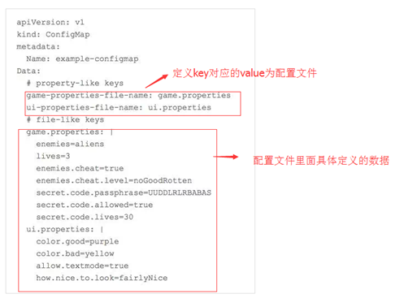
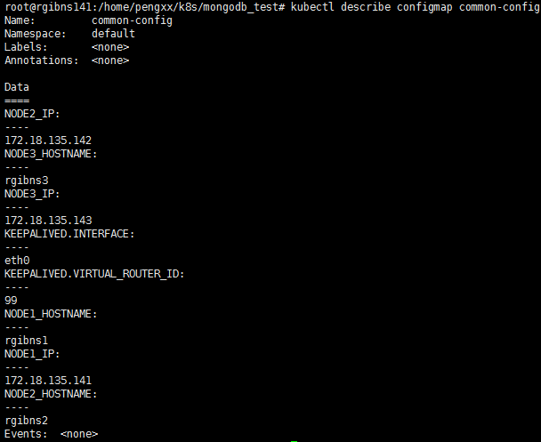
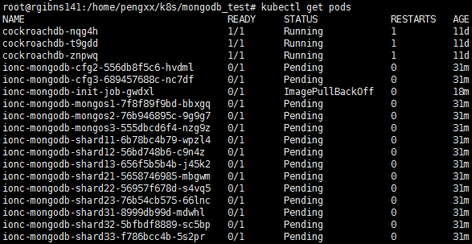
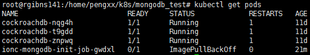
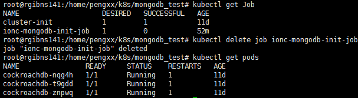
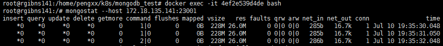
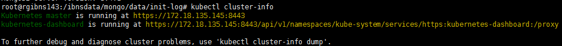
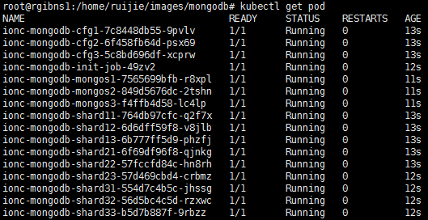

# 部署Kubernets集群


# 部署MongoDB组件

## 创建MongoDB容器化组件

### mongo

目前MongoDB每个组件都使用单独的一个Docker来部署。基于固定主机的部署方式，网络采用host模式，结构上类似直接在主机部署。未使用K8s和docker层面的高可用特征，为mongo自身的集群特性实现高可用保证。
其中Cfg和Mongos能够容忍挂掉2个，而Shard只能容错挂掉1个服务。由于客户端都是支持配置多个Mongodb Server的IP，且自带容错机制，因此不存在需要提供唯一VIP的问题。

### 使用部署脚本

因为有许多动态性的参数，例如部署的IP、hostname等需要按照环境进行修改，因此最好使用.sh脚本的方法。

完整的参数链如下：

init.sh->env.conf->configMap->yaml->docker环境变量->镜像启动脚本->镜像配置文件

- env.conf主要是环境配置文件，包括ip地址等信息；
- configMap.sh主要是将env.conf的配置导入到k8s的环境变量中；
- yaml则是引用k8s的环境变量，且包含了各种docker环境配置和镜像配置；
- init.sh则是将入口参数导入，替换以上env.conf和yaml文件中的变量。


## env.conf

```properties
#--公共环境变量
NODE1_IP=${NODE1_IP}
NODE2_IP=${NODE2_IP}
NODE3_IP=${NODE3_IP}
# :-表示如果前面变量为空，则采用后面的默认值
NODE1_HOSTNAME=${NODE1_HOSTNAME:-rgibns1}
NODE2_HOSTNAME=${NODE2_HOSTNAME:-rgibns2}
NODE3_HOSTNAME=${NODE3_HOSTNAME:-rgibns3}
#主机网卡
KEEPALIVED.INTERFACE=${ETHINTERFACE}
#id 局域网内不可重复
KEEPALIVED.VIRTUAL_ROUTER_ID=99
```

## configmap.sh

```sh
#! /bin/bash
kubectl delete configmap common-config
kubectl create configmap common-config --from-env-file=env.conf --validate=true
```

## mongo.yaml

```yaml
---
apiVersion: extensions/v1beta1
kind: Deployment
metadata:
  name: ionc-mongodb-cfg1
  namespace: default
spec:
  replicas: 1
  template:
    metadata:
      labels:
        app: mongodb
        id: mongodb-cfg1
    spec:
      nodeSelector:
        node: "1"
      hostNetwork: true
      containers:
      - name: ionc-mongodb-cfg1
        image: ${NODE1_IP}:5000/mongo
        env:
          - name: TZ
            value: "Asia/Shanghai"
        ports:
          - containerPort: 21001
        imagePullPolicy: IfNotPresent
        volumeMounts:
          - name: mongo-data
            mountPath: "/data/configdb"
          - name: time
            mountPath: /etc/localtime
            readOnly: true                        
        resources: 
          limits: 
#            cpu: 2
            memory: 1Gi 
        args: [ "-replSet", "cfg" ,"--configsvr" ,"--port" ,"21001" ,"--wiredTigerCacheSizeGB", "0.5"]
      volumes:
      - name: mongo-data
        hostPath:
          path: /ibnsdata/mongo/data/cfg1/
      - name: time
        hostPath:
          path: /etc/localtime          
---
apiVersion: extensions/v1beta1
kind: Deployment
metadata:
  name: ionc-mongodb-cfg2
  namespace: default
spec:
  replicas: 1
  template:
    metadata:
      labels:
        app: mongodb
        id: mongodb-cfg2
    spec:
      nodeSelector:
        node: "2"
      hostNetwork: true
      containers:
      - name: ionc-mongodb-cfg2
        image: ${NODE1_IP}:5000/mongo
        env:
          - name: TZ
            value: "Asia/Shanghai"        
        ports:
          - containerPort: 21002
        imagePullPolicy: IfNotPresent
        volumeMounts:
          - name: mongo-data
            mountPath: "/data/configdb"
          - name: time
            mountPath: /etc/localtime
            readOnly: true              
        resources: 
          limits: 
#            cpu: 2
            memory: 1Gi
        args: [ "-replSet", "cfg" ,"--configsvr" ,"--port" ,"21002" ,"--wiredTigerCacheSizeGB", "0.5"]
      volumes:
      - name: mongo-data
        hostPath:
          path: /ibnsdata/mongo/data/cfg2/
      - name: time
        hostPath:
          path: /etc/localtime           
---
apiVersion: extensions/v1beta1
kind: Deployment
metadata:
  name: ionc-mongodb-cfg3
  namespace: default
spec:
  replicas: 1
  template:
    metadata:
      labels:
        app: mongodb
        id: mongodb-cfg3
    spec:
      nodeSelector:
        node: "3"
      hostNetwork: true
      containers:
      - name: ionc-mongodb-cfg3
        image: ${NODE1_IP}:5000/mongo
        env:
          - name: TZ
            value: "Asia/Shanghai"        
        ports:
          - containerPort: 21003
        imagePullPolicy: IfNotPresent
        volumeMounts:
          - name: mongo-data
            mountPath: "/data/configdb"
          - name: time
            mountPath: /etc/localtime
            readOnly: true              
        resources: 
          limits: 
#            cpu: 2
            memory: 1Gi            
        args: [ "-replSet", "cfg" ,"--configsvr" ,"--port" ,"21003" ,"--wiredTigerCacheSizeGB", "0.5"]
      volumes:
      - name: mongo-data
        hostPath:
          path: /ibnsdata/mongo/data/cfg3/
      - name: time
        hostPath:
          path: /etc/localtime           
---
apiVersion: extensions/v1beta1
kind: Deployment
metadata:
  name: ionc-mongodb-shard11
  namespace: default
spec:
  replicas: 1
  template:
    metadata:
      labels:
        app: mongodb
        id: mongodb-shard11
    spec:
      nodeSelector:
        node: "1"
      hostNetwork: true
      containers:
      - name: ionc-mongodb-shard11
        image: ${NODE1_IP}:5000/mongo
        env:
          - name: TZ
            value: "Asia/Shanghai"        
        ports:
          - containerPort: 20001
        imagePullPolicy: IfNotPresent
        volumeMounts:
          - name: mongo-data
            mountPath: "/data/db"
          - name: time
            mountPath: /etc/localtime
            readOnly: true              
        resources: 
          limits: 
#            cpu: 3
            memory: 5Gi            
        args: [ "-replSet", "shard1" ,"--port" ,"20001" ,"--shardsvr" ,"--wiredTigerCacheSizeGB", "4"]
      volumes:
      - name: mongo-data
        hostPath:
          path: /ibnsdata/mongo/data/shard11/
      - name: time
        hostPath:
          path: /etc/localtime           
---
apiVersion: extensions/v1beta1
kind: Deployment
metadata:
  name: ionc-mongodb-shard12
  namespace: default
spec:
  replicas: 1
  template:
    metadata:
      labels:
        app: mongodb
        id: mongodb-shard12
    spec:
      nodeSelector:
        node: "2"
      hostNetwork: true
      containers:
      - name: ionc-mongodb-shard12
        image: ${NODE1_IP}:5000/mongo
        env:
          - name: TZ
            value: "Asia/Shanghai"        
        ports:
          - containerPort: 20002
        imagePullPolicy: IfNotPresent
        volumeMounts:
          - name: mongo-data
            mountPath: "/data/db"
          - name: time
            mountPath: /etc/localtime
            readOnly: true              
        resources: 
          limits: 
#            cpu: 3
            memory: 5Gi            
        args: [ "-replSet", "shard1" ,"--port" ,"20002" ,"--shardsvr" ,"--wiredTigerCacheSizeGB", "4"]
      volumes:
      - name: mongo-data
        hostPath:
          path: /ibnsdata/mongo/data/shard12/     
      - name: time
        hostPath:
          path: /etc/localtime           
---
apiVersion: extensions/v1beta1
kind: Deployment
metadata:
  name: ionc-mongodb-shard13
  namespace: default
spec:
  replicas: 1
  template:
    metadata:
      labels:
        app: mongodb
        id: mongodb-shard13
    spec:
      nodeSelector:
        node: "3"
      hostNetwork: true
      containers:
      - name: ionc-mongodb-shard13
        image: ${NODE1_IP}:5000/mongo
        env:
          - name: TZ
            value: "Asia/Shanghai"        
        ports:
          - containerPort: 20003
        imagePullPolicy: IfNotPresent
        volumeMounts:
          - name: mongo-data
            mountPath: "/data/db"
          - name: time
            mountPath: /etc/localtime
            readOnly: true              
        resources: 
          limits: 
#            cpu: 1
            memory: 0.5Gi                 
        args: [ "-replSet", "shard1" ,"--port" ,"20003" ,"--shardsvr" ]
      volumes:
      - name: mongo-data
        hostPath:
          path: /ibnsdata/mongo/data/shard13/   
      - name: time
        hostPath:
          path: /etc/localtime           
---
apiVersion: extensions/v1beta1
kind: Deployment
metadata:
  name: ionc-mongodb-shard21
  namespace: default
spec:
  replicas: 1
  template:
    metadata:
      labels:
        app: mongodb
        id: mongodb-shard21
    spec:
      nodeSelector:
        node: "1"
      hostNetwork: true
      containers:
      - name: ionc-mongodb-shard21
        image: ${NODE1_IP}:5000/mongo
        env:
          - name: TZ
            value: "Asia/Shanghai"        
        ports:
          - containerPort: 20004
        imagePullPolicy: IfNotPresent
        volumeMounts:
          - name: mongo-data
            mountPath: "/data/db"
          - name: time
            mountPath: /etc/localtime
            readOnly: true            
        resources: 
          limits: 
#            cpu: 3
            memory: 2Gi                 
        args: [ "-replSet", "shard2" ,"--port" ,"20004" ,"--shardsvr" ,"--wiredTigerCacheSizeGB", "1.5"]
      volumes:
      - name: mongo-data
        hostPath:
          path: /ibnsdata/mongo/data/shard21/  
      - name: time
        hostPath:
          path: /etc/localtime           
---
apiVersion: extensions/v1beta1
kind: Deployment
metadata:
  name: ionc-mongodb-shard22
  namespace: default
spec:
  replicas: 1
  template:
    metadata:
      labels:
        app: mongodb
        id: mongodb-shard22
    spec:
      nodeSelector:
        node: "2"
      hostNetwork: true
      containers:
      - name: ionc-mongodb-shard22
        image: ${NODE1_IP}:5000/mongo
        env:
          - name: TZ
            value: "Asia/Shanghai"        
        ports:
          - containerPort: 20005
        imagePullPolicy: IfNotPresent
        volumeMounts:
          - name: mongo-data
            mountPath: "/data/db"
          - name: time
            mountPath: /etc/localtime
            readOnly: true             
        resources: 
          limits: 
#            cpu: 1
            memory: 0.5Gi                 
        args: [ "-replSet", "shard2" ,"--port" ,"20005" ,"--shardsvr"]
      volumes:
      - name: mongo-data
        hostPath:
          path: /ibnsdata/mongo/data/shard22/  
      - name: time
        hostPath:
          path: /etc/localtime           
---
apiVersion: extensions/v1beta1
kind: Deployment
metadata:
  name: ionc-mongodb-shard23
  namespace: default
spec:
  replicas: 1
  template:
    metadata:
      labels:
        app: mongodb
        id: mongodb-shard23
    spec:
      nodeSelector:
        node: "3"
      hostNetwork: true
      containers:
      - name: ionc-mongodb-shard23
        image: ${NODE1_IP}:5000/mongo
        env:
          - name: TZ
            value: "Asia/Shanghai"        
        ports:
          - containerPort: 20006
        imagePullPolicy: IfNotPresent
        volumeMounts:
          - name: mongo-data
            mountPath: "/data/db"
          - name: time
            mountPath: /etc/localtime
            readOnly: true             
        resources: 
          limits: 
#            cpu: 3
            memory: 2Gi                 
        args: [ "-replSet", "shard2" ,"--port" ,"20006" ,"--shardsvr" ,"--wiredTigerCacheSizeGB", "1.5"]
      volumes:
      - name: mongo-data
        hostPath:
          path: /ibnsdata/mongo/data/shard23/  
      - name: time
        hostPath:
          path: /etc/localtime           
---
apiVersion: extensions/v1beta1
kind: Deployment
metadata:
  name: ionc-mongodb-shard31
  namespace: default
spec:
  replicas: 1
  template:
    metadata:
      labels:
        app: mongodb
        id: mongodb-shard31
    spec:
      nodeSelector:
        node: "1"
      hostNetwork: true
      containers:
      - name: ionc-mongodb-shard31
        image: ${NODE1_IP}:5000/mongo
        env:
          - name: TZ
            value: "Asia/Shanghai"        
        ports:
          - containerPort: 20007
        imagePullPolicy: IfNotPresent
        volumeMounts:
          - name: mongo-data
            mountPath: "/data/db"
          - name: time
            mountPath: /etc/localtime
            readOnly: true             
        resources: 
          limits: 
#            cpu: 1
            memory: 0.5Gi                 
        args: [ "-replSet", "shard3" ,"--port" ,"20007" ,"--shardsvr"]
      volumes:
      - name: mongo-data
        hostPath:
          path: /ibnsdata/mongo/data/shard31/  
      - name: time
        hostPath:
          path: /etc/localtime           
---
apiVersion: extensions/v1beta1
kind: Deployment
metadata:
  name: ionc-mongodb-shard32
  namespace: default
spec:
  replicas: 1
  template:
    metadata:
      labels:
        app: mongodb
        id: mongodb-shard32
    spec:
      nodeSelector:
        node: "2"
      hostNetwork: true
      containers:
      - name: ionc-mongodb-shard32
        image: ${NODE1_IP}:5000/mongo
        env:
          - name: TZ
            value: "Asia/Shanghai"        
        ports:
          - containerPort: 20008
        imagePullPolicy: IfNotPresent
        volumeMounts:
          - name: mongo-data
            mountPath: "/data/db"
          - name: time
            mountPath: /etc/localtime
            readOnly: true             
        resources: 
          limits: 
#            cpu: 3
            memory: 2Gi                 
        args: [ "-replSet", "shard3" ,"--port" ,"20008" ,"--shardsvr" ,"--wiredTigerCacheSizeGB", "1.5"]
      volumes:
      - name: mongo-data
        hostPath:
          path: /ibnsdata/mongo/data/shard32/  
      - name: time
        hostPath:
          path: /etc/localtime           
---
apiVersion: extensions/v1beta1
kind: Deployment
metadata:
  name: ionc-mongodb-shard33
  namespace: default
spec:
  replicas: 1
  template:
    metadata:
      labels:
        app: mongodb
        id: mongodb-shard33
    spec:
      nodeSelector:
        node: "3"
      hostNetwork: true
      containers:
      - name: ionc-mongodb-shard33
        image: ${NODE1_IP}:5000/mongo
        env:
          - name: TZ
            value: "Asia/Shanghai"        
        ports:
          - containerPort: 20009
        imagePullPolicy: IfNotPresent
        volumeMounts:
          - name: mongo-data
            mountPath: "/data/db"
          - name: time
            mountPath: /etc/localtime
            readOnly: true             
        resources: 
          limits: 
#            cpu: 3
            memory: 2Gi                 
        args: [ "-replSet", "shard3" ,"--port" ,"20009" ,"--shardsvr" ,"--wiredTigerCacheSizeGB", "1.5"]
      volumes:
      - name: mongo-data
        hostPath:
          path: /ibnsdata/mongo/data/shard33/  
      - name: time
        hostPath:
          path: /etc/localtime           
---
apiVersion: extensions/v1beta1
kind: Deployment
metadata:
  name: ionc-mongodb-mongos1
  namespace: default
spec:
  replicas: 1
  template:
    metadata:
      labels:
        app: mongodb
        id: mongodb-mongos1
    spec:
      nodeSelector:
        node: "1"
      hostNetwork: true
      containers:
      - name: ionc-mongodb-mongos1
        image: ${NODE1_IP}:5000/mongo
        env:
          - name: TZ
            value: "Asia/Shanghai"        
        ports:
          - containerPort: 23001
        imagePullPolicy: IfNotPresent
        volumeMounts:
          - name: mongo-data
            mountPath: "/data/db"
          - name: time
            mountPath: /etc/localtime
            readOnly: true             
        resources: 
          limits: 
#            cpu: 2
            memory: 1Gi                 
        env:
          - name: NODE1_IP
            valueFrom:
              configMapKeyRef:
                name: common-config
                key: NODE1_IP
          - name: NODE2_IP
            valueFrom:
              configMapKeyRef:
                name: common-config
                key: NODE2_IP
          - name: NODE3_IP
            valueFrom:
              configMapKeyRef:
                name: common-config
                key: NODE3_IP
        args: [ "mongos", "--configdb", "cfg/\${NODE1_IP}:21001,\${NODE2_IP}:21002,\${NODE3_IP}:21003" ,"--port" ,"23001"]
      volumes:
      - name: mongo-data
        hostPath:
          path: /ibnsdata/mongo/data/mongos1/     
      - name: time
        hostPath:
          path: /etc/localtime           
---
apiVersion: extensions/v1beta1
kind: Deployment
metadata:
  name: ionc-mongodb-mongos2
  namespace: default
spec:
  replicas: 1
  template:
    metadata:
      labels:
        app: mongodb
        id: mongodb-mongos2
    spec:
      nodeSelector:
        node: "2"
      hostNetwork: true
      containers:
      - name: ionc-mongodb-mongos2
        image: ${NODE1_IP}:5000/mongo
        env:
          - name: TZ
            value: "Asia/Shanghai"        
        ports:
          - containerPort: 23002
        imagePullPolicy: IfNotPresent
        volumeMounts:
          - name: mongo-data
            mountPath: "/data/db"
          - name: time
            mountPath: /etc/localtime
            readOnly: true             
        resources: 
          limits: 
#            cpu: 2
            memory: 1Gi                 
        env:
          - name: NODE1_IP
            valueFrom:
              configMapKeyRef:
                name: common-config
                key: NODE1_IP
          - name: NODE2_IP
            valueFrom:
              configMapKeyRef:
                name: common-config
                key: NODE2_IP
          - name: NODE3_IP
            valueFrom:
              configMapKeyRef:
                name: common-config
                key: NODE3_IP
        args: [ "mongos", "--configdb", "cfg/\${NODE1_IP}:21001,\${NODE2_IP}:21002,\${NODE3_IP}:21003" ,"--port" ,"23002"]
      volumes:
      - name: mongo-data
        hostPath:
          path: /ibnsdata/mongo/data/mongos2/        
      - name: time
        hostPath:
          path: /etc/localtime           
---
apiVersion: extensions/v1beta1
kind: Deployment
metadata:
  name: ionc-mongodb-mongos3
  namespace: default
spec:
  replicas: 1
  template:
    metadata:
      labels:
        app: mongodb
        id: mongodb-mongos3
    spec:
      nodeSelector:
        node: "3"
      hostNetwork: true
      containers:
      - name: ionc-mongodb-mongos3
        image: ${NODE1_IP}:5000/mongo
        env:
          - name: TZ
            value: "Asia/Shanghai"        
        ports:
          - containerPort: 23003
        imagePullPolicy: IfNotPresent
        volumeMounts:
          - name: mongo-data
            mountPath: "/data/db"
          - name: time
            mountPath: /etc/localtime
            readOnly: true             
        resources: 
          limits: 
#            cpu: 2
            memory: 1Gi                 
        env:
          - name: NODE1_IP
            valueFrom:
              configMapKeyRef:
                name: common-config
                key: NODE1_IP
          - name: NODE2_IP
            valueFrom:
              configMapKeyRef:
                name: common-config
                key: NODE2_IP
          - name: NODE3_IP
            valueFrom:
              configMapKeyRef:
                name: common-config
                key: NODE3_IP
        args: [ "mongos", "--configdb", "cfg/\${NODE1_IP}:21001,\${NODE2_IP}:21002,\${NODE3_IP}:21003" ,"--port" ,"23003"]
      volumes:
      - name: mongo-data
        hostPath:
          path: /ibnsdata/mongo/data/mongos3/         
      - name: time
        hostPath:
          path: /etc/localtime           
 
---
apiVersion: batch/v1
kind: Job
metadata:
  name: ionc-mongodb-init-job
spec:
  template:
    metadata:
      name: ionc-mongodb-init-job
    spec:
      containers:
      - name: ionc-mongodb-init-job
        image: ${NODE1_IP}:5000/mongo   
        env:
          - name: NODE1_IP
            valueFrom:
              configMapKeyRef:
                name: common-config
                key: NODE1_IP
          - name: NODE2_IP
            valueFrom:
              configMapKeyRef:
                name: common-config
                key: NODE2_IP
          - name: NODE3_IP
            valueFrom:
              configMapKeyRef:
                name: common-config
                key: NODE3_IP
          - name: TZ
            value: "Asia/Shanghai"   
        volumeMounts: 
        - name: time
          mountPath: /etc/localtime
          readOnly: true             
        args: [ "/user/init/js/init.sh"]    
      volumes:
        - name: time
          hostPath:
            path: /etc/localtime        
      restartPolicy: Never
---
apiVersion: batch/v2alpha1
kind: CronJob
metadata:
  name: ionc-mongodb-cron-job
spec:
  schedule: "39 2 * * *"
  jobTemplate:
    spec:
      template: 
        spec: 
          containers:
          - name: ionc-mongodb-cron-job
            image: ${NODE1_IP}:5000/mongo
            volumeMounts: 
              - name: time
                mountPath: /etc/localtime
                readOnly: true             
            env:
              - name: NODE1_IP
                valueFrom:
                  configMapKeyRef:
                    name: common-config
                    key: NODE1_IP
              - name: NODE2_IP
                valueFrom:
                  configMapKeyRef:
                    name: common-config
                    key: NODE2_IP
              - name: NODE3_IP
                valueFrom:
                  configMapKeyRef:
                    name: common-config
                    key: NODE3_IP
              - name: TZ
                value: "Asia/Shanghai"                      
            args: [ "/user/init/js/cron.sh"]    
          volumes:
            - name: time
              hostPath:
                path: /etc/localtime            
          restartPolicy: Never
```

#### yaml结构解析

总共部署三种类型的容器：mongdb(用于路由和网络)、config server （用于记录元数据配置）、shard（数据分片）。其中mongodb和config server每个节点都必须有一个，表示该节点的元数据和网络配置。shard作为主要的数据存储组件，应该考虑其高可用性。

## init.sh

```sh
#!/bin/bash
# $(<$1)表示将文本中变量文本变成变量
# 而eval主要是用于执行命令并显示结果
function replace_vars() {
  eval "cat <<EOF
  $(<$1)
EOF
  " > $1
# s/^[ \t]* 是将这一行起始的空白字符删掉
sed -i '1s/^[ \t]*//' $1
}
# 如果程序入参的数量不等于4且不等于7
if [[ $# -ne 4 && $# -ne 7 ]]; then
   echo "invalid argument"
   exit 1;
fi
# 创建变量值，用于替换文本配置文件中同名的变量
ethname=`ifconfig | grep -B1 $1  |grep Link| awk '{print $1}'`
export ETHINTERFACE=$ethname
export NODE1_IP=$1
export NODE2_IP=$2
export NODE3_IP=$3
export VIRTUAL_IP=$4
if [[ $# -eq 7  ]]; then
   export NODE1_HOSTNAME=$5
   export NODE2_HOSTNAME=$6
   export NODE3_HOSTNAME=$7
fi
replace_vars env.conf
replace_vars keepalived.yaml
replace_vars logstash.yaml
replace_vars mongo.yaml

# 镜像导入，这里使用的镜像都是已经打包好了的tar包，只要使用docker的load命令加载即可。
# mongodb
docker load -i ../images/mongo.tar
docker tag  ${NODE1_IP}:5000/mongo:latest
docker push ${NODE1_IP}:5000/mongo:latest
# keepalived
docker load -i ../images/keepalived.tar
docker tag keepalived:latest ${NODE1_IP}:5000/keepalived:latest
docker push ${NODE1_IP}:5000/keepalived:latest
# logstash
docker load -i ../images/logstash.tar
docker tag logstash:latest ${NODE1_IP}:5000/logstash:latest
docker push ${NODE1_IP}:5000/logstash:latest
```

举例

```sh
chmod +x init.sh
```

先查看集群节点

```shell
root@rgibns141:/home/pengxx/k8s/mongodb_test# kubectl get nodes
NAME             STATUS    ROLES     AGE       VERSION
172.18.135.141   Ready     <none>    24d       v1.9.8
172.18.135.142   Ready     <none>    24d       v1.9.8
172.18.135.143   Ready     <none>    24d       v1.9.8
```

加入参数

```shell
./init.sh 172.18.135.141 172.18.135.142 172.18.135.143 172.18.135.144 rgibns141 rgibns142 rgibns143
```

或

```shell
./init.sh 192.168.100.1 192.168.100.2 192.168.100.3 192.168.100.4
```

接着再执行configmap.sh就可以将env.conf配置写入到k8s的环境中了。

## ConfigMap

### 基本原理

ConfigMap是存储通用的配置变量的。ConfigMap有点儿像一个统一的配置文件，使用户可以将分布式系统中用于不同模块的环境变量统一到一个对象中管理；而它与配置文件的区别在于它是存在集群的“环境”中的，并且支持K8s集群中所有通用的操作调用方式 

而资源的使用者可以通过ConfigMap来存储这个资源的配置，这样需要访问这个资源的应用就可以同通过ConfigMap来引用这个资源。相当通过创建Configmap封装资源配置。 

configmap以一个或者多个key:value的形式保存在k8s系统中供应用使用，既可以用于表示一个变量的值（eg.apploglevel:info)，也可以用于表示一个完整配置文件的内容（eg： server.xml=<?xml...>...) 可以通过yaml配置文件或者直接用kubectl create configmap 命令行的方式来创建 ConfigMap。 

### ConfigMap 配置

可以通过建立ConfigMap来支持应用从环境变量和包含配置数据的文件读取信息，如下面例子了展示了configMap如何获得这两种配置的。 



data 一栏包括了配置数据。就如同你们看到的那样，ConfigMap可以被用来保存单个属性，也可以用来保存一个配置文件。

### ConfigMap 创建方式

#### 命令行

(1) 从目录中创建 

该目录中已经存在一些配置文件，而且目录中所有的文件都将作为configMap中的数据，一个文件为一个data。 key的名字为文件的名字，value为文件的内容。 

```shell
[root@master file]# ls
game.properties  ui.properties
[root@master file]# kubectl  create configmap game-config --from-file=/opt/configmap/file/
[root@master file]# kubectl  describe configmap game-config
Name:        game-config
Namespace:    default
Labels:        <none>
Annotations:    <none>

Data
====
game.properties:    158 bytes
ui.properties:        83 bytes
```

(2) 从文件中创建 

```shell
[root@master file]# kubectl create configmap game-config2 --from-file=/opt/configmap/file/game.properties --from-file=/opt/configmap/file/ui.properties
[root@master file]# kubectl  describe configmap game-config2
Name:        game-config2
Namespace:    default
Labels:        <none>
Annotations:    <none>

Data
====
game.properties:    158 bytes
ui.properties:        83 bytes
```

(3) 从文字值（literal values）中创建 

```shell
[root@master yaml]# kubectl create configmap special-config --from-literal=special.how=very --from-literal=special.type=charm
[root@master yaml]# kubectl get configmaps special-config -o yaml
apiVersion: v1
data:
  special.how: very
  special.type: charm
kind: ConfigMap
metadata:
  creationTimestamp: 2017-03-02T15:28:29Z
  name: special-config
  namespace: default
  resourceVersion: "128440"
  selfLink: /api/v1/namespaces/default/configmaps/special-config
  uid: e30d9c0f-ff5c-11e6-9929-000c29962b4f
[root@master yaml]# kubectl  describe configmap special-config
Name:        special-config
Namespace:    default
Labels:        <none>
Annotations:    <none>

Data
====
special.how:    4 bytes
special.type:    5 bytes
```

#### yaml文件方式创建

例子1

```yaml
apiVersion: v1
kind: ConfigMap
metadata:
  name: example-config
data:
  example.property.1: hello
  example.property.2: world
  example.property.file: |-
    property.1=value-1
    property.2=value-2
    property.3=value-3
```

```shell
[root@master yaml]# kubectl  describe configmap example-config
Name:        example-config
Namespace:    default
Labels:        <none>
Annotations:    <none>

Data
====
example.property.1:    5 bytes
example.property.2:    5 bytes
example.property.file:    56 bytes
```

例子2

```yaml
apiVersion: v1
kind: ConfigMap
metadata:
  name: cm-serverxml
data:
  key-serverxml: |
    <?xml version='1.0' encoding='utf-8'?>
    <Server port="8005" shutdown="SHUTDOWN">
      <Listener className="org.apache.catalina.startup.VersionLoggerListener" />
      <Listener className="org.apache.catalina.core.AprLifecycleListener" SSLEngine="on" />
      <Listener className="org.apache.catalina.core.JreMemoryLeakPreventionListener" />
      <Listener className="org.apache.catalina.mbeans.GlobalResourcesLifecycleListener" />
      <Listener className="org.apache.catalina.core.ThreadLocalLeakPreventionListener" />
      <GlobalNamingResources>
        <Resource name="UserDatabase" auth="Container"
                  type="org.apache.catalina.UserDatabase"
                  description="User database that can be updated and saved"
                  factory="org.apache.catalina.users.MemoryUserDatabaseFactory"
                  pathname="conf/tomcat-users.xml" />
      </GlobalNamingResources>

      <Service name="Catalina">
        <Connector port="8080" protocol="HTTP/1.1"
                   connectionTimeout="20000"
                   redirectPort="8443" />
        <Connector port="8009" protocol="AJP/1.3" redirectPort="8443" />
        <Engine name="Catalina" defaultHost="localhost">
          <Realm className="org.apache.catalina.realm.LockOutRealm">
            <Realm className="org.apache.catalina.realm.UserDatabaseRealm"
                   resourceName="UserDatabase"/>
          </Realm>
          <Host name="localhost"  appBase="webapps"
                unpackWARs="true" autoDeploy="true">
            <Valve className="org.apache.catalina.valves.AccessLogValve" directory="logs"
                   prefix="localhost_access_log" suffix=".txt"
                   pattern="%h %l %u %t "%r" %s %b" />

          </Host>
        </Engine>
      </Service>
    </Server>
```

### 具体配置

我们这里为了便于工程管理，使用命令行的形式读取env.conf文件的配置

```shell
kubectl create configmap common-config --from-env-file=env.conf --validate=true
```

如果配置错误了改能删除了重新创建

```shell
kubectl delete configmap common-config
```

查看配置

```shell
kubectl describe configmap common-config
```



## yaml对configMap的引用

按k8s的引用格式，对于NODE1_IP的引用样例如下：

```yaml
env:
	- name: NODE1_IP
	valueFrom:
		configMapKeyRef:
			name: common-config
			key: NODE1_IP
```

在yarm中就引用了common-config的内容。

## 执行K8s部署

###pod的删除

批量删除错误的pod方法



```shell
kubectl get pods | grep Pending | awk '{print $1}' | xargs kubectl delete pod
```

这里的Evicted指的是pod的状态

但是有时候发现删除失败，是因为直接删除pod触发了replicas的确保机制，那么我们删除deployment 

```shell
kubectl get deployment | grep ionc-mongodb | awk '{print $1}' | xargs kubectl delete deployment
```



但是这里发现还有一个没有删除，这个时候可以有针对性的删除



同时也发现了规律，在yaml中pod是什么形式的，就专门杀死该形式即可。

例如：

```shell
kubectl get job | grep ionc-mongodb | awk '{print $1}' | xargs kubectl delete job
kubectl get cronjob | grep ionc-mongodb | awk '{print $1}' | xargs kubectl delete cronjob
```

如果是由于MongoDB版本问题导致的，可以清空MongoDB的挂载目录。

查看容器的日志

```shell
docker logs <容器ID>
```

当安装完成之后，需要进行命令操作，例如进入容器

```shell
docker exec -it 4ef2e539d4de bash
```

这个容器id为任意的MongoDB容器节点。再统计MongoDB的指标值

```shell
root@rgibns141:/# mongostat --host 172.18.135.141:23001
```



或者将它输出到日志

```shell
root@rgibns141:/# mongostat --host 172.18.135.141:23001 > abc.log
```


### 查看k8环境

```shell
kubectl cluster-info
```



## 查看初始化日志



现在想查看init的job日志，可以使用如下命令

```sh
kubectl logs -f ionc-mongodb-init-job-49zv2
```

即能跟踪该日志