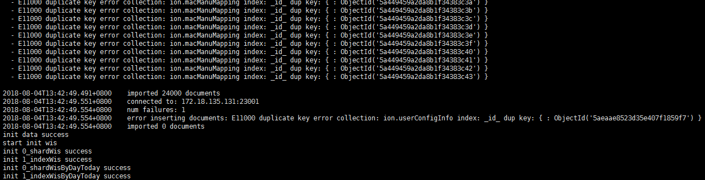

## 键重复

```sh
- E11000 duplicate key error collection: ion.macManuMapping index: _id_ dup key: { : ObjectId('5a449459a2da8b1f34383c3d') }
- E11000 duplicate key error collection: ion.macManuMapping index: _id_ dup key: { : ObjectId('5a449459a2da8b1f34383c3e') }
- E11000 duplicate key error collection: ion.macManuMapping index: _id_ dup key: { : ObjectId('5a449459a2da8b1f34383c3f') }
- E11000 duplicate key error collection: ion.macManuMapping index: _id_ dup key: { : ObjectId('5a449459a2da8b1f34383c40') }
- E11000 duplicate key error collection: ion.macManuMapping index: _id_ dup key: { : ObjectId('5a449459a2da8b1f34383c41') }
- E11000 duplicate key error collection: ion.macManuMapping index: _id_ dup key: { : ObjectId('5a449459a2da8b1f34383c42') }
- E11000 duplicate key error collection: ion.macManuMapping index: _id_ dup key: { : ObjectId('5a449459a2da8b1f34383c43') }
```



该错误是表示键重复了，从命令来看

```js
db.macManuMapping.ensureIndex({"key":1}, {"unique":true})
```

是具有唯一索引字段，数据导入是从json中导入的

```sh
{ 
    "_id" : ObjectId("5a449457a2da8b1f3437e11d"), 
    "key" : "0003ED", 
    "mval" : "Shinkawa Electric Co., Ltd."
}
```

而且key字段是不重复的，因此怀疑可能是在多次初始化造成的，把挂载数据删除，再次部署

## dash执行错误

在init.sh中调用cron.sh脚本，调用命令为：

```sh
chmod +x /user/init/js/cron.sh
bash /user/init/js/cron.sh
```

结果报错为：

```sh
/user/init/js/cron.sh: 12: /user/init/js/cron.sh: Syntax error: Bad for loop variable
```

场景是，有一个job执行了init.sh，另外一个cronjob执行了cron.sh，需求是在init.sh执行后就能自动执行一次cron.sh，而不是等到；每天的2点39分执行定时任务。有效的做法是在yaml文件的job中加入以下代码：

```yaml
command: ["/bin/bash"]          
args: [ "-c", "(bash /user/init/js/init.sh);(bash /user/init/js/cron.sh)"]
```

这样就相当于让job连续执行了两个sh脚本。

> 参考链接：[k8s 一个容器启动多个阻塞进程](https://blog.csdn.net/zhd930818/article/details/80026199)

