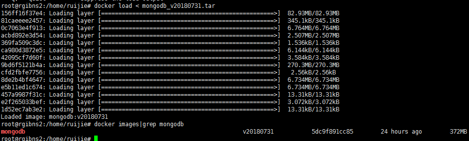

# cdh容器固化

cdh容器在部署完毕后一定不要漏了其runtime备份的过程，因为很多 文件是后来加上的。因此需要等cdh启动完成后，生成runtime镜像。clouder manager 会在每个容器中运行时加入新的东西。如果容器挂了，重启的时候就能重启这些固化的容器，保证clouder manager产生的新文件都在。

# kafka 的topic

必须等到cdh中的卡夫卡安装成功后才行。

完整部署IBNS系统的时候kafka的topic会自动化产生（采集器做的），但是如果只是不是cdh，那么kafka的topic为空。因此要手动执行一次脚本。


使用kubectl 来执行

```sh
kubectl delete -f ./kafka-topic.yaml
kubectl apply -f ./kafka-topic.yaml
```

如果容器图中的目录不存在这个路径，那么可以试试搜索

也可以试试/opt/kube/files/images/ibns

# k8s的界面操作

## 进入首页

产生令牌

```sh
kubectl -n kube-system describe secret $(kubectl -n kube-system get secret |grep admin-user | awk '{print $1}')
```

## 修改yaml配置

需求是要更新MongoDB的一个定时任务的镜像，这里可以直接在界面上修改，避免在三个节点上重复操作。


点击更新后就能够将集群的yaml更新了。现在验证该容器;

由于是定时任务，因此要使用cronjob命令：

```sh
root@rgibns1:/opt/kube/files/images/ibns# kubectl get cronjob
NAME                     SCHEDULE       SUSPEND   ACTIVE    LAST SCHEDULE   AGE
ionc-mongodb-cron-job    39 2 * * *     False     0         8h              30d
```

再使用describe命令：

.

可以发现镜像已经更新了

## 报错

这种方式会导致一个错误


即容器的镜像无法拉取，是因为该pod从本地拉取，但是k8是集群，这个页面的主节点不一定在制作镜像的地方。因此，把镜像上传到中央仓库中再进行拉取则不会出现该问题。

或者在k8集群的每个节点都部署该镜像。

先把镜像导出为文件

```sh
docker save -o mongodb_v20180731.tar mongodb:v20180731
```

该命令会在本地创建一个tar文件


在把这个文件分发到其他节点，进行导入


然后在各个节点中导入tar文件




