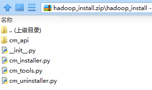
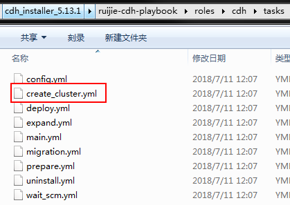
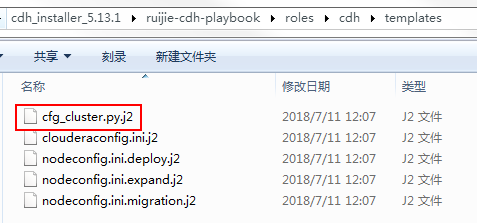

# spark自动部署原理

打开用于k8部署的cdh文件目录：

```shell
root@rgibns1:/etc/ansible/images/cdh/cdh_installer_5.13.1/ruijie-cdh-playbook/roles/cdh# ls
files  tasks  templates
```

## cm_installer.py

其中files文件'hadoop_install.zip'中有关于cdh的安装各种函数：



打开cm_installer.py文件

```python
func_map = {
    "EXPAND_NODES": expand_nodes,
    "RELOAD_CONFIG": reapply_config,
    "FOR_TEST": for_test,
    "CLUSTER_CREATE": cluster_create,
    "CMS_CREATE": management_create,
    "CDH_PARCELS_PREPARE": parcels_prepare_cdh,
    "SPARK_PARCELS_PREPARE": parcels_prepare_spark,
    "KAFKA_PARCELS_PREPARE": parcels_prepare_kafka,
    "ZK_CREATE": lambda: create_service_common(_CFG.ZK_CFG),
    "HDFS_CREATE": lambda: create_service_common(_CFG.HDFS_CFG),
    "HDFS_FORMAT_NAMENODE": create_service_hdfs_format_namenode,
    "HBASE_CREATE": lambda: create_service_common(_CFG.HBASE_CFG),
    "YARN_CREATE": lambda: create_service_common(_CFG.YARN_CFG),
    "HIVE_CREATE": lambda: create_service_common(_CFG.HIVE_CFG),
    "OOZIE_CREATE": lambda: create_service_common(_CFG.OOZIE_CFG),
    "KAFKA_CREATE": lambda: create_service_common(_CFG.KAFKA_CFG),
    "SPARK_CREATE": lambda: create_service_common(_CFG.SPARK_CFG),
    "ZK_START": lambda: start_service(_CFG.ZK_CFG),
    "HDFS_START": lambda: start_service(_CFG.HDFS_CFG),
    "OOZIE_MYSQL_DB": create_service_oozie_db,
    "HIVE_MYSQL_DB": create_service_hive_db,
    "HDFS_HA": hdfs_ha,
    "HBASE_CREATE_ROOT": hbase_create_root,
    "OOZIE_SHARELIB": oozie_install_sharelib,
    "OOZIE_ADD_HA": oozie_ha,
    "CLIENT_CONFIG": deploy_client_config,
    "YARN_CREATE_DIRS": yarn_create_dirs,
    "HIVE_CREATE_DIRS": hive_create_dirs,
    "START_YARN": lambda: start_service(_CFG.YARN_CFG),
    "START_HIVE": lambda: start_service(_CFG.HIVE_CFG),
    "START_OOZIE": lambda: start_service(_CFG.OOZIE_CFG),
    "SPARK_USER_HISTORY_DIRS": spark_user_and_history_dir,
    "KUDU_CREATE": lambda: create_service_common(_CFG.KUDU_CFG),
    "IMPALA_CREATE": lambda: create_service_common(_CFG.IMPALA_CFG),
    "START_SPARK": lambda: start_service(_CFG.SPARK_CFG),
    "START_KUDU": lambda: start_service(_CFG.KUDU_CFG),
    "START_IMPALA": lambda: start_service(_CFG.IMPALA_CFG),
    "START_HBASE": lambda: start_service(_CFG.HBASE_CFG),
    "START_KAFKA": lambda: start_service(_CFG.KAFKA_CFG)
}
```

这个key-val对应关系是关键字对应到具体的实现函数。如果是对spark处理，需要配置三个key：

- SPARK_CREATE
- SPARK_USER_HISTORY_DIRS
- START_SPARK

另外还有函数也要修改和添加

```python
def spark1_user_and_history_dir():
    spark = get_service(_CFG.SPARK1_CFG)
    print("Create Spark user and history dir")
    wait_on_success(spark.service_command_by_name('CreateSparkUserDirCommand'))
    wait_on_success(spark.service_command_by_name('CreateSparkHistoryDirCommand'))


def spark2_user_and_history_dir():
    spark = get_service(_CFG.SPARK2_CFG)
    print("Create Spark user and history dir")
    wait_on_success(spark.service_command_by_name('CreateSparkUserDirCommand'))
    wait_on_success(spark.service_command_by_name('CreateSparkHistoryDirCommand'))

```

在文档中搜索关于SPARK_CFG的配置，还有一些其他的spark配置，将其修改为spark1和spark2。但是注意不用修改SPARK_PARCELS_PREPARE，它表示源，cdh中默认安装了spark1，spark2是现有打包中依赖好了，因此SPARK_PARCELS_PREPARE表示的是spark2是正常的， 不用再修改。


## create_cluster.yml

这些值影响着files目录中的create_cluster.yml文件



进入create_cluster.yml文件

```yaml
- name: Create Base Cluster
  command: "python cm_installer.py {{ item }}"
  args:
    chdir: "{{ install_cdh_dir }}"
  with_items:
    - "CLUSTER_CREATE"
    - "CMS_CREATE"
    - "CDH_PARCELS_PREPARE"
    - "SPARK_PARCELS_PREPARE"
    - "KAFKA_PARCELS_PREPARE"
    - "ZK_CREATE"
    - "YARN_CREATE"
    - "HDFS_CREATE"
    - "SPARK_CREATE"
    - "ZK_START"
    - "HDFS_FORMAT_NAMENODE"
    - "HDFS_START"
    - "HDFS_HA"
#    - "CLIENT_CONFIG"
    - "YARN_CREATE_DIRS"
    - "START_YARN"
    - "SPARK_USER_HISTORY_DIRS"
    - "START_SPARK"
  register: cdh_install_status
  ignore_errors: True

- name: Retry Create Base Cluster
  command: "python cm_installer.py {{ item }}"
  args:
    chdir: "{{ install_cdh_dir }}"
  with_items:
    - "CLUSTER_CREATE"
    - "CMS_CREATE"
    - "CDH_PARCELS_PREPARE"
    - "SPARK_PARCELS_PREPARE"
    - "KAFKA_PARCELS_PREPARE"
    - "ZK_CREATE"
    - "YARN_CREATE"
    - "HDFS_CREATE"
    - "SPARK_CREATE"
    - "ZK_START"
    - "HDFS_FORMAT_NAMENODE"
    - "HDFS_START"
    - "HDFS_HA"
#    - "CLIENT_CONFIG"
    - "YARN_CREATE_DIRS"
    - "START_YARN"
    - "SPARK_USER_HISTORY_DIRS"
    - "START_SPARK"
  when: cdh_install_status| failed
```

cm_installer.py文件中的key就是被该处调用，然后间接调用了cm_installer.py中的函数。

## cfg_cluster.py.j2

cm_installer.py文件中的函数里提到了一个参数`SPARK_CFG`，这个参数的配置位置是templates文件夹中的cfg_cluster.py.j2文件



打开cfg_cluster.py.j2文件中的spark位置：

```python
SPARK_CFG = {
    'service': 'SPARK_ON_YARN',
    'name': 'Spark1',
    'config': {
        'yarn_service': YARN_CFG['name']
         },
    'roles': [
        {'name': 'spark1', 'type': 'SPARK_YARN_HISTORY_SERVER', 'target': '{{ node3 }}'},
        {'name': 'spark1_gw1', 'type': 'GATEWAY', 'target': 'EDGE'}
    ],
    'role_cfg': [
        {'type': 'SPARK_YARN_HISTORY_SERVER',
         'config': {'history_server_max_heapsize': 1073741824}},
        {'type': 'GATEWAY', 'config': {
            'spark_history_enabled': 'true',
            'spark-conf/spark-defaults.conf_client_config_safety_valve': 'spark.history.ui.port=18089\nspark.history.fs.logDirectory=hdfs://nameservice1/user/spark/sparkApplicationHistory'
            }
        }
    ]
}
```

可以看到就存在`SPARK_CFG`配置。

## 结论

容器工具根据create_cluster.yml文件进行配置，当部署spark的时候，就调用cm_installer.py中关于spark的key值和函数，函数的参数则是来自cfg_cluster.py.j2文件中的`SPARK_CFG`配置。

# spar不同版本增加配置

# 目录位置

`/opt/kube/kube-system/cdh/cdh_installer_5.13.1/ruijie-cdh-playbook/roles/cdh`

## 修改cfg_cluster.py.j2文件

在修改`SPARK_CFG`名称为`SPARK1_CFG`，并参考它创建`SPARK2_CFG`。主要的是name、service参数不能相同。

```python
SPARK1_CFG = {
    'service': 'SPARK_ON_YARN',
    'name': 'Spark1',
    'config': {
        'yarn_service': YARN_CFG['name']
         },
    'roles': [
        {'name': 'spark1', 'type': 'SPARK_YARN_HISTORY_SERVER', 'target': '{{ node3 }}'},
        {'name': 'spark1_gw1', 'type': 'GATEWAY', 'target': 'EDGE'}
    ],
    'role_cfg': [
        {'type': 'SPARK_YARN_HISTORY_SERVER',
         'config': {'history_server_max_heapsize': 1073741824}},
        {'type': 'GATEWAY', 'config': {
            'spark_history_enabled': 'true',
            'spark-conf/spark-defaults.conf_client_config_safety_valve': 'spark.history.ui.port=18089\nspark.history.fs.logDirectory=hdfs://nameservice1/user/spark/sparkApplicationHistory'
            }
        }
    ]
}
SPARK2_CFG = {
    'service': 'SPARK2_ON_YARN',
    'name': 'Spark2',
    'config': {
        'yarn_service': YARN_CFG['name']
         },
    'roles': [
        {'name': 'spark', 'type': 'SPARK2_YARN_HISTORY_SERVER', 'target': '{{ node3 }}'},
        {'name': 'spark_gw1', 'type': 'GATEWAY', 'target': 'EDGE'}
    ],
    'role_cfg': [
        {'type': 'SPARK2_YARN_HISTORY_SERVER',
         'config': {'history_server_max_heapsize': 1073741824}},
        {'type': 'GATEWAY', 'config': {
            'spark_history_enabled': 'true',
            'spark2-conf/spark-defaults.conf_client_config_safety_valve': 'spark.history.ui.port=18089\nspark.history.fs.logDirectory=hdfs://nameservice1/user/spark/spark2ApplicationHistory'
            }
        }
    ]
}
```

## 修改cm_installer.py

由于是压缩文件，先下载出来，在本地改好了之后再替换。

```python
func_map = {
    "EXPAND_NODES": expand_nodes,
    "RELOAD_CONFIG": reapply_config,
    "FOR_TEST": for_test,
    "CLUSTER_CREATE": cluster_create,
    "CMS_CREATE": management_create,
    "CDH_PARCELS_PREPARE": parcels_prepare_cdh,
    "SPARK_PARCELS_PREPARE": parcels_prepare_spark,
    "KAFKA_PARCELS_PREPARE": parcels_prepare_kafka,
    "ZK_CREATE": lambda: create_service_common(_CFG.ZK_CFG),
    "HDFS_CREATE": lambda: create_service_common(_CFG.HDFS_CFG),
    "HDFS_FORMAT_NAMENODE": create_service_hdfs_format_namenode,
    "HBASE_CREATE": lambda: create_service_common(_CFG.HBASE_CFG),
    "YARN_CREATE": lambda: create_service_common(_CFG.YARN_CFG),
    "HIVE_CREATE": lambda: create_service_common(_CFG.HIVE_CFG),
    "OOZIE_CREATE": lambda: create_service_common(_CFG.OOZIE_CFG),
    "KAFKA_CREATE": lambda: create_service_common(_CFG.KAFKA_CFG),
    "SPARK1_CREATE": lambda: create_service_common(_CFG.SPARK1_CFG),
    "SPARK2_CREATE": lambda: create_service_common(_CFG.SPARK2_CFG),
    "ZK_START": lambda: start_service(_CFG.ZK_CFG),
    "HDFS_START": lambda: start_service(_CFG.HDFS_CFG),
    "OOZIE_MYSQL_DB": create_service_oozie_db,
    "HIVE_MYSQL_DB": create_service_hive_db,
    "HDFS_HA": hdfs_ha,
    "HBASE_CREATE_ROOT": hbase_create_root,
    "OOZIE_SHARELIB": oozie_install_sharelib,
    "OOZIE_ADD_HA": oozie_ha,
    "CLIENT_CONFIG": deploy_client_config,
    "YARN_CREATE_DIRS": yarn_create_dirs,
    "HIVE_CREATE_DIRS": hive_create_dirs,
    "START_YARN": lambda: start_service(_CFG.YARN_CFG),
    "START_HIVE": lambda: start_service(_CFG.HIVE_CFG),
    "START_OOZIE": lambda: start_service(_CFG.OOZIE_CFG),
    "SPARK1_USER_HISTORY_DIRS": spark1_user_and_history_dir,
    "SPARK2_USER_HISTORY_DIRS": spark2_user_and_history_dir,
    "KUDU_CREATE": lambda: create_service_common(_CFG.KUDU_CFG),
    "IMPALA_CREATE": lambda: create_service_common(_CFG.IMPALA_CFG),
    "START_SPARK1": lambda: start_service(_CFG.SPARK1_CFG),
    "START_SPARK2": lambda: start_service(_CFG.SPARK2_CFG),
    "START_KUDU": lambda: start_service(_CFG.KUDU_CFG),
    "START_IMPALA": lambda: start_service(_CFG.IMPALA_CFG),
    "START_HBASE": lambda: start_service(_CFG.HBASE_CFG),
    "START_KAFKA": lambda: start_service(_CFG.KAFKA_CFG)
}
```

## 修改create_cluster.yml

```yaml
- name: Create Base Cluster
  command: "python cm_installer.py {{ item }}"
  args:
    chdir: "{{ install_cdh_dir }}"
  with_items:
    - "CLUSTER_CREATE"
    - "CMS_CREATE"
    - "CDH_PARCELS_PREPARE"
    - "SPARK_PARCELS_PREPARE"
    - "KAFKA_PARCELS_PREPARE"
    - "ZK_CREATE"
    - "YARN_CREATE"
    - "HDFS_CREATE"
    - "SPARK1_CREATE"
    - "SPARK2_CREATE"
    - "ZK_START"
    - "HDFS_FORMAT_NAMENODE"
    - "HDFS_START"
    - "HDFS_HA"
#    - "CLIENT_CONFIG"
    - "YARN_CREATE_DIRS"
    - "START_YARN"
    - "SPARK1_USER_HISTORY_DIRS"
    - "SPARK2_USER_HISTORY_DIRS"
    - "START_SPARK1"
    - "START_SPARK2"
  register: cdh_install_status
  ignore_errors: True

- name: Retry Create Base Cluster
  command: "python cm_installer.py {{ item }}"
  args:
    chdir: "{{ install_cdh_dir }}"
  with_items:
    - "CLUSTER_CREATE"
    - "CMS_CREATE"
    - "CDH_PARCELS_PREPARE"
    - "SPARK_PARCELS_PREPARE"
    - "KAFKA_PARCELS_PREPARE"
    - "ZK_CREATE"
    - "YARN_CREATE"
    - "HDFS_CREATE"
    - "SPARK1_CREATE"
    - "SPARK2_CREATE"
    - "ZK_START"
    - "HDFS_FORMAT_NAMENODE"
    - "HDFS_START"
    - "HDFS_HA"
#    - "CLIENT_CONFIG"
    - "YARN_CREATE_DIRS"
    - "START_YARN"
    - "SPARK1_USER_HISTORY_DIRS"
    - "SPARK2_USER_HISTORY_DIRS"
    - "START_SPARK1"
    - "START_SPARK2"
  when: cdh_install_status| failed
```


# 结果验证

登录到vip的地址中`172.18.135.223:9322 root/rJ1#iBns` ，尝试使用spark-shell、spark2-shell，能够正常给出反应，则表示安装正常。

# CDH问题

### 主机节点NTP拒绝连接

查看具体的节点，进入到cdh容器中，使用如下命令：

```sh
[root@rgibns3 /]# ntpdc -np
ntpdc: read: Connection refused
```

重启一下服务

```sh
[root@rgibns3 /]# systemctl restart ntpd
[root@rgibns3 /]# ntpdc -np
     remote           local      st poll reach  delay   offset    disp
=======================================================================
*127.127.1.0     127.0.0.1       13   64    1 0.00000  0.000000 2.81735
=172.18.135.131  172.18.135.133  11   64    1 0.00040  0.057106 1.98431
=172.18.135.132  172.18.135.133  12   64    1 0.00043  0.057059 1.98431
```

查看服务状态

```sh
[root@rgibns3 /]# systemctl status ntpd
● ntpd.service - Network Time Service
   Loaded: loaded (/usr/lib/systemd/system/ntpd.service; enabled; vendor preset: disabled)
   Active: active (running) since Wed 2018-07-25 10:35:46 CST; 4min 20s ago
  Process: 6633 ExecStart=/usr/sbin/ntpd -u ntp:ntp $OPTIONS (code=exited, status=0/SUCCESS)
 Main PID: 6634 (ntpd)
   CGroup: /kubepods/besteffort/podaa8e038f-8f52-11e8-9e65-080027938020/70131f653560e97cde5b74b9eb009bd33e16fd8550a887a83b6c1477db92c8ac/system.slice/ntpd.service
           └─6634 /usr/sbin/ntpd -u ntp:ntp -g

Jul 25 10:35:46 rgibns3 ntpd[6634]: Listen normally on 5 cni0 10.244.0.1 UDP 123
Jul 25 10:35:46 rgibns3 ntpd[6634]: Listen normally on 6 lo ::1 UDP 123
Jul 25 10:35:46 rgibns3 ntpd[6634]: Listen normally on 7 cni0 fe80::ccd3:8e...23
Jul 25 10:35:46 rgibns3 ntpd[6634]: Listen normally on 8 veth79dacf76 fe80:...23
Jul 25 10:35:46 rgibns3 ntpd[6634]: Listen normally on 9 eth0 fe80::a00:27f...23
Jul 25 10:35:46 rgibns3 ntpd[6634]: Listening on routing socket on fd #26 f...es
Jul 25 10:35:46 rgibns3 ntpd[6634]: 0.0.0.0 c016 06 restart
Jul 25 10:35:46 rgibns3 ntpd[6634]: 0.0.0.0 c012 02 freq_set kernel 0.000 PPM
Jul 25 10:35:46 rgibns3 ntpd[6634]: 0.0.0.0 c011 01 freq_not_set
Jul 25 10:35:49 rgibns3 ntpd[6634]: 0.0.0.0 c514 04 freq_mode
Hint: Some lines were ellipsized, use -l to show in full.

```

现在查CDH页面发现正常。