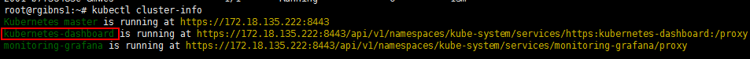
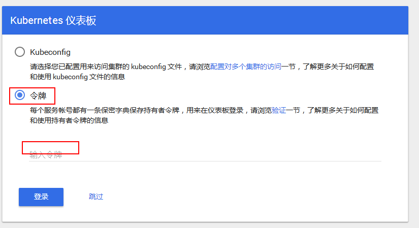

账号获取

```sh
cat /etc/kubernetes/ssl/basic-auth.csv
```

或者直接用admin/rjsdn@$!

获取仪表盘地址

```sh
kubectl cluster-info
```

token获取

```sh
kubectl -n kube-system describe secret $(kubectl -n kube-system get secret |grep admin-user | awk '{print $1}')
```



