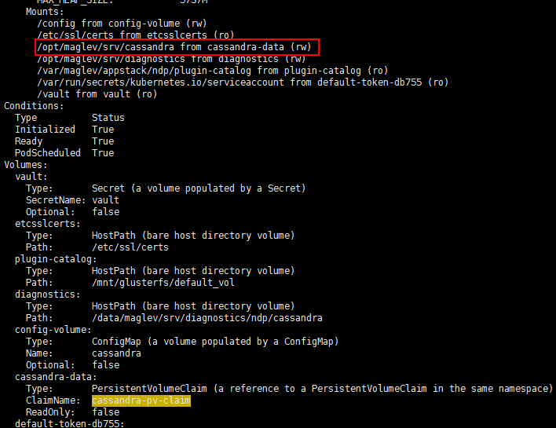
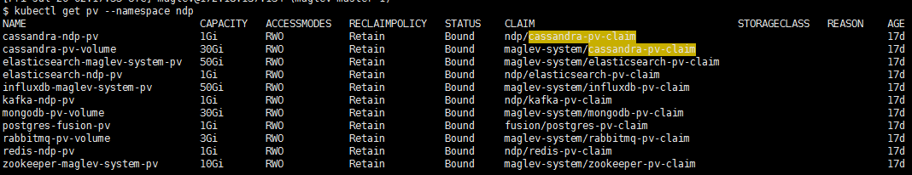
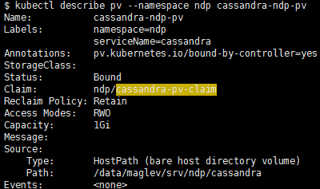

# 查找挂载目录

```shell
kubectl describe pod --namespace ndp cassandra-0
```



这个数据的挂载是链接地址，因此要进入pv中找

```shell
kubectl get pv --namespace ndp
```



```shell
kubectl describe pv --namespace ndp cassandra-ndp-pv
```



这个图的Path字段就显示了挂载目录。

# 打标签

```sh
#查看label
kubectl get node --show-labels
#添加标签
kubectl label node 172.18.135.131 node=1
#其中node=1就是标签
#删除标签
kubectl label node 172.18.135.131 node-
```

#  NodeAffinity 

在 k8s 中，pod 会通过 kube-scheduler 按照节占先有的资源平均的调度到这些节点上，但有时候，我们需要将某个应用的pod调度到特定的节点上， 
比如：两个应用需要频繁的进行通讯，那么我们希望将它们部署到同一个节点。或者希望访问一些类似需要ssd这样特殊资源的节点等应用场景。

最简单的方法是使用 `nodeSelector`，但它比较简单粗暴，使用起来不能灵活调度，这个在后续版本中也会慢慢过实，所以我们一般用 `nodeAffinity`来实现这些需求。

具体演示如下：

```sh
# 列出集群所有节点
-[appuser@pengxx ~]$ kubectl get no
NAME           STATUS    ROLES     AGE       VERSION
10.130.14.67   Ready     <none>    35d       v1.9.3
10.130.14.68   Ready     <none>    90d       v1.9.3
10.130.14.73   Ready     <none>    89d       v1.9.3123456
# 删除之前打过的标签 tester=pengxx
-[appuser@pengxx ~]$ kubectl label no 10.130.14.67 tester-
node "10.130.14.67" labeled

# 重新打标签 tester=pengxx
-[appuser@pengxx ~]$ kubectl label no 10.130.14.67 tester=chenqiang
node "10.130.14.67" labeled

# 查看所有标签
-[appuser@pengxx ~]$ kubectl get no --show-labels                 
NAME           STATUS    ROLES     AGE       VERSION   LABELS
10.130.14.67   Ready     <none>    35d       v1.9.3    beta.kubernetes.io/arch=amd64,beta.kubernetes.io/os=linux,ingress-nginx=true,kubernetes.io/hostname=10.130.14.67,tester=pengxx
10.130.14.68   Ready     <none>    90d       v1.9.3    beta.kubernetes.io/arch=amd64,beta.kubernetes.io/os=linux,ingress-nginx=true,kubernetes.io/hostname=10.130.14.68
10.130.14.73   Ready     <none>    89d       v1.9.3    beta.kubernetes.io/arch=amd64,beta.kubernetes.io/os=linux,kubernetes.io/hostname=10.130.14.73

# 通过特定标签进行过滤节点
-[appuser@pengxx ~]$ kubectl get no -l tester=pengxx
NAME           STATUS    ROLES     AGE       VERSION
10.130.14.67   Ready     <none>    35d       v1.9.3
```

如果我不希望pod调度到打了 `tester=pengxx`这个标签的 node，那么需要使用 `NotIn` 这个介词，否则使用 `In` 。  假设不希望调度，则添加如下的 nodeAffinity: 

```yaml
spec:
  affinity:
    nodeAffinity:
    requiredDuringSchedulingIgnoredDuringExecution:
      nodeSelectorTerms:
      - matchExpressions:
      - key: tester
        operator: NotIn
        values:
        - pengxx
```

从测试结果看，果然没有调度到 `10.130.14.67` 这个节点。

```sh
-[appuser@chenqiang-dev ~]$ kubectl -n chenqiang-ns1 get po -o wide    
NAME                                     READY     STATUS    RESTARTS   AGE       IP               NODE
nginx-hello-deployment-95f99df9d-56fvz   1/1       Running   0          11m       172.12.8.247     10.130.14.73
nginx-hello-deployment-95f99df9d-mj6xs   1/1       Running   0          11m       172.12.185.208   10.130
```

## 更复杂的例子

节点标签为：

```sh
allAppstacks=enabled,appstack.assurance-backend=enabled,appstack.fusion=enabled,appstack.maglev-system=enabled,appstack.ndp=enabled,beta.kubernetes.io/arch=amd64,beta.kubernetes.io/os=linux,compute=allowed,data=allowed,kubernetes.io/hostname=172.18.137.134,machine_profile=medium,node-role.kubernetes.io/master=,roles=master,web=allowed
```

yaml配置为：

```yaml
    spec:
      affinity: {
  nodeAffinity: {
    requiredDuringSchedulingIgnoredDuringExecution: {
      nodeSelectorTerms: [
        {
          matchExpressions: [
            {
              key: compute,
              operator: In,
              values: [
                allowed
              ]
            },
            {
              key: appstack.maglev-system,
              operator: In,
              values: [
                enabled
              ]
            }
          ]
        },
        {
          matchExpressions: [
            {
              key: compute,
              operator: In,
              values: [
                allowed
              ]
            },
            {
              key: allAppstacks,
              operator: In,
              values: [
                enabled
              ]
            }
          ]
        }
      ]
    }
  }
}
```

转化一下格式为：

```json
{ spec: 
   { affinity: 
      { nodeAffinity: 
         { requiredDuringSchedulingIgnoredDuringExecution: 
            { nodeSelectorTerms: 
               [ { matchExpressions: 
                    [ { key: 'compute', operator: 'In', values: [ 'allowed' ] },
                      { key: 'appstack.maglev-system',
                        operator: 'In',
                        values: [ 'enabled' ] } ] },
                 { matchExpressions: 
                    [ { key: 'compute', operator: 'In', values: [ 'allowed' ] },
                      { key: 'allAppstacks', operator: 'In', values: [ 'enabled' ] } ] } ] } } } } }
```

可以发现这其中有两种匹配表达式，只要满足其中一个就可以决定这个pod的节点选择了。

# configmap

```sh
kubectl get configmap --all-namespaces
kubectl describe configmap common-config -n assurance
```

# 查看清理的残留

```sh
kubectl get pods --all-namespaces | grep  xxxx
```

