# cdh容器的对外端口9322挂了

k8s部署了cdh容器化环境，该环境是完整的Ubuntu系统，可以通过9322端口登录。但是场景是可以在k8s宿主机中使用k8s exec 命令进入，但是无法以宿主机的9322端口登录。

## 排查：

1. 确认pod正常

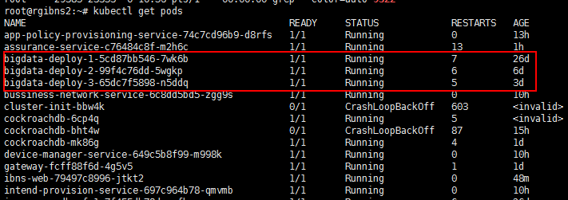

观察有问题的pod：

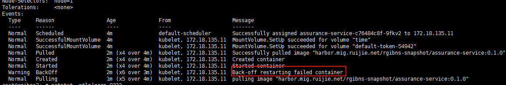

2. 确认三个节点的9322端口监听情况

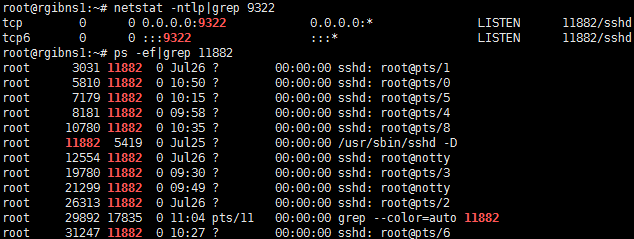

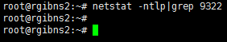

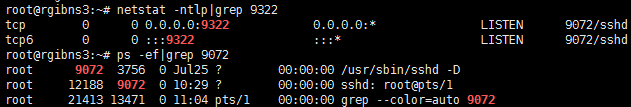

可以发现2节点的9322端口没有被监听

这里得出结论，sshd服务挂了。

## 重启sshd服务

先查看sshd的服务状态

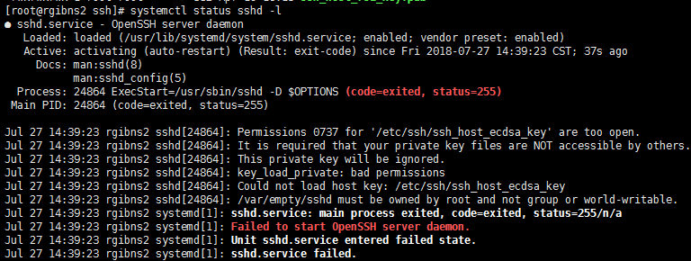

发现是给的权限太高了，参考博客说明

> 1. [Permissions 0777 for ‘***’ are too open.](https://blog.csdn.net/dcatfly/article/details/75201180)
> 2. [SSH无法连接：Permissions 0777 for '/etc/ssh/ssh_host_rsa_key' are too open.](https://blog.csdn.net/fly_520/article/details/79991229)

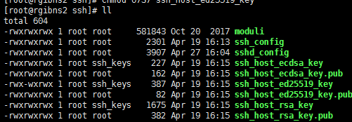

对所有文件以及所属的目录赋予0600权限后接着报如下错误

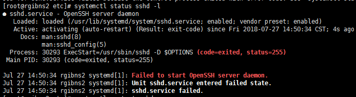

测试一下

```sh
sshd -t
```

出现以下提醒：

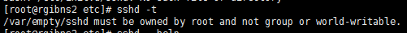

> 1. [SSH异常“Failed to start OpenSSH Server daemon”问题排查](https://yq.aliyun.com/articles/103191?t=t1) 

将/var/empty/sshd和其他节点的权限比对一下

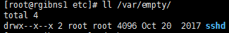

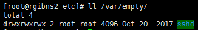

对该文件夹赋予744权限，再次重启sshd服务，则成功了。

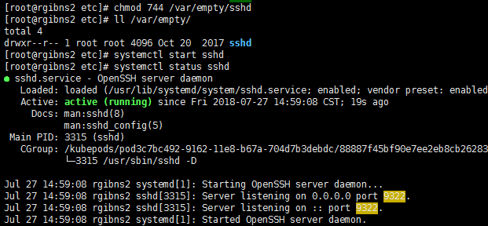

> 1. [Starting sshd: /var/empty/sshd must be owned by root and not group or world-writable.](https://blog.csdn.net/ucan23/article/details/49850365)

该问题深知会导致

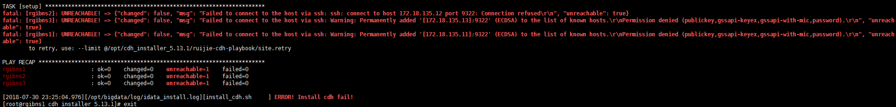

# cdh的EventServer进程挂了

## 问题分析

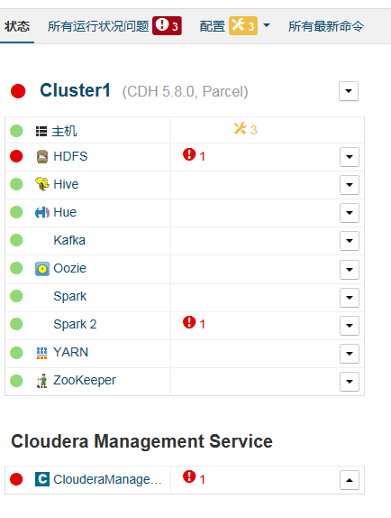

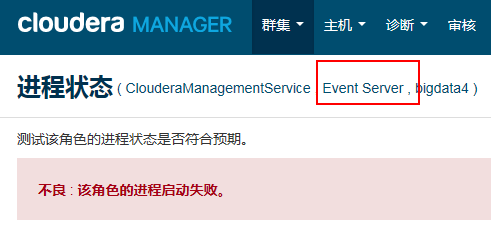

重启cloudermanager后出现同样错误

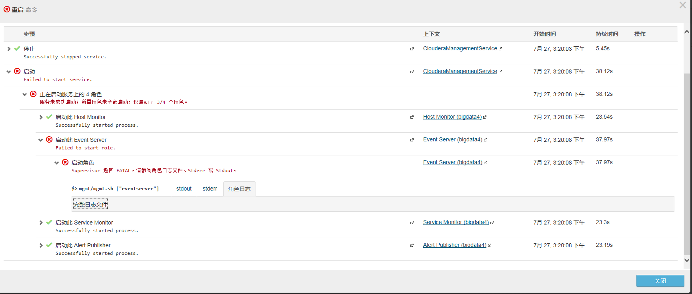

查看角色日志发现

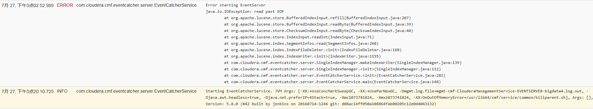

```sh
7月 27, 下午3点02:52.989 ERROR com.cloudera.cmf.eventcatcher.server.EventCatcherService Error starting EventServer
java.io.IOException: read past EOF
	at org.apache.lucene.store.BufferedIndexInput.refill(BufferedIndexInput.java:207)
	at org.apache.lucene.store.BufferedIndexInput.readByte(BufferedIndexInput.java:39)
	at org.apache.lucene.store.ChecksumIndexInput.readByte(ChecksumIndexInput.java:40)
	at org.apache.lucene.store.IndexInput.readInt(IndexInput.java:71)
	at org.apache.lucene.index.SegmentInfos.read(SegmentInfos.java:260)
	at org.apache.lucene.index.IndexFileDeleter.<init>(IndexFileDeleter.java:168)
	at org.apache.lucene.index.IndexWriter.<init>(IndexWriter.java:1155)
	at com.cloudera.cmf.eventcatcher.server.SingleIndexManager.makeIndexWriter(SingleIndexManager.java:139)
	at com.cloudera.cmf.eventcatcher.server.SingleIndexManager.<init>(SingleIndexManager.java:112)
	at com.cloudera.cmf.eventcatcher.server.EventCatcherService.<init>(EventCatcherService.java:282)
	at com.cloudera.cmf.eventcatcher.server.EventCatcherService.main(EventCatcherService.java:148)
 
```

`java.io.IOException: read past EOF`中的EOF表示 `End Of File`，已经执行到文件末尾了，但是读没有结束，即读取超出范围了。


# ntp 服务挂了

报错内容

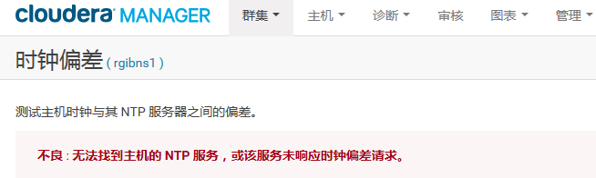

查看ntp状态

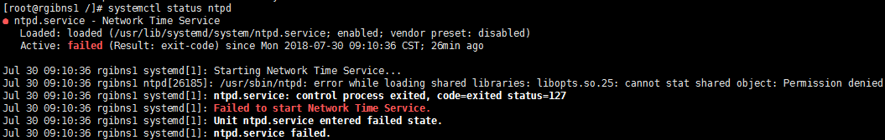

说是库加载时权限不足，先看看ntpd的动态依赖：

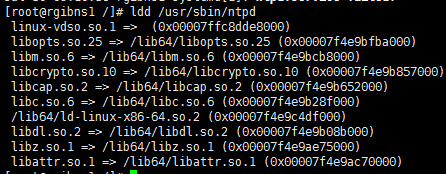

发现存在这个包

# 暂时方案

将cdh的该问题抑制。目前采用外部的ntp方案，因此停止的同时要删除该开机自启动。

```sh
chkconfig ntpd off
```

# 某个节点的sudo为777

```sh
export HISTTIMEFORMAT='%F %T'
history|grep chmod
```

显示所有的chmod命令

```sh
   79  2018-07-31 02:23:28chmod -R 777.
   80  2018-07-31 02:23:28chmod -R 777 /
   81  2018-07-31 02:23:28chmod -R 777 .
  102  2018-07-31 02:23:28chmod 755 -R *
  106  2018-07-31 02:23:28chmod 700 ~/.ssh
  243  2018-07-31 02:23:28chmod 777 *.war
  248  2018-07-31 02:23:28chmod 777 *.war
  250  2018-07-31 02:23:28chmod 777 *.war
  257  2018-07-31 02:23:28chmod 777 *.war
  262  2018-07-31 02:23:28chmod 777 *.war
  337  2018-07-31 02:23:28chmod 777 start.sh
  793  2018-07-31 02:23:28chmod 777 ntp.sh
  853  2018-07-31 02:54:39history chmod
  855  2018-07-31 02:56:52histort|grep chmod
  856  2018-07-31 02:56:56history|grep chmod
  858  2018-07-31 02:57:41history|grep chmod
```

最好的办法是重做镜像，删除那些可能修改权限的软件。

# mysql连接错误

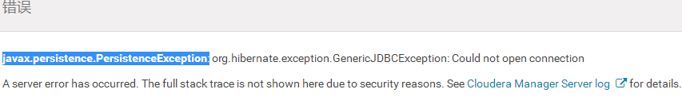

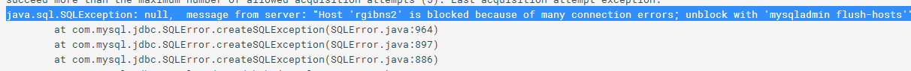

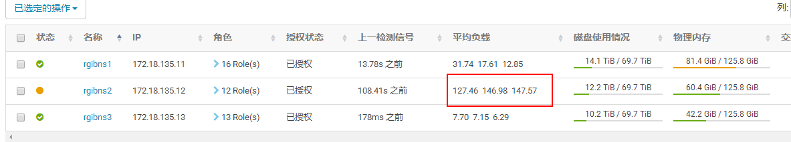

发现rgibns2节点负载很高

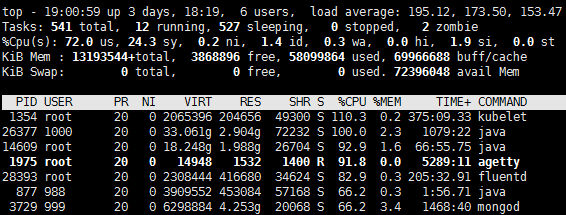

查看yarn应用发现有一个任务占用率很高

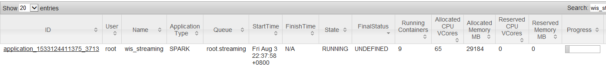

调查发现该任务为一个大型的综合任务，含有多个流处理线程，同时导致MongoDB的shard12分片也有高负载。如果能够拆解该任务，将有大的帮助。

## 解决方式

到11、12执行一下

```sh
 mysqladmin flush-hosts -uroot  -prjbigdata
```

然后到11 重启cm

```sh
crm resource restart cloudera-scm-server
```
