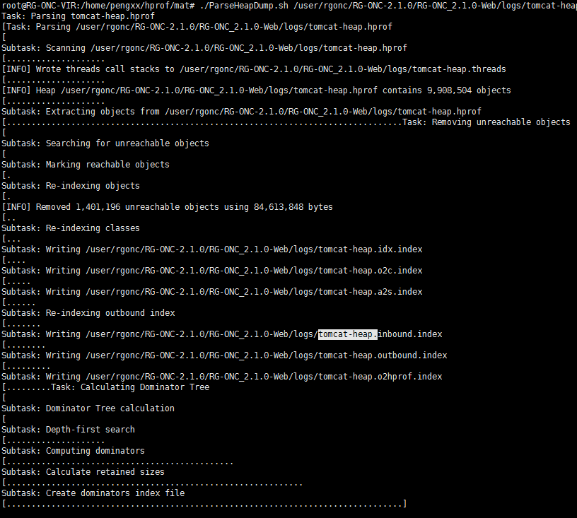
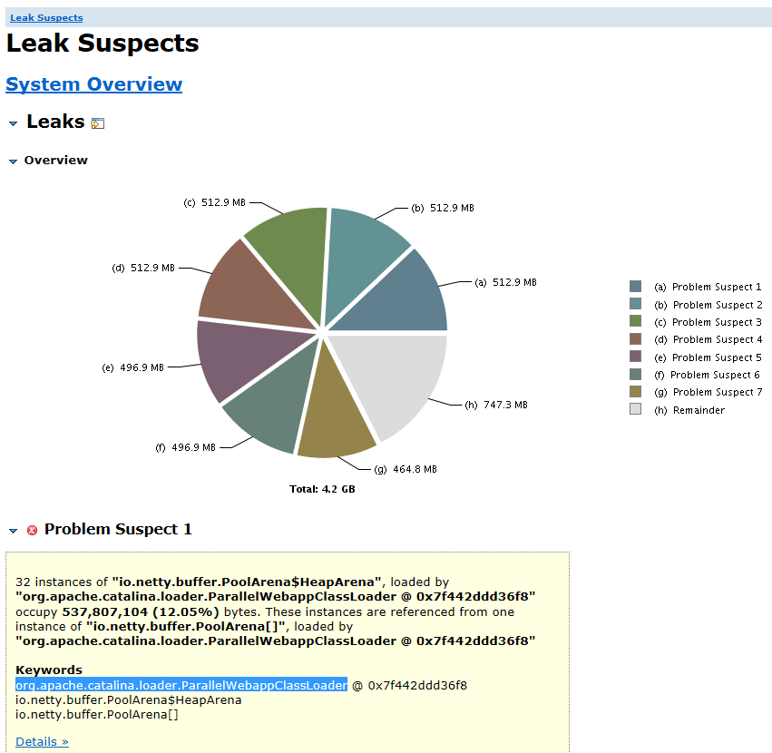

# 内存dump及分析
$ jmap -dump:format=b,file=tomcat.bin pid

安装MAT的Linux版本: http://registry.mig.ruijie.net:8000/software/linux/MemoryAnalyzer-1.8.1.20180910-linux.gtk.x86_64.zip

解压$ tar zxvf MemoryAnalyzer-1.8.1.20180910-linux.gtk.x86_64.zip

解压之后，需要修改mat的配置文件，打开MemoryAnalyzer.ini文件，修改-Xmx的值，使大于hprof文件的大小，建议是其2倍大小。

执行内存泄漏分析


./ParseHeapDump.sh xxx/tomcat.hprof org.eclipse.mat.api:suspects

注意：会产生大量的文件，建议创建一个文件夹来做。


```shell
root@RG-ONC-VIR:/home/pengxx/hprof/mat# ll
total 152
drwxrwxr-x  6 root root  4096 May 16 21:07 ./
drwxr-xr-x  3 root root  4096 May 16 21:07 ../
drwxrwxr-x  3 root root  4096 Sep 20  2018 configuration/
-rw-rw-r--  1 root root 16863 Sep 10  2018 epl-v10.html
drwxrwxr-x 18 root root  4096 Sep 20  2018 features/
-rwxr-xr-x  1 root root 73064 Sep 20  2018 MemoryAnalyzer*
-rw-rw-r--  1 root root   186 May 16 21:07 MemoryAnalyzer.ini
-rw-rw-r--  1 root root  9013 Sep 10  2018 notice.html
drwxrwxr-x  4 root root  4096 Sep 20  2018 p2/
-rwxr-xr-x  1 root root   333 Sep 10  2018 ParseHeapDump.sh*
drwxrwxr-x  5 root root 20480 Sep 20  2018 plugins/
```

执行结果：会产生网页报告




然后把网页文件压缩包解压后的index.html文件导入到浏览器中：



这里面能够发现主要是catalina造成的内存泄露