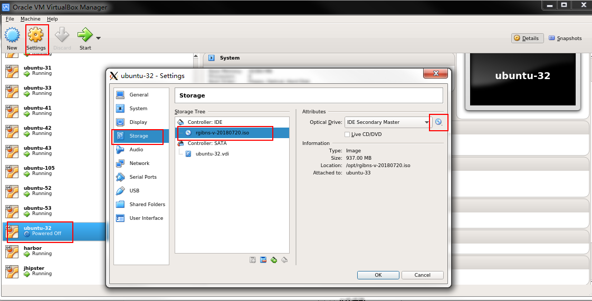

## 安装 Xming

Xming工具是将Linux的图形信号发送到window系统中，让其显示。这里主要是为了启动virtualbox。

## 打通监听隧道

Xming是在windows后台启动的，因此要让它监听Linux信号，就需要使用Xshell建立隧道。

在宿主机（能够创建虚拟机）上配置隧道。这里的宿主机是30。


## 开启virtualbox

```shell
virtualbox
```

等待一段时间就能够自动启动，然后在界面上选择好宿主机上的ISO镜像安装即可。



配置好后，直接点击Start按钮，可以看到界面安装形式。安装成功后，会自动关闭该虚拟机，然后要启动它。


这里主要选择从后端启动它，因为以后用服务器都是从命令行进去，而不是界面。


可以看到小图中已经在开机加载了。


开机成功了。

## 修改IP

在创建虚拟机的时候是使用了比较靠后的ip地址（例如220），是为了防止ip冲突，创建的IP不能联网，就无法使用命令行远程连接了，因此虚拟机创建成功后要改回自己想要的ip地址

```shell
root@rgibns:~# vim /etc/network
```


定位到interfaces回车确认


修改address地址并保存。然后重启

```shell
reboot
```

再次进入时，账号密码不变，但是ip要改成132了。

## 虚拟机的管理


在virtualbox中可以看到有很多的虚拟机，虽然虚拟机里面给予了很多其他的名字，但是从virtualbox上看就是简单的编号。我的虚拟机是31-33号。现在需要能够将虚拟机开启或者关闭，不用virtualbox也能够做到。

```shell
VBoxManage startvm ubuntu-31  --type headless
VBoxManage controlvm ubuntu-31 savestate
```

甚至可以将该命令都配置成脚本便于批量管理


