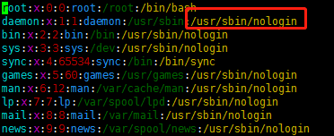
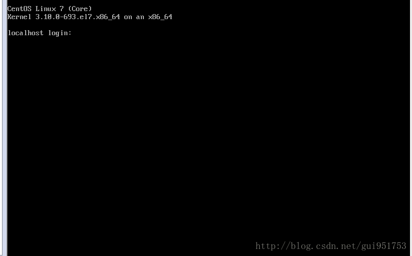

# 用户与组

```shell
# 创建组，完成后可以在/etc/group文件中找到该组名
groupadd manager
# 在组中加入用户，完成后可以在/etc/group和/etc/passwd文件中找到该组名
useradd harry -G manager
useradd peter -G manager
# 切换用户
su harry
# 修改用户密码
# 1. 当前用户修改密码
passwd
# 2. root用户修改其他用户密码
passwd harry
# 退出当前用户
exit

```

**创建非交互式shell登录的用户**

可以先查看/etc/passwd下有相关案例



```shell
useradd -s /usr/sbin/nologin strlt
```

**删除用户**

```shell
userdel strlt
```

###交互式shell和非交互式shell、登录shell和非登录shell的区别

在我们使用shell的同时，我们应该清楚shell的一些配置文件的存放位置，按照范围来分，可以分为两种：
（1）全局配置：

/etc/profile
/etc/profile.d/*.sh
/etc/bashrc

（2）个人配置：

~/.bash_profile
~/.bashrc

```bash
配置文件可以有两种分类的方法。其一，是按照配置文件的生效范围划分；其二，是按照配置文件的功能划分。
1. 按照配置文件的生效范围划分：
(1)全局配置文件
功能：定义全局的环境变量。
包含的配置文件：
/etc/profile
/etc/profile.d/*.sh
/etc/bashrc
（2）个人配置文件
功能：自定义当前用户的环境变量
包含的配置文件：
~/.bash_profile
~/.bashrc
2. 按照配置文件的功能划分：  
（1）profile类型：为交互式登陆的shell提供配置
功能：定义环境变量;运行命令或者脚本                
包含的配置文件：
全局：/etc/profile  /etc/profile.d/*.sh
个人: ~/.bash_profile
（2）bashrc类：为非交互式登陆的shell提供配置
功能：定义命令别名和函数；定义本地变量
包含的配置文件：
全局：/etc/profile      
个人：~/.bashrc
```

我们可以根据shell是否是交互式和shell是否是登录式这两个维度，来对shell进行分类。

交互式shell和非交互式shell（interactive shell and non-interactive shell）交互式模式就是在终端上执行，shell等待你的输入，并且立即执行你提交的命令。这种模式被称作交互式是因为shell与用户进行交互。这种模式也是大多数用户非常熟悉的：登录、执行一些命令、退出。当你退出后，shell也终止了。
shell也可以运行在另外一种模式：非交互式模式，以shell script(非交互)方式执行。在这种模式 下，shell不与你进行交互，而是读取存放在文件中的命令,并且执行它们。当它读到文件的结尾EOF，shell也就终止了。

举个例子，最常见的交互式shell，就是我们利用虚拟机登录Linux系统时的那个等待登录界面，大概如下图所示：



系统在等待我们键入登录的用户名和密码，这就是一种交互式shell，而非交互式shell就像我们写的那些很简单的脚本，比如一个脚本展示出:helloworld。这个脚本不需要我们对其进行交互，它就只是很简单的将其脚本中的命令按顺序执行。

####登录式shell和非登录式shell

- 登录shell：是需要用户名、密码登录后才能进入的shell（或者通过--login”选项生成的shell）。
- 非登录shell：当然就不需要输入用户名和密码即可打开的Shell，例如：直接命令“bash”就是打开一个新的非登录shell，在Gnome或KDE中打开一个“终端”（terminal）窗口程序也是一个非登录shell。
- 执行exit命令，退出一个shell（登录或非登录shell）；
- 执行logout命令，退出登录shell（不能退出非登录shell）。

####交互式登录shell和非交互式登录shell的区别

交互式登录：(清除掉所有变量，通过文件重新读入)

1. 直接通过终端输入账号密码登录
2. 使用“su - UserName”切换的用户

执行顺序：（影响该shell的配置文件）
/etc/profile --> /etc/profile.d/*.sh --> ~/.bash_profile--> ~/.bashrc--> /etc/bashrc

####非交互式登录：（会继承上一个shell的全部变量）

1. su UserName
2. 图形界面下打开的终端
3. 执行脚本   （当我们执行脚本的时候.我们就已经进入到了一个子shell）
4. 任何其它的bash实例

执行顺序：（影响该shell的配置文件）

~/.bashrc--> /etc/bashrc--> /etc/profile.d/*.sh

使用./test.sh或者 bash ./test.sh执行脚本的时候，是开启一个子shell，这个子shell能继承上一个父shell的变量，而这个子shell的变量，随着子shell的退出而消失。当我们用. test.sh 或者source test.sh时，不开启子shell，在当前shell运行，子shell中的所有值都影响当前。

一般我们对shell进行一些配置的时候，通常都是对~/.bashrc 和/etc/bashrc这两个文件进行一些配置。

# 读写操作

将/etc/fstab复制到/var/tmp/fstab，设置harry可以读写，natasha不能做任何操作，其他用户可读，设置manager组为fstab的所属组。

```shell
# 复制
cp iostat.txt /var/tmpfstab
#状况为
root@rgibns1:/home/pengxx# ll /var/tmp/fstab 
-rw-r--r-- 1 root root 541466 Jun 11 14:18 /var/tmp/fstab
#切换文件所属组
chgrp manager /var/tmp/fstab
#状况变更为
root@rgibns1:/home/pengxx# ll /var/tmp/fstab 
-rw-r--r-- 1 root manager 541466 Jun 11 14:18 /var/tmp/fstab
#设置harry用户可以读写
setfacl -m u:harry:rw /var/tmp/fstab
# 状况变更为
root@rgibns1:/home/pengxx# ll /var/tmp/fstab 
-rw-rw-r--+ 1 root manager 541466 Jun 11 14:18 /var/tmp/fstab
# 设置natasha用户不能做任何操作
setfacl -m u:natasha:0 /var/tmp/fstab
# 状况变更为
root@rgibns1:/home/pengxx# ll /var/tmp/fstab 
-rw-rw-r--+ 1 root manager 541466 Jun 11 14:18 /var/tmp/fstab
# 其他用户可读
chmod o+r/var/tmp/fstab
# 状况变更为
root@rgibns1:/home/pengxx# ll /var/tmp/fstab 
-rw-rw-r--+ 1 root manager 541466 Jun 11 14:18 /var/tmp/fstab
# 检查facl权限
getfacl/var/tmp/fstab
#结果为
getfacl: Removing leading '/' from absolute path names
# file: var/tmp/fstab
# owner: root
# group: manager
user::rw-
user:harry:rw-
user:natasha:---
group::r--
mask::rw-
other::r--
```

###在/home下创建一个目录，名为admins，要求所属组为manager组，组成员可以读写，其他用户没有任何权限，同组成员在目录下创建的文件的所属组也为manager组。

```shell
# 在/home下创建一个目录，名为admins
mkdir /home/admins
drwxr-xr-x  2 root   root   4096 Jun 11 14:50 admins/
# 要求所属组为manager组
chown :manager /home/admins
# 事实证明使用 chgrp manager /home/admins命令也可以达成
drwxr-xr-x  2 root   manager 4096 Jun 11 14:50 admins/
# 组员可以读写，其他用户没有任何权限
chmod g=rw,o-rwx /home/admins/
drwxrw----  2 root   manager 4096 Jun 11 14:50 admins/
# 同组员在目录下创建的文件的所属组也为manager组
chmod g+s /home/admins/
drwxrwS---  2 root   manager 4096 Jun 11 14:50 admins/
#检查
# file: admins/
# owner: root
# group: manager
# flags: -s-
user::rwx
group::rw-
other::---
```

### 建立用户test12，其UID为4332，密码为test12。

```shell
useradd -u 4332 test12
# 在/etc/passwd文件中可以看到该用户
test12:x:4332:4332::/home/test12:
# 设置密码为test12，会提示输入两次。
passwd test12
```

### 找出harry拥有的文件，拷贝到目录/opt/dir下。

```shell
mkdir /opt/dir -p
# -rf强制递归，-p拷贝权限，必须加上分号
find / -user harry -exec cp -rfp {} /opt/dir \;
```

会发现没有这样的文件，可以先创建一些目录和文件

```shell
mkdir /home/harry
chown harry:harry harry/
su harry
cd harry & touch harry.txt
ls -l
-rw-rw-r-- 1 harry harry 0 Jun 11 15:37 harry.txt
```

再次使用root账户执行拷贝命令能够得到如下文件：

```shell
root@rgibns1:/home# ll /opt/dir/
total 16
drwxr-xr-x  3 root  root  4096 Jun 11 15:38 ./
drwxr-xr-x 15 root  root  4096 Jun 11 15:20 ../
-rw-------  1 harry harry   46 Jun 11 15:38 .bash_history
drwxr-xr-x  2 harry harry 4096 Jun 11 15:38 harry/
-rw-rw-r--  1 harry harry    0 Jun 11 15:37 harry.txt
```

### 为natasha用户建立计划任务，每天14：23执行 echo "file_word"

```shell
crontab -u natasha -e 23 14 * * * echo "file_world"
```

这个命令会开启一个 GNU nona编译器，写完代码后，可以使用ctrl+x退出，会提示是否保存，输入YES即可。显示用户的crontab文件：

```shell
crontab -u natasha -l
```

# 编程

## 求和

编写一个名为mul的脚本，参数为一个大于20的正整数。先检查参数是否符合要求。如果不符合，请答应警告，如果符合，分别输出其与1到10的乘积。

```shell
#!/bin/bash
if [ $1 -gt 20 ]
then
    n=1
    m=1
    while [ $n -le 10 ]
    do
        m=$(expr $1 \* $n)
        echo "$n $m"
        n=$(expr $n + 1)
    done
else
    echo "number is wrong"
fi
```

注意点：

- 赋值的时候等号左右不能有空格；
- 乘积操作，需要转义；数据运算需要调用expr关键字；
- 使用[]方括号来包括条件，条件与方括号的前后必须要要空格。

执行命令

```shell
bash mul.sh 30
```

## 求平方

编写一个名为square的脚本，参数为一个大于10的正整数。先检查参数是否符合要求。不符合要求，请给出提示；否则输出从1到正整数的平方值。

```shell
#!/bin/bash
if [ $1 -gt 10 ]
then
    n=1
    while [ $n -le $1 ]
    do
        m=$(expr $n \* $n)
        echo "$n $m"
        n=$(expr $n + 1)
    done
else
    echo "number is wrong"
fi
```

注意：

- -gt和-le别写错了；
- m不一定要定义在while循环的外面。

## 判断文件存在

编写一个名为move的脚本程序，格式 `move <file1> <file2>`。如果file1不存在，给出提示；否则移动file1至file2。

```shell
#!/bin/bash
file1=/home/pengxx/log
file2=/home/pengxx/study
if test -f $file1
then
    mv $file1 $file2
else
    echo "file1 is not exits"
fi
```

也可以写为

```shell
#!/bin/bash
if test -f file1
then
    mv file1 file2
else
    echo "file1 is not exits"
fi
```


## 斐波拉契数列

编写一个shell脚本，能够显示下面序列的前25个数字。0,1,1,2,3,5,8,13,....，前两个数字之和为第三个数字，即著名的斐波拉契数列。

```shell
#!/bin/bash
n=0
echo "$n"
m=1
echo "$m"
t=1
a=2
while [ $a -lt 25 ]
do
    # 求两个元素之和
    t=$(expr $n + $m)
    echo "$t"
    # a是计数器
    a=$(expr $a + 1)
    # 将n更新为n后面的一个元素，也就是m
    n=$m
    # 将m更新到m后面的一个元素，也就是新生成的t
    m=$t
done
```

注意：

- 最好使用[]方括号来包裹条件，且注意条件前后的空格。