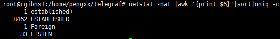

# chmod
- 创建者拥有读写可执行权限，同一组用户拥有读和执行权限，其他用户拥有读和执行权限
- "0"表示没有权限、“1”表示可执行权限、“2”表示可写权限、“4”表示可读权限。例如：7=1+2+4，5=1+4
- 使用“chmod 777 test.sh”命令使用能使用linux系统的用户拥有相同的“读写可执行权限”。
- linux给文件或目录赋权限还有一种容易理解方法。比如：“chmod a-x”表示所有用户对此文件或目录将没有执行权限。

“a”表示所有用户，“u”表示创建者、“g”表示创建者同组用户、“o”表示其他用户；“+”表示添加权限，“-”表示取消权限；“r”表示读权限、“w”表示写权限、“x”表示写权限。

- 修改文件夹的权限，例如：chmod 777  -R test/。用-R表示对全部子文件和文件夹


# rm
强制删除文件：
```sh
rm -f /var/log/httpd/access.log
```
强制删除文件夹(不会一个个的问是否删除)
```sh
rm -rf /var/log/httpd/access
```

# chkconfig
service redis does not support chkconfig的解决办法

必须把下面两行注释放在/etc/init.d/redis文件靠前的注释中：
```sh 
# chkconfig:   2345 90 10

# description:  Redis is a persistent key-value database
```
上面的注释的意思是，redis服务必须在运行级2，3，4，5下被启动或关闭，启动的优先级是90，关闭的优先级是10。

## linux 运行级别

运行级别就是操作系统当前正在运行的功能级别。这个级别从0到6 ，具有不同的功能。这些级别在/etc/inittab文件里指定。这个文件是init程序寻找的主要文件，最先运行的服务是那些放在/etc/rc.d 目录下的文件。

不同的运行级定义如下：(可以参考Linux里面的/etc/inittab)

 

## 缺省的运行级，RHS用到的级别如下：

0. 关机
1. 单用户模式
2. 无网络支持的多用户模式
3. 有网络支持的多用户模式
4. 保留，未使用
5. 有网络支持有X-Window支持的多用户模式
6. 重新引导系统，即重启

## 对各个运行级的详细解释：
0. 为停机，机器关闭
1. 为单用户模式，就像Win9x下的安全模式类似。
2. 为多用户模式，但是没有NFS支持。
3. 为完整的多用户模式，是标准的运行级。
4. 一般不用，在一些特殊情况下可以用它来做一些事情。例如在笔记本电脑的电池用尽时，可以切换到这个模式来做一些设置。
5. 就是X11，进到X Window系统了。
6. 为重启，运行init 6机器就会重启。
7. 

## chkconfig用法
chkconfig命令可以用来检查、设置系统的各种服务
##使用语法：

chkconfig [--add][--del][--list][系统服务] 或 chkconfig [--level <等级代号>][系统服务][on/off/reset]

## 参数用法：
- –add 　增加所指定的系统服务，让chkconfig指令得以管理它，并同时在系统启动的叙述文件内增加相关数据。
- –del 　删除所指定的系统服务，不再由chkconfig指令管理，并同时在系统启动的叙述文件内删除相关数据。
- –level<等级代号> 　指定读系统服务要在哪一个执行等级中开启或关毕。

## 使用范例：
|命令|说明
--- | ---
chkconfig –list | 列出所有的系统服务
chkconfig –add redis | 增加redis服务
chkconfig –del redis | 删除redis 服务
chkconfig –level redis 2345 on |  把redis在运行级别为2、3、4、5的情况下都是on（开启）的状态。

# rm
- 把一个文件夹的所有内容移动到上级目录
`mv tomcat -t ../`

# curl
curl 用于模拟get、post请求
## 带头的get
```sh
curl -v "http://cloudbox-api-daily.aliyun.com/v1/users/queryQuota.json" -H "X-Authorize-Provider:kp" -H "T:1510061747409" -H "X-Channel-Id:90101" -H "X-Authorize-Token;" 
```
当某头信息必须带上，且为空时，例如X-Authorize-Token字段，可以用分号结尾。-v参数表示显示头信息。
## 带头的post
```sh
curl -v "http://cloudbox-api-daily.aliyun.com/v1/users/queryQuota.json" -H "X-Authorize-Provider:kp" -H "T:1510061747409" -H "X-Channel-Id:90101" -H "X-Authorize-Token;" -d "key:value"
```

# tail
1. tail -n 100 log 查看日志文件的最后100行
2. tail -f log 追加查看日志文件的末尾

# find
模糊查找
```sh
find . -name '*val*'
```
# 端口占用
在使用中，可能发现某个端口被占用，例如日志出现以下错误
```
The port may already be in use or the connector may be misconfigured.
```
可以使用以下命令：
```bash
netstat -anp|grep 8012
```
结果为：
```bash
tcp        0      0 0.0.0.0:8012            0.0.0.0:*               LISTEN      9713/java
```
可以看到8012端口被进程号为9713的一个java程序占用了，这个时候使用`ps -ef|grep 9713`就可以知道这个java程序是啥了，然后关闭它或者修改端口号就好了
# 进制转化
```bash
--将16进制转化为10进制
printf %d 0x300b
--将10进制转化为16进制
printf %x 12288
```
# CPU使用率
在linux的系统维护中，可能需要经常查看cpu使用率，分析系统整体的运行情况。而监控CPU的性能一般包括以下3点：运行队列、CPU使用率和上下文切换。

对于每一个CPU来说运行队列最好不要超过3，例如，如果是双核CPU就不要超过6。如果队列长期保持在3以上，说明任何一个进程运行时都不能马上得到cpu的响应，这时可能需要考虑升级cpu。另外满负荷运行cpu的使用率最好是user空间保持在65%～70%，system空间保持在30%，空闲保持在0%~5% 。
## top命令
```bash
[root@li676-235 ~]# top -bn 1 -i -c
top - 14:19:51 up 138 days, 7:15, 1 user, load average: 0.20, 0.33, 0.39
Tasks: 115 total, 1 running, 114 sleeping, 0 stopped, 0 zombie
Cpu(s): 4.5%us, 3.8%sy, 0.0%ni, 91.0%id, 0.6%wa, 0.0%hi, 0.0%si, 0.0%st
Mem: 1014660k total, 880512k used, 134148k free, 264904k buffers
Swap: 262140k total, 34788k used, 227352k free, 217144k cached
PID USER PR NI VIRT RES SHR S %CPU %MEM TIME+ COMMAND 
12760 root 20 0 15084 1944 1632 R 2.0 0.2 0:00.01 top -bn 1 -i -c
```
如上所示，top命令可以看到总体的系统运行状态和cpu的使用率 。
- %us：表示用户空间程序的cpu使用率（没有通过nice调度）
- %sy：表示系统空间的cpu使用率，主要是内核程序。
- %ni：表示用户空间且通过nice调度过的程序的cpu使用率。
- %id：空闲cpu
- %wa：cpu运行时在等待io的时间
- %hi：cpu处理硬中断的数量
- %si：cpu处理软中断的数量
- %st：被虚拟机偷走的cpu

一般CPU使用率用于监控分布式集群中某个节点的健康信息，例如判断节点CPU使用率不能超过70%
```bash
#!/usr/bin/env bash
MAX_cpu=70
top_command=`which top`
cpuInfo=`$top_command -bn 1 | grep "Cpu(s)" | awk '{print $2+$3}'`
Cpu=${cpuInfo/.*}
if [ $Cpu -gt $MAX_cpu ]
then
    echo "ERROR"
else
    echo "SUCCESS"
fi
```
其核心命令就是
```bash
top -bn 1 -i -c|grep "Cpu(s)"|awk '{print $2+$3}'
```
找到用户空间和系统空间的Cpu使用率之和。
# 等式判别
例如
```bash
if [ $Cpu -gt $MAX_cpu ]
then
    echo "ERROR"
else
    echo "SUCCESS"
fi
```
代码中出现了-gt，实际上这是等式的判别条件：
- EQ 就是 EQUAL等于
- NQ 就是 NOT EQUAL不等于 
- GT 就是 GREATER THAN大于　 
- LT 就是 LESS THAN小于 
- GE 就是 GREATER THAN OR EQUAL 大于等于 
- LE 就是 LESS THAN OR EQUAL 小于等于

# 如何解决apt-get中Unmet dependencies问题

新安装的Ubuntu 16.04 TLS系统，由于apt-get upgrade过程中断，导致依赖损坏；安装新的包时，提示Unmet dependencies问题。本文记录了问题的排查方法及解决方案。


根据提示信息，运行apt-get -f install来修复问题， 发现该命令无效。因此采用其他修复方法。

```shell
sudo apt --fix-broken install -y
sudo apt-get update
sudo apt-get upgrade -y
```

# 解决“/bin/bash^M: bad interpreter: No such file or directory”

在执行shell脚本时提示这样的错误主要是由于shell脚本文件是dos格式，即每一行结尾以\r\n来标识，而unix格式的文件行尾则以\n来标识。
  查看脚本文件是dos格式还是unix格式的几种办法。

1. **`cat -A filename`  从显示结果可以判断，dos格式的文件行尾为^M\$，unix格式的文件行尾为\$。**

2. `od -t x1 filename` 如果看到输出内容中存在0d 0a的字符，那么文件是dos格式，如果只有0a，则是unix格式。

3. `vi filename`打开文件，执行` : set ff`，如果文件为dos格式在显示为fileformat=dos，如果是unxi则显示为fileformat=unix。

  解决方法：

1. 使用linux命令`dos2unix filename`，直接把文件转换为unix格式
2. 使用sed命令`sed -i "s/\r//" filename`  或者` sed -i "s/^M//" filename`直接替换结尾符为unix格式
3. **`vi filename`打开文件，执行` : set ff=unix` 设置文件为unix，然后执行`:wq`，保存成unix格式。**

# history

显示时间方法

```sh
export HISTTIMEFORMAT='%F %T'
history|grep chmod
```

# 系统连接数

```sh
runtime: failed to create new OS thread (have 8 already; errno=11)
runtime: may need to increase max user processes (ulimit -u)
fatal error: newosproc
```

连接数统计

```
netstat -nat |awk '{print $6}'|sort|uniq -c
```



参数说明

```sh
CLOSED：无连接是活动的或正在进行 
LISTEN：服务器在等待进入呼叫 
SYN_RECV：一个连接请求已经到达，等待确认 
SYN_SENT：应用已经开始，打开一个连接 
ESTABLISHED：正常数据传输状态 
FIN_WAIT1：应用说它已经完成 
FIN_WAIT2：另一边已同意释放 
ITMED_WAIT：等待所有分组死掉 
CLOSING：两边同时尝试关闭 
TIME_WAIT：另一边已初始化一个释放 
LAST_ACK：等待所有分组死掉
```

查看系统最大连接数

```sh
ulimit -a
```

#  磁盘占用量

**du命令**是查看使用空间的，但是与[df](http://man.linuxde.net/df)命令不同的是Linux du命令是对文件和目录磁盘使用的空间的查看，还是和df命令有一些区别的。

### 语法 

```sh
du [选项][文件]
```

### 选项 

```sh
-a或-all 显示目录中个别文件的大小。
-b或-bytes 显示目录或文件大小时，以byte为单位。
-c或--total 除了显示个别目录或文件的大小外，同时也显示所有目录或文件的总和。
-k或--kilobytes 以KB(1024bytes)为单位输出。
-m或--megabytes 以MB为单位输出。
-s或--summarize 仅显示总计，只列出最后加总的值。
-h或--human-readable 以K，M，G为单位，提高信息的可读性。
-x或--one-file-xystem 以一开始处理时的文件系统为准，若遇上其它不同的文件系统目录则略过。
-L<符号链接>或--dereference<符号链接> 显示选项中所指定符号链接的源文件大小。
-S或--separate-dirs 显示个别目录的大小时，并不含其子目录的大小。
-X<文件>或--exclude-from=<文件> 在<文件>指定目录或文件。
--exclude=<目录或文件> 略过指定的目录或文件。
-D或--dereference-args 显示指定符号链接的源文件大小。
-H或--si 与-h参数相同，但是K，M，G是以1000为换算单位。
-l或--count-links 重复计算硬件链接的文件。
```

###  实例 

 显示目录或者文件所占空间：

```
[root@localhost test]# du
608 ./test6
308 ./test4
4 ./scf/lib
4 ./scf/service/deploy/product
4 ./scf/service/deploy/info
12 ./scf/service/deploy
16 ./scf/service
4 ./scf/doc
4 ./scf/bin
32 ./scf
8 ./test3
1288 .
```