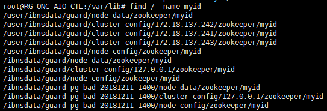

# 出厂初始化配置
1. Zookeeper
- 设置为 conf/zoo.cfg
```
tickTime=2000
dataDir=/var/lib/zookeeper/
clientPort=2181
initLimit=5
syncLimit=2
server.0=127.0.0.1:2888:3888
```
- 设置 /var/lib/zookeeper/myid
```
0
```

2. Kafka 
- 设置 config/server.properties
```
broker.id=0
reserved.broker.max.id=100000
listeners=PLAINTEXT://:9092
advertised.listeners=PLAINTEXT://127.0.0.1:9092
log.dirs=/tmp/kafka-logs
```

- 需要创建topic，以 topic_sample 为例
- **待讨论：需要创建的主题列表，统一在守护服务的配置文件中变更**
```
bin/kafka-topics.sh --create --zookeeper 127.0.0.1:2181 --replication-factor 1 --partitions 1 --topic topic_sample
```


# 启动
1. zookeeper 
- 在前台启动
```
bin/zkServer.sh start-foreground
```
- 在后台启动
```
bin/zkServer.sh start
```

2. kafka
- 在前端启动
```
bin/kafka-server-start.sh config/server.properties
```

# 停止
1. Zookeeper 
- 使用命令行停止
```
bin/zkServer.sh stop
```

2. Kafka
```
bin/kafka-server-stop.sh config/server.properties
```

# 单机转集群
1. Zookeeper
- 以 172.18.135.121, 172.18.135.122, 172.18.135.123 为示例
- 各结点的配置文件
```
tickTime=2000
dataDir=/var/lib/zookeeper/
clientPort=2181
initLimit=5
syncLimit=2
server.0=172.18.135.121:2888:3888
server.1=172.18.135.122:2888:3888
server.2=172.18.135.123:2888:3888
```
- 各结点的 /var/lib/zookeeper/myid 文件（实际服务器中发现放在/user/ibnsdata/guard/node-data/zookeeper/myid目录），填写结点的编号，分别是0, 1, 2，例如主结点的文件：
```
0
```




- 主结点保留数据，从结点删除数据
- 从结点如果不删除数据，已知可能会有数据的不一致性，以下是在两个不同结点上运行的结果

```
[zk: 127.0.0.1:2181(CONNECTED) 17] create /test test
Node already exists: /test
[zk: 127.0.0.1:2181(CONNECTED) 18] get /test
Node does not exist: /test
```

```
[zk: 127.0.0.1:2181(CONNECTED) 7] create /test test 
Node already exists: /test
[zk: 127.0.0.1:2181(CONNECTED) 8] get /test
test
cZxid = 0x200000006
ctime = Fri Oct 19 16:57:50 CST 2018
mZxid = 0x200000006
mtime = Fri Oct 19 16:57:50 CST 2018
pZxid = 0x200000006
cversion = 0
dataVersion = 0
aclVersion = 0
ephemeralOwner = 0x0
dataLength = 4
numChildren = 0
```

2. Kafka
- 以 172.18.135.121, 172.18.135.122, 172.18.135.123 为例
- 172.18.135.121
```
broker.id=0
reserved.broker.max.id=100000
listeners=PLAINTEXT://:9092
advertised.listeners=PLAINTEXT://172.18.135.121:9092
log.dirs=/tmp/kafka-logs
zookeeper.connect=localhost:2181
```
- 172.18.135.122
```
broker.id=1
reserved.broker.max.id=100000
listeners=PLAINTEXT://:9092
advertised.listeners=PLAINTEXT://172.18.135.122:9092
log.dirs=/tmp/kafka-logs
zookeeper.connect=localhost:2181
```
- 172.18.135.123
```
broker.id=2
reserved.broker.max.id=100000
listeners=PLAINTEXT://:9092
advertised.listeners=PLAINTEXT://172.18.135.123:9092
log.dirs=/tmp/kafka-logs
zookeeper.connect=localhost:2181
```

- 需要重新创建 topic，以 topic_sample 为例
```
bin/kafka-topics.sh --create --zookeeper 127.0.0.1:2181 --replication-factor 3 --partitions 1 --topic topic_sample
```


# 集群成员变更 
1. zookeeper 
- Zookeeper 结点成员变更，不需要多数成员在线时进行处理，因此处理的逻辑可以视同于创建集群，可以复用上面的操作
- 已知问题：如果A、B、C -> A、X、Y，其中X, Y这两个结点原来已经有数据，但是没有被清理掉，则会出现三个结点数据不一致的情况。
- 以 172.18.135.121, 172.18.135.122, 172.18.135.123 为示例
- 各结点的配置文件
```
tickTime=2000
dataDir=/var/lib/zookeeper/
clientPort=2181
initLimit=5
syncLimit=2
server.0=172.18.135.121:2888:3888
server.1=172.18.135.122:2888:3888
server.2=172.18.135.123:2888:3888
```
- 各结点的 /var/lib/zookeeper/myid 文件，填写结点的编号，分别是0, 1, 2，例如主结点的文件：
```
0
```
- 主结点保留数据，从结点删除数据
- 从结点如果不删除数据，已知可能会有数据的不一致性，以下是在两个不同结点上运行的结果

```
[zk: 127.0.0.1:2181(CONNECTED) 17] create /test test
Node already exists: /test
[zk: 127.0.0.1:2181(CONNECTED) 18] get /test
Node does not exist: /test
```

```
[zk: 127.0.0.1:2181(CONNECTED) 7] create /test test 
Node already exists: /test
[zk: 127.0.0.1:2181(CONNECTED) 8] get /test
test
cZxid = 0x200000006
ctime = Fri Oct 19 16:57:50 CST 2018
mZxid = 0x200000006
mtime = Fri Oct 19 16:57:50 CST 2018
pZxid = 0x200000006
cversion = 0
dataVersion = 0
aclVersion = 0
ephemeralOwner = 0x0
dataLength = 4
numChildren = 0
```

2. Kafka
- 操作和组建集群相同
- 以 172.18.135.121, 172.18.135.122, 172.18.135.123 为例
- 172.18.135.121
```
broker.id=0
reserved.broker.max.id=100000
listeners=PLAINTEXT://:9092
advertised.listeners=PLAINTEXT://172.18.135.121:9092
log.dirs=/tmp/kafka-logs
zookeeper.connect=localhost:2181
```
- 172.18.135.122
```
broker.id=1
reserved.broker.max.id=100000
listeners=PLAINTEXT://:9092
advertised.listeners=PLAINTEXT://172.18.135.122:9092
log.dirs=/tmp/kafka-logs
zookeeper.connect=localhost:2181
```
- 172.18.135.123
```
broker.id=2
reserved.broker.max.id=100000
listeners=PLAINTEXT://:9092
advertised.listeners=PLAINTEXT://172.18.135.123:9092
log.dirs=/tmp/kafka-logs
zookeeper.connect=localhost:2181
```

- 从结点不删除/tmp/kafka-logs


# 集群结点退化
- zookeeper
- 设置为 conf/zoo.cfg
```
tickTime=2000
dataDir=/var/lib/zookeeper/
clientPort=2181
initLimit=5
syncLimit=2
server.0=127.0.0.1:2888:3888
```
- 设置 /var/lib/zookeeper/myid
```
0
```

- kafka 
- 设置 config/server.properties
```
broker.id=0
reserved.broker.max.id=100000
listeners=PLAINTEXT://:9092
advertised.listeners=PLAINTEXT://127.0.0.1:9092
log.dirs=/tmp/kafka-logs
```
- 需要删除 /tmp/kafka-logs
- 需要重新创建 topic
- 需要重新创建 topic，以 topic_sample 为例
```
bin/kafka-topics.sh --create --zookeeper 127.0.0.1:2181 --replication-factor 1 --partitions 1 --topic topic_sample
```


# 官方方案

## Clustered (Multi-Server) Setup
- For reliable ZooKeeper service, you should deploy ZooKeeper in a cluster known as an ensemble. As long as a majority of the ensemble are up, the service will be available. Because Zookeeper requires a majority, it is best to use an odd number of machines. For example, with four machines ZooKeeper can only handle the failure of a single machine; if two machines fail, the remaining two machines do not constitute a majority. However, with five machines ZooKeeper can handle the failure of two machines.
- As mentioned in the ZooKeeper Getting Started Guide , a minimum of three servers are required for a fault tolerant clustered setup, and it is strongly recommended that you have an odd number of servers.
- Usually three servers is more than enough for a production install, but for maximum reliability during maintenance, you may wish to install five servers. With three servers, if you perform maintenance on one of them, you are vulnerable to a failure on one of the other two servers during that maintenance. If you have five of them running, you can take one down for maintenance, and know that you're still OK if one of the other four suddenly fails.
- Your redundancy considerations should include all aspects of your environment. If you have three ZooKeeper servers, but their network cables are all plugged into the same network switch, then the failure of that switch will take down your entire ensemble.
- Here are the steps to setting a server that will be part of an ensemble. These steps should be performed on every host in the ensemble:
-Install the Java JDK. You can use the native packaging system for your system, or download the JDK from:
http://java.sun.com/javase/downloads/index.jsp
- Set the Java heap size. This is very important to avoid swapping, which will seriously degrade ZooKeeper performance. To determine the correct value, use load tests, and make sure you are well below the usage limit that would cause you to swap. Be conservative - use a maximum heap size of 3GB for a 4GB machine.
- Install the ZooKeeper Server Package. It can be downloaded from:
http://zookeeper.apache.org/releases.html
- Create a configuration file. This file can be called anything. Use the following settings as a starting point:
```
tickTime=2000
dataDir=/var/lib/zookeeper/
clientPort=2181
initLimit=5
syncLimit=2
server.1=zoo1:2888:3888
server.2=zoo2:2888:3888
server.3=zoo3:2888:3888
```
- You can find the meanings of these and other configuration settings in the section Configuration Parameters. A word though about a few here:
- Every machine that is part of the ZooKeeper ensemble should know about every other machine in the ensemble. You accomplish this with the series of lines of the form server.id=host:port:port. The parameters host and port are straightforward. You attribute the server id to each machine by creating a file named myid, one for each server, which resides in that server's data directory, as specified by the configuration file parameter dataDir.
- The myid file consists of a single line containing only the text of that machine's id. So myid of server 1 would contain the text "1" and nothing else. The id must be unique within the ensemble and should have a value between 1 and 255.
- If your configuration file is set up, you can start a ZooKeeper server:
```
$ java -cp zookeeper.jar:lib/slf4j-api-1.6.1.jar:lib/slf4j-log4j12-1.6.1.jar:lib/log4j-1.2.15.jar:conf \ org.apache.zookeeper.server.quorum.QuorumPeerMain zoo.cfg
```
-QuorumPeerMain starts a ZooKeeper server, JMX management beans are also registered which allows management through a JMX management console. The ZooKeeper JMX document contains details on managing ZooKeeper with JMX.
- See the script bin/zkServer.sh, which is included in the release, for an example of starting server instances.
- Test your deployment by connecting to the hosts:
- In Java, you can run the following command to execute simple operations:
```
$ bin/zkCli.sh -server 127.0.0.1:2181
```

## Single Server and Developer Setup
- Setting up a ZooKeeper server in standalone mode is straightforward. The server is contained in a single JAR file, so installation consists of creating a configuration.
- Once you've downloaded a stable ZooKeeper release unpack it and cd to the root
- To start ZooKeeper you need a configuration file. Here is a sample, create it in conf/zoo.cfg:
```
tickTime=2000
dataDir=/var/lib/zookeeper
clientPort=2181
```
- This file can be called anything, but for the sake of this discussion call it conf/zoo.cfg. Change the value of dataDir to specify an existing (empty to start with) directory. Here are the meanings for each of the fields:
- tickTime
the basic time unit in milliseconds used by ZooKeeper. It is used to do heartbeats and the minimum session timeout will be twice the tickTime.
- dataDir
the location to store the in-memory database snapshots and, unless specified otherwise, the transaction log of updates to the database.
- clientPort
the port to listen for client connections
- Now that you created the configuration file, you can start ZooKeeper:
```
bin/zkServer.sh start
```
- ZooKeeper logs messages using log4j -- more detail available in the Logging section of the Programmer's Guide. You will see log messages coming to the console (default) and/or a log file depending on the log4j configuration.
- The steps outlined here run ZooKeeper in standalone mode. There is no replication, so if ZooKeeper process fails, the service will go down. This is fine for most development situations, but to run ZooKeeper in replicated mode, please see Running Replicated ZooKeeper.


# Kafka

- So far we have been running against a single broker, but that's no fun. For Kafka, a single broker is just a cluster of size one, so nothing much changes other than starting a few more broker instances. But just to get feel for it, let's expand our cluster to three nodes (still all on our local machine).
- First we make a config file for each of the brokers (on Windows use the copy command instead):

```
> cp config/server.properties config/server-1.properties
> cp config/server.properties config/server-2.properties
```
Now edit these new files and set the following properties:
```
config/server-1.properties:
    broker.id=1
    listeners=PLAINTEXT://:9093
    log.dirs=/tmp/kafka-logs-1
 
config/server-2.properties:
    broker.id=2
    listeners=PLAINTEXT://:9094
    log.dirs=/tmp/kafka-logs-2
```
- The broker.id property is the unique and permanent name of each node in the cluster. We have to override the port and log directory only because we are running these all on the same machine and we want to keep the brokers from all trying to register on the same port or overwrite each other's data.
- We already have Zookeeper and our single node started, so we just need to start the two new nodes:
```
> bin/kafka-server-start.sh config/server-1.properties &
...
> bin/kafka-server-start.sh config/server-2.properties &
...
```
- Now create a new topic with a replication factor of three:
```
> bin/kafka-topics.sh --create --zookeeper localhost:2181 --replication-factor 3 --partitions 1 --topic my-replicated-topic
```
- Okay but now that we have a cluster how can we know which broker is doing what? To see that run the "describe topics" command:
```
> bin/kafka-topics.sh --describe --zookeeper localhost:2181 --topic my-replicated-topic
Topic:my-replicated-topic   PartitionCount:1    ReplicationFactor:3 Configs:
    Topic: my-replicated-topic  Partition: 0    Leader: 1   Replicas: 1,2,0 Isr: 1,2,0
```
- Here is an explanation of output. The first line gives a summary of all the partitions, each additional line gives information about one partition. Since we have only one partition for this topic there is only one line.
- "leader" is the node responsible for all reads and writes for the given partition. Each node will be the leader for a randomly selected portion of the partitions.
- "replicas" is the list of nodes that replicate the log for this partition regardless of whether they are the leader or even if they are currently alive.
- "isr" is the set of "in-sync" replicas. This is the subset of the replicas list that is currently alive and caught-up to the leader.
- Note that in my example node 1 is the leader for the only partition of the topic.
- We can run the same command on the original topic we created to see where it is:
```
> bin/kafka-topics.sh --describe --zookeeper localhost:2181 --topic test
Topic:test  PartitionCount:1    ReplicationFactor:1 Configs:
    Topic: test Partition: 0    Leader: 0   Replicas: 0 Isr: 0
```
- So there is no surprise there—the original topic has no replicas and is on server 0, the only server in our cluster when we created it.
- Let's publish a few messages to our new topic:
```
> bin/kafka-console-producer.sh --broker-list localhost:9092 --topic my-replicated-topic
...
my test message 1
my test message 2
^C
```
Now let's consume these messages:
```
> bin/kafka-console-consumer.sh --bootstrap-server localhost:9092 --from-beginning --topic my-replicated-topic
...
my test message 1
my test message 2
^C
```
Now let's test out fault-tolerance. Broker 1 was acting as the leader so let's kill it:
```
> ps aux | grep server-1.properties
7564 ttys002    0:15.91 /System/Library/Frameworks/JavaVM.framework/Versions/1.8/Home/bin/java...
> kill -9 7564
```
On Windows use:
```
> wmic process where "caption = 'java.exe' and commandline like '%server-1.properties%'" get processid
ProcessId
6016
> taskkill /pid 6016 /f
```
Leadership has switched to one of the slaves and node 1 is no longer in the in-sync replica set:
```
> bin/kafka-topics.sh --describe --zookeeper localhost:2181 --topic my-replicated-topic
Topic:my-replicated-topic   PartitionCount:1    ReplicationFactor:3 Configs:
    Topic: my-replicated-topic  Partition: 0    Leader: 2   Replicas: 1,2,0 Isr: 2,0
```
But the messages are still available for consumption even though the leader that took the writes originally is down:
```
> bin/kafka-console-consumer.sh --bootstrap-server localhost:9092 --from-beginning --topic my-replicated-topic
...
my test message 1
my test message 2
^C
```


- 已知问题： kafka 启动异常
```
[2018-10-31 15:51:39,700] ERROR Error while renaming dir for test1-0 in log dir X:\ROOT\node-data\kafka (kafka.server.LogDirFailure
hannel)                                                                                                                            
java.nio.file.AccessDeniedException: X:\ROOT\node-data\kafka\test1-0 -> X:\ROOT\node-data\kafka\test1-0.0fcc2109aea54b108729a890bdb
a843-delete                                                                                                                        
        at sun.nio.fs.WindowsException.translateToIOException(WindowsException.java:83)                                            
        at sun.nio.fs.WindowsException.rethrowAsIOException(WindowsException.java:97)                                              
        at sun.nio.fs.WindowsFileCopy.move(WindowsFileCopy.java:387)                                                               
        at sun.nio.fs.WindowsFileSystemProvider.move(WindowsFileSystemProvider.java:287)                                           
        at java.nio.file.Files.move(Files.java:1395)                                                                               
        at org.apache.kafka.common.utils.Utils.atomicMoveWithFallback(Utils.java:697)                                              
        at kafka.log.Log$$anonfun$renameDir$1.apply$mcV$sp(Log.scala:579)                                                          
        at kafka.log.Log$$anonfun$renameDir$1.apply(Log.scala:577)                                                                 
        at kafka.log.Log$$anonfun$renameDir$1.apply(Log.scala:577)                                                                 
        at kafka.log.Log.maybeHandleIOException(Log.scala:1696)                                                                    
        at kafka.log.Log.renameDir(Log.scala:577)                                                                                  
        at kafka.log.LogManager.asyncDelete(LogManager.scala:828)                                                                  
        at kafka.cluster.Partition$$anonfun$delete$1.apply(Partition.scala:245)                                                    
        at kafka.cluster.Partition$$anonfun$delete$1.apply(Partition.scala:240)                                                    
        at kafka.utils.CoreUtils$.inLock(CoreUtils.scala:250)                                                                      
        at kafka.utils.CoreUtils$.inWriteLock(CoreUtils.scala:258)                                                                 
        at kafka.cluster.Partition.delete(Partition.scala:240)                                                                     
        at kafka.server.ReplicaManager.stopReplica(ReplicaManager.scala:342)                                                       
        at kafka.server.ReplicaManager$$anonfun$stopReplicas$2.apply(ReplicaManager.scala:372)                                     
        at kafka.server.ReplicaManager$$anonfun$stopReplicas$2.apply(ReplicaManager.scala:370)                                     
        at scala.collection.Iterator$class.foreach(Iterator.scala:891)                                                             
        at scala.collection.AbstractIterator.foreach(Iterator.scala:1334)                                                          
        at scala.collection.IterableLike$class.foreach(IterableLike.scala:72)                                                      
        at scala.collection.AbstractIterable.foreach(Iterable.scala:54)                                                            
        at kafka.server.ReplicaManager.stopReplicas(ReplicaManager.scala:370)                                                      
        at kafka.server.KafkaApis.handleStopReplicaRequest(KafkaApis.scala:198)                                                    
        at kafka.server.KafkaApis.handle(KafkaApis.scala:109)                                                                      
        at kafka.server.KafkaRequestHandler.run(KafkaRequestHandler.scala:69)                                                      
        at java.lang.Thread.run(Thread.java:748)                                                                                   
        Suppressed: java.nio.file.AccessDeniedException: X:\ROOT\node-data\kafka\test1-0 -> X:\ROOT\node-data\kafka\test1-0.0fcc210
aea54b108729a890bdbda843-delete                                                                                                    
                at sun.nio.fs.WindowsException.translateToIOException(WindowsException.java:83)                                    
                at sun.nio.fs.WindowsException.rethrowAsIOException(WindowsException.java:97)                                      
                at sun.nio.fs.WindowsFileCopy.move(WindowsFileCopy.java:301)                                                       
                at sun.nio.fs.WindowsFileSystemProvider.move(WindowsFileSystemProvider.java:287)                                   
                at java.nio.file.Files.move(Files.java:1395)                                                                       
                at org.apache.kafka.common.utils.Utils.atomicMoveWithFallback(Utils.java:694)                                      
                ... 23 more                                                                                                        
[2018-10-31 15:51:39,717] INFO [ReplicaManager broker=0] Stopping serving replicas in dir X:\ROOT\node-data\kafka (kafka.server.Rep
icaManager)                                                                                                                        
[2018-10-31 15:51:39,720] INFO [ReplicaFetcherManager on broker 0] Removed fetcher for partitions  (kafka.server.ReplicaFetcherMana
er)                                                                                                                                
[2018-10-31 15:51:39,722] INFO [ReplicaAlterLogDirsManager on broker 0] Removed fetcher for partitions  (kafka.server.ReplicaAlterL
gDirsManager)                                                                                                                      
[2018-10-31 15:51:39,728] INFO [ReplicaManager broker=0] Broker 0 stopped fetcher for partitions  and stopped moving logs for parti
ions  because they are in the failed log directory X:\ROOT\node-data\kafka. (kafka.server.ReplicaManager)                          
[2018-10-31 15:51:39,729] INFO Stopping serving logs in dir X:\ROOT\node-data\kafka (kafka.log.LogManager)                         
[2018-10-31 15:51:39,734] ERROR Shutdown broker because all log dirs in X:\ROOT\node-data\kafka have failed (kafka.log.LogManager) 
                                                                                                                                   
```