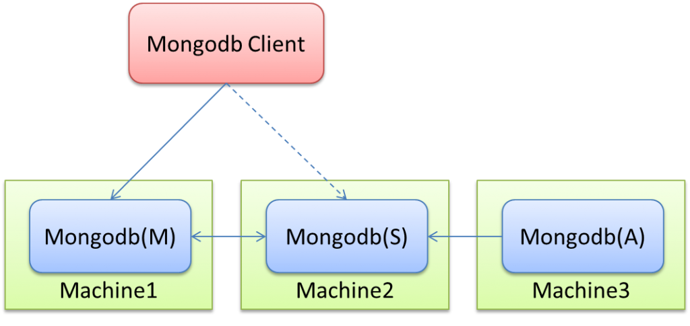
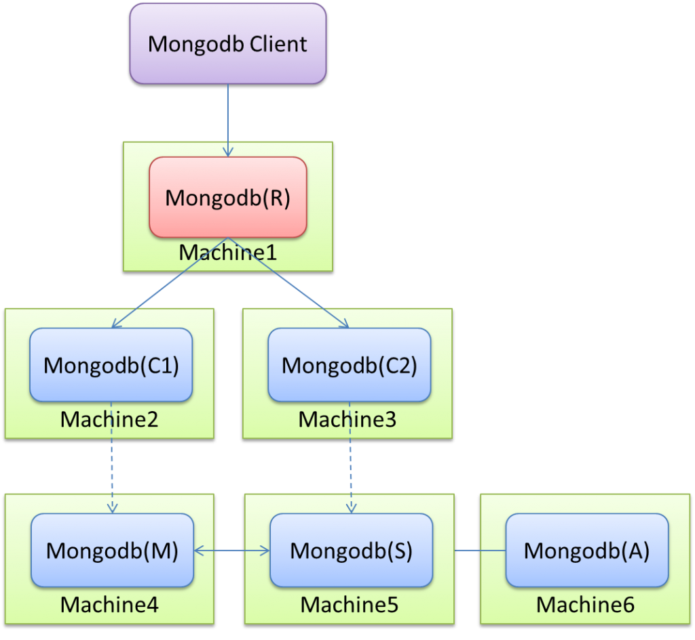
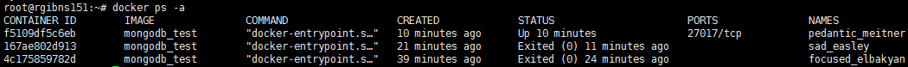
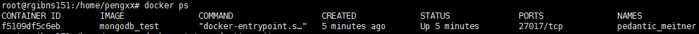
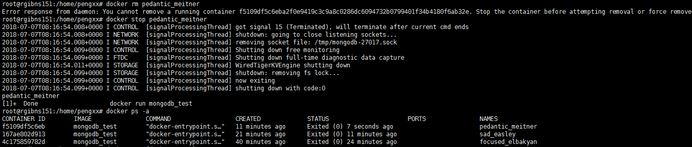

# MongoDB节点介绍

**主节点（Primary）**

> 在复制集中，主节点是唯一能够接收写请求的节点。MongoDB在主节点进行写操作，并将这些操作记录到主节点的oplog中。而从节点将会从oplog复制到其本机，并将这些操作应用到自己的数据集上。（复制集最多只能拥有一个主节点）

**从节点（Secondaries）**

> 从节点通过应用主节点传来的数据变动操作来保持其数据集与主节点一致。从节点也可以通过增加额外参数配置来对应特殊需求。例如，从节点可以是non-voting或是priority 0.

**仲裁节点（ARBITER）**

> 仲裁节点即投票节点，其本身并不包含数据集，且也无法晋升为主节点。但是，旦当前的主节点不可用时，投票节点就会参与到新的主节点选举的投票中。仲裁节点使用最小的资源并且不要求硬件设备。投票节点的存在使得复制集可以以偶数个节点存在，而无需为复制集再新增节点 不要将投票节点运行在复制集的主节点或从节点机器上。 投票节点与其他 复制集节点的交流仅有：选举过程中的投票，心跳检测和配置数据。这些交互都是不加密的。仲裁节点一般都是奇数个，为了遵从少数服从多数原理。而且一般设置至少为3个节点，一个节点容易出现单点故障。

**心跳检测**

> 复制集成员每两秒向复制集中其他成员进行心跳检测。如果某个节点在10秒内没有返回，那么它将被标记为不可用。 

# MongoDB组件介绍

 

从图中可以看到有四个组件：mongos、config server、shard、replica set。 

**mongos**

> 数据库集群请求的入口，所有的请求都通过mongos进行协调，不需要在应用程序添加一个路由选择器，mongos自己就是一个请求分发中心，它负责把对应的数据请求请求转发到对应的shard服务器上。在生产环境通常有多mongos作为请求的入口，防止其中一个挂掉所有的mongodb请求都没有办法操作。

**config server**

> 顾名思义为配置服务器，存储所有数据库元信息（路由、分片）的配置。mongos本身没有物理存储分片服务器和数据路由信息，只是缓存在内存里，配置服务器则实际存储这些数据。mongos第一次启动或者关掉重启就会从 config server 加载配置信息，以后如果配置服务器信息变化会通知到所有的 mongos 更新自己的状态，这样 mongos 就能继续准确路由。在生产环境通常有多个 config server 配置服务器，因为它存储了分片路由的元数据，这个可不能丢失！就算挂掉其中一台，只要还有存货， mongodb集群就不会挂掉。

**shard**

> 这就是传说中的分片了。上面提到一个机器就算能力再大也有天花板，就像军队打仗一样，一个人再厉害喝血瓶也拼不过对方的一个师。俗话说三个臭皮匠顶个诸葛亮，这个时候团队的力量就凸显出来了。在互联网也是这样，一台普通的机器做不了的多台机器来做。
>
> 一台机器的一个数据表 Collection1 存储了 1T 数据，压力太大了！在分给4个机器后，每个机器都是256G，则分摊了集中在一台机器的压力。也许有人问一台机器硬盘加大一点不就可以了，为什么要分给四台机器呢？不要光想到存储空间，实际运行的数据库还有硬盘的读写、网络的IO、CPU和内存的瓶颈。在mongodb集群只要设置好了分片规则，通过mongos操作数据库就能自动把对应的数据操作请求转发到对应的分片机器上。在生产环境中分片的片键可要好好设置，这个影响到了怎么把数据均匀分到多个分片机器上，不要出现其中一台机器分了1T，其他机器没有分到的情况，这样还不如不分片！ 

**replica set**

> 前面已经详细讲过了这个东东，怎么这里又来凑热闹！其实上图4个分片如果没有 replica set 是个不完整架构，假设其中的一个分片挂掉那四分之一的数据就丢失了，所以在高可用性的分片架构还需要对于每一个分片构建 replica set 副本集保证分片的可靠性。生产环境通常是 2个副本 + 1个仲裁。 

# 集群搭建的三种方式

今天主要来说说Mongodb的三种集群方式的搭建：Replica Set / Sharding / Master-Slaver。这里只说明最简单的集群搭建方式（生产环境），如果有多个节点可以此类推或者查看官方文档。

## Replica Set

中文翻译叫做副本集，不过我并不喜欢把英文翻译成中文，总是感觉怪怪的。其实简单来说就是集群当中包含了多份数据，保证主节点挂掉了，备节点能继续提供数据服务，提供的前提就是数据需要和主节点一致。如下图： 



Mongodb(M)表示主节点，Mongodb(S)表示备节点，Mongodb(A)表示仲裁节点。主备节点存储数据，仲裁节点不存储数据。客户端同时连接主节点与备节点，不连接仲裁节点。 

默认设置下，主节点提供所有增删查改服务，备节点不提供任何服务。但是可以通过设置使备节点提供查询服务，这样就可以减少主节点的压力，当客户端进行数据查询时，请求自动转到备节点上。这个设置叫做[Read Preference Modes](http://docs.mongodb.org/manual/applications/replication/#read-preference-modes)，同时Java客户端提供了简单的配置方式，可以不必直接对数据库进行操作。

仲裁节点是一种特殊的节点，它本身并不存储数据，主要的作用是决定哪一个备节点在主节点挂掉之后提升为主节点，所以客户端不需要连接此节点。这里虽然只有一个备节点，但是仍然需要一个仲裁节点来提升备节点级别。我开始也不相信必须要有仲裁节点，但是自己也试过没仲裁节点的话，主节点挂了备节点还是备节点，所以咱们还是需要它的。

介绍完了集群方案，那么现在就开始搭建了。 

### 建立数据文件夹

一般情况下不会把数据目录建立在mongodb的解压目录下，不过这里方便起见，就建在mongodb解压目录下吧。

```shell
mkdir -p /mongodb/data/master 
mkdir -p /mongodb/data/slaver 
mkdir -p /mongodb/data/arbiter  
#三个目录分别对应主，备，仲裁节点
```

### 建立配置文件

由于配置比较多，所以我们将配置写到文件里。 

```shell
#master.conf
dbpath=/mongodb/data/master
logpath=/mongodb/log/master.log
pidfilepath=/mongodb/master.pid
directoryperdb=true
logappend=true
replSet=testrs
bind_ip=10.10.148.130
port=27017
oplogSize=10000
fork=true
noprealloc=true
```

```shell
#slaver.conf
dbpath=/mongodb/data/slaver
logpath=/mongodb/log/slaver.log
pidfilepath=/mongodb/slaver.pid
directoryperdb=true
logappend=true
replSet=testrs
bind_ip=10.10.148.131
port=27017
oplogSize=10000
fork=true
noprealloc=true
```

```shell
#arbiter.conf
dbpath=/mongodb/data/arbiter
logpath=/mongodb/log/arbiter.log
pidfilepath=/mongodb/arbiter.pid
directoryperdb=true
logappend=true
replSet=testrs
bind_ip=10.10.148.132
port=27017
oplogSize=10000
fork=true
noprealloc=true
```

参数解释： 

```shell
dbpath：数据存放目录
logpath：日志存放路径
pidfilepath：进程文件，方便停止mongodb
directoryperdb：为每一个数据库按照数据库名建立文件夹存放
logappend：以追加的方式记录日志
replSet：replica set的名字
bind_ip：mongodb所绑定的ip地址
port：mongodb进程所使用的端口号，默认为27017
oplogSize：mongodb操作日志文件的最大大小。单位为Mb，默认为硬盘剩余空间的5%
fork：以后台方式运行进程
noprealloc：不预先分配存储
```

### 启动mongodb

进入每个mongodb节点的bin目录下 

```shell
./monood -f master.conf
./mongod -f slaver.conf
./mongod -f arbiter.conf
```

注意配置文件的路径一定要保证正确，可以是相对路径也可以是绝对路径。 

### 配置主，备，仲裁节点

可以通过客户端连接mongodb，也可以直接在三个节点中选择一个连接mongodb。

```shell
./mongo 10.10.148.130:27017   #ip和port是某个节点的地址
&gt;use admin
&gt;cfg={ _id:"testrs", members:[ {_id:0,host:'10.10.148.130:27017',priority:2}, {_id:1,host:'10.10.148.131:27017',priority:1}, 
{_id:2,host:'10.10.148.132:27017',arbiterOnly:true}] };
&gt;rs.initiate(cfg)             #使配置生效
```

cfg是可以任意的名字，当然最好不要是mongodb的关键字，conf，config都可以。最外层的_id表示replica set的名字，members里包含的是所有节点的地址以及优先级。优先级最高的即成为主节点，即这里的10.10.148.130:27017。特别注意的是，对于仲裁节点，需要有个特别的配置——arbiterOnly:true。这个千万不能少了，不然主备模式就不能生效。

配置的生效时间根据不同的机器配置会有长有短，配置不错的话基本上十几秒内就能生效，有的配置需要一两分钟。如果生效了，执行rs.status()命令会看到如下信息： 

```shell
{
        "set" : "testrs",
        "date" : ISODate("2013-01-05T02:44:43Z"),
        "myState" : 1,
        "members" : [
                {
                        "_id" : 0,
                        "name" : "10.10.148.130:27017",
                        "health" : 1,
                        "state" : 1,
                        "stateStr" : "PRIMARY",
                        "uptime" : 200,
                        "optime" : Timestamp(1357285565000, 1),
                        "optimeDate" : ISODate("2013-01-04T07:46:05Z"),
                        "self" : true
                },
                {
                        "_id" : 1,
                        "name" : "10.10.148.131:27017",
                        "health" : 1,
                        "state" : 2,
                        "stateStr" : "SECONDARY",
                        "uptime" : 200,
                        "optime" : Timestamp(1357285565000, 1),
                        "optimeDate" : ISODate("2013-01-04T07:46:05Z"),
                        "lastHeartbeat" : ISODate("2013-01-05T02:44:42Z"),
                        "pingMs" : 0
                },
                {
                        "_id" : 2,
                        "name" : "10.10.148.132:27017",
                        "health" : 1,
                        "state" : 7,
                        "stateStr" : "ARBITER",
                        "uptime" : 200,
                        "lastHeartbeat" : ISODate("2013-01-05T02:44:42Z"),
                        "pingMs" : 0
                }
        ],
        "ok" : 1
}
```

如果配置正在生效，其中会包含如下信息：

```shell
"stateStr" : "RECOVERING"
```

同时可以查看对应节点的日志，发现正在等待别的节点生效或者正在分配数据文件。

现在基本上已经完成了集群的所有搭建工作。至于测试工作，可以留给大家自己试试。一个是往主节点插入数据，能从备节点查到之前插入的数据（查询备节点可能会遇到某个问题，可以自己去网上查查看）。二是停掉主节点，备节点能变成主节点提供服务。三是恢复主节点，备节点也能恢复其备的角色，而不是继续充当主的角色。二和三都可以通过rs.status()命令实时查看集群的变化。

## Sharding

和Replica Set类似，都需要一个仲裁节点，但是Sharding还需要配置节点和路由节点。就三种集群搭建方式来说，这种是最复杂的。部署图如下：



### 启动数据节点

```shell
./mongod --fork --dbpath ../data/set1/ --logpath ../log/set1.log --replSet test #192.168.4.43
./mongod --fork --dbpath ../data/set2/ --logpath ../log/set2.log --replSet test #192.168.4.44
./mongod --fork --dbpath ../data/set3/ --logpath ../log/set3.log --replSet test #192.168.4.45 决策 不存储数据
```

### 启动配置节点

```shell
./mongod --configsvr --dbpath ../config/set1/ --port 20001 --fork --logpath ../log/conf1.log #192.168.4.30
./mongod --configsvr --dbpath ../config/set2/ --port 20002 --fork --logpath ../log/conf2.log #192.168.4.31
```

### 启动路由节点

```shell
./mongos --configdb 192.168.4.30:20001,192.168.4.31:20002 --port 27017 --fork --logpath ../log/root.log 
```

这里我们没有用配置文件的方式启动，其中的参数意义大家应该都明白。一般来说一个数据节点对应一个配置节点，仲裁节点则不需要对应的配置节点。注意在启动路由节点时，要将配置节点地址写入到启动命令里。

### 配置Replica Set

​       这里可能会有点奇怪为什么Sharding会需要配置Replica Set。其实想想也能明白，多个节点的数据肯定是相关联的，如果不配一个Replica Set，怎么标识是同一个集群的呢。这也是人家mongodb的规定，咱们还是遵守吧。配置方式和之前所说的一样，定一个cfg，然后初始化配置。

```shell
./mongo 192.168.4.43:27017   #ip和port是某个节点的地址
&gt;use admin
&gt;cfg={ _id:"testrs", members:[ {_id:0,host:'192.168.4.43:27017',priority:2}, {_id:1,host:'192.168.4.44:27017',priority:1}, 
{_id:2,host:'192.168.4.45:27017',arbiterOnly:true}] };
&gt;rs.initiate(cfg)             #使配置生效
```

### 配置Sharding

```shell
./mongo 192.168.4.29:27017   #这里必须连接路由节点
&gt;sh.addShard("test/192.168.4.43:27017") #test表示replica set的名字 当把主节点添加到shard以后，会自动找到set里的主，备，决策节点
&gt;db.runCommand({enableSharding:"diameter_test"})    #diameter_test is database name
&gt;db.runCommand( { shardCollection: "diameter_test.dcca_dccr_test",key:{"__avpSessionId":1}}) 
```

第一个命令很容易理解，第二个命令是对需要进行Sharding的数据库进行配置，第三个命令是对需要进行Sharding的Collection进行配置，这里的dcca_dccr_test即为Collection的名字。另外还有个key，这个是比较关键的东西，对于查询效率会有很大的影响，具体可以查看`Shard Key Overview`。

到这里Sharding也已经搭建完成了，以上只是最简单的搭建方式，其中某些配置仍然使用的是默认配置。如果设置不当，会导致效率异常低下，所以建议大家多看看官方文档再进行默认配置的修改。

##  Master-Slaver

这个是最简答的集群搭建，不过准确说也不能算是集群，只能说是主备。并且官方已经不推荐这种方式，所以在这里只是简单的介绍下吧，搭建方式也相对简单。

```shell
./mongod --master --dbpath /data/masterdb/      #主节点
./mongod --slave --source &lt;masterip:masterport&gt; --dbpath /data/slavedb/     备节点
```

基本上只要在主节点和备节点上分别执行这两条命令，Master-Slaver就算搭建完成了。我没有试过主节点挂掉后备节点是否能变成主节点，不过既然已经不推荐了，大家就没必要去使用了。

以上三种集群搭建方式首选Replica Set，只有真的是大数据，Sharding才能显现威力，毕竟备节点同步数据是需要时间的。Sharding可以将多片数据集中到路由节点上进行一些对比，然后将数据返回给客户端，但是效率还是比较低的说。

我自己有测试过，不过具体的机器配置已经不记得了。Replica Set的ips在数据达到1400w条时基本能达到1000左右，而Sharding在300w时已经下降到500ips了，两者的单位数据大小大概是10kb。大家在应用的时候还是多多做下性能测试，毕竟不像Redis有benchmark。

Mongodb现在用的还是比较多的，但是个人觉得配置太多了。。。。我看官网都看了好多天，才把集群搭建的配置和注意要点弄明白。而且用过的人应该知道mongodb吃内存的问题，解决办法只能通过ulimit来控制内存使用量，但是如果控制不好的话，mongodb会挂掉。。。

# 容器化

## Dockerfile

```shell
FROM debian:jessie-slim
# add our user and group first to make sure their IDs get assigned consistently, regardless of whatever dependencies get added
# 添加用户组和用户
RUN groupadd -r mongodb && useradd -r -g mongodb mongodb
# -y 即yes；–no-install-recommends参数来避免安装非必须的文件，从而减小镜像的体积。
# 安装ca证书、jq（json工具）、numactl(用于控制 进程与共享存储的 NUMA 技术机制)
# 清空apt-get缓存目录
RUN apt-get update \
	&& apt-get install -y --no-install-recommends \
		ca-certificates \
		jq \
		numactl \
	&& rm -rf /var/lib/apt/lists/*

# grab gosu for easy step-down from root (https://github.com/tianon/gosu/releases)
# 设置环境变量，nodeca主要是Node.js项目的lib
ENV GOSU_VERSION 1.10
# grab "js-yaml" for parsing mongod's YAML config files (https://github.com/nodeca/js-yaml/releases).
# js-yaml 解析器工具
ENV JSYAML_VERSION 3.10.0
# ex 是一个行编辑器，打开调试回响模式，并且在出错时退出
# 安装wget
# 清空apt缓存
# dpkgArch：查看内核（amd64）并输出最后一列
# wget -O 把记录写入文件
# 下载gosu工具
# 配置加密工具gpg：--keyserver（上传公钥）--verify（验证签名）
# 增加gosu执行权限，gosu nobody true切换到nobody用户，安全
# 删除已安装的wget和其配置文件
RUN set -ex; \
	\
	apt-get update; \
	apt-get install -y --no-install-recommends \
		wget \
	; \
	rm -rf /var/lib/apt/lists/*; \
	\
	dpkgArch="$(dpkg --print-architecture | awk -F- '{ print $NF }')"; \
	wget -O /usr/local/bin/gosu "https://github.com/tianon/gosu/releases/download/$GOSU_VERSION/gosu-$dpkgArch"; \
	wget -O /usr/local/bin/gosu.asc "https://github.com/tianon/gosu/releases/download/$GOSU_VERSION/gosu-$dpkgArch.asc"; \
	export GNUPGHOME="$(mktemp -d)"; \
	gpg --keyserver ha.pool.sks-keyservers.net --recv-keys B42F6819007F00F88E364FD4036A9C25BF357DD4; \
	gpg --batch --verify /usr/local/bin/gosu.asc /usr/local/bin/gosu; \
	rm -r "$GNUPGHOME" /usr/local/bin/gosu.asc; \
	chmod +x /usr/local/bin/gosu; \
	gosu nobody true; \
	\
	wget -O /js-yaml.js "https://github.com/nodeca/js-yaml/raw/${JSYAML_VERSION}/dist/js-yaml.js"; \
# TODO some sort of download verification here
	\
	apt-get purge -y --auto-remove wget

RUN mkdir /docker-entrypoint-initdb.d

ENV GPG_KEYS \
# pub   4096R/A15703C6 2016-01-11 [expires: 2018-01-10]
#       Key fingerprint = 0C49 F373 0359 A145 1858  5931 BC71 1F9B A157 03C6
# uid                  MongoDB 3.4 Release Signing Key <packaging@mongodb.com>
	0C49F3730359A14518585931BC711F9BA15703C6
# https://docs.mongodb.com/manual/tutorial/verify-mongodb-packages/#download-then-import-the-key-file
RUN set -ex; \
	export GNUPGHOME="$(mktemp -d)"; \
	for key in $GPG_KEYS; do \
		gpg --keyserver ha.pool.sks-keyservers.net --recv-keys "$key"; \
	done; \
	gpg --export $GPG_KEYS > /etc/apt/trusted.gpg.d/mongodb.gpg; \
	rm -r "$GNUPGHOME"; \
	apt-key list

# Allow build-time overrides (eg. to build image with MongoDB Enterprise version)
# Options for MONGO_PACKAGE: mongodb-org OR mongodb-enterprise
# Options for MONGO_REPO: repo.mongodb.org OR repo.mongodb.com
# Example: docker build --build-arg MONGO_PACKAGE=mongodb-enterprise --build-arg MONGO_REPO=repo.mongodb.com .
# ARG 定义的变量只在建立 image 时有效，建立完成后变量就失效消失
ARG MONGO_PACKAGE=mongodb-org
ARG MONGO_REPO=repo.mongodb.org
ENV MONGO_PACKAGE=${MONGO_PACKAGE} MONGO_REPO=${MONGO_REPO}

ENV MONGO_MAJOR 3.4
ENV MONGO_VERSION 3.4.1
# 打印一个用于修改更新源sources.list的命令，主要用于提高软件下载安装速度
# 重定向，将终端打印的内容输出到文件
RUN echo "deb http://$MONGO_REPO/apt/debian jessie/${MONGO_PACKAGE%-unstable}/$MONGO_MAJOR main" | tee "/etc/apt/sources.list.d/${MONGO_PACKAGE%-unstable}.list"
# 安装MongoDB
RUN set -x \
	&& apt-get update \
	&& apt-get install -y \
		${MONGO_PACKAGE}=$MONGO_VERSION \
		${MONGO_PACKAGE}-server=$MONGO_VERSION \
		${MONGO_PACKAGE}-shell=$MONGO_VERSION \
		${MONGO_PACKAGE}-mongos=$MONGO_VERSION \
		${MONGO_PACKAGE}-tools=$MONGO_VERSION \
	&& rm -rf /var/lib/apt/lists/* \
	&& rm -rf /var/lib/mongodb \
	&& mv /etc/mongod.conf /etc/mongod.conf.orig
# 挂载卷
RUN mkdir -p /data/db /data/configdb \
	&& chown -R mongodb:mongodb /data/db /data/configdb
COPY js/ /user/init/js/ 
RUN chmod +x -R /user/init/js/
VOLUME /data/db /data/configdb /user/init/logs
# ENTRYPOINT将容器功能表现得像一个可执行程序
# 当指定了 ENTRYPOINT 后，CMD 的含义就发生了改变，不再是直接的运行其命令，而是将 CMD 的内容作为参数传给 ENTRYPOINT 指令。
COPY docker-entrypoint.sh /usr/local/bin/
RUN ln -s usr/local/bin/docker-entrypoint.sh /entrypoint.sh # backwards compat
RUN chmod +x /usr/local/bin/docker-entrypoint.sh
ENTRYPOINT ["docker-entrypoint.sh"]

EXPOSE 27017
CMD ["mongod"]
```

## docker-entrypoint.sh

实际上Dockerfile和docker-entrypoint.sh都可以到github上的[docker-library](https://github.com/docker-library)进行查看，不需要完整理解。但是注意一下的是该Dockerfile中的有链接故障，应该参考官方文档。但是如果是完全按照官方的Dockerfile安装成功之后会发现找不到docker-entrypoint.sh文件，因此**使用该文件中的方法创建docker-entrypoint.sh软连接才行**。

## 容器化步骤

将Dockerfile和docker-entrypoint.sh文件拷贝到同一个目录下，如/home/pengxx/Docker/mongodb/。然后使用Docker命令来创建镜像：

```shell
docker build -t mongodb_test .
```

后面的点表示运行当前目录下的文件。然后经过一番下载后就安装成功了

```shell
Successfully built 7a4395f52818
Successfully tagged mongodb_test:latest
```

**查看镜像**

```shell
root@rgibns151:/home/pengxx# docker images
REPOSITORY          TAG                 IMAGE ID            CREATED             SIZE
mongodb_test        latest              7a4395f52818        About an hour ago   392MB
<none>              <none>              e10b8ae1f39b        2 hours ago         79.5MB
debian              jessie-slim         7c1b08041938        10 days ago         79.2MB
ubuntu              xenial              5e8b97a2a082        4 weeks ago         114MB
```

可以发现其中有四个镜像，其中jessie-slim是上面的Dockerfile创建时下载的，而xenial是github官方的Dockerfile创建时下载的。（我们这里采用的方法是使用官方的下载方式，但是最后出现找不到docker-entrypoint.sh，因此最后的步骤是采用上述的Dockerfile操作，这里的jessie-slim是使用上述Dockerfile创建时失败而产生的）

我们关注这个mongodb_test镜像，根据它来启动一个容器：

需要注意的是最好加上&符号，表示在后台启动，否则无法退出来进入命令行了。

```shell
root@rgibns151:/home/pengxx# docker run mongodb_test &
[1] 26201
root@rgibns151:/home/pengxx# 2018-07-07T08:05:36.165+0000 I CONTROL  [main] Automatically disabling TLS 1.0, to force-enable TLS 1.0 specify --sslDisabledProtocols 'none'
2018-07-07T08:05:36.173+0000 I CONTROL  [initandlisten] MongoDB starting : pid=1 port=27017 dbpath=/data/db 64-bit host=f5109df5c6eb
...

root@rgibns151:/home/pengxx# 
```

现在观察一下所有容器的状态

```shell
root@rgibns151:~# docker ps -a
```



可以看到一些被删除的容器也显示了，也可以只看运行的容器

```shell
root@rgibns151:~# docker ps
```



可以看到镜像的名IMAGE=mongodb_test的容器是NAMES=pedantic_meitner。

如果想删除容器，只进行rm操作是不够的，因为必须先停掉该容器才行。



可以看到该容器的所有记录都是停止状态的，然后可以一下全部删除。

```shell
docker rm $(docker ps -aq)
```

该命令会删除所有的容器，慎用！主要是当记录太多时候考虑使用。

进入命令行

```shell
docker exec -it pedantic_meitner mongo admin
```

