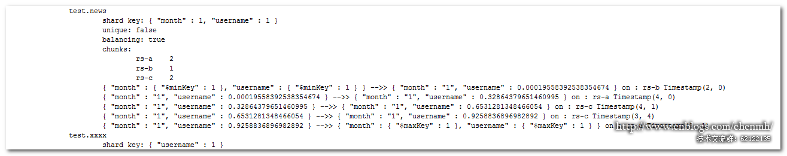

MongoDB版本：3.6 

## 一、分片键类别

### 1.升序片键

升序片键例如：日期时间字段、自增字段。

### 2.随机分发片键

随机分发片键例如：用户名、邮件名、UUID、MD5值或者是其它的一些没有规律的值的列。

### 3.基于位置的片键

基于位置的片键例如：IP、经纬度、居住地址等。

## 二、分片策略

### 1.范围分片

创建分片时，只在主分片上创建了一个块{ "username" : { "$minKey" : 1 } } -->> { "username" : { "$maxKey" : 1 } } on : rs-a Timestamp(1, 0)。

 

至少得3个不同的值才会进行块切分，相同的值只会在一个分片块中。比如对一个name字段进行范围分区，如果一直往name字段插入"a"，那么它会一直存储主分片的{ "username" : { "$minKey" : 1 } } -->> { "username" : { "$maxKey" : 1 } }中，直到name出现三个不同的值，比如“a”,“b”,“c”这个时候就会进行分片。当然这只是测试，现实中不会对这种粗粒度的字段单独做分片。

### 2.hashed分片

创建分片时，默认在每个分片上创建了两个数据块。但是当前每个块上面是没有数据的。

 

### 3.组合分片

组合分片是比较好的一种分片的选择，好的组合分片可以同时解决热点和随机读IO问题。例如：

```
sh.shardCollection("test.bbbb",{"username":1,"_id":1});
```

### 4.标签分片

比如对于一些日志非查询文档，可以通过标签将其只插入到某个分片中。例如

```
sh.addTagRange("test.log",{ "_id" : { "$minKey" : 1 }  }, { "_id" : { "$maxKey" : 1 } },"tag_rs-a");
```

可以在config库中的tag文档中查看设置的标签信息。

```
use config

db.tags.find();
```

## 三、标签

可以通过标签将特定范围的数据在指定的分片中。

 

将{ "_id" : 18000 } -->> { "_id" : 26000 }范围的数据保存到rs-a的分片上，这部分数据跨越了两个数据块。

### 1.为分片指定tag

```
sh.addShardTag("rs-a","tag_rs-a");

sh.addShardTag("rs-b","tag_rs-b");

sh.addShardTag("rs-c","tag_rs-c");
```

### 2.创建规则

```
sh.addTagRange("test.person",{ "_id" : 18000 }, { "_id" : 26000 },"tag_rs-a");
```


数据{ "_id" : 18000 } -->> { "_id" : 26000 }已经被移动到了rs-a分片上。

## 四、分片案例

分片策略没有绝对的好坏，针对不同的业务场景选择不同的分片策略。

### 1.分片情景

1.所有的分片读写都均匀。

2.数据访问均匀，而不是随机性的访问；由于新数据都是先在内存中创建，尽量避免需要从磁盘访问新数据。

3.尽量避免由于数据块的数据移动导致数据从磁盘加载到内存中从而导致热数据被清理出内存。

4.组合字段分片可能会是理想的分片方案。

 

**分片键公式：{coarseLocality:1,search:1}**

**coarseLocality**：应该是一个大粒度的局部字段。比如MONTH月份升序字段。

**search**:是一个经常用来查找的字段。

### 2.分片案例

**案例1.****使用日期字段、自增字段、时间戳分片的问题**

有一个网站浏览记录表，表中有一个createtime字段用来记录每天记录的插入时间。

对于这类文档不太适合使用**createtime**字段作为分片字段，因为读写可能都会集中在最新的分片上。使用自增字段也存在同样的问题

**案例2.****大粒度字段分片问题**

**有一个五大洲的用户文档表，表中有一个continent****字段存储用户所在洲。**

如果使用continent作为分片字段会存在以下几个问题：

1.分片的粒度太大了，会导致最后每一个分片的数据都非常的大而且没有再分的可能。而且也有可能会导致磁盘空间不够的情况。

2.可能会导致某个分片在某个时间点的访问量远远大于其他分片。

**案例3****：使用月份和用户名进行组合分片**

有一个用户操作记录集合，业务需要查询用户最近一个月操作记录。集合有month,userName键

使用{month:1,userName:1}分片情景如下：

month保证热数据优于内存。

userName:保证数据的随机性，避免集中过热问题。

存在的问题：对于新文档由于很多月份还不存在，会导致新数据都是往最后一个分片上面插入数据，存在热读写问题，最后通过均衡器对数据块进行移动。

**数据测试**

sh.shardCollection("test.news",{"month":1,"username":1 });

**----****插入1****月数据10****万记录**

```
for(var i=0;i<100000;i++){db.news.insert({"_id":i,"month":"1","username":Math.random(),"createdate":new Date()})}
```

 

**----****插入2****月数据10****万记录**

```
for(var i=100000;i<200000;i++){ db.news.insert({"_id":i,"month":"2","username":Math.random(),"createdate":new Date()})}
```

新数据往一直往最末尾的分片（rs-a）上插，因为这个时候"month":2在最大的分片上。{ "month" : "1", "username" : 0.9258836896982892 } -->> { "month" : { "$maxKey" : 1 }, "username" : { "$maxKey" : 1 } } on : rs-a Timestamp(3, 1)

 

数据插入完之后均衡器将rs-c上的一个块分给了rs-a

**----****插入全部月份数据。**

```
for(var a=1;a<13;a++)
{
for(var i=0;i<20000;i++){ db.news.insert({"month":a,"username":Math.random(),"createdate":new Date()})}
}
```

 

保证每个月的数据都均匀的分布到不同的分片上，并且随着时间的推移旧的数据可能就不会被使用也不会被移动。

注意：这个案例比较特殊，因为对于日志集合比较旧的数据基本上是不会被查询的，所以借助了month键作为了分片键保证了热数据优先存储于内存，对于整张表都是热数据比如登入用户集合就不适合这种分片方式，hashed会更适合。

**案例4****：使用队列**

队列不仅在容灾中非常的有用，而且在常规的突发流量下也非常的有用。队列可以吸收短时间内爆发的大量请求。也可以把队列反过来用，即缓存MongoDB返回的结果。

比如：RabbitMQ

**案例5****：使用用户名和创建时间进行组合分片**

用户名：保证数据的随机性，避免热点问题

创建时间：保证单个数据块过大问题

## 五、设计集合注意事项

1. 集合的键数量应该是固定的，包括嵌套文档的数量都应该提前规划好。

2. 尽量都是做原子更新，而不是某个键的值受其它键值更新的影响。比如num1,num2,total如果num键的值是经常会被更新的那么这种设计就不好，因为total也要对应跟着变，而mongodb本身计算能力就很弱。

3. <font color = "red">**理想的分片键应该结合了粗粒度分片键和细粒度分片键两者的优势。**</font>