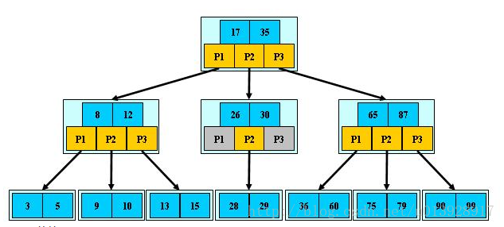
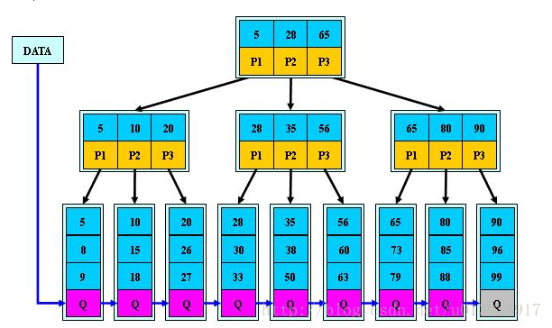
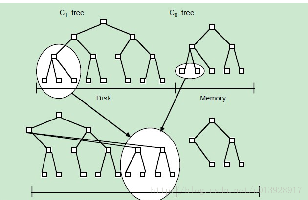

原文如连接：<https://github.com/wiredtiger/wiredtiger/wiki/Btree-vs-LSM>

文中对比了LSM和B-Tree的读写吞吐量，在单线程写操作下和多线程读操作下的差异。英文差的小伙伴别指望我这个半吊子来翻译了。

总结一点就是：在写操作上，LSM的吞吐量会是B-Tree的1.5~2倍   而在读操作上，随着读线程的增加，LSM性能下降很明显，B-Tree在读的性能上吞吐量是LSM的1.5~2倍。

因此在一个表需要频繁的进行写操作时，换成LSM的存储方式，将会是一个不错的选择。

目前正准备从B-Tree转向LSM，需要一段时间验证其效果。

另，目前只知道在创建collection的时候可以修改存储方式，脚本如下：

```javascript
db.createCollection(
"TestTable",
{storageEngine: { wiredTiger: {configString: "type=lsm"}}}
)
```

 

##B+树和LSM比较
在关系型数据库mysql中普遍使用B+树作为索引，在实际中索引也分为聚集索引和非聚集索引，而在hbase中则采用的是LMS树组织数据的。两者各有自己的优劣。

###B+树
B+树由B-树演变而来，B-树是一种多路搜索树，并且具有以下特点：

- 定义任意非叶子结点最多只有M个儿子；且M>2；
- 根结点的儿子数为[2, M]；
- 除根结点以外的非叶子结点的儿子数为[M/2, M]；
- 每个结点存放至少M/2-1（取上整）和至多M-1个关键字；（至少2个关键字）
- 非叶子结点的关键字个数=指向儿子的指针个数-1；
- 非叶子结点的关键字：K[1], K[2], …, K[M-1]；且K[i] < K[i+1]；
- 非叶子结点的指针：P[1], P[2], …, P[M]；其中P[1]指向关键字小于K[1]的子树，P[M]指向关键字大于K[M-1]的子树，其它P[i]指向关键字属于(K[i-1], K[i])的子树；
- 所有叶子结点位于同一层； 

B-树图如下：



B+树和B-树的不同在于其定义基本与B-树同，除了： 

- 非叶子结点的子树指针与关键字个数相同； 
- 非叶子结点的子树指针P[i]，指向关键字值属于[K[i], K[i+1])的子树 
- 为所有叶子结点增加一个链指针； 
- 所有关键字都在叶子结点出现；

B+树如下图： 



###LSM树
LSM 树按另一种不同的方式组织数据，输入的数据会被先存在日志文件中，这些文件内的数据是完全有序的，当文件被修改时，对应的更新会被先保存在内存中，这样可以加速查询。LSM树分为两个部分，一部分在磁盘一部分在内存，当内存空间逐渐被占满之后，LSM会把这些有序的键刷新到磁盘，同时和磁盘中的LSM树合并成一个文件。

LSM树的过程如下： 



###数据查找和数据传输

1. B+树的特点决定了能够对主键进行高效的查找和删除，B+树能够提供高效的的范围扫描功能得益于相互连接且按主键有序，扫描时避免了耗时的遍历操作。 
   LSM树在查找时先查找内存的存储，如果在内存中未命中就去磁盘文件中查找文件，找到key之后返回最新的版本。 
   B树和LSM树最主要的区别在于他们的结构和如何利用硬件，特别是磁盘。

2. 在没有太多的修改时，B+树表现得很好，因为修改要求执行高代价的优化操作以保证查询能在有限的时间内完成。LSM以磁盘传输速率工作，并能较好地扩展以处理大量数据，他们使用日志文件和内存存储来将随机写转换成顺序写，因此也能够保证稳定的数据插入速率。由于读写分离，两个操作也不存在冲突的问题。

3. LSM树的主要目标是快速的建立索引，B树是建立索引的通用技术，但是在大并发插入数据的情况下，B树需要大量的随机IO，这些随机IO严重影响索引建立速度。LSM通过磁盘序列写，来达到最优的写性能，因为这个降低了磁盘的寻道次数，一次IO可以写入多个索引块。

