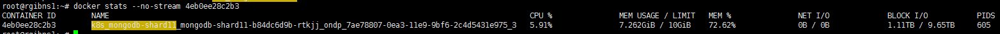
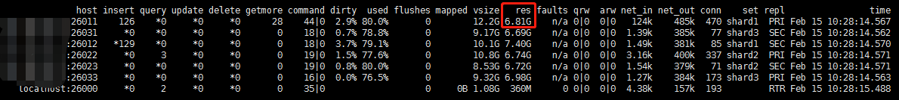

关于mongod如何管理内存，度娘有如下一段话：

目前，MongoDB使用的是内存映射存储引擎，它会把磁盘IO操作转换成内存操作，如果是读操作，内存中的数据起到缓存的作用，如果是写操作，内存还可以把随机的写操作转换成顺序的写操作，总之可以大幅度提升性能。MongoDB并不干涉内存管理工作，而是把这些工作留给操作系统的虚拟缓存管理器去处理，这样的好处是简化了MongoDB的工作，但坏处是你没有方法很方便的控制MongoDB占多大内存，事实上MongoDB会占用所有能用的内存，所以最好不要把别的服务和MongoDB放一起。

MongoDB Manual上说:

```
MongoDB keeps most recently used data in RAM. If you have created indexes for your queries and your working data set fits in RAM, MongoDB serves all queries from memory.
```

简而言之，就是mongod把这事交给操作系统了，缺了就跟OS要内存，多了也不还，爱咋咋地。

如果需要强行收回内存也不是没有办法：

重启mongod，或者调用 db.runCommand({closeAllDatabases:1})来清除内存
使用Linux命令清除缓存中的数据：echo 3 > /proc/sys/vm/drop_caches

在应用运行过程中重启mongod，是比较ugly的做法，可以尝试使用第二种方法。

还有没有更好的方法控制mongodb占用的内存大小呢？

查看mongod -h发现mongod提供了额外的可选参数来控制WiredTiger存储引擎所占用的cache size。需要注意的是，cache size设置较低，同时mongodb复杂查询很频繁的话，会有延迟发生。

cacheSizeGB 指的就是Cache size，包括数据和索引。Mongod本身使用内存如连接池堆栈以及sorting buffer等都是额外的，不会被统计到这个数字里面。如果索引在内存，查询冷数据取决于你的IO能力。如果IO latency很低，系统也没有是高负载，那响应时间应该是毫秒级的区别。但是如果查询很频繁，又涉及到很多范围、批量查询，IOPS又跟不上，那就有可能到几百几千毫秒都有可能。

## 举例

在某服务器上使用容器来运行mongdb，其wiredTigerCacheSizeGB配置为6GB，总容器内存上限为10GB，使用docker stats命令查看shard1容器内存使用量：

```shell
docker stats --no-stream
```



可以发现其总内存使用量约为7.26GB，其中除却wiredTigerCacheSizeGB占用的6GB内存，其余的1.26GB是Mongod本身使用内存。

而从mongostat来看，其中shard1占用的物理内存是6.83GB



