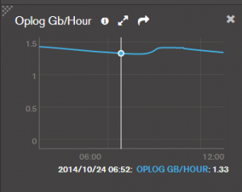
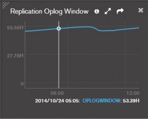

[Oplog ](http://docs.mongoing.com/manual-zh/core/replica-set-oplog.html)可以说是Mongodb Replication的纽带了。

- #### 作用：

当Primary进行写操作的时候，会将这些写操作记录写入Primary的[Oplog ](http://docs.mongoing.com/manual-zh/core/replica-set-oplog.html)中，而后Secondary会将[Oplog ](http://docs.mongoing.com/manual-zh/core/replica-set-oplog.html)复制到本机并应用这些操作，从而实现Replication的功能。
同时由于其记录了Primary上的写操作，故还能将其用作数据恢复。
可以简单的将其视作Mysql中的binlog。

- #### 大小：

[Oplog ](http://docs.mongoing.com/manual-zh/core/replica-set-oplog.html)是一个capped collection。
在64位的Linux, Solaris, FreeBSD, and Windows 系统中，Mongodb默认将其大小设置为可用disk空间的5%（默认最小为1G，最大为50G），或也可以在mongodb复制集实例初始化之前将mongo.conf中oplogSize设置为我们需要的值。
但是由于[Oplog ](http://docs.mongoing.com/manual-zh/core/replica-set-oplog.html)其保证了复制的正常进行，以及数据的安全性和容灾能力。
我们可以通过如下两个图(MMS)来了解他增加的情况：

上图分别是[Oplog ](http://docs.mongoing.com/manual-zh/core/replica-set-oplog.html)每小时的增量，以及现有[Oplog ](http://docs.mongoing.com/manual-zh/core/replica-set-oplog.html)存储了多少小时的操作。我们可以根据这个来监控并观察oplog情况。我们需要足够的oplog大小来保证数据的安全性。
也可以通过命令来查看：
[db.getReplicationInfo()](http://docs.mongoing.com/manual-zh/reference/method/db.getReplicationInfo.html#db.getReplicationInfo)

我们在生产环境中很可能会发现，可用disk的5%可能不够用，那么我们就需要进行[Oplog ](http://docs.mongoing.com/manual-zh/core/replica-set-oplog.html)的扩容了。

- [Oplog的扩容 ](http://docs.mongoing.com/manual-zh/tutorial/change-oplog-size.html)：
- 背景：一个由3个节点组成的复制集。
- 主节点：A 从节点：B,C
- 需求：Oplog扩容，尽量少的影响业务。
- 思路：先由从节点开始，一台一台的从复制集中剥离，修改，再回归复制集，最后操作主节点来减少业务影响时间。
- 流程：
- 先将B节点关闭，去掉–replSet启动参数,更换启动端口–port,将节点以单机模式启动。
- 然后备份其现有的oplog：

1. *mongodump –db local –collection ‘oplog.rs’ –port 37017*

- 进入mongo，将现在的oplog中最新的位置复制到tmp表（local数据库）中：

1. *use local*
2. *db.temp.save( db.oplog.rs.find( { }, { ts: 1, h: 1 } ).sort( {$natural : -1} ).limit(1).next() )*

- 确认tmp中的数据：

1. *db.temp.find()*

- 删除原有的oplog：

1. *db.oplog.rs.drop()*

- 建立新的oplog（capped），下例为2G大小，可根据需求修改：

1. *db.runCommand( { create: “oplog.rs”, capped: true, size: (2 \* 1024 \* 1024 \* 1024) } )*

- 将tmp中的数据存储到新的oplog中，并验证：

1. *db.oplog.rs.save( db.temp.findOne() )*
2. *db.oplog.rs.find()*

- 关闭B节点，并恢复原有config配置，并在config中设置oplogSize为你之前设置的大小，并启动。
- 继续对C节点进行如上操作，C节点完成后最后对主节点A进行如上操，作即可完成。