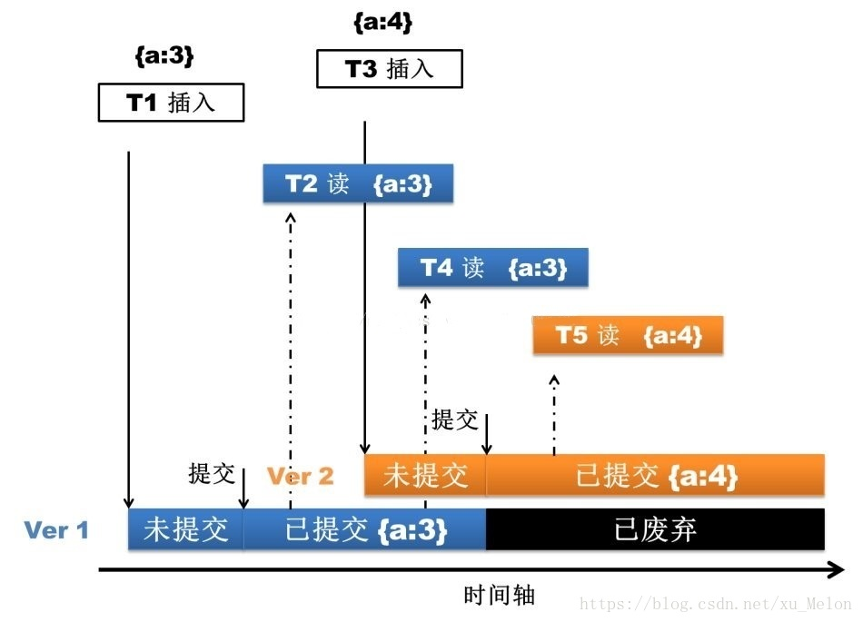
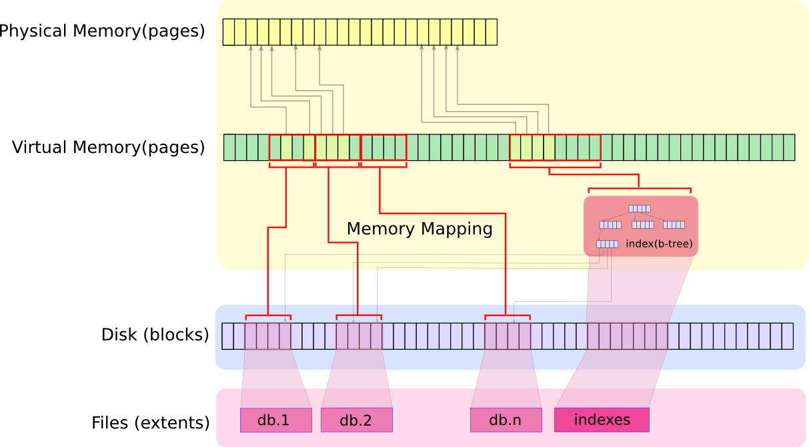
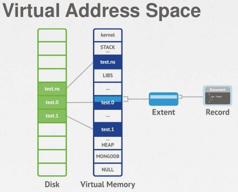

 MongoDB在写入前，首先需要与服务器进行连接再发送请求，服务端的处理流程如下：

Mongod在启动时会创建一个PortMessageServer对象，其调用setupSockets为mongod配置的每个地址创建一个socket，并bind地址，然后调用initAndListen监听所有的地址，调用select等待监听fd上发生的链接时间，调用accept系统接受新的连接请求，并为每个连接创建一个线程，执行handleIncomingMsg方法。

handleIncomingMsg会创建一个新的Client对象，并不断调用recv从连接上读取请求，并将请求反序列化为Message对象，并调用MyMessageHandler::process方法处理请求。

MyMessageHandler::process会调用assembleResponse方法，从Message对象里获取请求类型,根据请求类型进行相应的处理。如果是dbInsert，会调用receivedInsert处理，再调用database类的接口定位对应的Collection对象，然后调用insertDocement往集合写入文档。

接下来解释一下MongoDB的存储引擎

从MongoDB 3.0之后引入的WiredTiger弥补了MMAP存储引擎自身的天然缺陷(耗费磁盘空间和内存空间且难以清理，更致命的是库级别锁)。

WiredTiger通过MVCC实现文档级别的锁，这样就允许了多个客户端请求同时更新一个集合内的不同文档。

回归主题，上文说到调用insertDocement来写文档，那么存储引擎的处理过程就是，先写journal日志，然后通过多版本并发控制（MVCC）。操作开始之时，WiredTiger 提供了一个时间点快照。快照提供了内存数据的一致性视图，这样就能修改该文档内容。

都知道NoSQL快，其实上文并没有体现，关键快在，MongoDB修改的是内存的文档，接着就直接返回了。接下来就有必要了解一下这过程的详细信息。

Mongo使用了内存映射技术 － 写入数据时候只要在内存里完成就可以返回给应用程序，而保存到硬体的操作则在后台异步完成。先了解一下Memeory-Mapped Files

1. 内存映射文件是OS通过mmap在内存中创建一个数据文件，这样就把文件映射到一个虚拟内存的区域。
2. 虚拟内存对于进程来说，是一个物理内存的抽象，寻址空间大小为2^64。
3. 操作系统通过mmap来把进程所需的所有数据映射到这个地址空间(红线)，然后再把当前需要处理的数据映射到物理内存(灰线)。
4. 当进程访问某个数据时，如果数据不在虚拟内存里，触发page fault，然后OS从硬盘里把数据加载进虚拟内存和物理内存。
5. 如果物理内存满了，触发swap-out操作，这时有些数据就需要写回磁盘，如果是纯粹的内存数据，写回swap分区，如果不是就写回磁盘。、

MongoDB的存储模型

MongoDB把文档写进内存之后就返回了，那么接下来的数据的一致性问题、持久化问题，就由上文点到的journal日志来实现了。默认情况下mongodb每100毫秒往journal文件中flush一次数据，默认每隔60秒，MongoDB请求操作系统将Shared view刷新输出到磁盘，此外，journal日志还可以用来做备份容灾。

这样Mongo的一次数据写入过程才算完成。