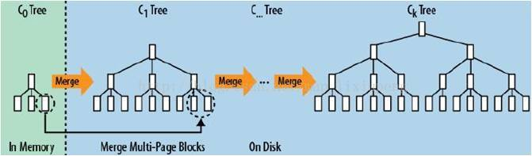

**1、Hash存储引擎**

**代表数据库：redis、memcache等**

通常也常见于其他存储引擎的查找速度优化上。 Hash 索引结构的特殊性，其检索效率非常高，索引的检索可以一次定位，不像B-Tree 索引需要从根节点到枝节点，最后才能访问到页节点这样多次的IO访问，所以 Hash 索引的查询效率要远高于 B-Tree 索引。虽然 Hash 索引效率高，但是 Hash 索引本身由于其特殊性也带来了很多限制和弊端。

**这里列举缺点：**

（1）Hash 索引仅仅能满足"=","IN"和"<=>"查询，不能使用范围查询。
（2）Hash 索引无法被用来避免数据的排序操作。
（3）Hash 索引不能利用部分索引键查询。
(4）Hash 索引在任何时候都不能避免表扫描。
**Hash碰撞，就是链式扫描：**
由于不同索引键存在相同 Hash 值，所以即使取满足某个 Hash 键值的数据的记录条数，也无法从 Hash索引中直接完成查询，还是要通过访问表中的实际数据进行相应的比较，并得到相应的结果。
（5）Hash 索引遇到大量Hash值相等的情况后性能并不一定就会比B-Tree索引高。

**2、B树存储引擎**

**代表数据库：****MongoDB、mysql(基本上关系型数据库)等**

还有一种算是B树存储引擎：COLA树（CacheObliviousBTree）

**代表数据库：tokudb**

**为了如何让B树更有效的执行，他们提出了一个缓存忘却CacheOblivious算法，该算法在不需要明确知道存储器层次中数据传输规模的情况下，也可以高效的工作。更多请参见：https://en.wikipedia.org/wiki/Cache-oblivious_algorithm。**

说个大家熟悉的名称**TokuMX** : 目前非常流行的NoSQL数据库MongoDB的底层替换成与TokuDB同样的存储引擎[ ToKuMx]，达到了非常好的效 果

**3、LSM树（Log-Structured Merge Tree）存储引擎**

**代表数据库：nessDB、leveldb、hbase等**

核心思想的核心就是放弃部分读能力，换取写入的最大化能力。LSM Tree ，这个概念就是结构化合并树的意思，它的核心思路其实非常简单，就是假定内存足够大，因此不需要每次有数据更新就必须将数据写入到磁盘中，而可以先将最新的数据驻留在磁盘中，等到积累到最后多之后，再使用归并排序的方式将内存内的数据合并追加到磁盘队尾(因为所有待排序的树都是有序的，可以通过合并排序的方式快速合并到一起)。

日志结构的合并树（LSM-tree）是一种基于硬盘的数据结构，与B-tree相比，能显著地减少硬盘磁盘臂的开销，并能在较长的时间提供对文件的高速插入（删除）。然而LSM-tree在某些情况下，特别是在查询需要快速响应时性能不佳。通常LSM-tree适用于索引插入比检索更频繁的应用[系统](https://www.2cto.com/os/)。Bigtable在提供Tablet服务时，使用GFS来存储日志和SSTable，而GFS的设计初衷就是希望通过添加新数据的方式而不是通过重写旧数据的方式来修改文件。而LSM-tree通过滚动合并和多页块的方法推迟和批量进行索引更新，充分利用内存来存储近期或常用数据以降低查找代价，利用硬盘来存储不常用数据以减少存储代价。

磁盘的技术特性:对磁盘来说，能够最大化的发挥磁盘技术特性的使用方式是:一次性的读取或写入固定大小的一块数据，并尽可能的减少随机寻道这个操作的次数。

 

LSM和Btree差异就要在读性能和写性能进行舍和求。在牺牲的同事，寻找其他方案来弥补。

1、**LSM具有批量特性，存储延迟。**当写读比例很大的时候（写比读多），LSM树相比于B树有更好的性能。因为随着insert操作，为了维护B树结构，节点分裂。读磁盘的随机读写概率会变大，性能会逐渐减弱。 多次单页随机写，变成一次多页随机写,复用了磁盘寻道时间，极大提升效率。

2、**B树的写入过程:**对B树的写入过程是一次原位写入的过程，主要分为两个部分，首先是查找到对应的块的位置，然后将新数据写入到刚才查找到的数据块中，然后再查找到块所对应的磁盘物理位置，将数据写入去。当然，在内存比较充足的时候，因为B树的一部分可以被缓存在内存中，所以查找块的过程有一定概率可以在内存内完成，不过为了表述清晰，我们就假定内存很小，只够存一个B树块大小的数据吧。可以看到，在上面的模式中，需要两次随机寻道（一次查找，一次原位写），才能够完成一次数据的写入，代价还是很高的。

3、**LSM Tree**放弃磁盘读性能来换取写的顺序性，似乎会认为读应该是大部分系统最应该保证的特性，所以用读换写似乎不是个好买卖。但别急，听我分析一下。

a、内存的速度远超磁盘，1000倍以上。而读取的性能提升，主要还是依靠内存命中率而非磁盘读的次数

b、写入不占用磁盘的io，读取就能获取更长时间的磁盘io使用权，从而也可以提升读取效率。例如LevelDb的SSTable虽然降低了了读的性能，但如果数据的读取命中率有保障的前提下，因为读取能够获得更多的磁盘io机会，因此读取性能基本没有降低，甚至还会有提升。而写入的性能则会获得较大幅度的提升，基本上是5~10倍左右。

下面说说详细例子:

**LSM Tree**弄了很多个小的有序结构，比如每m个数据，在内存里排序一次，下面100个数据，再排序一次……这样依次做下去，我就可以获得N/m个有序的小的有序结构。

在查询的时候，因为不知道这个数据到底是在哪里，所以就从最新的一个小的有序结构里做二分查找，找得到就返回，找不到就继续找下一个小有序结构，一直到找到为止。

 

很容易可以看出，这样的模式，读取的时间复杂度是(N/m)*log2N 。读取效率是会下降的。

这就是最本来意义上的LSM tree的思路。那么这样做，性能还是比较慢的，于是需要再做些事情来提升，怎么做才好呢？

**LSM Tree优化方式：**

a、Bloom filter: 就是个带随即概率的bitmap,可以快速的告诉你，某一个小的有序结构里有没有指定的那个数据的。于是就可以不用二分查找，而只需简单的计算几次就能知道数据是否在某个小集合里啦。效率得到了提升，但付出的是空间代价。

b、compact:小树合并为大树:因为小树他性能有问题，所以要有个进程不断地将小树合并到大树上，这样大部分的**老数据**查询也可以直接使用log2N的方式找到，不需要再进行(N/m)*log2n的查询了