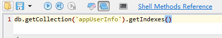

查看老化时间

```sql
db.getCollection('appUserInfo').getIndexes()
```




查看数据均衡是否开启

```sh
mongos> sh.getBalancerState()
true
```

如果balance开启，查看是否正在有数据的迁移

```sh
mongos> sh.isBalancerRunning()
false
```

查看片键状态

```shell
sh.status()
# 然后使用搜索命令找到相关集合
```

