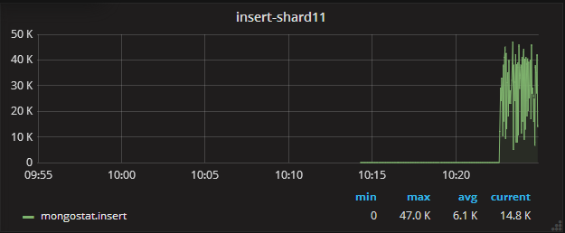
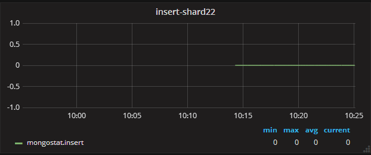
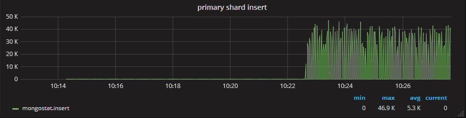

```shell
use ion
# 创建集合
db.createCollection("pengxxTest")
# 创建索引
db.pengxxTest.ensureIndex({"name": 1, "ts": 1})
```

试验1：不使用片键

写入1千万的数据，发现数据全部写入到shard1中。






最高写入速度达到47万/s。

从主分片的综合统计来看也是如此




```shell
# 设置分片键
# 基于hash
sh.shardCollection( "ion.pengxxTest", { "index" : "hashed" } )
# 基于值
sh.shardCollection( "ion.pengxxTest", { "index" : 1 } )
```

