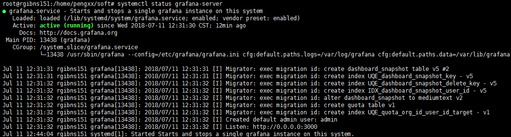
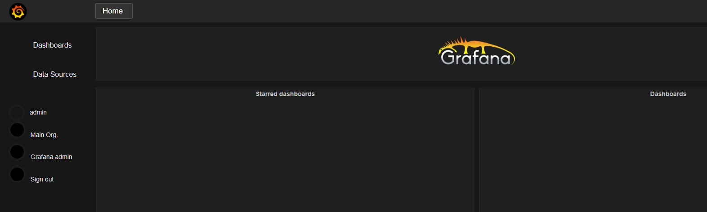

安装prometheus 

下载安装 Prometheus (<https://prometheus.io/download/>) 

然后解压到/home/pengxx/soft/prometheus目录，其中要配置yaml文件。

```yaml
- job_name: mongodb2
  static_configs:
  - targets: ['192.168.11.191:9104']
    labels:
     instance: mongodb2
```

启动监控

```shell
./prometheus --config.file=prometheus.yml &
```


安装go语言

```shell
apt-get install golang
go version
```

由于 Go 代码必需保存在 workspace(工作区)中，所以我们必需在 **Home** 目录(例如 ~/workspace)创建一个**workspace** 目录并定义 **GOPATH** 环境变量指向该目录，这个目录将被 Go 工具用于保存和编辑二进制文件。 

```
mkdir ~/workspace
echo 'export GOPATH="$HOME/workspace"' >> ~/.bashrc
source ~/.bashrc

mkdir ~/workspace/bin
sudo add-apt-repository ppa:masterminds/glide && sudo apt-get update
sudo apt-get install glide
```

参考[github的glide](https://github.com/Masterminds/glide)安装方式

将下载的mongodb_exporte拷贝到$GOPATH/src/github.com/mongodb_exporter目录

然后使用

```
make build
```

会报错

```
package golang.org/x/tools/cover: unrecognized import path "golang.org/x/tools/cover" (https fetch: Get https://golang.org/x/tools/cover?go-get=1: dial tcp 216.239.37.1:443: i/o timeout)
Makefile:63: recipe for target 'init' failed
make: *** [init] Error 1
```

这里的解决方法是讲该包下载下来

```shell
git clone https://github.com/golang/tools.git $GOPATH/src/golang.org/x/tools
```

执行监控

```
./mongodb_exporter -mongodb.uri mongodb://172.18.135.141:23001
```

下载Grafana

到[官方网站](https://grafana.com/grafana/download)上有最新的软件链接

```shell
wget https://s3-us-west-2.amazonaws.com/grafana-releases/release/grafana_5.2.1_amd64.deb 
sudo dpkg -i grafana_5.2.1_amd64.deb  
```

或者直接手动点击这个链接下载。

但是有时候dpkg会失败，那么用二进制包

```shell
wget https://s3-us-west-2.amazonaws.com/grafana-releases/release/grafana-5.2.1.linux-amd64.tar.gz 
tar -zxvf grafana-5.2.1.linux-amd64.tar.gz
```

发现和想要的配置不一样，因此这里采用apt-get install grafana方法安装

编辑配置文件/etc/grafana/grafana.ini，修改dashboards.json段落下两个参数的值：

```ini
 [dashboards.json] enabled = true
 path = /var/lib/grafana/dashboards 
```

下载安装仪表盘  grafana-dashboards 

从网站下载：https://codeload.github.com/percona/grafana-dashboards/zip/master

把压缩包拷贝到 /var/lib/grafana 目录

```
cp grafana-dashboards-master.zip  /var/lib/grafana
```

运行Grafana服务 

```
systemctl daemon-reload
systemctl start grafana-server
systemctl status grafana-server
```

能看到运行成功界面



进入3000端口的web界面，登录账号是admin/admin



然后在Data Source中配置数据源，再导入一个仪表盘，可以直接从Windows中导入js文件。实际上就是grafana-dashboards-master.zip中dashborads文件夹中的。