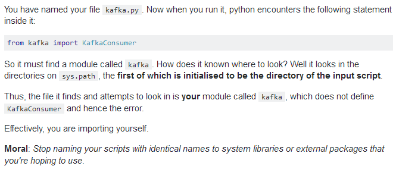
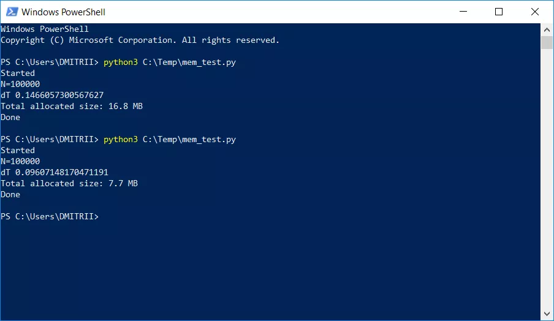
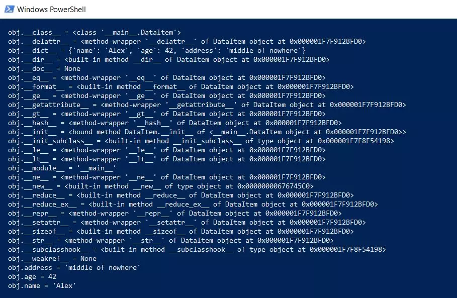
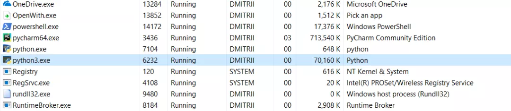
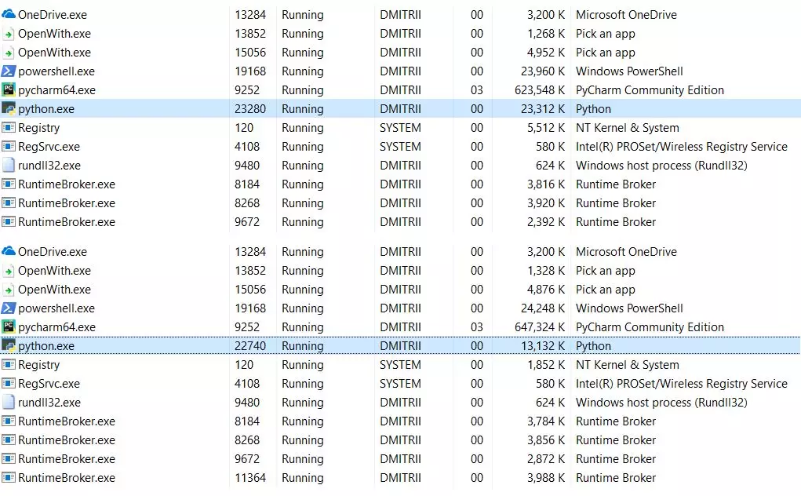
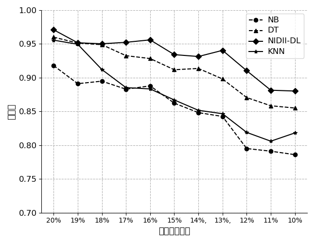

## 运行时异常的抛出
```python
import sys

try:
    f = open('./1foo.txt')
    s = f.readline()
    i = int(s.strip())
except OSError as err:
    print("OS error: {0}".format(err))
except ValueError:
    print("Could not convert data to an integer.")
except:
    print("Unexpected error:", sys.exc_info()[0])
    raise  # 和java中的throw差不多，相当于主动抛出一个运行时异常
```
利用raise就能够主动抛出异常

## 打印异常信息
对于python3.x版本，打印异常需要使用以下方式：
```python
def divide(x, y):
    try:
        result = x / y
    except ZeroDivisionError:
        print("division by zero!")
    except TypeError as e:
        print(e)
    else:
        print("result is", result)
    finally:
        print("executing finally clause")


divide('2', '1')
```
对于python2.x版本，打印异常需要使用以下方式：
```python
def divide(x, y):
    try:
        result = x / y
    except ZeroDivisionError:
        print("division by zero!")
    except TypeError, e:
        print(e)
    else:
        print("result is", result)
    finally:
        print("executing finally clause")


divide('2', '1')
```

# python获取当前目录路径和上级路径

在使用python的时候总会遇到路径切换的使用情况，如想从文件夹test下的`test.py`调用data文件夹下的`data.txt`文件：

```python
.
└── folder
    ├── data
    │   └── data.txt
    └── test
        └── test.py123456
```

一种方法可以在data文件下加入`__init__.py` 然后在`test.py` 中`import data` 就可以调用`data.txt`文件；

另一种方法可以借助python os模块的方法对目录结构进行操作，下面就说一下这种方式的使用：

```python
import os

print '***获取当前目录***'
print os.getcwd()
print os.path.abspath(os.path.dirname(__file__))

print '***获取上级目录***'
print os.path.abspath(os.path.dirname(os.path.dirname(__file__)))
print os.path.abspath(os.path.dirname(os.getcwd()))
print os.path.abspath(os.path.join(os.getcwd(), ".."))

print '***获取上上级目录***'
print os.path.abspath(os.path.join(os.getcwd(), "../.."))12345678910111213
```

输出结果为：

```python
***获取当前目录***
/workspace/demo/folder/test
/workspace/demo/folder/test

***获取上级目录***
/workspace/demo/folder
/workspace/demo/folder
/workspace/demo/folder

***获取上上级目录***
/workspace/demo
```

# 找不到模块

报错为`ImportError: cannot import name 'KafkaConsumer'`，网上资料显示为：



发现错误是将文件名写成了kafka.py，和kafka的库重复了。

# 减低类的内存

内存不足是项目开发过程中经常碰到的问题，我和我的团队在之前的一个项目中也遇到了这个问题，我们的项目需要存储和处理一个相当大的动态列表，测试人员经常向我抱怨内存不足。但是最终，我们通过添加一行简单的代码解决了这个问题。



我将在下面解释它的工作原理。

举一个简单的“learning”示例 - 创建一个DataItem类，在其中定义一些个人信息属性，例如姓名，年龄和地址。

```python
class DataItem(object):
   def __init__(self, name, age, address):
       self.name = name
       self.age = age
       self.address = address
```

## 小测试——这样一个对象会占用多少内存？

首先让我们尝试下面这种测试方案：

```python
d1 = DataItem("Alex", 42, "-")
print ("sys.getsizeof(d1):", sys.getsizeof(d1))
```

答案是56字节。看起来比较小，结果令人满意。

但是，让我们检查另一个数据多一些的对象：

```python
d2 = DataItem("Boris", 24, "In the middle of nowhere")
print ("sys.getsizeof(d2):", sys.getsizeof(d2))
```

答案仍然是56。这让我们明白这个结果并不完全正确。

我们的直觉是对的，这个问题不是那么简单。Python是一种非常灵活的语言，具有动态类型，它在工作时存储了许多额外的数据。这些额外的数据本身就占了很多内存。

例如，sys.getsizeof(“ ”)返回33，没错，每个空行就多达33字节！并且sys.getsizeof（1）将为此数字返回24-24个字节（我建议C程序员们现在点击结束阅读，以免对Python的美丽失去信心）。

对于更复杂的元素，例如字典，sys.getsizeof(dict())返回272个字节，这还只是一个空字典。举例到此为止，但事实已经很清楚了，何况RAM的制造商也需要出售他们的芯片。

现在，让我们回到回到我们的DataItem类和“小测试”问题。

## 这个类到底占多少内存？

首先，我们将以较低级别输出该类的全部内容：

```python
def dump(obj):
 for attr in dir(obj):
   print("  obj.%s = %r" % (attr, getattr(obj, attr)))
```

这个函数将显示隐藏在“隐身衣”下的内容，以便所有Python函数（类型，继承和其他包）都可以运行。

结果令人印象深刻：



## 它总共占用多少内存呢？

在GitHub上，有一个函数可以计算实际大小，通过递归调用所有对象的getsizeof实现。

```python
def get_size(obj, seen=None):
   # From https://goshippo.com/blog/measure-real-size-any-python-object/
   # Recursively finds size of objects
   size = sys.getsizeof(obj)
   if seen is None:
       seen = set()
   obj_id = id(obj)
   if obj_id in seen:
       return 0

# Important mark as seen *before* entering recursion to gracefully handle
   # self-referential objects
   seen.add(obj_id)
   if isinstance(obj, dict):
     size += sum([get_size(v, seen) for v in obj.values()])
     size += sum([get_size(k, seen) for k in obj.keys()])
   elif hasattr(obj, '__dict__'):
     size += get_size(obj.__dict__, seen)
   elif hasattr(obj, '__iter__') and not isinstance(obj, (str, bytes, bytearray)):
     size += sum([get_size(i, seen) for i in obj])
   return size
```

让我们试一下：

```python
d1 = DataItem("Alex", 42, "-")
print ("get_size(d1):", get_size(d1))

d2 = DataItem("Boris", 24, "In the middle of nowhere")
print ("get_size(d2):", get_size(d2))
```

我们分别得到460和484字节，这似乎更接近事实。

使用这个函数，我们可以进行一系列实验。例如，我想知道如果DataItem放在列表中，数据将占用多少空间。

get_size([d1])函数返回532个字节，显然，这些是“原本的”460+一些额外开销。但是get_size([d1，d2])返回863个字节—小于460+484。get_size([d1，d2，d1])的结果更加有趣，它产生了871个字节，只是稍微多了一点，这说明Python很聪明，不会再为同一个对象分配内存。

现在我们来看问题的第二部分。

## 是否有可能减少内存消耗？

答案是肯定的。Python是一个解释器，我们可以随时扩展我们的类，例如，添加一个新字段：

```python
d1 = DataItem("Alex", 42, "-")
print ("get_size(d1):", get_size(d1))

d1.weight = 66
print ("get_size(d1):", get_size(d1))
```

这是一个很棒的特点，但是如果我们不需要这个功能，我们可以强制解释器使用__slots__指令来指定类属性列表：

```python
class DataItem(object):
   __slots__ = ['name', 'age', 'address']
   def __init__(self, name, age, address):
       self.name = name
       self.age = age
       self.address = address
```

更多信息可以参考文档中的“__dict__和__weakref__的部分。使用__dict__所节省的空间可能会很大”。

我们尝试后发现：get_size（d1）返回的是64字节，对比460直接，减少约7倍。作为奖励，对象的创建速度提高了约20％（请参阅文章的第一个屏幕截图）。

真正使用如此大的内存增益不会导致其他开销成本。只需添加元素即可创建100,000个数组，并查看内存消耗：

```python
data = []
for p in range(100000):
   data.append(DataItem("Alex", 42, "middle of nowhere"))

snapshot = tracemalloc.take_snapshot()
top_stats = snapshot.statistics('lineno')
total = sum(stat.size for stat in top_stats)
print("Total allocated size: %.1f MB" % (total / (1024*1024)))
```

在没有__slots__的情况结果为16.8MB，而使用__slots__时为6.9MB。当然不是7倍，但考虑到代码变化很小，它的表现依然出色。现在讨论一下这种方式的缺点。激活__slots__会禁止创建其他所有元素，包括__dict__，这意味着，例如，下面这种将结构转换为json的代码将不起作用：

```python
def toJSON(self):
       return json.dumps(self.__dict__)
```

但这也很容易搞定，可以通过编程方式生成你的dict，遍历循环中的所有元素：

```python
def toJSON(self):
       data = dict()
       for var in self.__slots__:
           data[var] = getattr(self, var)
       return json.dumps(data)
```

向类中动态添加新变量也是不可能的，但在我们的项目里，这不是必需的。
下面是最后一个小测试。来看看整个程序需要多少内存。在程序末尾添加一个无限循环，使其持续运行，并查看Windows任务管理器中的内存消耗。

## 没有__slots__时



69Mb变成27Mb......好吧，毕竟我们节省了内存。对于只添加一行代码的结果来说已经很好了。
注意：tracemalloc调试库使用了大量额外的内存。显然，它为每个创建的对象添加了额外的元素。如果你将其关闭，总内存消耗将会少得多，截图显示了2个选项：



## 如何节省更多的内存？

可以使用numpy库，它允许你以C风格创建结构，但在这个的项目中，它需要更深入地改进代码，所以对我来说第一种方法就足够了。
奇怪的是，__slots__的使用从未在Habré上详细分析过，我希望这篇文章能够填补这一空白。

## 结论

Python是非常可靠的（为了“删除”Python中的程序，你必须非常努力），这是一种易于阅读和方便编写的语言。在许多情况下，这些优点远胜过缺点，但如果你需要性能和效率的最大化，你可以使用numpy库像C++一样编写代码，它可以非常快速有效地处理数据。

# 画图时的中文乱码问题



可以发现使用matplotlib画图，坐标轴的中文都变成了乱码，可以加入以下三行代码：

```python
import matplotlib as mpl
mpl.rcParams['font.sans-serif'] = ['SimHei']
mpl.rcParams['font.serif'] = ['SimHei']
```

# zip矩阵转置

zip() 函数用于将可迭代的对象作为参数，将对象中对应的元素打包成一个个元组，然后返回由这些元组组成的列表。而与 zip 相反，*zipped 可理解为解压，返回二维矩阵式

```python
>>>a = [1,2,3]
>>> b = [4,5,6]
>>> c = [4,5,6,7,8]
>>> zipped = zip(a,b)     # 打包为元组的列表
[(1, 4), (2, 5), (3, 6)]
>>> zip(a,c)              # 元素个数与最短的列表一致
[(1, 4), (2, 5), (3, 6)]
>>> zip(*zipped)          # 与 zip 相反，*zipped 可理解为转置，返回二维矩阵式
[(1, 2, 3), (4, 5, 6)]
```

