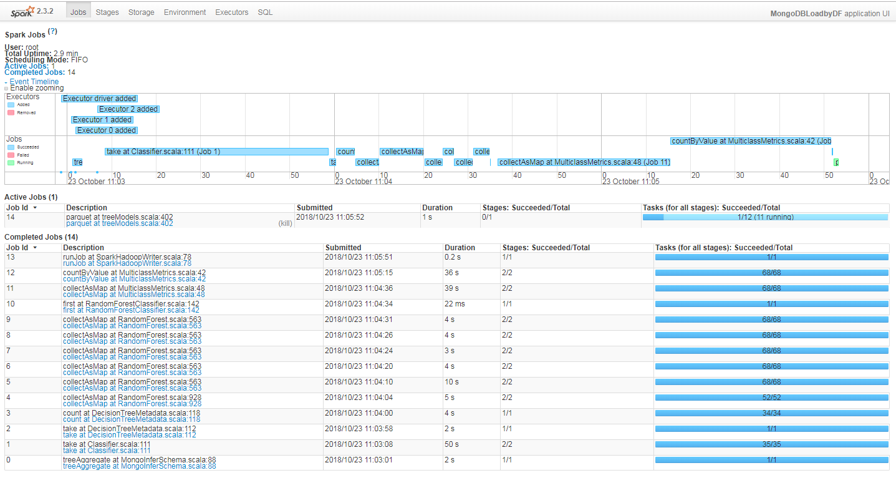
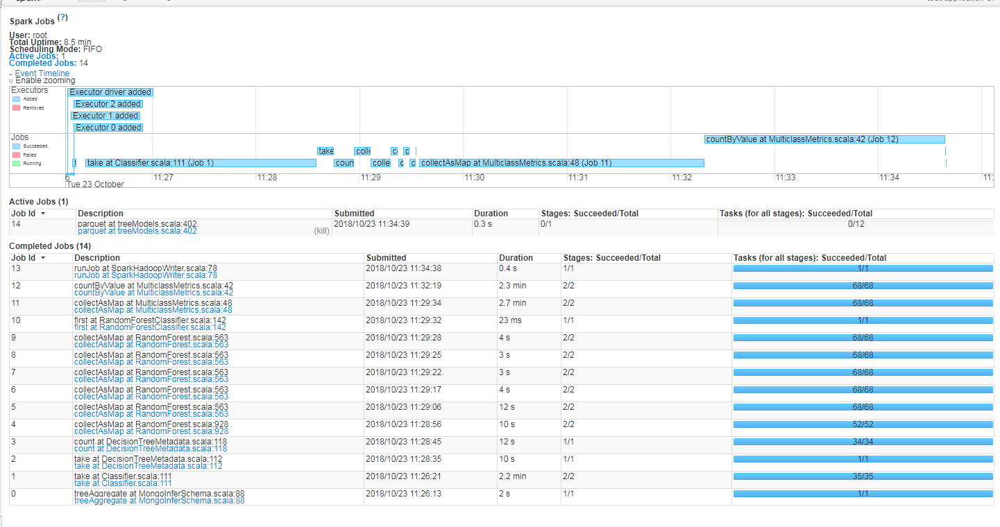
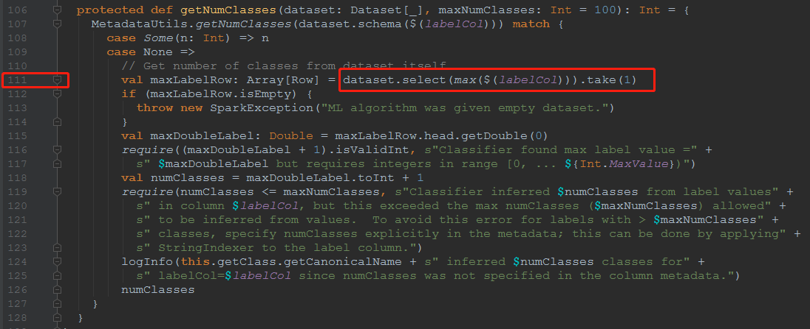
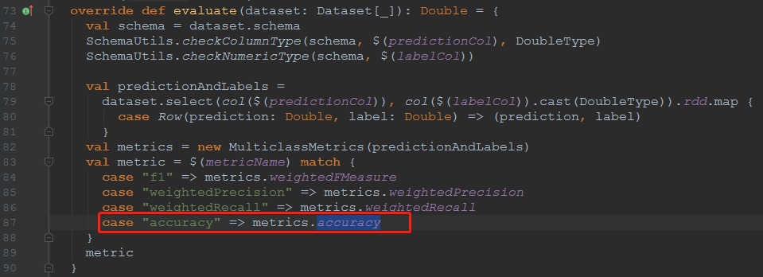
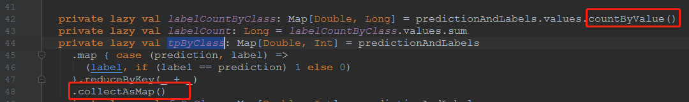

# 随机森林

使用两种语言进行编码：

第一个是scala



第二个是python

scala版本和python版本所经历的spark流程是一样的，但是流程中可以发现，python在Classifier的第111行和MulticlassMetrics的第42行消耗的时间比scala版本多很多。

在随机森林类RandomForestClassifier.scala的train函数中有以下引用

```scala
  override protected def train(dataset: Dataset[_]): RandomForestClassificationModel = {
    val categoricalFeatures: Map[Int, Int] =
      MetadataUtils.getCategoricalFeatures(dataset.schema($(featuresCol)))
    val numClasses: Int = getNumClasses(dataset)

    if (isDefined(thresholds)) {
      require($(thresholds).length == numClasses, this.getClass.getSimpleName +
        ".train() called with non-matching numClasses and thresholds.length." +
        s" numClasses=$numClasses, but thresholds has length ${$(thresholds).length}")
    }
    ...
}
```

其中的`val numClasses: Int = getNumClasses(dataset)`引用了Classifier类的代码：



可以看到正好是第111行。使用了take。

**take**

访问Dataset类的take方法，有以下描述

```scala
/**
   * Returns the first `n` rows in the Dataset.
   *
   * Running take requires moving data into the application's driver process, and doing so with
   * a very large `n` can crash the driver process with OutOfMemoryError.
   *
   * @group action
   * @since 1.6.0
   */
def take(n: Int): Array[T] = head(n)
```

说明是shuffle操作


另外在评估器MulticlassClassificationEvaluator类的evaluate方法中有个准确度计算：



这个accuracy是MulticlassMetrics类中的accuracy变量：

```scala
lazy val accuracy: Double = tpByClass.values.sum.toDouble / labelCount
```

其中的tpByClass和labelCount在MulticlassMetrics类的第42行和第44行定义了：



从流程上看，出现了shuffle过程就是第42行和第48行。

**countByValue**

统计一个RDD中各个value的出现次数。返回一个map，map的key是元素的值，value是出现的次数。

```scala
def countByValue()(implicit ord: Ordering[T] = null): Map[T, Long] = withScope {
  map(value => (value, null)).countByKey()
}
```

追溯countByKey方法

```scala
def countByKey(): Map[K, Long] = self.withScope {
  self.mapValues(_ => 1L).reduceByKey(_ + _).collect().toMap
}
```

可以看到collect的shuffle操作。

**collectAsMap**

功能和collect函数类似。该函数用于Pair RDD，最终返回Map类型的结果。

```scala
def collectAsMap(): Map[K, V] = self.withScope {
  val data = self.collect()
  val map = new mutable.HashMap[K, V]
  map.sizeHint(data.length)
  data.foreach { pair => map.put(pair._1, pair._2) }
  map
}
```

可以看到collect的shuffle操作。


