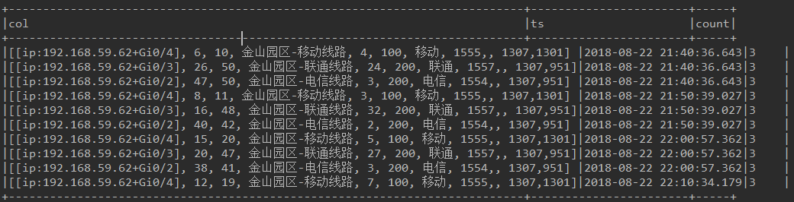

介绍SparkSQL的较为复杂的语法以及操作

<!--more-->

# DataFrame & array

## 扁平化 数组/列表

在一次使用DataFrame获取mongodb的数据时，发现获取到的值为：

```sh
root
 |-- _id: struct (nullable = true)
 |    |-- oid: string (nullable = true)
 |-- count: integer (nullable = true)
 |-- items: array (nullable = true)
 |    |-- element: struct (containsNull = true)
 |    |    |-- devices: array (nullable = true)
 |    |    |    |-- element: string (containsNull = true)
 |    |    |-- inOctets: long (nullable = true)
 |    |    |-- octets: long (nullable = true)
 |    |    |-- outLineName: string (nullable = true)
 |    |    |-- outOctets: long (nullable = true)
 |    |    |-- serviceBw: string (nullable = true)
 |    |    |-- serviceProvider: string (nullable = true)
 |    |    |-- templateId: long (nullable = true)
 |    |    |-- yhdfList: array (nullable = true)
 |    |    |    |-- element: array (containsNull = true)
 |    |    |    |    |-- element: double (containsNull = true)
 |    |    |-- zoneIds: string (nullable = true)
 |-- ts: timestamp (nullable = true)
```

其真实数据的某些字段为


可以发现把array默认都放到了一行中，这种结构不是我们希望的，应该是每个列表中的元素为一行，使用如下方案：

### inline

```sh
# inline也是一个非常有用的函数，它可以把array[struct[XXX]]直接展开成XXX
input_df.selectExpr("inline(items)", "ts").show(10, False)
```


可以看出，array数据已经按照元素展开了。

注意，该函数仅能够展开struct类型的数组，而基本类型的数组则报错，例如`array<timestamp>`就不行

### explode

```sh
# explode与inline不同，专门针对array类型，即不会产生多个列
input_df.selectExpr("explode(items)", "ts", "count")
```

结果为：



可以看到，array数据被铺平了，但是列名是col，而不是像上面一样的多个列，但是能够专门针对基本类型的数组。

# posexplode

```sh
# explode在explode的基础上，加入一个数组位置索引
input_df.selectExpr("explode(items)", "ts", "count")
```

结果为：


可以看到，同一个数组铺平出来的三个行，会按照0，1，2索引表示位置。

# Agg

## 去重

有一个场景，vkey列相同，但是ts列不同，需要为ts列计算不重复数量，有两种方法：

### functions.countDistinct

主要是依靠API接口完成

```python
df.groupBy("vkey").agg(functions.countDistinct("ts"))
```

结果为：


这种方法会产生一个无法预知的列名，如果能够将`count(DISTINCT ts)`作为表达式则更好，下面尝试一下。

### functions.expr

主要是依靠API接口完成

```python
df.groupBy("vkey").agg(functions.expr("count(DISTINCT ts) as ts_count"))
```

结果为：


这种方法的好处是可以自定义列名。

# 合并

## 合并列

```python
    res_df1 = res_df.select("_id", "count", functions.struct("devices", "inOctets", "octets", "outLineName", "outOctets")
```

## 合并行

```python
res_df2 = res_df1.groupBy("_id").agg(functions.expr("collect_list(item) as items"))
```


# udf

在pyspark中使用udf和scala有些不同，这个不同会有性能影响。

方式一：

```python
def string2Vectors(features_str: str):
  features = features_str[51:-2].split(",")
  result = {}
  for i in range(len(features)):
    result[i] = float(features[i])
    vector = Vectors.sparse(18, result)
    return vector
# 性能评估
startTime = time.time()
string2VectorsUdfs = functions.udf(Offline.string2Vectors, VectorUDT())
data = df.withColumn("features", string2VectorsUdfs(df["features"])).select("label", "features")
print(data.rdd.count())
endTime = time.time()
print("readDataTime = %s" % (endTime - startTime))
```

方式二：

```python
@udf(returnType=VectorUDT())
def string2Vectors(features_str: str):
    features = features_str[51:-2].split(",")
    result = {}
    for i in range(len(features)):
        result[i] = float(features[i])
    vector = Vectors.sparse(18, result)
    return vector
# 性能评估
startTime = time.time()
data = df.select("label", string2Vectors("features").alias("features"))
print(data.rdd.count())
endTime = time.time()
print("readDataTime = %s" % (endTime - startTime))
```

为了比较他们的消耗，使用一个shuffle流程（实际上应该避免shuffle）来判断耗时，代码中使用了`data.rdd.count()`。

方式一的运行结果为:


方式一出现了shuffle过程。方式二的运行结果为：


在相同的资源条件下，方式一明显用时超过了方式二。而从scala版本的udf来看，使用方式一也是没有shuffle过程的。