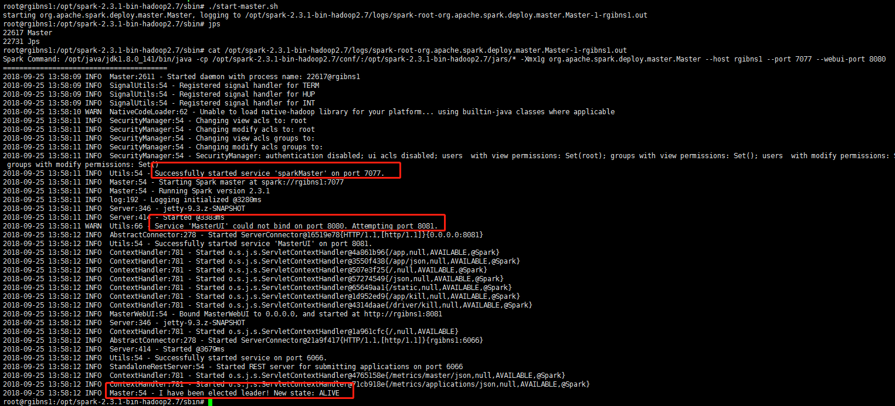
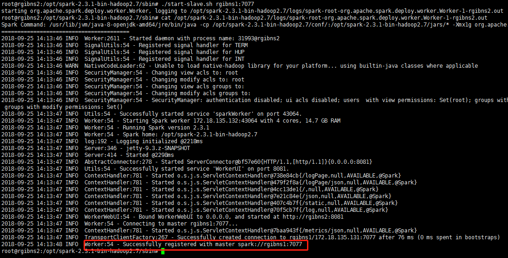
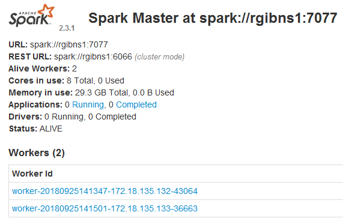

## stanalone模式

1. 在每个节点上安装`apt install openjdk-8-jdk-headless`

2. 将spark安装包拷贝到各个节点

3. 在主节点的sbin目录下启动`./start-master.sh`，可以查看打印出来的日志文件的说明

   

   其中第一个sparkMaster地址为7077，而其HTTP界面访问地址为8081，最后一行表示Master启动成功，且选举为主节点。

4. 在从节点启动`./start-slave.sh rgibns1:7077`，可以查看打印出来的日志文件说明

   

   表示Worker节点加入了集群。

5. 在界面上查看集群信息：

   

这个表示，可以以这种方式将各个节点自动加入到集群中，而不用关闭集群。

