# Spark基础

## Spark API

### RDD

弹性分布式数据集（简称RDD）是不可变Java虚拟机（JVM）对象的分布式集合，Spark就是围绕RDD而构建的。RDD以并行方式应用和记录数据转换，从而提高了速度和容错能力。Spark秉承着“不移动数据，移动计算”的方式，将RDD的转换过程以树的形式保存，仅仅在关键动作（shuffle）时进行计算。这种结构类似于一个连加公式，让每一步的操作都成为一个连加操作，当遇到等于操作的时候一起计算。而公式是可以移动到相关数据附近。因此RDD不仅能够提高计算性能，而且在数据错误时，能够回溯重建逻辑。

RDD有两组并行操作：转换（返回指向新RDD的指针）和动作（在运行计算后向驱动程序返回值）

某种意义上来说，RDD转换操作是惰性的，因为它们不立即计算其结果。只有动作执行了并且需要将结果返回给驱动程序时，才会计算转换。该延迟执行会产生更多精细查询：针对性能进行优化的查询。这种优化始于Apache Spark的DAGScheduler——面向阶段的调度器，使用如上面截图中所示的阶段进行转换。由于具有单独的RDD转换和动作，DAGScheduler可以在查询中执行优化，包括能够避免shuffle数据（最耗费资源的任务）。

**弹性**

- 数据可完全放内存或完全放磁盘，也可部分存放在内存，部分存放在磁盘，并可以自动切换
- RDD出错后可自动重新计算（通过血缘自动容错）
- 可checkpoint（设置检查点，用于容错），可persist或cache（缓存）
- 里面的数据是分片的（也叫分区，partition），分片的大小可自由设置和细粒度调整

**分布式**

- RDD中的数据可存放在多个节点上

**数据集**

- 数据的集合，没啥好说的

相对于与DataFrame和Dataset，RDD是Spark最底层的抽象，目前是开发者用的最多的，但逐步会转向DataFrame和Dataset（当然，这是Spark的发展趋势）

### DataFrame

DataFrame像RDD一样，是分布在集群的节点中的不可变的数据集合。然而，与RDD不同的是，在DataFrame中，数据是以命名列的方式组织的。

> 如果你熟悉Python的pandas或者R的data.frames，这是一个类似的概念。

DataFrame的思想来源于Python的pandas库，RDD是一个数据集，DataFrame在RDD的基础上加了Schema（描述数据的信息，可以认为是元数据，DataFrame曾经就有个名字叫SchemaRDD）

假设RDD中的两行数据长这样

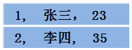

那么DataFrame中的数据长这样

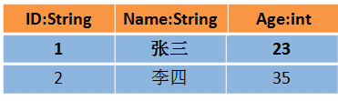

从上面两个图可以看出，DataFrame比RDD多了一个表头信息（Schema），像一张表了，DataFrame还配套了新的操作数据的方法，DataFrame API（如df.select())和SQL(select id, name from xx_table where ...)。

有了DataFrame这个高一层的抽象后，我们处理数据更加简单了，甚至可以用SQL来处理数据了，对开发者来说，易用性有了很大的提升。

不仅如此，通过DataFrame API或SQL处理数据，会自动经过Spark 优化器（Catalyst）的优化，即使你写的程序或SQL不高效，也可以运行的很快，很爽吧！

> DataFrame是用来处理结构化数据的

### DataSet

 Dataset是从Spark 1.6开始引入的一个新的抽象，当时还是处于alpha版本；然而在Spark 2.0，它已经变成了稳定版了。

Dataset是特定域对象中的强类型集合，它可以使用函数或者相关操作并行地进行转换等操作。每个Dataset都有一个称为DataFrame的非类型化的视图，这个视图是行的数据集。

DataSet和RDD主要的区别是：DataSet是特定域的对象集合；然而RDD是任何对象的集合。DataSet的API总是强类型的；而且可以利用这些模式进行优化，然而RDD却不行。

Dataset的定义中还提到了DataFrame，DataFrame是特殊的Dataset，它在编译时不会对模式进行检测。在未来版本的Spark，Dataset将会替代RDD成为我们开发编程使用的API（注意，RDD并不是会被取消，而是会作为底层的API提供给用户使用）。

假设RDD中的两行数据长这样


那么Dataset中的数据长这样

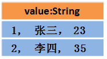

或者长这样（每行数据是个Object）

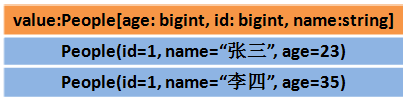

使用Dataset API的程序，会经过Spark SQL的优化器进行优化，目前仅支持Scala、Java API，尚未提供Python的API（所以一定要学习Scala）

相比DataFrame，Dataset提供了编译时类型检查，对于分布式程序来讲，提交一次作业太费劲了（要编译、打包、上传、运行），到提交到集群运行时才发现错误，这也是引入Dataset的一个重要原因。

### 编程方式区别

**RDD**

```python
def rddWordCount():
    sc = SparkContext(master="local[*]", appName="rddTest")
    lines = sc.textFile("e:/data/sparkcredits.txt")
    counts = lines.flatMap(lambda x: x.split(' ')) \
        .map(lambda x: (x, 1)) \
        .reduceByKey(add)
    output = counts.collect()
    for (word, count) in output:
        print("%s: %i" % (word, count))
```

**DataFrame**

方式一：

```python
def dfWordCount():
    spark = SparkSession \
        .builder \
        .appName("pengxxPythonTestShuffle") \
        .getOrCreate()
    lines = spark.read.text("e:/data/sparkcredits.txt")
    words = lines.select(explode(split(lines.value, " ")).alias("word"))
    wordCountDF = words.groupBy(['word']).count().orderBy("count", ascending=False)
    wordCountDF.show()
```

方式二：

```python
def dfWordCount():
    spark = SparkSession \
        .builder \
        .appName("pengxxPythonTestShuffle") \
        .getOrCreate()
    lines = spark.read.text("e:/data/sparkcredits.txt")
    words = lines.select(explode(split(lines.value, " ")).alias("word"))
    words.createTempView("wordCount")
    spark.sql("select word, count(word) from wordCount group by word order by count(word) desc").show()
```

最后结果为：

```shell
+-------+-----+
|   word|count|
+-------+-----+
|  Wang,|    7|
|Michael|    6|
| Zhang,|    6|
|   Liu,|    6|
|    Li,|    6|
|    Xu,|    4|
|   John|    3|
|     Li|    3|
|   Zhu,|    3|
|    Van|    3|
|    Yu,|    3|
| Andrew|    3|
|  Ruben|    2|
|    not|    2|
|   Peng|    2|
| Sergey|    2|
|   Feng|    2|
|  Jakub|    2|
|    Xin|    2|
|    Liu|    2|
+-------+-----+
only showing top 20 rows
```

**DataSet**

DataSet代码暂时不支持python语言，仅支持Scala和Java。因此给出Scala例子

```scala
object datasetTest {
  case class Person(_id: String, label: Double, features: String)
  def main(args: Array[String]): Unit = {
    val spark = SparkSession.builder().master("local[*]").appName("MongoDBLoadbyDF").getOrCreate()
    val database = "ion"
    val table = "test"
    val df = spark.read.format("com.mongodb.spark.sql").
      option("uri", "mongodb://172.18.135.11:26000,172.18.135.12:26000,172.18.135.13:26000").
      option("database", database).
      option("collection", table).load()
    import spark.implicits._ //隐式转换
    val ds = df.as[Person]
    ds.printSchema()
    val person = ds.collect()(0)// 使用DataSet，获取Person对象
    println(person.label,person._id,person.features)
    val personRow = df.collect()(0)// 使用DataSet，获取Row对象
    println(personRow["_id"])
  }
}
```

在代码中能够看出DataFrame是DataSet的一种特例，DataSet是面向可自定义数据结构，而DataFrame则是规定了这个数据结构必须是Row类型。

## 性能比较

Spark的钨丝（Tungsten）计划是开源社区专门用于提升Spark性能的计划。因为Spark使用scala开发的，所以最终运行在JVM的代码存在着各方面的限制和弊端（例如GC上的overhead），因此Tungsten计划目标是从内存和CPU层面对Spark的性能进行优化。

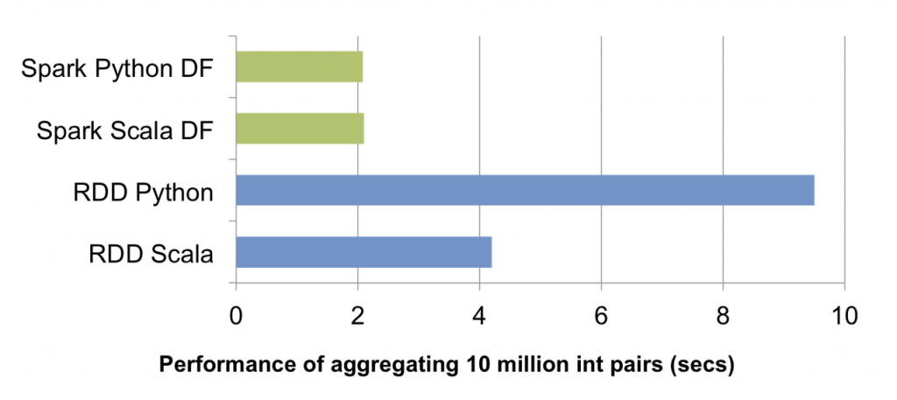

在这个图中可以看出，数据量在1千万时，DataFrame比RDD更快，同时也发现Scala的RDD比Python的RDD更快。这个是Spark内部原理所决定（spark在Shuffle时进行磁盘交互，每个task都运行在JVM上，但是python版本却要多启动一个python线程用于通讯）。因此建议为：

- 尽可能多的使用DataFrame，减少使用RDD；
- 在无法避免RDD时，使用Scala编程；
- 算法开发者为了提高效率，可以使用Python开发，由工程开发者后期转为Scala开发。

# SparkSQL

SparkSQL基本都是在DataFrame上实现的。包括使用SQL语句和API两种。

### SQL语句使用方法

```python
words  # type: DataFrame
words.createTempView("wordCount")
spark.sql("select word, count(word) from wordCount group by word order by count(word) desc").show(10, False)
```

通过`createTempView()`函数在DataFrame上创建一个临时的试图，类似于在数据库中一个具体的表上创建一个试图；然后使用`spark.sql()`就可以使用SQL语句了。实际上Spark会将SQL语句解析为各种API函数。

> SQL函数可以在`org.apache.spark.sql.functions`找到，或者参考[Spark SQL 函数全集](http://spark.apache.org/docs/2.3.2/api/python/pyspark.sql.html#pyspark.sql.DataFrame)。

### API使用方法

```python
words  # type: DataFrame
words = lines.select(explode(split(lines.value, " ")).alias("word"))
wordCountDF = words.groupBy(['word']).count().orderBy("count", ascending=False)
wordCountDF.show(10, False)
```

像代码中提到的`select(),alias(),groupBy(),count(),orderBy()`都是SparkSQL的API表现形式。

> API方法也是在`org.apache.spark.sql.functions`中，可以参考中文网站对各个方法的说明：[spark dataframe操作集锦](https://blog.csdn.net/sparkexpert/article/details/51042970)。

### udf函数

当SparkSQL提供的函数无法满足更加细致的操作时，可以使用用户自定义（udf）函数。举例说明：

在数据库中有个libsvm格式的表，将它转化为libsvm格式读入到内存中。

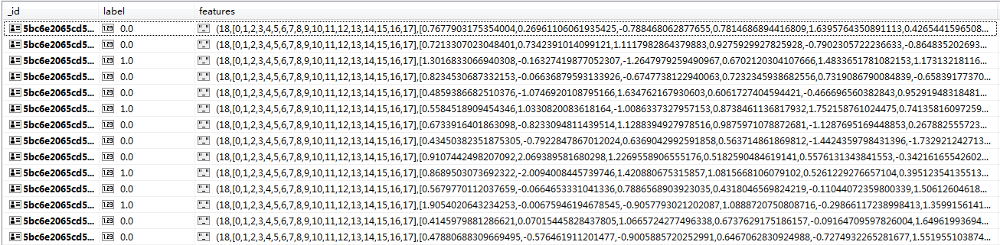

在表中有label列是目标列，但是这个features列却不是我们需要的格式，libsvm是一种以稀疏矩阵来表达矩阵的格式，大量节省内存。

```python
# 定义udf函数
@udf(returnType=VectorUDT())
def createVectors(features_str: str):
    features = features_str[51:-2].split(",")
    result = {}
    for i in range(len(features)):
        result[i] = float(features[i])
    vector = Vectors.sparse(18, result)
    return vector
df = Offline().readClusterMongodb(spark_obj, "ion", "test")
# 使用udf函数
data = df.select("label", createVectors("features").alias("features"))
return data
```

### 结合mongo的复杂例子

```python
tableFilter = [{'$match': {'outOctetsReAvg': 16}}]
orgDF = spark.read.format(MONGODB_DRIVER) \
        .options(uri=MONGODB_URI, database="ion", collection="outLineSumInfo",                          pipeline=tableFilter)
        .load()
orgDF.printSchema()
orgDF.show(5, False)
```

结果表结构为：

```shell
root
 |-- _id: struct (nullable = true)
 |    |-- oid: string (nullable = true)
 |-- calTs: timestamp (nullable = true)
 |-- did: string (nullable = true)
 |-- inOctetsActual: array (nullable = true)
 |    |-- element: double (containsNull = true)
 |-- ...
 |-- ts: array (nullable = true)
 |    |-- element: timestamp (containsNull = true)
```

可以看到这个结构是嵌套的，假设取出前五行：

```python
orgDF.select("_id", "calTs", "did", "ts").show(5)
```

结果为：

```shell
+--------------------+--------------------+--------------+--------------------+
|                 _id|               calTs|           did|                  ts|
+--------------------+--------------------+--------------+--------------------+
|[5bd1ca3709974500...|2018-10-25 21:50:...|ip:172.18.55.1|[2018-10-24 21:53...|
|[5bd1ca3e09974500...|2018-10-25 21:50:...|ip:172.18.55.1|[2018-10-24 21:53...|
|[5bd1cc8c7e2ce300...|2018-10-25 22:00:...|ip:172.18.55.1|[2018-10-24 22:02...|
|[5bd2466e9ce2fa00...|2018-10-26 06:40:...|ip:172.18.55.1|[2018-10-25 06:44...|
|[5bd248c06fc94600...|2018-10-26 06:50:...|ip:172.18.55.1|[2018-10-25 06:50...|
+--------------------+--------------------+--------------+--------------------+
```


但是DataFrame擅长处理列式的结构，做法是平铺：

```python
orgDF.selectExpr("_id", "calTs", "did", "inline(ts)").show(5)
```

报错为：

```python
cannot resolve 'inline(`ts`)' due to data type mismatch: input to function inline should be array of struct type, not array<timestamp>;
```

这里使用explode语法：

```python
orgDF.selectExpr("_id", "calTs", "did", "explode(ts) as ts").show(5, False)
```

结果为：

```python
+--------------------------+-----------------------+--------------+-------------------+
|_id                       |calTs                  |did           |ts                 |
+--------------------------+-----------------------+--------------+-------------------+
|[5bd1ca370997450011740f3c]|2018-10-25 21:50:31.991|ip:172.18.55.1|2018-10-24 21:53:28|
|[5bd1ca370997450011740f3c]|2018-10-25 21:50:31.991|ip:172.18.55.1|2018-10-24 21:55:39|
|[5bd1ca370997450011740f3c]|2018-10-25 21:50:31.991|ip:172.18.55.1|2018-10-24 21:57:50|
|[5bd1ca370997450011740f3c]|2018-10-25 21:50:31.991|ip:172.18.55.1|2018-10-24 22:00:01|
|[5bd1ca370997450011740f3c]|2018-10-25 21:50:31.991|ip:172.18.55.1|2018-10-24 22:02:12|
+--------------------------+-----------------------+--------------+-------------------+
```

这个时候就将数据平铺了。实际上嵌套的数据结构并不适合spark，最好还是以csv，libsvm，或者列式结构作为算法的源数据，避免多余的性能开销。

# 机器学习

Spark机器学习包括两个部分：特征工程和Spark-ML

## 特征工程

在Spark的


## 管道

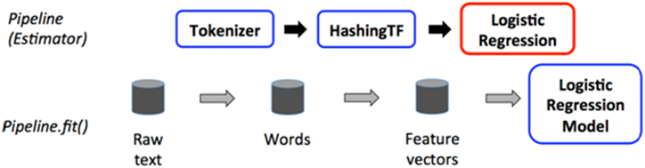

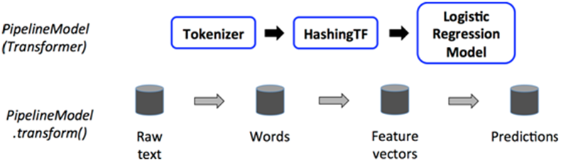

代码举例

```python
train  # type: DataFrame ["id", "text", "label"]
test  # type: DataFrame  ["id", "text"]
# 分词
tokenizer = Tokenizer(inputCol="text", outputCol="words")
# 词频
hashingTF = HashingTF(inputCol="words", outputCol="features")
# lr算法
lr = LogisticRegression(maxIter=10, regParam=0.001, featuresCol="features", labelCol="label")
# 管道
pipeline = Pipeline(stages=[tokenizer, hashingTF, lr])
# 训练模型
model = pipeline.fit(training)
# 预测
prediction = model.transform(test)
```


# 优化说明

## 单机python性能

单机算法最大的缺陷是在CPU密集计算类型中，只能使用1个真核的CPU，这就导致了CPU成为其性能的瓶颈。看一个例子。

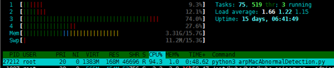

在该例子中CPU使用率达到了94%，但是从4个CPU来看，确并没有使用满，这便是因为python只能使用单个CPU的现象。再从真个时间流程来看，就更加形象。

CPU监控信息


IO监控信息

但是使用多线程时则不一样。

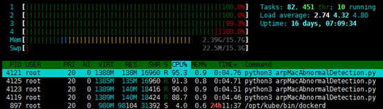

可以看到有四个相同的进程，每个进程的CPU使用率都在90%左右。这就是使用多进程提高并行能力的方法。再从真个时间流程来看，就更加形象。

CPU监控信息

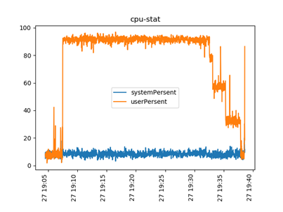

在CPU监控中，可以明确看到，算法运行时，将4个真核CPU都完整使用了，在19：35左右，各个进程开始结束，也就是图中呈现的阶梯下降情况。

IO监控信息

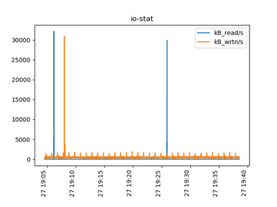

从IO监控图中可以看出，该任务是一个一次性将所有数据都读入到内存的任务，因此更能证明主要瓶颈点不是IO，而是CPU。同时也能看出一个问题，在19:08左右有一个大批量的写入，这个在算法流程中的逻辑需要检查。

## 单机spark性能

为了对比单机的spark和单机的pyspark，通过随机森林的试验来查看效果。

在一个5百万的libsvm格式的文本数据集上进行试验。

### 单机python性能

CPU监控信息：

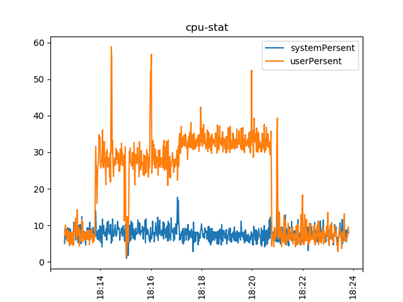

从图中发现用户程序的CPU使用率能够达到40%左右，即1.2个真核CPU资源，但是python程序却最多只能使用1核CPU。这主要是因为其中有大量的IO交互以及内存计算。在18:14-18:17时用户程序的CPU使用率在35%左右，但是在18:17~18:21时用户程序的CPU使用率在40%以上。

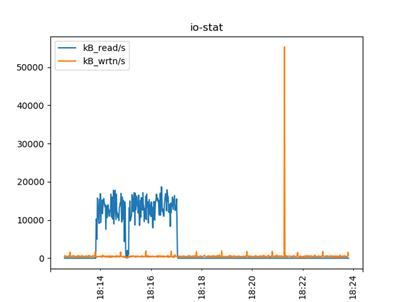

将IO监控和CPU监控对照来看，就能够发现在18:14-18:17主要是读取数据，这个正好和CPU使用一致；而在18:17~18:21时用户程序的CPU使用率在40%以上，则是算法的计算中，也会存在CPU的处理。因此python程序的CPU的使用率仍然是1个真核。

### 单机spark性能

CPU监控信息：

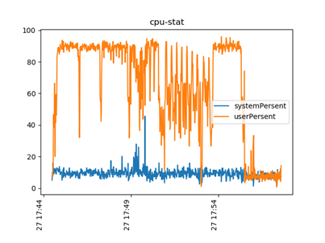

在CPU监控图中，横坐标表示时间，纵坐标表示CPU使用率。当使用python运行spark-ML时，能够发现用户程序的CPU使用率（userPersent）几乎长时间在90%左右（剩下的10%是系统程序在用），这也能说明spark-ML能够使用所有核。

IO监控信息：

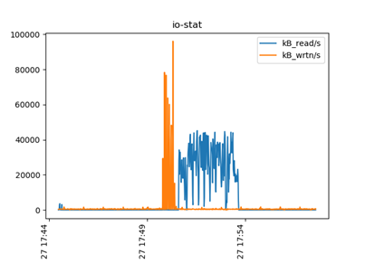

在IO监控图中，可以看出Spark-ML运行时不是一开始就读（mongodb）写(shuffle)数据，而是在算法需要的时候才全部读入。同时也揭示了，sparkML算法在算法结束后时分区写入。