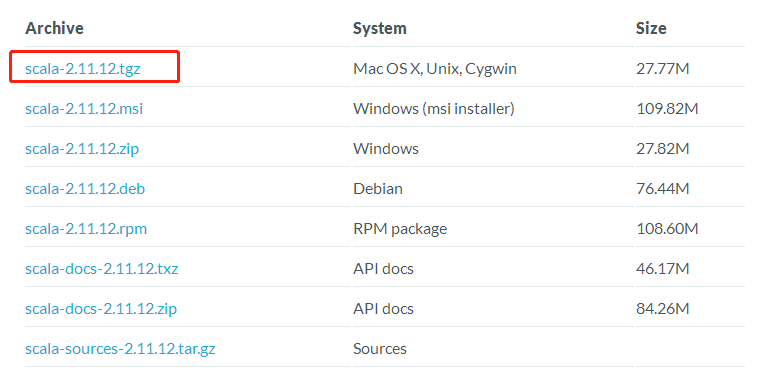
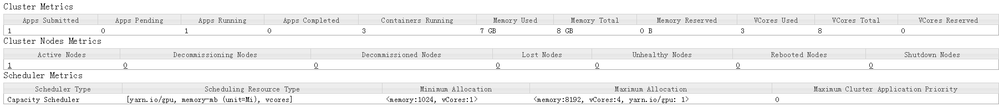
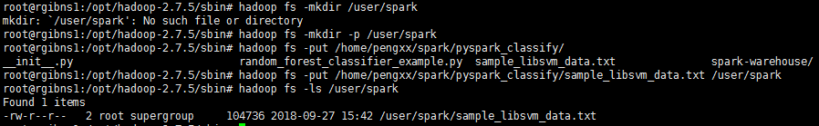

## 安装基础环境（JAVA和SCALA环境）

### 环境准备

```sh
#在三个节点的/etc/hosts文件中存在以下三个host配置，组成集群
rgibns1
rgibns2
rgibns3
```


###获取安装文件

**默认和大数据有关的安装都在/opt目录下。**

#### java

从官方下载jdk的Linux版本，如`jdk-8u181-linux-x64.tar.gz`

#### scala

在下载时遇到一些问题，首先进入官网后：选择一个版本



进入后发现网页打开错误，或者下载为0kb/s，网址为

```http
https://downloads.lightbend.com/scala/2.11.12/scala-2.11.12.tgz
```

这个时候只要修改一个地方就可以加速下载：

```http
http://downloads.typesafe.com/scala/2.11.12/scala-2.11.12.tgz
```

而且下载速度很快。


####hadoop

```sh
wget http://www-eu.apache.org/dist/hadoop/common/hadoop-2.7.5/hadoop-2.7.5.tar.gz
```

尽可能下载最新版本

### 解压文件

#### java

在三个节点中执行

```sh
tar -zxf jdk-8u181-linux-x64.tar.gz
```

#### scala

在三个节点中执行

```sh
tar -xzf scala-2.11.12.tgz
```

#### hadoop

在主节点rgibns1执行

```sh
tar -xzf hadoop-2.7.5.tar.gz
```

#### 创建软链接

解压完压缩包后，可以选择创建软连接，减少因为版本变更造成的改动，示例

```shell
# 注意：要指定好目录关系
ln -s jdk1.8.0_181 java
ln -s scala-2.11.12 scala
ln -s hadoop-3.1.2 hadoop
```


### 配置环境变量

```sh
vim /etc/profile
#在文件末尾追加以下内容
# java，注意JAVA_HOME与实际一致
export JAVA_HOME=/opt/java
export PATH=$PATH:$JAVA_HOME/bin
export CLASSPATH=$CLASSPATH::$JAVA_HOME/lib/
# scala，注意SCALA_HOME与实际一致
export SCALA_HOME=/opt/scala
export PATH=$PATH:$SCALA_HOME/bin
# hadoop，注意HADOOP_HOME与实际一致
export HADOOP_HOME=/opt/hadoop
export PATH="$HADOOP_HOME/bin:$HADOOP_HOME/sbin:$PATH"
export HADOOP_CONF_DIR=$HADOOP_HOME/etc/hadoop
export YARN_CONF_DIR=$HADOOP_HOME/etc/hadoop
```

最后shi环境变量生效

```sh
source /etc/profile
```

验证java和scala

```sh
java -version
scala -version
```

###hadoop配置

#### $HADOOP_HOME/etc/hadoop/hadoop-env.sh

**修改**JAVA_HOME 如下：

```sh
export JAVA_HOME=/opt/java
```

重要，这个必须要修改。

#### $HADOOP_HOME/etc/hadoop/slaves

```sh
# 该文件默认有个localhost，这里为了可以仅将主节点作为Master，不用于存数据，可以删除localhost
rgibns1
rgibns2
rgibns3
```

注意，如果是hadoop3.x，那么这个文件应该是$HADOOP_HOME/etc/hadoop/workers

#### $HADOOP_HOME/etc/hadoop/core-site.xml

```xml
<configuration>
    <property>
        <name>fs.defaultFS</name>
        <value>hdfs://rgibns1:9000</value>
    </property>
    <property>
        <name>io.file.buffer.size</name>
        <value>131072</value>
    </property>
    <property>
        <name>hadoop.tmp.dir</name>
        <value>/opt/hadoop/tmp</value>
    </property>
</configuration>
```

#### $HADOOP_HOME/etc/hadoop/hdfs-site.xml

注意：如果是单机节点，请修改secondary配置为主节点名称和replication配置为1

```xml
<configuration>
    <property>
        <name>dfs.namenode.secondary.http-address</name>
        <value>rgibns2:50090</value>
    </property>
    <property>
        <name>dfs.replication</name>
        <value>2</value>
    </property>
    <property>
        <name>dfs.namenode.name.dir</name>
        <value>file:/opt/hadoop/hdfs/name</value>
    </property>
    <property>
        <name>dfs.datanode.data.dir</name>
        <value>file:/opt/hadoop/hdfs/data</value>
    </property>
</configuration>
```

#### $HADOOP_HOME/etc/hadoop/mapred-site.xml

复制template，生成xml：

```sh
cp $HADOOP_HOME/etc/hadoop/mapred-site.xml.template $HADOOP_HOME/etc/hadoop/mapred-site.xml
```

内容：

```xml
<configuration>
    <property>
        <name>mapreduce.framework.name</name>
        <value>yarn</value>
    </property>
    <property>
        <name>mapreduce.jobhistory.address</name>
        <value>rgibns1:10020</value>
    </property>
    <property>
        <name>mapreduce.jobhistory.address</name>
        <value>rgibns1:19888</value>
    </property>
</configuration>
```

#### $HADOOP_HOME/etc/hadoop/yarn-site.xml

```xml
<configuration>
    <!-- Site specific YARN configuration properties -->
    <property>
        <name>yarn.nodemanager.aux-services</name>
        <value>mapreduce_shuffle</value>
    </property>
    <property>
        <name>yarn.resourcemanager.address</name>
        <value>rgibns1:8032</value>
    </property>
    <property>
        <name>yarn.resourcemanager.scheduler.address</name>
        <value>rgibns1:8030</value>
    </property>
    <property>
        <name>yarn.resourcemanager.resource-tracker.address</name>
        <value>rgibns1:8031</value>
    </property>
    <property>
        <name>yarn.resourcemanager.admin.address</name>
        <value>rgibns1:8033</value>
    </property>
    <property>
        <name>yarn.resourcemanager.webapp.address</name>
        <value>rgibns1:8088</value>
    </property>
</configuration>
```

至此master节点的hadoop搭建完毕

然后将master节点的文件复制到各个从节点

```sh
scp -r hadoop-2.7.5 root@rgibns2:/opt
scp -r hadoop-2.7.5 root@rgibns3:/opt
```

再启动之前我们需要

格式化一下namenode

```sh
hadoop namenode -format
```

#### 配置GPU

从样例创建一个文件

```shell
cp mapred-site.xml resource-types.xml
```

在resource-types.xml中删除`<configuration>..</configuration>`的内容，并加入以下内容

```xml
<configuration>
  <property>
     <name>yarn.resource-types</name>
     <value>yarn.io/gpu</value>
  </property>
</configuration>
```

修改capacity-scheduler.xml中的yarn.scheduler.capacity.resource-calculator参数为org.apache.hadoop.yarn.util.resource.DominantResourceCalculator。

```xml
  <property>
    <name>yarn.scheduler.capacity.resource-calculator</name>
    <value>org.apache.hadoop.yarn.util.resource.DominantResourceCalculator</value>
    <description>
      ...
    </description>
  </property>
```

在yarn-site.xml文件中加入以下内容

```xml
</configuration>
    <!-- 自动发现GPU -->
    <property>
        <name>yarn.nodemanager.resource-plugins</name>
        <value>yarn.io/gpu</value>
    </property>
</configuration>
```

启动yarn后访问如下网址http://172.18.130.34:8088/cluster/apps，结果为：




#### 其他

如果是hadoop3.x还需要配置如下信息

将`$HADOOP_HOME/sbin/start-dfs.sh，$HADOOP_HOME/sbin/stop-dfs.sh`两个文件顶部添加以下参数

```shell
HDFS_DATANODE_USER=root
# 安全配置可以不要
#HADOOP_SECURE_DN_USER=hdfs
HDFS_NAMENODE_USER=root
HDFS_SECONDARYNAMENODE_USER=root
```

`$HADOOP_HOME/sbin/start-yarn.sh，$HADOOP_HOME/sbin/stop-yarn.sh`顶部也需添加以下

```shell
YARN_RESOURCEMANAGER_USER=root
# 安全配置可以不要
#HADOOP_SECURE_DN_USER=yarn
YARN_NODEMANAGER_USER=root
```


 # 启动集群

```sh
# 启动hadoop
/opt/hadoop/sbin/start-all.sh
/opt/spark-2.1.0-bin-hadoop2.7/sbin/start-all.sh
# 或仅启动hdfs
/opt/hadoop/sbin/start-dfs.sh
# 使用jps命令查看相应进程
jps
```


或者通过web访问：

```http
http://rgibns1:50070/dfshealth.html#tab-overview
```

如果是hadoop3.x，那么hdfs的端口有变更

hdfs:172.18.135.131:9870

如果安装失败，需要删除tmp目录的内容

```shell
rm tmp/ -rf
rm hdfs/data/ hdfs/name/ -rf
```


# 关闭集群

```sh
/opt/spark-2.1.0-bin-hadoop2.7/sbin/stop-all.sh
/opt/hadoop-2.7.3/sbin/stop-all.sh
jps
```

# 开发测试

## python&hdfs

将文件上传到hdfs

```sh
hadoop fs -mkdir -p /user/spark 
hadoop fs -put /home/pengxx/spark/pyspark_classify/sample_libsvm_data.txt /user/spark
hadoop fs -ls /user/spark
```



首先下载hdfs依赖

```sh
conda install -c conda-forge python-hdfs
```

```python
from hdfs import Client
client = Client("http://localhost:50070",root="/",timeout=100,session=False)
client.list("/")
```

这是使用单机版本的hdfs库尝试的，下面尝试使用集群的pyspark连接

```python
if __name__ == "__main__":
    spark = SparkSession \
        .builder \
        .appName("RandomForestClassifierExample") \
        .master("local[2]") \
        .getOrCreate()
    spark.sparkContext.setLogLevel("WARN")
    data = spark.read.format("libsvm").load("hdfs://172.18.135.131:9000/user/spark/sample_libsvm_data.txt")
    data.show(10, False)
```

这里有个问题注意一下：

`hdfs://172.18.135.131:9000/user/spark/sample_libsvm_data.txt`如果不加端口号9000则会报错“拒绝连接到8020端口”，实际上，旧式的hadoop采用8020端口，因此要声明使用9000端口。

> [java.net.ConnectException: Call From localhost/127.0.0.1 to localhost:8020 failed on connection](https://blog.csdn.net/tszxlzc/article/details/61925599)

集群提交方案：

```sh
/opt/spark-2.3.1-bin-hadoop2.7/bin/spark-submit --master spark://172.18.135.131:7077 --executor-memory 2G --total-executor-cores 2 --num-executors 4 random_forest_classifier_example.py
```

## scala&hdfs

将jar包【可以无spark依赖】上传到环境中，使用如下命令

```sh
/opt/spark-2.3.1-bin-hadoop2.7/bin/spark-submit --master spark://172.18.135.131:7077 --class com.ruijie.batch.Test assurance.ml.scala-0.9.1-dev-20180927082904.jar
```

如果是yarn集群模式

```sh
/opt/spark-2.3.1-bin-hadoop2.7/bin/spark-submit --master yarn --class com.ruijie.batch.Test assurance.ml.scala-0.9.1-dev-20180927083553.jar
```

# FAQ

提交任务到yarn时出现以下问题：

```shell
2019-06-12 20:52:02,032 ERROR client.TransportClient: Failed to send RPC RPC 6023759164461043573 to /172.18.130.34:48178: java.nio.channels.ClosedChannelException
java.nio.channels.ClosedChannelException
	at io.netty.channel.AbstractChannel$AbstractUnsafe.write(...)(Unknown Source)
```

可以从nodeManager.log中找到一个警告：

```shell
2019-06-12 20:52:00,667 WARN org.apache.hadoop.yarn.server.nodemanager.containermanager.monitor.ContainersMonitorImpl: Container [pid=5804,containerID=container_1560343815404_0001_01_000001] is running 244705792B beyond the 'VIRTUAL' memory limit. Current usage: 383.7 MB of 1 GB physical memory used; 2.3 GB of 2.1 GB virtual memory used. Killing container.
```

表示虚拟内存不足，解决方法是：

在etc/hadoop/yarn-site.xml文件中，修改检查虚拟内存的属性为false，如下：

```xml
<configuration>
    <!-- 关闭虚拟内存默认为2.1GB的检查 -->
    <property>
        <name>yarn.nodemanager.vmem-check-enabled</name>
        <value>false</value>
    </property>
</configuration>
```

然后重启yarn服务。

