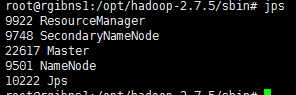

## 安装基础环境（JAVA和SCALA环境）

### Java1.8环境搭建：

配置master的java环境

```sh
#下载jdk1.8的rpm包
wget --no-check-certificate --no-cookies --header "Cookie: oraclelicense=accept-securebackup-cookie" http://download.oracle.com/otn-pub/java/jdk/8u112-b15/jdk-8u112-linux-x64.rpm 
rpm -ivh jdk-8u112-linux-x64.rpm 

#增加JAVA_HOME
vim etc/profile

#增加如下行：
#Java home
export JAVA_HOME=/usr/java/jdk1.8.0_112/
export PATH=$PATH:$JAVA_HOME/bin
export CLASSPATH=$CLASSPATH::$JAVA_HOME/lib/
#刷新配置：
source /etc/profile #当然reboot也是可以的
```

配置workerN主机的java环境

```sh
#使用scp命令进行拷贝
scp jdk-8u112-linux-x64.rpm root@workerN:/root

#其他的步骤如master节点配置一样
```

 

### Scala2.11.12环境搭建：

在下载时遇到一些问题，首先进入官网后：选择一个版本


进入后发现网页打开错误，或者下载为0kb/s，网址为

```http
https://downloads.lightbend.com/scala/2.11.12/scala-2.11.12.tgz
```

这个时候只要修改一个地方就可以加速下载：

```http
http://downloads.typesafe.com/scala/2.11.12/scala-2.11.12.tgz
```

而且下载速度很快。

Master节点：

```sh
#下载scala安装包：
wget -O "scala-2.12.2.rpm" "https://downloads.lightbend.com/scala/2.12.1/scala-2.12.2.rpm"

#安装rpm包：
rpm -ivh scala-2.12.2.rpm

#增加SCALA_HOME
vim /etc/profile

#增加如下内容;
#Scala Home
export SCALA_HOME=/usr/share/scala
export PATH=$PATH:$SCALA_HOME/bin
#刷新配置
source /etc/profile
```

WorkerN节点;

```sh
#使用scp命令进行拷贝
scp scala-2.12.2.rpm root@workerN:/root

#其他的步骤如master节点配置一样
```

 

## MASTER节点

### 下载二进制包

```sh
wget http://www-eu.apache.org/dist/hadoop/common/hadoop-2.7.3/hadoop-2.7.3.tar.gz
```

### 解压并移动至相应目录

```sh
tar -xvf hadoop-2.7.3.tar.gz
mv hadoop-2.7.3 /opt
```

### 修改相应的配置文件

#### （1）/etc/profile：

增加如下内容：

```sh
#hadoop enviroment 
export HADOOP_HOME=/opt/hadoop-2.7.3/
export PATH="$HADOOP_HOME/bin:$HADOOP_HOME/sbin:$PATH"
export HADOOP_CONF_DIR=$HADOOP_HOME/etc/hadoop
export YARN_CONF_DIR=$HADOOP_HOME/etc/hadoop
```

然后载入一下

```sh
source /etc/profile
```


#### （2）$HADOOP_HOME/etc/hadoop/hadoop-env.sh

修改JAVA_HOME 如下：

```sh
export JAVA_HOME=/opt/jdk1.8.0_181
```

重要，这个必须要修改。

#### （3）$HADOOP_HOME/etc/hadoop/slaves

```sh
worker1
worker2
```

#### （4）$HADOOP_HOME/etc/hadoop/core-site.xml

```xml
<configuration>
    <property>
        <name>fs.defaultFS</name>
        <value>hdfs://rgibns1:9000</value>
    </property>
    <property>
        <name>io.file.buffer.size</name>
        <value>131072</value>
    </property>
    <property>
        <name>hadoop.tmp.dir</name>
        <value>/opt/hadoop-2.7.5/tmp</value>
    </property>
</configuration>
```

#### （5）$HADOOP_HOME/etc/hadoop/hdfs-site.xml

```xml
<configuration>
    <property>
        <name>dfs.namenode.secondary.http-address</name>
        <value>rgibns2:50090</value>
    </property>
    <property>
        <name>dfs.replication</name>
        <value>2</value>
    </property>
    <property>
        <name>dfs.namenode.name.dir</name>
        <value>file:/opt/hadoop-2.7.5/hdfs/name</value>
    </property>
    <property>
        <name>dfs.datanode.data.dir</name>
        <value>file:/opt/hadoop-2.7.5/hdfs/data</value>
    </property>
</configuration>
```

#### （6）$HADOOP_HOME/etc/hadoop/mapred-site.xml

复制template，生成xml：

```sh
cp mapred-site.xml.template mapred-site.xml
```

内容：

```xml
<configuration>
    <property>
        <name>mapreduce.framework.name</name>
        <value>yarn</value>
    </property>
    <property>
        <name>mapreduce.jobhistory.address</name>
        <value>rgibns1:10020</value>
    </property>
    <property>
        <name>mapreduce.jobhistory.address</name>
        <value>rgibns1:19888</value>
    </property>
</configuration>
```

#### （7）$HADOOP_HOME/etc/hadoop/yarn-site.xml

```xml
<configuration>
    <!-- Site specific YARN configuration properties -->
    <property>
        <name>yarn.nodemanager.aux-services</name>
        <value>mapreduce_shuffle</value>
    </property>
    <property>
        <name>yarn.resourcemanager.address</name>
        <value>rgibns1:8032</value>
    </property>
    <property>
        <name>yarn.resourcemanager.scheduler.address</name>
        <value>rgibns1:8030</value>
    </property>
    <property>
        <name>yarn.resourcemanager.resource-tracker.address</name>
        <value>rgibns1:8031</value>
    </property>
    <property>
        <name>yarn.resourcemanager.admin.address</name>
        <value>rgibns1:8033</value>
    </property>
    <property>
        <name>yarn.resourcemanager.webapp.address</name>
        <value>rgibns1:8088</value>
    </property>
</configuration>
```

至此master节点的hadoop搭建完毕

再启动之前我们需要

格式化一下namenode

```sh
hadoop namenode -format
```

 # 启动集群

```sh
/opt/hadoop-2.7.3/sbin/start-all.sh
/opt/spark-2.1.0-bin-hadoop2.7/sbin/start-all.sh
jps
```



# 关闭集群

```sh
/opt/spark-2.1.0-bin-hadoop2.7/sbin/stop-all.sh
/opt/hadoop-2.7.3/sbin/stop-all.sh
jps
```

# 开发测试

## python&hdfs

将文件上传到hdfs

```sh
hadoop fs -mkdir -p /user/spark 
hadoop fs -put /home/pengxx/spark/pyspark_classify/sample_libsvm_data.txt /user/spark
hadoop fs -ls /user/spark
```


首先下载hdfs依赖

```sh
conda install -c conda-forge python-hdfs
```

```python
from hdfs import Client
client = Client("http://localhost:50070",root="/",timeout=100,session=False)
client.list("/")
```

这是使用单机版本的hdfs库尝试的，下面尝试使用集群的pyspark连接

```python
if __name__ == "__main__":
    spark = SparkSession \
        .builder \
        .appName("RandomForestClassifierExample") \
        .master("local[2]") \
        .getOrCreate()
    spark.sparkContext.setLogLevel("WARN")
    data = spark.read.format("libsvm").load("hdfs://172.18.135.131:9000/user/spark/sample_libsvm_data.txt")
    data.show(10, False)
```

这里有个问题注意一下：

`hdfs://172.18.135.131:9000/user/spark/sample_libsvm_data.txt`如果不加端口号9000则会报错“拒绝连接到8020端口”，实际上，旧式的hadoop采用8020端口，因此要声明使用9000端口。

> [java.net.ConnectException: Call From localhost/127.0.0.1 to localhost:8020 failed on connection](https://blog.csdn.net/tszxlzc/article/details/61925599)

集群提交方案：

```sh
/opt/spark-2.3.1-bin-hadoop2.7/bin/spark-submit --master spark://172.18.135.131:7077 --executor-memory 2G --total-executor-cores 2 --num-executors 4 random_forest_classifier_example.py
```

## scala&hdfs

将jar包【可以无spark依赖】上传到环境中，使用如下命令

```sh
/opt/spark-2.3.1-bin-hadoop2.7/bin/spark-submit --master spark://172.18.135.131:7077 --class com.ruijie.batch.Test assurance.ml.scala-0.9.1-dev-20180927082904.jar
```

如果是yarn集群模式

```sh
/opt/spark-2.3.1-bin-hadoop2.7/bin/spark-submit --master yarn --class com.ruijie.batch.Test assurance.ml.scala-0.9.1-dev-20180927083553.jar
```

