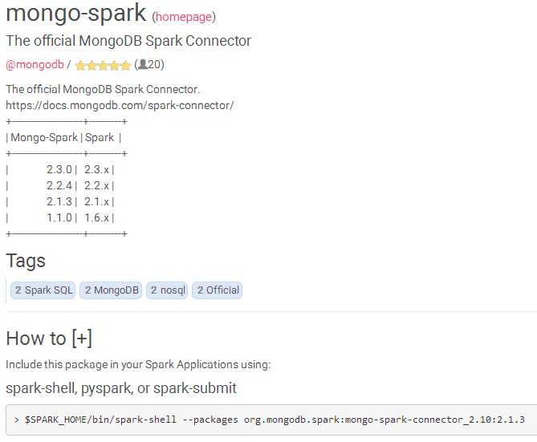
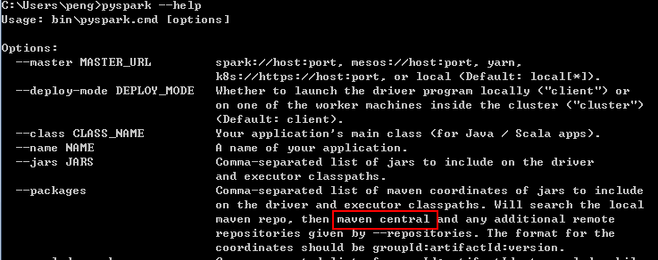
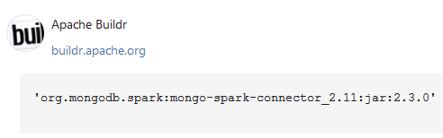
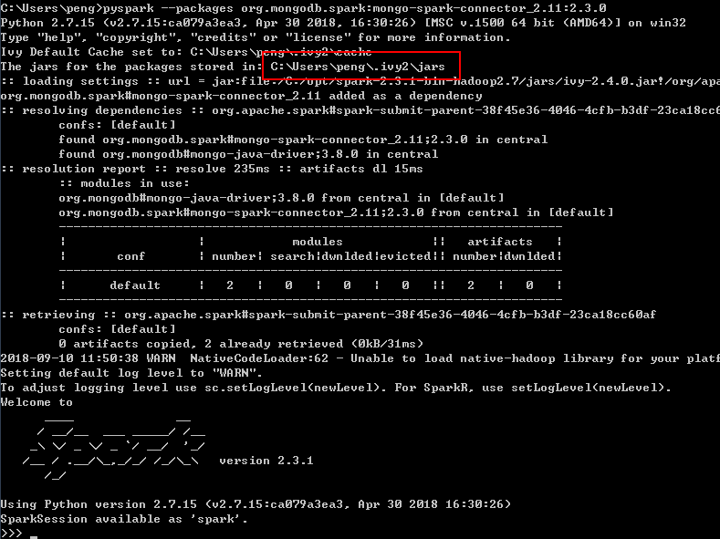
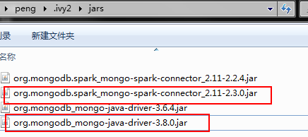
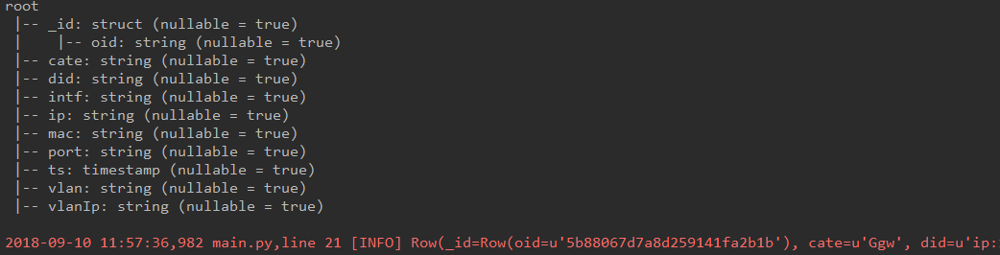

# 第三方包位置

spark允许使用第三方包来直接给spark任务使用，访问[SparkPackages](https://spark-packages.org/)网站，可以搜索需要使用的包。

# mongodb

从SparkPackages找到mongo-spark，如下图所示



这个是mongodb官方提供的连接包，我们按照这种方式，首先使用pyspark来下载这些包。

使用`pyspark --help`查看packages命令



（实际上是maven仓库中的包），现在我的Spark版本是2.3.x，因此看看maven仓库中是否存在这个mongo-spark版本。如下图



因此我们改变命令为：

```shell
pyspark --packages org.mongodb.spark:mongo-spark-connector_2.11:2.3.0
```

现在的步骤很关键，如果缺少了会报错`“java.lang.ClassNotFoundException: com.mongodb.spark.sql.DefaultSource”`




进入到这个包的下载目录`C:\Users\peng\.ivy2\jars`，有以下文件



**把选中的两个文件复制一份到spark的jars目录中**。

## 使用命令

一般情况下都是在代码中新建一个SparkSession，可以参考[spark处理mongodb数据（python版）](https://blog.csdn.net/hellousb2010/article/details/53414349)，测试如下：

```python
#! /usr/bin/env python
# -*- coding: utf-8 -*-
"""
@author:pengxingxiong@ruijie.com.cn
@time: 2018/9/6 22:06
@desc:
"""
import os
from pyspark.sql import SparkSession
from code.common import log

if __name__ == "__main__":
    MONGODB_URI = "mongodb://$host:$port"
    MONGODB_DB = "$db"
    MONGODB_COLLECTION = "$table"
    LOG = log.get_logger(module_name="test")
    spark = SparkSession.builder.master("local[*]").appName("test").getOrCreate()
    test_collection = spark.read.format("com.mongodb.spark.sql.DefaultSource").options(uri=MONGODB_URI, database=MONGODB_DB, collection=MONGODB_COLLECTION).load()
    test_collection.printSchema()
    LOG.info(test_collection.first())
```

返回结果如下：



