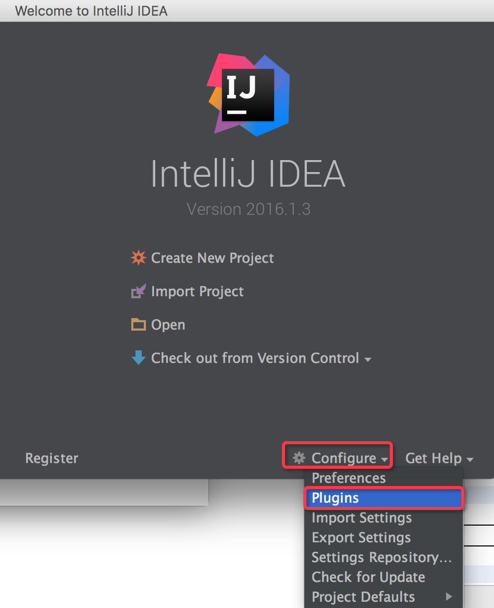
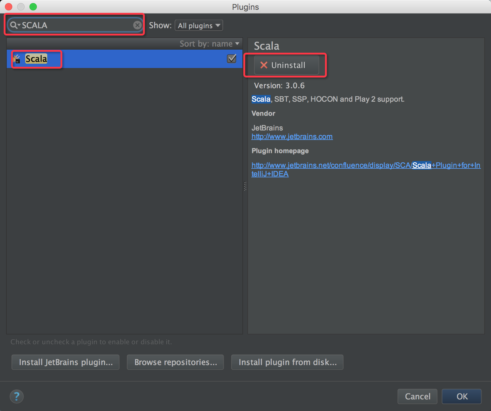
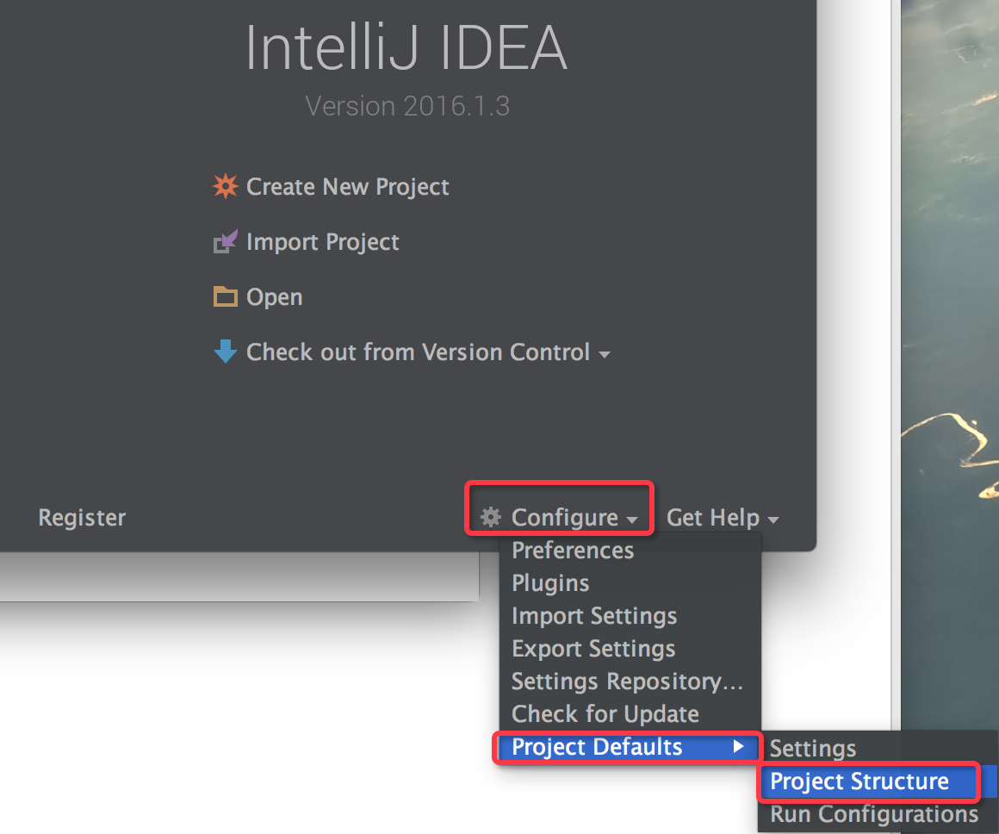
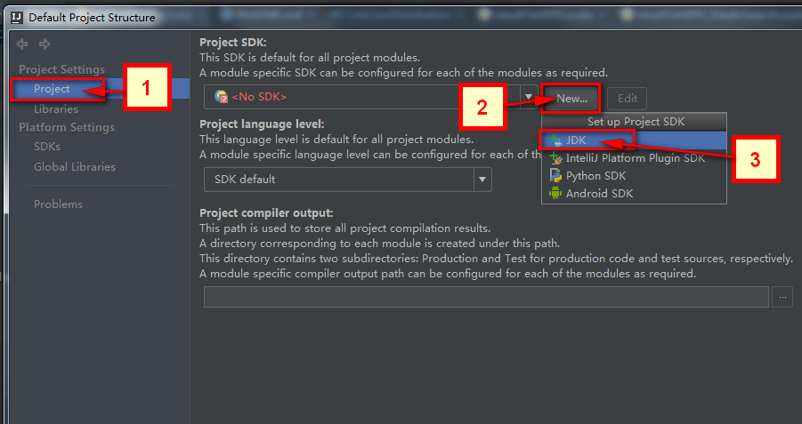
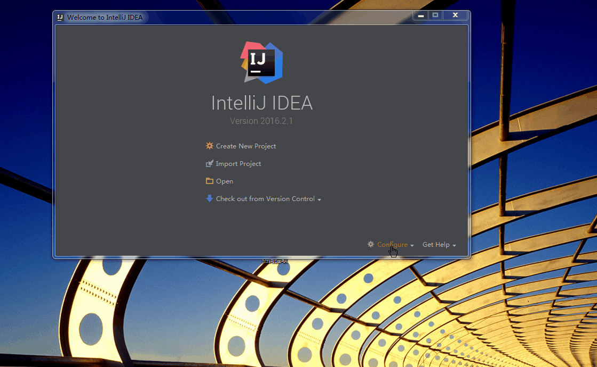
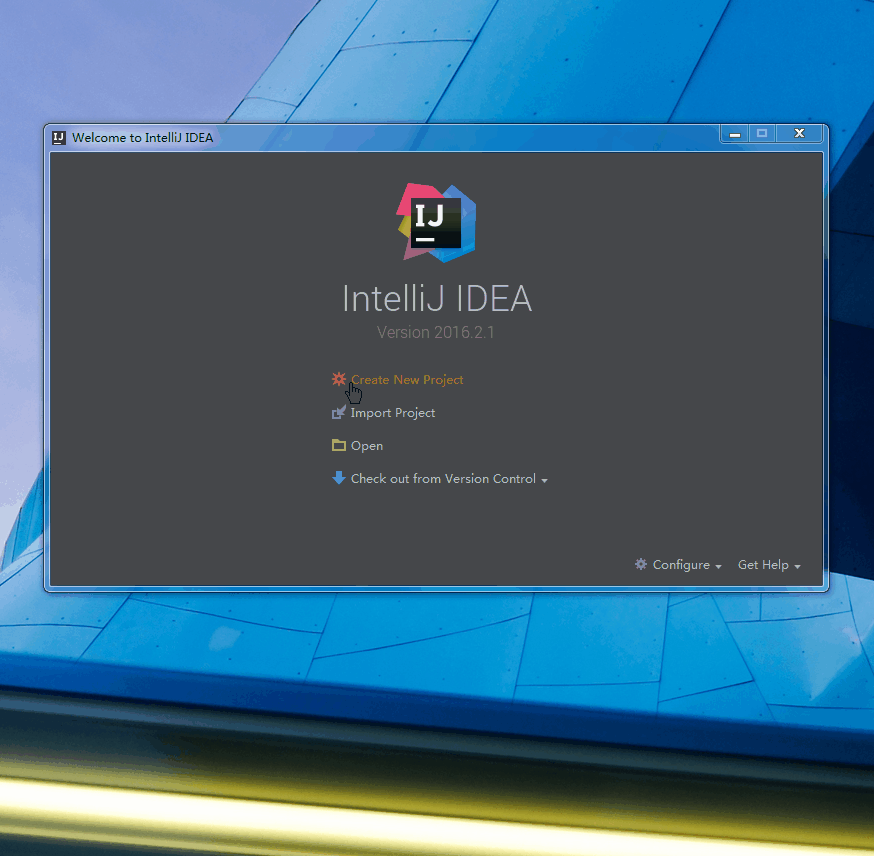
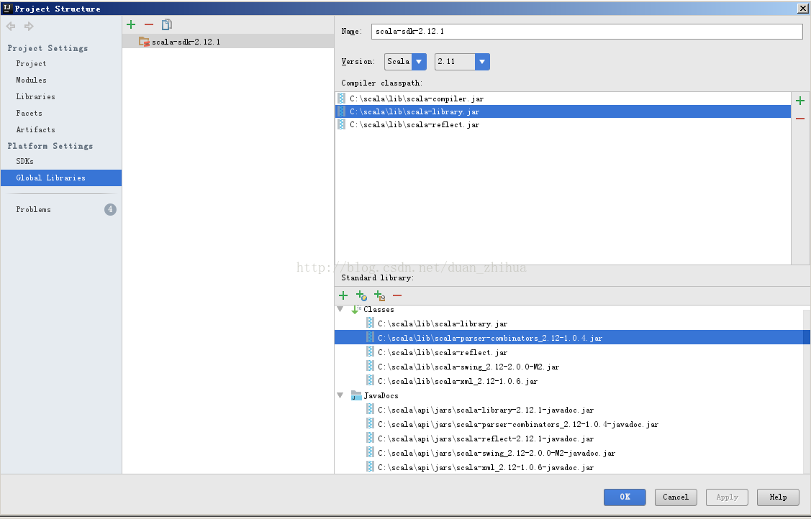
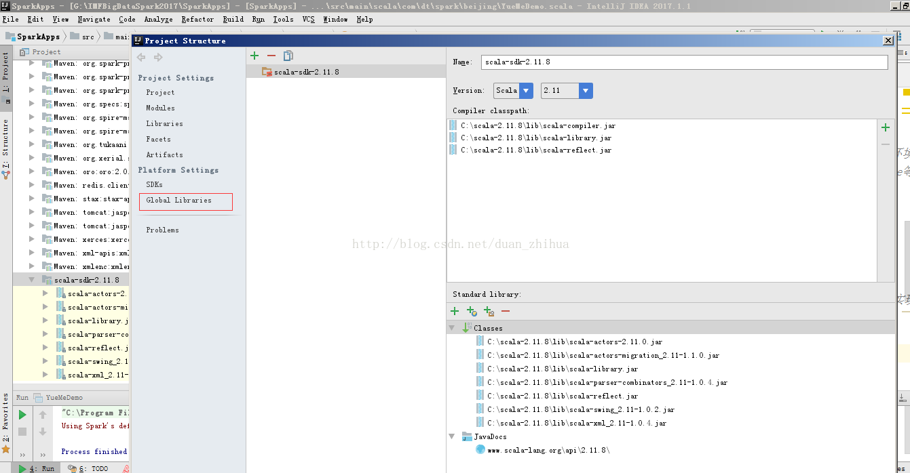
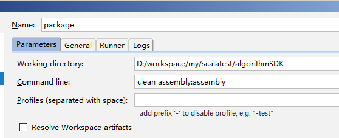

使用idea 新建maven 管理的spark 项目有以下几步:

-   scala插件的安装
-   全局JDK和Library的设置
-   配置全局的Scala SDK
-   新建maven项目
-   属于你的”Hello World!”
-   导入spark依赖
-   编写sprak代码
-   打包在spark上运行

# scala插件的安装

首先在欢迎界面点击Configure，选择plugins如下图所示：



如果安装失败，则需要到官网上下载一个安装版本，最好是不要安装最新版的，因为spark可能还不支持。

因为的安装过了所以事uninstall 没有安装的话是 install ，安装成功后，点击OK退出。



**注意：插件安装完了之后，记得重启一下IntelliJ IDEA使得插件能够生效。**

# 全局JDK和Library的设置

为了不用每次都去配置JDK，这里先进行一次全局配置。首先在欢迎界面点击Configure，然后在Project Defaults的下拉菜单中选择Project Structure，如下图所示：

在打开的Default Project Structure界面的左侧边栏选择Project，在右侧打开的页面中创建一个新的JDK选项（一定要本机已经安装过JDK了），如下图所示步骤在下拉菜单中点击JDK后，在打开的对话框中选择你所安装JDK的位置，注意是JDK安装的根目录，就是JAVA_HOME中设置的目录。



# 配置全局的Scala SDK

在欢迎页面的右下角点击Configure，然后在Project Defaults的下拉菜单中选择Project Structure，在打开的页面左侧选择Global Libraries，然后在中间一栏中有一个绿色的加号标志 +，点击后在下拉菜单中选择 Scala SDK

然后在打开的对话框中选择系统本身所安装的Scala（即System对应的版本），点击OK确定，这时候会在中间一栏位置处出现Scala的SDK，在其上右键点击后选择Copy to Project Libraries…，这个操作是为了将Scala SDK添加到项目的默认Library中去。整个流程如下面的动图所示。



# 新建maven项目

在欢迎界面点击Create New Project，在打开的页面左侧边栏中，选择Maven，然后在右侧的Project SDK一项中，查看是否是正确的JDK配置项正常来说这一栏会自动填充的，因为我们之前在1.3中已经配置过了全局的Project JDK了，如果这里没有正常显示JDK的话，可以点击右侧的New…按钮，然后指定JDK安装路径的根目录即可），然后点击Next，来到Maven项目最重要三个参数的设置页面，这三个参数分别为：GroupId, ArtifactId和Version. 步骤如下图所示：



# 属于你的”Hello World!”

在上一步中，我们已经创建了一个Maven工程

1.  为了让你的首次体验Scala更清爽一些，将一些暂时无关的文件和文件夹都勇敢的删除掉吧，主要有 main\resources 和 test 这三个；
2.  将Scala的框架添加到这个项目中，方法是在左侧栏中的项目名称上右键菜单中点击Add Framework Support…，然后在打开的对话框左侧边栏中，勾选Scala前面的复选框，然后点击确定即可（前提是上文中所述步骤都已正确走通，否则你很有可能看不到Scala这个选项的）；
3.  在main文件夹中建立一个名为 scala 的文件夹，并右键点击 scala 文件夹，选择 Make Directory as，然后选择Sources Root ，这里主要意思是将 scala 文件夹标记为一个源文件的根目录，然后在其内的所有代码中的 package ，**其路径就从这个根目录下开始算起。**
4.  在已经标记好为源文件根目录的 scala 文件夹 上，右键选择 New，然后选择 Scala Class，随后设置好程序的名称，并且记得将其设置为一个 Object(类似于Java中含有静态成员的静态类)，正常的话，将会打开这个 Object 代码界面，并且可以看到IntelliJ IDEA自动添加了一些最基本的信息；
5.  编写程序，并run。这样就配置完毕了scala项目。

#  导入spark依赖

此时你已经可以成功的运行一个Scala 项目了。想要运行在spark 上则还需要导入相关依赖。打开pom.xml文件添加如下依赖。

**注意：是添加如下依赖；spark 和Scala的版本是对应的。**

```xml
<properties>
        <spark.version>2.0.2</spark.version>
        <scala.version>2.11</scala.version>
    </properties>


    <dependencies>
        <dependency>
            <groupId>org.apache.spark</groupId>
            <artifactId>spark-core_${scala.version}</artifactId>
            <version>${spark.version}</version>
        </dependency>
        <dependency>
            <groupId>org.apache.spark</groupId>
            <artifactId>spark-streaming_${scala.version}</artifactId>
            <version>${spark.version}</version>
        </dependency>
        <dependency>
            <groupId>org.apache.spark</groupId>
            <artifactId>spark-sql_${scala.version}</artifactId>
            <version>${spark.version}</version>
        </dependency>
        <dependency>
            <groupId>org.apache.spark</groupId>
            <artifactId>spark-hive_${scala.version}</artifactId>
            <version>${spark.version}</version>
        </dependency>
        <dependency>
            <groupId>org.apache.spark</groupId>
            <artifactId>spark-mllib_${scala.version}</artifactId>
            <version>${spark.version}</version>
        </dependency>

    </dependencies>

    <build>
        <plugins>

            <plugin>
                <groupId>org.scala-tools</groupId>
                <artifactId>maven-scala-plugin</artifactId>
                <version>2.15.2</version>
                <executions>
                    <execution>
                        <goals>
                            <goal>compile</goal>
                            <goal>testCompile</goal>
                        </goals>
                    </execution>
                </executions>
            </plugin>

            <plugin>
                <artifactId>maven-compiler-plugin</artifactId>
                <version>3.6.0</version>
                <configuration>
                    <source>1.8</source>
                    <target>1.8</target>
                </configuration>
            </plugin>

            <plugin>
                <groupId>org.apache.maven.plugins</groupId>
                <artifactId>maven-surefire-plugin</artifactId>
                <version>2.19</version>
                <configuration>
                    <skip>true</skip>
                </configuration>
            </plugin>

        </plugins>
    </build>
```

# 引入Hadoop的bin

在windows中调试spark项目时经常会遇到缺少hadoop/bin/winutils.exe文件，因此需要从网上下载一个bin文件来补充。类似错误是：

```shell
ERROR Shell: Failed to locate the winutils binary in the hadoop binary path
java.io.IOException: Could not locate executable null\bin\winutils.exe in the Hadoop binaries.
```

"null\bin\winutils.exe"表示无法定位到winutils.exe。但这并不意味这我们一定要安装Hadoop，我们可以直接下载所需要的[winutils.exe](https://raw.githubusercontent.com/dereckyu/notebook/master/BigData/standalone-spark-on-windows/winutils.exe)到磁盘上的任何位置。更加保险的方式是将hadoop的bin目录都下载下来。[点击此处下载](https://github.com/sardetushar/hadooponwindows/tree/master/bin)。

然后在代码中显示的注明hadoop的位置即可：

```scala
System.setProperty("hadoop.home.dir", "C:\\Program Files\\hadoop")
```

这样spark就可以自动找到hadoop\bin\winutils.exe了。

# 临时更换scala版本导致的问题

Spark IDEA集成环境开发时，pom文件新安装了一些jar包，没注意到其中scala的版本被替换了，运行一个测试程序提示这个：

```shell
Exception in thread "main" java.lang.NoSuchMethodError: scala.Predef$.refArrayOps([Ljava/lang/Object;)Lscala/collection/mutable/ArrayOps;  
    at org.apache.spark.sql.SparkSession$Builder.config(SparkSession.scala:793)  
    at com.dt.spark.beijing.YueMeDemo$.main(YueMeDemo.scala:34)  
    at com.dt.spark.beijing.YueMeDemo.main(YueMeDemo.scala)  
  
Process finished with exit code 1  
```

这个报错java.lang.NoSuchMethodError: scala.Predef$.refArrayOps([Ljava/lang/Object;)不深入研究了，是jvm层面报出来的，JVM在加载时候没有发现这个方法。查下来就是scala的编译版本被替换了。将IDEA中将scala 2.12版本换成scala 2.11就好了。





# Hive开发

## 环境配置

引入Hive依赖

```xml
<dependency>
  <groupId>org.apache.spark</groupId>
  <artifactId>spark-hive_${scala.version}</artifactId>
  <version>${spark.version}</version>
</dependency>
```

到服务器的spark/conf中将hive-site.xml拷贝到项目的resources目录中，并只保留以下配置：

```xml
<?xml version="1.0" encoding="UTF-8" standalone="no"?>
<?xml-stylesheet type="text/xsl" href="configuration.xsl"?>
<configuration>
    <property>
        <name>hive.metastore.uris</name>
        <value>thrift://10.206.19.181:9083</value>
        <description>JDBC connect string for a JDBC metastore</description>
    </property>
    <!--ObjectStore: Version information not found in metastore-->
    <property>
        <name>hive.metastore.schema.verification</name>
        <value>false</value>
    </property>
    <property>
        <name>hive.exec.scratchdir</name>
        <value>/tmp/hive</value>
    </property>
    <property>
        <name>hive.downloaded.resources.dir</name>
        <value>/tmp/${hive.session.id}_resources</value>
        <description>Temporary local directory for added resources in the remote file system.</description>
    </property>
    <property>
        <name>javax.jdo.option.ConnectionUserName</name>
        <value>root</value>
        <description>Username to use against metastore database</description>
    </property>
    <property>
        <name>javax.jdo.option.ConnectionPassword</name>
        <value>EMRroot1234</value>
        <description>password to use against metastore database</description>
    </property>
    <property>
        <name>javax.jdo.option.ConnectionURL</name>
        <value>jdbc:mysql://10.206.19.181/hivemeta?createDatabaseIfNotExist=true&amp;characterEncoding=UTF-8</value>
        <description>JDBC connect string for a JDBC metastore</description>
    </property>
    <property>
        <name>javax.jdo.option.ConnectionDriverName</name>
        <value>com.mysql.jdbc.Driver</value>
        <description>Driver class name for a JDBC metastore</description>
    </property>


</configuration>
```

## 代码编写

```scala
val sc = new SparkContext(conf)
val hiveContext = new HiveContext(sc)
HiveUtil.tableNotExistException(hiveContext, DATABASE, USER_BEHAVIOR)
//读取评分数据
val ratings = hiveContext.sql(behaviorDataSQL).rdd.map { row =>
  val userID = row.getString(0).toInt
  val movieID = row.getString(1).toInt
  val rate = row.getDouble(2).toFloat
  val timestamp = row.getLong(3) % 10
  val rating = Rating(userID, movieID, rate)
  (timestamp, rating)
}
```

## 运行异常

```shell
java.lang.IllegalArgumentException: Error while instantiating 'org.apache.spark.sql.hive.HiveSessionState':
  at org.apache.spark.sql.SparkSession$.org$apache$spark$sql$SparkSession
$$
...
Caused by: java.lang.RuntimeException: The root scratch dir: /tmp/hive on HDFS should be writable. Current permissions are: ---------
  at org.apache.hadoop.hive.ql.session.SessionState.createRootHDFSDir(SessionState.java:612)
  at org.apache.hadoop.hive.ql.session.SessionState.createSessionDirs(SessionState.java:554)
  at org.apache.hadoop.hive.ql.session.SessionState.start(SessionState.java:508)
  ... 85 more
```

错误消息中提示零时目录 **/tmp/hive** 没有写的权限：

```shell
The root scratch dir: /tmp/hive on HDFS should be writable. Current permissions are: ---------
```

在项目所在的盘根目录可以看到有D:/tmp/hive，现在给它授权：

```shell
C:\hadoop\bin\winutils\bin\winutils.exe chmod 777 D:\tmp\hive
```

再次运行则成功。

# HBase开发

# 环境配置

引入maven依赖

```xml
<dependency>
  <groupId>org.apache.hbase</groupId>
  <artifactId>hbase-server</artifactId>
  <version>1.3.0</version>
  <exclusions>
    <exclusion>
      <groupId>javax.servlet</groupId>
      <artifactId>*</artifactId>
    </exclusion>
    <exclusion>
      <groupId>org.mortbay.jetty</groupId>
      <artifactId>*</artifactId>
    </exclusion>
  </exclusions>
</dependency>
```

一般情况下需要将服务器上spark/conf/hbase-site.xml拷贝下来，但是HBase的配置比较简单，只配置一个zookeeper项即可：

```xml
<?xml version="1.0" encoding="UTF-8" standalone="no"?>
<?xml-stylesheet type="text/xsl" href="configuration.xsl"?>
<configuration>
    <property>
        <name>hbase.zookeeper.quorum</name>
        <value>emr-header-1,emr-header-2,emr-worker-1</value>
    </property>
</configuration>
```


## 代码编写

### 写入

```scala
val hbaseConf = HBaseConfiguration.create()
val tableName = DATABASE + "." + HBASE_RECOMMEND
lazy val job = Job.getInstance(hbaseConf)
job.getConfiguration.set(TableOutputFormat.OUTPUT_TABLE, tableName)
job.setOutputFormatClass(classOf[TableOutputFormat[ImmutableBytesWritable]])
val connection = ConnectionFactory.createConnection(hbaseConf)
val admin = connection.getAdmin
// 如果表不存在则创建表
if (!admin.isTableAvailable(TableName.valueOf(tableName))) {
  LOG.info("创建表： " + tableName)
  val tableDesc = new HTableDescriptor(TableName.valueOf(tableName))
  tableDesc.addFamily(new HColumnDescriptor("als"))
  admin.createTable(tableDesc)
  LOG.info("创建表成功")
}else {
  LOG.info("清空表： " + tableName)
  admin.disableTable(TableName.valueOf(tableName))
  admin.truncateTable(TableName.valueOf(tableName),true)
  LOG.info("清空表成功")
}
//获取每个user的推荐结果
val recData = recForAll(10, model)
//保存每个user的推荐结果到hbase中
LOG.info("将推荐结果保存到HBASE中...")
val recDataRDD = sc.makeRDD(recData).cache()
LOG.info("RDD转化")
recDataRDD.map(HBaseUtil.convert).saveAsNewAPIHadoopDataset(job.getConfiguration)
recDataRDD.unpersist()
LOG.info("保存到HBASE完毕")
admin.close()
```

这个地方比较重要的是recDataRDD必须是RDD类型，然后convert函数：

```scala

def convert(triple:Array[Rating]): (ImmutableBytesWritable, Put) ={
  var p: Put = null
  p = new Put(Bytes.toBytes(triple.head.user.toString))
  p.addColumn(Bytes.toBytes("als"), Bytes.toBytes("item_id"), Bytes.toBytes(triple.map(_.product).mkString(",").toString))
  p.addColumn(Bytes.toBytes("als"), Bytes.toBytes("rating"), Bytes.toBytes(triple.map(_.rating).mkString(",").toString))
  (new ImmutableBytesWritable, p)
}
```

其中` p = new Put(Bytes.toBytes(triple.head.user.toString))`创建一个写入行数据，并将user作为了rowKey，然后加入其它列。最后必须返回`(new ImmutableBytesWritable, p)`才能表示一个完整的行。

-   rowKey不能定义别名，因此在设计时，由于user和item是一对多的关系，要保证不重复，只能将item合并成一个逗号分隔的字符串，以user作为rowKey。
-   写入HBase的整数容易被HBase变成16进制保存，对于普通列还能接受，但是对于rowKey，如user这样的ID号如果被转成了16进制，那么在查找HBase数据的时候，也要将查询值改成16进制，并补充完整0x\符号，比较麻烦，因此可以将整数类型数据转成字符串，就能够轻松的保存到HBase中而不被转化格式。

### 读取

```scala
//读取数据并转化成rdd
val hBaseRDD = sc.newAPIHadoopRDD(hbaseConf, classOf[TableInputFormat],
                                  classOf[org.apache.hadoop.hbase.io.ImmutableBytesWritable],
                                  classOf[org.apache.hadoop.hbase.client.Result])

val count = hBaseRDD.count()
println("数据总行数="+count)
hBaseRDD.foreach{case (_,result) =>
  //获取行键
  val key = Bytes.toInt(result.getRow)
  //通过列族和列名获取列
  val userID = Bytes.toInt(result.getValue("base".getBytes,"user_id".getBytes))
  val itemID = Bytes.toInt(result.getValue("base".getBytes,"item_id".getBytes))
  val rate = Bytes.toDouble(result.getValue("base".getBytes,"rating".getBytes))
  println("Row key:"+key+" userID:"+userID+" itemID:"+itemID+" rate:"+rate)
}
admin.close()
```

# 提交到集群

## 打包

在maven中使用assembly插件打包：

```xml
<plugin>
  <groupId>org.apache.maven.plugins</groupId>
  <artifactId>maven-assembly-plugin</artifactId>
  <version>2.5.3</version>
  <configuration>
    <finalName>algorithm-SDK</finalName>
    <!--<descriptorRefs>
                        <descriptorRef>jar-with-dependencies</descriptorRef>
                    </descriptorRefs>-->
    <descriptors>
      <descriptor>assembly.xml</descriptor>
    </descriptors>
    <archive>
      <manifest>
        <mainClass>com.nubia.recsys.Start</mainClass>
      </manifest>
    </archive>
  </configuration>
  <executions>
    <execution>
      <id>make-assembly</id>
      <phase>package</phase>
      <goals>
        <goal>assembly</goal>
      </goals>
      <configuration>
        <appendAssemblyId>false</appendAssemblyId>
        <finalName>algorithm-SDK</finalName>
      </configuration>
    </execution>
  </executions>
</plugin>
```

然后在项目的根目录下创建assembly.xml文件(或者直接将上面的注释去掉，将下面的`<descriptors>`注释，这是打包的两种方法)：

```xml
<assembly>
    <id>dev</id>
    <formats>
        <format>jar</format>
    </formats>
    <includeBaseDirectory>false</includeBaseDirectory>
    <dependencySets>
        <dependencySet>
            <outputDirectory>/</outputDirectory>
            <useProjectArtifact>true</useProjectArtifact>
            <unpack>true</unpack>
            <scope>runtime</scope>
        </dependencySet>
        <dependencySet>
            <outputDirectory>/</outputDirectory>
            <unpack>true</unpack>
            <scope>system</scope>
        </dependencySet>
    </dependencySets>
</assembly>
```

然后在maven插件中配置命令：



即可打包完成。

## 提交

通常情况下，为了节省spark的standlone模式产生的内存浪费，就直接用hadoop的yarn集群来提交spark项目。具体命令为：

```shell
./spark-submit  --class com.nubia.recsys.Start --master yarn /home/pengxx/spark/algorithm-SDK-dev.jar
```

## 运行异常

```shell
WARN ClientCnxn: Session 0x0 for server null, unexpected error, closing socket connection and attempting reconnect
java.net.ConnectException: Connection timed out: no further information
	at sun.nio.ch.SocketChannelImpl.checkConnect(Native Method)
	at sun.nio.ch.SocketChannelImpl.finishConnect(SocketChannelImpl.java:717)
	at org.apache.zookeeper.ClientCnxnSocketNIO.doTransport(ClientCnxnSocketNIO.java:361)
	at org.apache.zookeeper.ClientCnxn$SendThread.run(ClientCnxn.java:1081)
```

该错误两种措施：

-   集群的时间不一致，在每个节点执行`ntpdate emr-header-1`
-   发现仍然无法解决问题，查看zookeeper：
-   /opt/apps/zookeeper-3.4.6/bin/zkServer.sh status
    发现181节点是follower，而182是leader。但是无法改变。结果去除该错误的方法是，将hbase-site.xml给去掉。在程序中使用hbaseConf.set("hbase.zookeeper.quorum", "emr-header-1,emr-header-2,emr-worker-1")即可

我当时发现此问题的时候主要是emr-header-1挂了。

另外，从emr-header-1挂了，也发现其yarn进程也出现问题，即热备模式中主节点转移到了另外一台服务器，但是服务器的配置中很多是以emr-header-1作为IP的，因此需要将emr-header-1恢复（恢复为主节点或启动DataNode、nodeManager进程）。


提交过程中遇到了重复出现以下信息：

```shell
INFO yarn.Client: Application report for application_1523590557543_0001 (state: ACCEPTED)
INFO yarn.Client: Application report for application_1523590557543_0001 (state: ACCEPTED)
INFO yarn.Client: Application report for application_1523590557543_0001 (state: ACCEPTED)
INFO yarn.Client: Application report for application_1523590557543_0001 (state: ACCEPTED)
```

连续出现该信息，表示yarn集群有问题，登录到emr-header-1:8088查看yarn集群，可以看到nodes连接中没有node节点，然后使用jps命令查看各个服务器发现没有nodeManager进程，因此在每个服务器中开启nodeManager即可：

```shell
yarn-daemon.sh --hosts allnodes start nodemanager
```

# Spark的日志配置

在测试spark计算时，将作业提交到yarn（模式–master yarn-cluster）上，想查看print到控制台这是imposible的，因为作业是提交到yarn的集群上，so 去yarn集群上看日志是很麻烦的，但有特别想看下print的信息，方便调试或者别的目的

在Spark的conf目录下（如果是windows的maven项目则是在Spark-core.jar的根目录），把log4j.properties.template修改为log4j.properties，原来的内容如下：

```properties
#Set everything to be logged to the console
log4j.rootCategory=INFO, console
log4j.appender.console=org.apache.log4j.ConsoleAppender
log4j.appender.console.target=System.err
log4j.appender.console.layout=org.apache.log4j.PatternLayout
log4j.appender.console.layout.ConversionPattern=%d{yy/MM/dd HH:mm:ss} %p %c{1}: %m%n

#Settings to quiet third party logs that are too verbose
log4j.logger.org.spark-project.jetty=WARN
log4j.logger.org.spark-project.jetty.util.component.AbstractLifeCycle=ERROR
log4j.logger.org.apache.spark.repl.SparkIMain$exprTyper=INFO
log4j.logger.org.apache.spark.repl.SparkILoop$SparkILoopInterpreter=INFO
```

改成如下内容：

```properties
log4j.rootCategory=INFO, console
log4j.appender.console=org.apache.log4j.ConsoleAppender
log4j.appender.console.target=System.err
log4j.appender.console.layout=org.apache.log4j.PatternLayout
log4j.appender.console.layout.ConversionPattern=%d{yy/MM/dd HH:mm:ss} %p %c{1}: %m%n
log4j.logger.org=WARN

log4j.appender.FILE=org.apache.log4j.DailyRollingFileAppender
log4j.appender.FILE.Threshold=DEBUG
log4j.appender.FILE.file=/home/hadoop/spark.log
log4j.appender.FILE.DatePattern='.'yyyy-MM-dd
log4j.appender.FILE.layout=org.apache.log4j.PatternLayout
log4j.appender.FILE.layout.ConversionPattern=[%-5p] [%d{yyyy-MM-dd HH:mm:ss}] [%C{1}:%M:%L] %m%n
```

这里主要是改了

```properties
log4j.logger.org=WARN
```

所有以org开头的日志都是WARN级别。

# 命令行解析器

对于java项目有JCommander进行命令行解析，而对于scala项目则有scopt完成此功能。

## 引入maven依赖：

```xml
<!--命令行解析工具-->
<dependency>
  <groupId>com.github.scopt</groupId>
  <artifactId>scopt_2.10</artifactId>
  <version>3.7.0</version>
</dependency>
```

## 代码开发

```scala
/**
    * 程序所需的外部控制参数
    * 该类型的class能让编译器帮忙自动生成常用方法
    *
    * @author pengxingxiong
    **/
case class Params(database: String = "pengxx_rec_platform",
                  item_meta: String = "movielens_item_meta",
                  behavior_meta: String = "movielens_user_behavior",
                  numRecommend: Int = 100,
                  item_recommend: String = "item_recommend",
                  alg_type: String = "ALS",
                  others: Map[String, String] = Map()
                 )

/**
    * 参数解析并加载到程序
    *
    * @author pengxingxiong
    **/
def argsParseAndLoad(args: Array[String]): Unit = {
  val defaultParams = Params()
  val parser = new OptionParser[Params]("ALSRecommend") {
    head("recommend algorithm SDK: an SDK  for general recommend algorithm.")
    opt[String]("database")
    .text(s"the database in hive, default: ${defaultParams.database}")
    .action((x, c) => c.copy(database = x))
    opt[String]("item_meta")
    .text(s"item mate data in hive, default: ${defaultParams.item_meta}")
    .action((x, c) => c.copy(item_meta = x))
    opt[String]("behavior_meta")
    .text(s"user behavior data in Hive, default: ${defaultParams.behavior_meta}")
    .action((x, c) => c.copy(behavior_meta = x))
    opt[Int]("numRecommend")
    .text(s"numRecommend, default: ${defaultParams.numRecommend}")
    .action((x, c) => c.copy(numRecommend = x))
    opt[String]("item_recommend")
    .text(s"the HBase tableName where recommend result saved in, default: ${defaultParams.item_recommend}")
    .action((x, c) => c.copy(item_recommend = x))
    opt[String]("alg_type")
    .text(s"the algorithm type set to train the offline data, default: ${defaultParams.alg_type}")
    .action((x, c) => c.copy(item_recommend = x))
    opt[Map[String, String]]("D").valueName("k1=v1,k2=v2...")
    .text("other arguments")
    .action((x, c) =>
            c.copy(others = x))
    note(
      """
          |For example, the following command submit this jar to the spark yarm:
          |
          | bin/spark-submit --class org.apache.spark.examples.mllib.MovieLensALS \
          |  examples/target/scala-*/spark-examples-*.jar \
          |  --numRecommend 5 --mysqlUrl root --mysqlPassword root --kryo --mysqlUrl jdbc:mysql://10.206.19.224:3306/nubia_recommend?zeroDateTimeBehavior=convertToNull&useUnicode=true&characterEncoding=utf-8\
          |  data/mllib/output/model
        """.stripMargin)
  }
  parser.parse(args, Params()) match {
    case Some(params) =>
    initParams(params)
    case None =>
    System.exit(1)
  }
}
/**
    * 加载配置项
    *
    * @author pengxingxiong
    **/
def initParams(params: Start.Params): Unit = {
  LOG.info("**********************************")
  LOG.info("database: " + params.database)
  LOG.info("item_meta: " + params.item_meta)
  LOG.info("behavior_meta: " + params.behavior_meta)
  LOG.info("numRecommends: " + params.numRecommend)
  LOG.info("item_recommend: " + params.item_recommend)
  LOG.info("item_recommend: " + params.item_recommend)
  LOG.info("alg_type: " + params.alg_type)
  LOG.info("**********************************")
  AlgorithmConfig.DATABASE = params.database
  AlgorithmConfig.ITEM_META = params.item_meta
  AlgorithmConfig.BEHAVIOR_META = params.behavior_meta
  AlgorithmConfig.numRecommend = params.numRecommend
  AlgorithmConfig.HBASE_RECOMMEND = params.item_recommend
  AlgorithmConfig.algType = params.alg_type
  AlgorithmConfig.others = params.others
  AlgorithmConfig.initSQL()
}
```

更加完善的功能则直接参考GitHub中关于scopt的官方说明。

