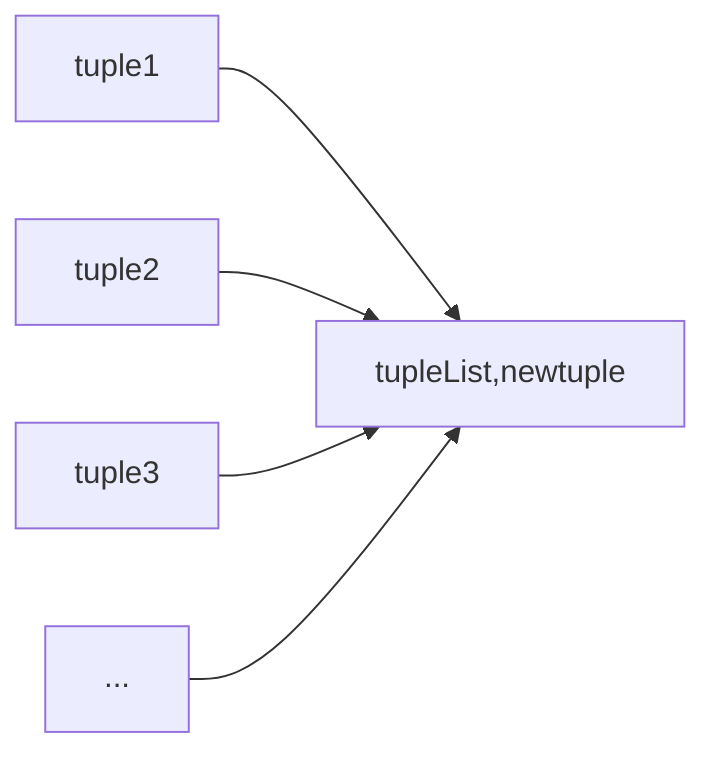
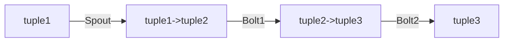
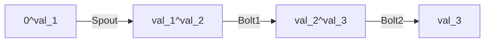

# 1 异或计算的基本原理

异或（xor）是一个数学运算符，它应用于逻辑运算。数学符号为⊕，计算机符号为xor，运算法则为：
$$
A \oplus B = (\neg A \wedge B) \vee (A \wedge \neg B)
$$
异或也叫半加运算，其运算法则相当于不带进位的二进制加法：二进制下用1表示真，0表示假，则异或的运算法则为：
$$
0 \oplus 0 = 0,1 \oplus 0 = 1,0 \oplus 1 = 1,1 \oplus 1 = 0(同为0，异为1)
$$
这些法则与加法是相同的，只是不带进位。


# 2 Acker理论

先概括下acker所参与的工作流程：

1. Spout在初始化时会产生一个tasksId；
2. Spout中创建新的Tuple，其id是一个64位的随机数；
3. Spout将新建的Tuple发送出去(给出了messageId来开启Tuple的追踪), 同时会发送一个消息到某个acker，要求acker进行追踪。该消息包含两部分：
   - Spout的taskId：用户acker在整个tuple树被完全处理后找到原始的Spout进行回调ack或fail
   - 一个64位的ack val值： 标志该tuple是否被完全处理。初始值为0。
4. 一个Bolt在处理完Tuple后，如果发射了一个新的anchor tuple，Storm会维护anchor tuple的列表；
5. 该Bolt调用OutputCollector.ack()时，Storm会做如下操作：
- 将anchor tuple列表中每个已经ack过的和新创建的Tuple的id做异或(XOR)。假定Spout发出的TupleID是tuple-id-0，该Bolt新生成的TupleID为tuple-id-1，那么，tuple-id-0*XOR*tuple-id-0*XOR *tuple-id-1
- Storm根据该原始TupleID进行一致性hash算法，找到最开始Spout发送的那个acker，然后把上面异或后得出的ack val值发送给acker

6. acker收到新的ack val值后，与保存的原始的Tuple的id进行异或，如果为0，表示该Tuple已被完全处理，则根据其taskId找到原始的Spout，回调其ack()方法。


Storm的设计模型中，Spout是源源不断的产生数据的，所以其nextTuple()方法在任何时候不应该被打断。**ack，fail 和 nextTuple是在同一个线程中完成的。**


在设计中，我们应尽量避免在Spout、Bolt中去Sleep。如果确实需要控制，最好用异步线程来做，例如用异步线程读取数据到队列，再由Spout去取队列中数据。异步线程可以随意控制速度等。

## 2.1 Tuple树

对于Spout创建的Tuple，在topology定义的流水线中经过Bolt处理时，可能会产生一个或多个新的Tuple。**源Tuple+新产生的Tuple构成了一个Tuple树**。当整棵树被处理完成，才算一个Tuple被完全处理，其中任何一个节点的Tuple处理失败或超时，则整棵树失败。

超时的值，可以通过定义topology时，conf.setMessageTimeoutSecs方法指定。

## 2.2 Anchor

`collector.emit(inputTule, new Values(newTupleValue));`

emit()方法发射一个新的tuple，第一个参数是传入Bolt的tuple，第二个参数是新产生的tuple的value，这种emit的方式，在Storm中称为: "anchor"（**锚定**）。

## 2.3 Acker的高效性

acker task并不显式的跟踪tuple树。 对于那些有成千上万个节点的tuple树，把这么多的tuple信息都跟踪起来会耗费太多的内存。相反，  acker用了一种不同的方式， 使得对于每个spout tuple所需要的内存量是恒定的（20 bytes) .  这个跟踪算法是storm如何工作的关键，并且也是它的主要突破。

一个acker task存储了一个spout-tuple-id到一对值的一个map。这个键值对结构的第一个值是创建这个tuple的taskid， 这个是用来在完成处理tuple的时候发送消息用的（发给具体的Acker）。 第二个值是一个64位的数字称作：ack val , ack val是整个tuple树的状态的一个表示，不管这棵树多大。
$$
map(spout-tuple-id, tmp-ack-val)
$$
它只是简单地把这棵树上的所有创建的tupleid/ack的tupleid一起异或(XOR)。以下公式中的 tmp-ack-val是要ack的tuple的id与由它新创建的所有的tuple的id异或的结果。
$$
tmp-ark-val =  tuple-id \oplus (child-tuple-id1 \oplus child-tuple-id2 \dotsc )
$$
当一个tuple被创建， 不管是spout还是bolt创建的，  它会被赋予一个64位的id ，而acker就是利用这个id去跟踪所有的tuple的。 每个tuple知道它的祖宗的id(从spout发出来的那个tuple的id), 每当你新发射一个tuple， 它的祖宗id都会传给这个新的tuple。 所以当一个tuple被ack的时候，它会发一个消息给acker，告诉它这个tuple树发生了怎么样的变化。具体来说就是它告诉acker:  我已经完成了， 我有这些儿子tuple, 你跟踪一下他们吧。

### 2.3.1 Acker怎么跟踪

所有acker共同维护一个map（task-id，源tuple-id/msgId），这里的task-id是由Spout创建时产生的，源tuple-id(或称为msgId)是用户可以自定义的。每个Bolt都声明锚Anchor(源tuple-id,新tuple-id)，注意，一个tuple可能存在于多个tuple树，所以可能存在多个tuple-id。



当在上万个节点的拓扑中Bolt要对它对应的喷口Spout应答（ack）时，就是根据源tuple-id告诉Acker线程，Acker线程找到对应的task-id，就能映射到对应任务中的Spout，这就完成了Bolt应答Spout的过程。

### 2.3.2 具体例子

下图是一个简单的Topology






ack_0的初始值为长整型0，val_x表示新产生的tuple-id，他们经过Spout，Bolt1，Bolt2，Bolt3处理，并与ark_val异或，最终ark_val变为0，表示tuple1被成功处理。
$$
ark_0 = ark_0 \oplus val_1 \oplus val_1 \oplus val_2 \oplus val_2 \oplus val_3 \oplus val_3
$$


**注：红色虚线框表示的是Acker组件，ack_val表示acker value的值，它的初值为0**

`(1001^1010) ^ (1001^1110) ^ (1010^1111) ^ (1110^1111)`

msg1绑定了两个源tuple，它们的id分别为1001和1010.在经过Bolt1处理后新生成了tuple id为1110,新生成的tuple与传入的tuple 1001进行异或得到的值为0111，然后Bolt1通过spout-tuple-id映射到指定的Acker组件，向它发送消息，Acker组件将Bolt1传过来的值与ack_val异或，更新ack_val的值变为了0100。与此相同经过Bolt2处理后，ack_val的值变为0001。最后经Bolt3处理后ack_val的值变为了0，说明此时由msg1标识的Tuple处理成功，此时Acker组件会通过事先绑定的task id映射找到对应的Spout,然后调用该Spout的ack方法。
$$
ark_0 = ark_0 \oplus 1010 \oplus 1010 \oplus 1111 \oplus 1111
$$


**说明：**

    1.  Acker (ack bolt)组件由系统自动产生，一般来说一个topology只有一个ack bolt（当然可以通过配置参数指定多个),当bolt处理并下发完tuple给下一跳的bolt时，会发送一个ack给ack bolt。ack bolt通过简单的异或原理(即同一个数与自己异或结果为零)来判定从spout发出的某一个Tuple是否已经被完全处理完毕。如果结果为真，ack bolt发送消息给spout，spout中的ack函数被调用并执行。如果超时，则发送fail消息给spout，spout中的fail函数被调用并执行，spout中的ack和fail的处理逻辑由用户自行填写。
    2.  Acker对于每个Spout-tuple保存一个ack-val的校验值，它的初始值是0， 然后每发射一个tuple 就ack一个tuple，那么tuple的id都要跟这个校验值异或一下，并且把得到的值更新为ack-val的新值。那么假设每个发射出去的tuple都被ack了， 那么最后ack-val一定是0(因为一个数字跟自己异或得到的值是0)。

$$
A  \oplus B \dotsb  \oplus B  \oplus A = 0(其中每个操作数出现且仅出现两次)
$$

3. tuple-id是随机的64位数字， ack val碰巧变成0(例如：ark_val = 1 ^ 2  ^ 3 = 0)而不是因为所有创建的tuple都完成了,这样的概率极小。 算一下就知道了， 就算每秒发生10000个ack， 那么需要5百万年才可能碰到一个错误。而且就算碰到了一个错误， 也只有在这个tuple失败的时候才会造成数据丢失。 
   $$
   {\color{red}year}=\frac{2^ {64}}{3600*24*365*10000} \approx 5849424
   $$
   ​

### 2.3.3 避免数据丢失方案

看看storm在每种异常情况下是怎么避免数据丢失的：

​         1. 由于对应的task挂掉了，一个tuple没有被ack：  storm的超时机制在超时之后会把这个tuple标记为失败，从而可以重新处理。

​         2. Acker挂掉了：  这种情况下由这个acker所跟踪的所有spout tuple都会超时，也就会被重新处理。

​          3. Spout挂掉了：  在这种情况下给spout发送消息的消息源负责重新发送这些消息。比如Kestrel和RabbitMQ在一个客户端断开之后会把所有”处理中“的消息放回队列。

就像你看到的那样， storm的可靠性机制是完全分布式的， 可伸缩的并且是高度容错的。


# 3 Acker实现

TupleImpl对象

```java
public class TupleImpl implements Tuple {
    private final List<Object> values;//tuple中的数据
    private final int taskId;
    private final String streamId;//对tuple的标识（成功、失败、超时等）
    private final GeneralTopologyContext context;//上下文
    private final MessageId id;//<rootId,异或值>
    private long _processSampleStartTime;
    private long _executeSampleStartTime;
    private long _outAckVal = 0;
}
```


## 3.1 Spout.nextTuple

Spout表面上是调用了nextTuple进行发送数据，而实际中是使用了collector.emit()方法来发送。`storm-client\src\jvm\org\apache\storm\executor\spout\SpoutOutputCollectorImpl.java`类是对`SpoutOutputCollector`的实现，可以在其`emit()->sendSpoutMsg()`中查看发送数据时的具体行为。

```java
private List<Integer> sendSpoutMsg(String stream, List<Object> values, Object messageId, Integer outTaskId) {
    emittedCount.increment();
    // 得到目标task id列表
    List<Integer> outTasks;
    if (outTaskId != null) {
        outTasks = taskData.getOutgoingTasks(outTaskId, stream, values);
    } else {
        outTasks = taskData.getOutgoingTasks(stream, values);
    }
    List<long> ackSeq = new ArrayList<>();
    Boolean needAck = (messageId != null) && hasAckers;
    // 生成随机的root_id，但是需要确保在当前spout中不能有重复的，不然就不能保证ack的准确性了
    long rootId = MessageId.generateId(random);
     // 遍历所有的目标task，每个task的messageId=<root_id, 随机数值>
    for (Integer t : outTasks) {
        MessageId msgId;
        if (needAck) {
            long as = MessageId.generateId(random);
            msgId = MessageId.makeRootId(rootId, as);
            // 添加到ackSeq list中，后面会有用
            ackSeq.add(as);
        } else {
            msgId = MessageId.makeUnanchored();
        }
        TupleImpl tuple = new TupleImpl(executor.getWorkerTopologyContext(), values, this.taskId, stream, msgId);
        // 扔到SpoutExecutor的transfer queue中，即进入发送队列
        executor.getExecutorTransfer().transfer(t, tuple);
    }
    if (isEventLoggers) {
        executor.sendToEventLogger(executor, taskData, values, executor.getComponentId(), messageId, random);
    }
    Boolean sample = false;
    try {
        sample = executor.getSampler().call();
    }
    catch (Exception ignored) {
    }
    // ack消息的逻辑在这里面，上面对所有的目标task分别emit消息，但是ack_init消息只需要发送一条。
    if (needAck) {
        TupleInfo info = new TupleInfo();
        info.setTaskId(this.taskId);
        info.setStream(stream);
        info.setMessageId(messageId);
        if (isDebug) {
            info.setValues(values);
        }
        if (sample) {
            info.setTimestamp(System.currentTimeMillis());
        }
        pending.put(rootId, info);
        // messageId = <root_id, 所有目标task的messageId随机数值的异或>
        List<Object> ackInitTuple = new Values(rootId, Utils.bitXorVals(ackSeq), this.taskId);
        // 发送给acker。会根据__acker_init这个stream直接找到task id进行发送。
        executor.sendUnanchored(taskData, Acker.ACKER_INIT_STREAM_ID, ackInitTuple, executor.getExecutorTransfer());
    } else if (messageId != null) {
        // 这里的逻辑，处理没有acker，但是仍然实现了IAckValueSpout接口的情况，需要给这种spout回调ack方法的机会。
        TupleInfo info = new TupleInfo();
        info.setStream(stream);
        info.setValues(values);
        info.setMessageId(messageId);
        info.setTimestamp(0);
        long timeDelta = sample ? 0L : null;
        info.setId("0:");
        executor.ackSpoutMsg(executor, taskData, timeDelta, info);
    }
    return outTasks;
}
```

这里我们可以看到，对于Spout在发送数据时做了两件事：

1. 从任务中取出tuple放入SpoutExecuter的发送队列（用到了`DisruptorQueue`高性能队列），即代码中提到的`executor.getExecutorTransfer().transfer(t, tuple);`,发送的MassageId=`<RootId,tupleId>`；实际是TupleImpl的一种形式`<context,value,taskId,StreamId,MassageId<rootId,tupleId>>`。
2. 把每个tupleId放入`ackSeq`队列中计算异或值，作为新的messageId，发送给Acker，即代码中提到的`executor.sendUnanchored(taskData, Acker.ACKER_INIT_STREAM_ID, ackInitTuple, executor.getExecutorTransfer());`从方法名就可以看出，`sendUnanchored`表示此处要断开锚，发送给Acker，参数`Acker.ACKER_INIT_STREAM_ID`是告诉Acker该应答是由Spout发送的。发送的MassageId=`<RootId,tupleId1^tupleId2>`。实际是TupleImpl的一种形式`<rootId,MassageId.get(rootId),taskId>`。

> 注:第2点中提到的tupleId1和tupleId2是指Spout向Bolt1和Bolt2发送了源tuple。

## 3.2 Bolt.emit

Bolt使用了collector.emit()方法来发送。`storm-client\src\jvm\org\apache\storm\executor\bolt\BoltOutputCollectorImpl.java`是`BoltCollector`的实现，可以在其`emit()->boltEmit()`中查看发送数据时的具体行为。它接收的参数anchors便是从SpoutTuple发送出来的DataTuple的anchores中取出的集合

```java
private List<Integer> boltEmit(String streamId, Collection<Tuple> anchors, List<Object> values, Integer targetTaskId) {
    // 一样地获取所有目标task列表
    List<Integer> outTasks;
    if (targetTaskId != null) {
        outTasks = taskData.getOutgoingTasks(targetTaskId, streamId, values);
    } else {
        outTasks = taskData.getOutgoingTasks(streamId, values);
    }
    // 遍历所有目标task，每一个目标task的message id= <rootId, edgeId>，其中edgeId是在这个bolt里新生成的随机数
    for (Integer t : outTasks) {
        Map<long, long> anchorsToIds = new HashMap<>();
        if (anchors != null) {
            for (Tuple a : anchors) {
                Set<long> rootIds = a.getMessageId().getAnchorsToIds().keySet();
                if (rootIds.size() > 0) {
                    //生成随机数作为当前tuple的tupleId
                    long edgeId = MessageId.generateId(random);
                    ((TupleImpl) a).updateAckVal(edgeId);
                    for (long root_id : rootIds) {
                        //计算任务中的锚的异或值
                        putXor(anchorsToIds, root_id, edgeId);
                    }
                }
            }
        }
        MessageId msgId = MessageId.makeId(anchorsToIds);
        //放入发送队列
        TupleImpl tupleExt = new TupleImpl(executor.getWorkerTopologyContext(), values, taskId, streamId, msgId);
        executor.getExecutorTransfer().transfer(t, tupleExt);
    }
    if (isEventLoggers) {
        executor.sendToEventLogger(executor, taskData, values, executor.getComponentId(), null, random);
    }
    return outTasks;
}
```

`Bolt.emit()`做一件事：

从任务中取出tuple放入BoltExecuter的发送队列,与Spout类似，即发送**DataTuple**`<RootId,anchores>`。前提是该Bolt还有下游节点，或者存在和下游节点的锚。


## 3.3 Bolt.ack

我们知道Acker机制在于Bolt能够对Acker进行应答，Acker确认下游Bolt是否完成上游的tuple的处理。所以Bolt还要实现`ack()`

```java
public void ack(Tuple input) {
    //0
    long ackValue = ((TupleImpl) input).getAckVal();
    //一个Bolt可能收到多个Spout发送的tuple，所以锚就有多个
    Map<long, long> anchorsToIds = input.getMessageId().getAnchorsToIds();
    for (Map.Entry<long, long> entry : anchorsToIds.entrySet()) {
        //将锚和0进行异或，发送给Acker
        executor.sendUnanchored(taskData, Acker.ACKER_ACK_STREAM_ID,
                            new Values(entry.getKey(), Utils.bitXor(entry.getValue(), ackValue)),
                            executor.getExecutorTransfer());
    }
    long delta = tupleTimeDelta((TupleImpl) input);
    if (isDebug) {
        LOG.info("BOLT ack TASK: {} TIME: {} TUPLE: {}", taskId, delta, input);
    }
    BoltAckInfo boltAckInfo = new BoltAckInfo(input, taskId, delta);
    boltAckInfo.applyOn(taskData.getUserContext());
    if (delta >= 0) {
        ((BoltExecutorStats) executor.getStats()).boltAckedTuple(
                            input.getSourceComponent(), input.getSourceStreamId(), delta);
    }
}
```

这里考虑两种情况：

1. `Spout->Bolt1,产生随机数1，MessageId=<rootId,1>；Bolt1->Bolt3,产生随机数3，MassageId=<rootId,3>`，当前Bolt是中间节点，则在调用ack之前先调用了emit方法，更新了上游发的tuple.ackvalue=0^3，则`ackTuple=new Values(entry.getKey(), Utils.bitXor(entry.getValue(), ackValue))=<rootId,1^0^3>=<rootId,1^3>`
2. Bolt1是终节点，则不需要调用emit方法，也就不存在更新上游的tuple.ackvalue，则上游的tuple.ackvalue=0；故`ackTuple=new Values(entry.getKey(), Utils.bitXor(entry.getValue(), ackValue))=<rootId,0^3>=<rootId,3>`

## 3.4 举个例子

所有的消息，都会有一个MessageId，它内部其实就是一个map：

`Map<Long, Long> anchorsToIds;`

存储的是anchor和anchor value。而anchor其实就是root_id，它在spout中生成，并且一路传到所有的bolt中，属于同一个tuple tree中的消息都会有相同的root_id，它可以唯一标识spout发出来的这条消息（以及从下游bolt根据这个tuple衍生发出的消息）。

### 3.4.1 tuple的Ack流程

 假设我们的topology结构为： `spout -> bolt1/bolt2 -> bolt3->bolt4` 即spout同时向bolt1和bolt2发送消息，它们处理完后，都向bolt3发送消息。bolt3作为聚合节点，bolt4没有后续处理节点。

1). spout发射一条消息，生成rootId，由于这个值不变，我们就用rootId来标识。 spout -> bolt1的MessageId = `<rootId, 1>` spout -> bolt2的MessageId = `<rootId, 2>` spout -> **acker**的MessageId = `<rootId, 1^2>`。

2). bolt1收到消息后，生成如下消息： bolt1 -> bolt3的MessageId = `<rootId, 3>` ；bolt1 -> **acker**的MessageId = `<rootId, 1^3>`，这里的1^3实际上是1^0^3。

3). 同样，bolt2收到消息后，生成如下消息： bolt2 -> bolt3的MessageId = `<rootId, 4>` bolt2 -> **acker**的MessageId = `<rootId, 2^4>`这里的2^4实际上是2^0^4。

4). bolt3收到消息后，生成如下消息： bolt3->bolt4的MessageId=`<rootId,5>`，发送了两条；bolt3 -> **acker**的MessageId = `<rootId, 3^5>`和MessageId = `<rootId, 4^5>`。

5). bolt4收到消息后，生成如下消息： bolt4 -> **acker**的MessageId = `<rootId, 5>` ，发送了两条。

6). acker中总共收到以下消息： 

```<rootId, 1^2>,<rootId, 1^3>,<rootId, 2^4>,<rootId,3^5>,<rootId,4^5>,<rootId, 5>,<rootId, 5>```

所有的AckValue部分进行异或之后，即为`1^2^1^3^2^4^3^5^4^5^5^5 = 0`。

### 3.4.2 Acker的异或计算

对于操作数A、B、......，有如下公式成立：
$$
A  \oplus A = 0
$$

$$
A  \oplus B \dotsb  \oplus B  \oplus A = 0(其中每个操作数出现且仅出现两次)
$$

$$
\wedge x \oplus 0 = x
$$

$$
A \oplus B = B \oplus A
$$


## 3.5 Acker.execute

主要是将tuple放入先进先出队列中缓存，然后根据调用是否成功或者超时对tuple进行重放，对tuple处理后继续调用了ack方法将input给移除。

```java
public void execute(Tuple input) {//<rootId,ackvalue,taskId>
    //超时的Tuple，使用rotate回调
    if (TupleUtils.isTick(input)) {
        Map<Object, AckObject> tmp = pending.rotate();
        LOG.debug("Number of timeout tuples:{}", tmp.size());
        return;
    }
    Boolean resetTimeout = false;
    String streamId = input.getSourceStreamId();
    Object id = input.getValue(0);
    AckObject curr = pending.get(id);
    // __acker_init消息，由spout发送，直接放入pending map中
    if (ACKER_INIT_STREAM_ID.equals(streamId)) {
        if (curr == null) {
            curr = new AckObject();
            //相当于清空了最旧的tuple,新的桶放入了空的对象
            pending.put(id, curr);
        }
        curr.updateAck(input.getlong(1));
        curr.spoutTask = input.getInteger(2);
      // __ack_ack消息
    } else if (ACKER_ACK_STREAM_ID.equals(streamId)) {
        if (curr == null) {
            curr = new AckObject();
            pending.put(id, curr);
        }
        curr.updateAck(input.getlong(1));
      // 也有可能直接fail了
    } else if (ACKER_FAIL_STREAM_ID.equals(streamId)) {
        // 在Spout之前就失败了
        if (curr == null) {
            curr = new AckObject();
        }
        curr.failed = true;
        pending.put(id, curr);
      //消息延迟
    } else if (ACKER_RESET_TIMEOUT_STREAM_ID.equals(streamId)) {
        resetTimeout = true;
        if (curr != null) {
            pending.put(id, curr);
        }
        //else if it has not been added yet, there is no reason time it out later on
    } else {
        LOG.warn("Unknown source stream {} from task-{}", streamId, input.getSourceTask());
        return;
    }
    int task = curr.spoutTask;
    //对失败、超时的tuple进行重新处理
    if (curr != null && task >= 0
                && (curr.val == 0 || curr.failed || resetTimeout)) {
        Values tuple = new Values(id, getTimeDeltaMillis(curr.startTime));
        if (curr.val == 0) {//最终的ackvalue=0，清除tuple
            pending.remove(id);
            collector.emitDirect(task, ACKER_ACK_STREAM_ID, tuple);
        } else if (curr.failed) {//失败的tuple重发
            pending.remove(id);
            collector.emitDirect(task, ACKER_FAIL_STREAM_ID, tuple);
        } else if(resetTimeout) {//延迟重发
            collector.emitDirect(task, ACKER_RESET_TIMEOUT_STREAM_ID, tuple);
        } else {
            throw new IllegalStateException("The checks are inconsistent we reach what should be unreachable code.");
        }
    }
    //调用collector的ack方法对处理过的input丢弃处理
    collector.ack(input);
}
```

这里的execute方法传入的参数tuple结构为`<rootId,ackvalue,taskId>`，也就是所说的**20字节**了，通过ackvalue是否为0，是否失败以及延迟进行重新标识，传递给Spout，SpoutExecutor的tupleActionFn方法会监听每个Tuple，根据其标识做出相应动作，如ackSpoutMsg（本质是删除tuple）和failSpoutMsg（本质是将tuple加入等待的PriorityQueue中）。对于ackSpoutMsg和failSpoutMsg可以追踪到具体的Spout实现类中，例如KafkaSpout等。

# 4 RotatingMap

Acker在RotatingMap中存储待定元组，用于Storm的几个地方，直到进程的有效到期时间。

RotatingMap就像一个HashMap，提供与O(1)相同的算法复杂度。

在内部，它有几个HashMaps('buckets')，每个持有一群记录，并且会同时到期。我们调用最长的死囚bucket和最近的nursery。当一个值放进RotatingMap，它将被送进nursery，**从任何其他可能到过的桶中删除**（有效地调整其死亡时间）。

每当它自己调用rotate()时，RotatingMap推进每个群走向到期。通常，每收到一个系统滴答流元组，Storm对象就调用rotate方法。如果有任何键值对在先前的死囚bucket，RotatingMap为每个键值对调用回调（在构造函数中给出），让它的主人采取适当的措施（例如，设一个元组失败）。

## 4.1 RotatingMap扮演的角色

1. **定时缓存器**，每个桶都是一个时间点的数据，Executor类中有个setupTicks方法，定期向该Executor的接收消息队列中发送Tick消息（超时心跳），使用`storm-client\src\jvm\org\apache\storm\StormTimer`类的scheduleRecurring方法实现定时任务，每隔配置的超时时间发送一次Tick消息，Tick消息将被Spout收到，就会执行RotatingMap.rotato。而SpoutExecutor的init方法就实现了RotatingMap的回调类，将RotatingMap中最旧的一批数据取出来进行放入等待的时间优先级队列PriorityQueue（超时越多，越优先）。
2. **先进先出列表**，便于对最近使用的数据再次重放。

## 4.2源码分析

```java
public class RotatingMap<K, V> {
    //此默认值确保过期时间最多为50%。
    private static final int DEFAULT_NUM_BUCKETS = 3;
    //把数据分成多个桶，用链表是因为在头尾的增减操作时O（1）
    private final LinkedList<HashMap<K, V>> _buckets;
    //回调接口对象
    private final RotatingMap.ExpiredCallback<K, V> _callback;

    public RotatingMap(int numBuckets, RotatingMap.ExpiredCallback<K, V> callback) {
        if (numBuckets < 2) {
            throw new IllegalArgumentException("numBuckets must be >= 2");
        } else {
            //按照桶的数量，初始化桶
            this._buckets = new LinkedList();

            for(int i = 0; i < numBuckets; ++i) {
                this._buckets.add(new HashMap());
            }

            this._callback = callback;
        }
    }

    public RotatingMap(RotatingMap.ExpiredCallback<K, V> callback) {
        this(3, callback);
    }

    public RotatingMap(int numBuckets) {
        this(numBuckets, (RotatingMap.ExpiredCallback)null);
    }
    //使用先进先出的原理，最后一个桶是最旧的数据，从桶中删除，给回调函数处理
    public Map<K, V> rotate() {
        Map<K, V> dead = (Map)this._buckets.removeLast();
        this._buckets.addFirst(new HashMap());
        if (this._callback != null) {
            Iterator var2 = dead.entrySet().iterator();

            while(var2.hasNext()) {
                Entry<K, V> entry = (Entry)var2.next();
                this._callback.expire(entry.getKey(), entry.getValue());
            }
        }

        return dead;
    }

    public boolean containsKey(K key) {
        Iterator var2 = this._buckets.iterator();

        HashMap bucket;
        do {
            if (!var2.hasNext()) {
                return false;
            }

            bucket = (HashMap)var2.next();
        } while(!bucket.containsKey(key));

        return true;
    }

    public V get(K key) {
        Iterator var2 = this._buckets.iterator();

        HashMap bucket;
        do {
            if (!var2.hasNext()) {
                return null;
            }

            bucket = (HashMap)var2.next();
        } while(!bucket.containsKey(key));

        return bucket.get(key);
    }

    public void put(K key, V value) {
        Iterator<HashMap<K, V>> it = this._buckets.iterator();
        HashMap<K, V> bucket = (HashMap)it.next();
        //在第一个桶上更新数据
        bucket.put(key, value);
        //去掉后面桶的该数据，表示第一个桶是最新数据，其他桶为旧的数据
        while(it.hasNext()) {
            bucket = (HashMap)it.next();
            bucket.remove(key);
        }

    }
    
    public Object remove(K key) {
        Iterator var2 = this._buckets.iterator();

        HashMap bucket;
        do {
            if (!var2.hasNext()) {
                return null;
            }

            bucket = (HashMap)var2.next();
        } while(!bucket.containsKey(key));

        return bucket.remove(key);
    }

    public int size() {
        int size = 0;

        HashMap bucket;
        for(Iterator var2 = this._buckets.iterator(); var2.hasNext(); size += bucket.size()) {
            bucket = (HashMap)var2.next();
        }

        return size;
    }
    //回调函数实现这个接口就可以，至少可以把删掉的元素传回去
    public interface ExpiredCallback<K, V> {
        void expire(K var1, V var2);
    }
}
```

