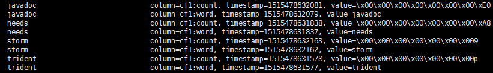
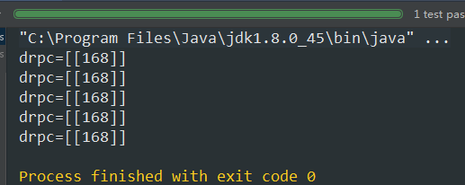
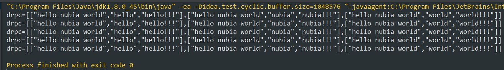
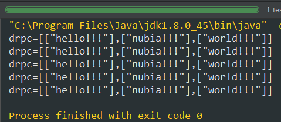

# HBase

**业务目标：使用drpc远程获取集群环境中的hbase表内容**

##  检查hbase表

### 操作复习

```sql
cd $HBASE_HOME
使用root账户执行
bin/hbase shell
--创建表（表名，列簇）
create 'STORM_TEST.TEST','cf1'
--查看表结构
describe 'STORM_TEST.TEST'
--查看表数据
scan 'STORM_TEST.TEST'
--插入数据（在001的行键位置插入两个列，word列的值为nubia，count列的值为20）
put 'STORM_TEST.TEST','001','cf1:word','nubia'
put 'STORM_TEST.TEST','001','cf1:count',20
--删除表，需要两步操作
disable 'STORM_TEST.TEST'
drop 'STORM_TEST.TEST'
--shell中删除错误字符：ctrl+spase+backspace
--创建Hive->HBase映射表
CREATE TABLE IF NOT EXISTS niustat_test_nubia_com.hbase_test(
word string,
cou bigint
)
STORED BY 'org.apache.hadoop.hive.hbase.HBaseStorageHandler'
WITH SERDEPROPERTIES 
("hbase.columns.mapping"=":key,cf1:count")
TBLPROPERTIES ("hbase.table.name" = "NIUSTAT_TEST_NUBIA_COM.HBASE_TEST");
```

## 设计storm拓扑

### pom依赖

引入hbase包，主要是因为涉及到数据库操作，可能会使用事务，使用storm-hbase包能够帮助省事。

```xml
<dependency>
  <groupId>org.apache.storm</groupId>
  <artifactId>storm-hbase</artifactId>
  <version>${storm.version}</version>
</dependency>
<dependency>
  <groupId>org.apache.storm</groupId>
  <artifactId>storm-core</artifactId>
  <version>${storm.version}</version>
  <!--storm-core.jar中存在yam文件，如果提交到集群，会和集群的yam文件冲突，所以要去掉-->
  <!--本地调试的时候，屏蔽掉scope，等打包部署的时候再放开-->
  <!--<scope>provided</scope>-->
</dependency>
```

### hbase状态设置

```java
StateFactory factory = HbaseFactory.getOptionsConf();
TridentState state = topology.newStaticState(factory);
```

1. 创建HbaseFactory，配置Hbase所需要的各种配置；
2. 根据工厂创建hbase状态，用于持久化操作；

```java
public class HbaseFactory {
    public static StateFactory getOptionsConf(){
        //展示了hbase中表的一行数据的结构，
        TridentHBaseMapper tridentHBaseMapper = new SimpleTridentHBaseMapper()
                .withColumnFamily("cf1")
                .withColumnFields(new Fields("word"))
                .withCounterFields(new Fields("count"))
                .withRowKeyField("word");

        HBaseValueMapper rowToStormValueMapper = new WordCountValueMapper();

        HBaseProjectionCriteria projectionCriteria = new HBaseProjectionCriteria();
        projectionCriteria.addColumn(new HBaseProjectionCriteria.ColumnMetaData("cf1", "count"));
        //从topology的config中取出hbase配置项
        HBaseState.Options options = new HBaseState.Options()
                .withConfigKey("HBCONFIG")
                .withDurability(Durability.SYNC_WAL)
                .withMapper(tridentHBaseMapper)
                .withProjectionCriteria(projectionCriteria)
                .withRowToStormValueMapper(rowToStormValueMapper)
                .withTableName("STORM_TEST.TEST");
        return new HBaseStateFactory(options);
    }
}
```

### 创建写入拓扑

将wordcount写入到hbase中

```java
public class WordCountTrident {
    private static StormTopology buildTopology(){
        Fields fields = new Fields("word", "count");
        FixedBatchSpout spout = new FixedBatchSpout(fields, 1,
                new Values("storm", 1),
                new Values("trident", 2),
                new Values("needs", 3),
                new Values("javadoc", 4)
        );
        spout.setCycle(true);

        StateFactory factory = HbaseFactory.getOptionsConf();

        TridentTopology topology = new TridentTopology();
        //普通流，Spout直接存入数据到hbase
        topology.newStream("spout1", spout)
                .partitionPersist(factory, fields,  new HBaseUpdater(), new Fields());
        return topology.build();
    }
    public static void main(String[] args) throws Exception {
        Config conf = new Config();
        conf.setMaxSpoutPending(5);
        String topoName = "hbase-wordCounter";
        //将hbase配置项放入到topology的config中
        Map<String, String> HBConfig = new HashMap<>();
        HBConfig.put("hbase.rootdir", CommonUtil.HBASE_ROOT_DIR);
        HBConfig.put("hbase.zookeeper.quorum",CommonUtil.ZOOKEEPER_HOST);
        conf.put("HBCONFIG",HBConfig);
        //storm模式选择
        SubmitUtil.localTest(conf,topoName, buildTopology());
        //SubmitUtil.clusterSubmit(conf,topoName, localDrpcTopology());
        //SubmitUtil.clienttoServer(conf,topoName, localDrpcTopology());
    }
}
```

写入过程直接使用了HBaseUpdater类，然后main函数中使用了三种提交拓扑的方案，本地运行、打为jar包、本地提交jar到集群。

注意：当写入的时候，如果本来是写入count列是String类型或者Integer类型，后来使用Counter工具，写入了Long型，那么很容易报错，因为代码中列的数据类型和表之前不一致，会报错误：Attempted to increment field that isn't 64 bits wide。就是说增长类型不是64字节的long结构。

最终的hbase效果是：



### 创建读取拓扑

1. 创建本地拓扑，用于测试drpc数据；
2. 创建集群拓扑，用于集群drpc功能；

之所以有两种拓扑，是因为有两种写法

```java
public class DrpcTrident {
    public static StormTopology localDrpcTopology(LocalDRPC drpc){

        StateFactory factory = HbaseFactory.getOptionsConf();

        TridentTopology topology = new TridentTopology();

        TridentState state = topology.newStaticState(factory);
        //drpc流，用于查询hbase
        topology.newDRPCStream("drpc-test",drpc)
                .each(new Fields("args"),new wordSplit(),new Fields("word"))
                .groupBy(new Fields("word"))
                .stateQuery(state,new Fields("word"),new HBaseQuery(), new Fields("columnName","columnValue"))
                .each(new Fields("word","columnValue"),new ReportFunction(), new Fields());
        return topology.build();
    }
    public static StormTopology remotoDrpcTopology(){
        StateFactory factory = HbaseFactory.getOptionsConf();

        TridentTopology topology = new TridentTopology();
        TridentState state = topology.newStaticState(factory);

        //drpc流，用于查询hbase
        topology.newDRPCStream("drpc-test")
                .each(new Fields("args"),new wordSplit(),new Fields("word"))
                .groupBy(new Fields("word"))
                .stateQuery(state,new Fields("word"),new HBaseQuery(), new Fields("columnName","columnValue"))
                //.each(new Fields("word","columnValue"),new ReportFunction(), new Fields());
                .each(new Fields("columnValue"), new FilterNull())
                .aggregate(new Fields("columnValue"), new Sum(), new Fields("sum"));
        return topology.build();
    }
}
```

localDrpcTopology方法需要传入LocalDRPC对象，但是在集群环境，拓扑是不应该有入参的，所以是另外一种写法，即remotoDrpcTopology方法。

### 提交拓扑

```java
public class DrpcOpt {
    public static void main(String[] args) throws Exception {
        DrpcOpt drpcOpt = new DrpcOpt();
        Config config = new Config();
        //将hbase配置项放入到topology的config中
        Map<String, String> HBConfig = new HashMap<>();
        HBConfig.put("hbase.rootdir", CommonUtil.HBASE_ROOT_DIR);
        HBConfig.put("hbase.zookeeper.quorum",CommonUtil.ZOOKEEPER_HOST);
        config.put("HBCONFIG",HBConfig);
        //选择模式
        //drpcOpt.localDRPC(config);
        drpcOpt.remotoDRPC(config);

    }
    private void localDRPC(Config config) throws Exception {
        LocalDRPC drpc = new LocalDRPC();
        SubmitUtil.localTest(config,"drpc",DrpcTrident.localDrpcTopology(drpc));
        for (int i =0;i<5;i++){
            System.out.println("drpc="+drpc.execute("drpc-test","storm trident"));
        }
        drpc.shutdown();
    }
    private void remotoDRPC(Config config) throws Exception {
        config.put(Config.DRPC_SERVERS, Collections.singletonList("10.206.19.181"));
        SubmitUtil.clienttoServer(config,"drpc",DrpcTrident.remotoDrpcTopology());
    }
}
```

提交DRPC类型拓扑时，也包含两种方式：

1. 本地方式，将drpc拓扑在本地运行，然后在本地使用LocalDRPC模式DRPC请求；
2. 集群方式，将drpc的服务所在的集群中节点的地址放入到Config中，然后打包上传；

### 测试集群的的drpc

为了将drpc和拓扑的提交隔离，因此另外写一个测试方法

官网说明使用以下代码就能够实现远程访问：

```java
DRPCClient client = new DRPCClient("drpc.server.location", 3772);
System.out.println(client.execute("words", "cat dog the man");
// prints the JSON-encoded result, e.g.: "[[5078]]"
```

> 参考：[apache-storm:Trident Tutorial](http://storm.apache.org/releases/current/Trident-tutorial.html)

但是只要这么写了是肯定报错的，报错如下：

```java
Exception in thread "main" java.lang.RuntimeException: java.lang.NullPointerException
	at org.apache.storm.security.auth.AuthUtils.GetTransportPlugin(AuthUtils.java:267)
	at org.apache.storm.security.auth.ThriftClient.reconnect(ThriftClient.java:88)
	at org.apache.storm.security.auth.ThriftClient.<init>(ThriftClient.java:69)
	at org.apache.storm.utils.DRPCClient.<init>(DRPCClient.java:44)
	at org.apache.storm.utils.DRPCClient.<init>(DRPCClient.java:39)
  ...
```

百度发现在stackoverflow上有对这个问题的解答：

有人说加入以下代码(貌似是满意回答)：

```java
Config conf = new Config();
conf.setDebug(false);
conf.put("storm.thrift.transport", "backtype.storm.security.auth.SimpleTransportPlugin");
conf.put(Config.STORM_NIMBUS_RETRY_TIMES, 3);
conf.put(Config.STORM_NIMBUS_RETRY_INTERVAL, 10);
conf.put(Config.STORM_NIMBUS_RETRY_INTERVAL_CEILING, 20);
conf.put(Config.DRPC_MAX_BUFFER_SIZE, 1048576);
```

但是我们知道这里的SimpleTransportPlugin是已经弃用的，而且Config.DRPC_MAX_BUFFER_SIZE也是弃用，因此为了代码的简洁性我们采用另外一个人的答案：

```java
Config config = new Config();
Map defaultConfig = Utils.readDefaultConfig();
config.putAll(defaultConfig);
```

于是远程测试的方式是：

```java
@Test
public void testDRPC() throws Exception {
  Config config = new Config();
  Map defaultConfig = Utils.readDefaultConfig();
  config.putAll(defaultConfig);
  DRPCClient client = new DRPCClient(config,"10.206.19.181", 3772);
  for (int i =0;i<5;i++){
    System.out.println("drpc="+client.execute("drpc-test", "needs"));
  }
}
```

> 参考：[apache-storm:Trident Tutorial](https://stackoverflow.com/questions/34427290/storm-0-10-0-how-to-create-the-drpc-remote-client)

最终效果：



# 拓扑类型比较

## 组件式

```java
private static TopologyBuilder generalDrpcTopology() {
  TopologyBuilder builder = new TopologyBuilder();
  DRPCSpout drpcSpout = new DRPCSpout(Constant.DRPC_NAME);
  SplitBolt splitBolt = new SplitBolt();
  ReturnResults returnResults = new ReturnResults();
  builder.setSpout("drpc", drpcSpout);
  builder.setBolt("split", splitBolt).noneGrouping("drpc");
  builder.setBolt("return", returnResults).noneGrouping("split");
  return builder;
}
```

这种类型的拓扑是以TopologyBuilder类的对象作为开端，然后将Spout、Bolt像组件一样用set方法拼装起来。

### 注意

1. drpcSpout的outPut的tuple是args和return-info两个字段，对于Bolt组件来说，是会自定义处理一个tuple，一般情况下是要对自己需要的args字段处理之后进行emit操作，而忽略了return-info字段，例如以下代码是我们经常犯的错误：

```java
public void execute(Tuple input) {
  String word = input.getStringByField("args");
  _collector.emit(new Values(word));
}
```

这个时候的return-info就丢失了，那么drpc的信息就无法向拓扑的其他Bolt传递了，也就无法在客户端进行drpc查询。

2. 分组的作用，有时候没有明确的分组意向，但是为什么还会有随机分组（Shuffle grouping），不分组（None grouping）这样的存在，不使用就好了，例如以下代码是我们认为很简洁的方式：

```java
private static TopologyBuilder generalDrpcTopology() {
  TopologyBuilder builder = new TopologyBuilder();
  DRPCSpout drpcSpout = new DRPCSpout(Constant.DRPC_NAME);
  SplitBolt splitBolt = new SplitBolt();
  ReturnResults returnResults = new ReturnResults();
  builder.setSpout("drpc", drpcSpout);
  builder.setBolt("split", splitBolt);
  builder.setBolt("return", returnResults);
  return builder;
}
```

数据流源头来自drpc客户端，drpcSpout接收后传递tuple("args","return-info")给splitBolt，splitBolt接收并处理后传递tuple("word","return-info")给returnResults，returnResults则解析return-info值传递给drpc客户端。能够实现tuple树的完整性。但是不写分组方式，则报错，通过断点的形式发现，splitBolt和returnResults根本没有接收到数据。在Task.getOutgoingTasks方法中对于数据的去向有个明确的描述，它返回了目标task对象，我们知道一个task对应着一个组件。因此，**分组的作用在于定义了在Bolt的task之间如何分配数据流。保证数据tuple树的完整性**。

## 流式

```java
private static TridentTopology tridentDrpcTopology() {
  TridentTopology topology = new TridentTopology();
  //实现流式计算
  topology.newDRPCStream(Constant.DRPC_NAME)
    .each(new Fields("args"), new Split(), new Fields("word"))
    .each(new Fields("word"),new Exclamation(),new Fields("excWord"))
    .project(new Fields("excWord"));
  return topology;
}
```

这种类型的拓扑是以TridentTopology类的对象作为开端，然后以类似java8的形式进行流式连接，连接方式就是map、reduce之类的函数了。

在java8中我们知道有一些常用的函数式接口：

| 函数式接口         | 函数描述符      |
| ------------- | ---------- |
| Predicate<T>  | T->boolean |
| Consumer<T>   | T->void    |
| Function<T,R> | T->R       |
| ...           | ...        |

比如map()就是一个函数转化功能，将一种类型的数据T转化为另一种R。在storm的流式拓扑中也能看到这样的函数式接口（trident.Stream类中）。

流式拓扑中将数据转化做的更加通俗易懂，不用像组件式拓扑那样深入到Spout/Bolt代码中才能看清楚input和output是什么。格式一般都是:
$$
streamFuc(oldFields, operation, newFields)
$$
其中operation也如java8函数接口那样有几种类型，这里稍微举例：

| 操作名称   | 函数式接口      | 说明                  |
| ------ | ---------- | ------------------- |
| each   | Function   | 增强了功能，将input也带上一起输出 |
| peek   | Consumer   | 用Consumer类型的动作消费一个流 |
| reduce | BiFunction | 双转化，(T,T)->T        |
| ...    | ...        | ...                 |

这种函数式编程方式使流式拓扑清晰易懂，且不用显式地注明流式怎么分组的，因为流本身就已经有了类似有向图这样的引导。

### 注意

在流式拓扑中的函数式接口虽然大体上和java8类似，但是经过封装后的操作则可能变化很大，比如each操作，虽然是使用了Function函数式接口，但是在输出时却带上了输入值。这就会对我们造成一定的影响，因此哪些值需要，哪些值不需要一定要判断清楚。

例如定义了一个拓扑：

```java
private static TridentTopology tridentDrpcTopology() {
  TridentTopology topology = new TridentTopology();
  //实现流式计算
  topology.newDRPCStream(Constant.DRPC_NAME)
    .each(new Fields("args"), new Split(), new Fields("word"))
    .each(new Fields("word"),new Exclamation(),new Fields("excWord"));
  return topology;
}
```

Split是将args字符串按照空格分组，Exclamation是给word添加三个感叹号。也就是说这个拓扑是将drpc客户端传入的字符串进行分割成单词后带上感叹号输出给drpc客户端。结果如下：



可以看到，将原有的hello nubia world也同时输出了，使用project函数可以只输出自己想要的字段：

```java
private static TridentTopology tridentDrpcTopology() {
  TridentTopology topology = new TridentTopology();
  //实现流式计算
  topology.newDRPCStream(Constant.DRPC_NAME)
    .each(new Fields("args"), new Split(), new Fields("word"))
    .each(new Fields("word"),new Exclamation(),new Fields("excWord"))
    .project(new Fields("excWord"));
  return topology;
}
```

则结果如下：



# 状态

状态定义：仅处理一次、快速、持续聚合，即有状态的数据。决定了Trident的计算结果将被如何提交，如何保存，如何更新等等的一套方案。

## State


## StateMap

StateMap是在State的基础上进行更高层次的抽象，让用户更加轻松的使用三种不同类型的事务。

通过比较State和StateMap中使用到的Mapper，发现jar中给出的例子SimpleTridentHBaseMapper的功能远比SimpleTridentHBaseMapMapper类丰富。在SimpleTridentHBaseMapper中可以设置多列，但是在SimpleTridentHBaseMapMapper中却只能设置一个列。原因是什么呢？

这主要是由于State和StateMap中的写入方法引起的，HBaseState中使用`updateState(List<TridentTuple> tuples, TridentCollector collector)`方法进行写入，注意传入的参数是tuples；而HBaseMapState中使用`multiPut(List<List<Object>> keys, List<T> values)`方法进行写入，注意传入的参数是key-value。tuples能够表达的内容远比key-value多，毕竟tuples是对象。因此这就注定了HBaseMapState只能处理单个列。