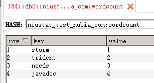

# redis集成

## 复习redis命令

```bash
# 查看redis进程号，确认当前环境有redis服务
ps -ef|grep redis
# 显示结果，可以看到有代表集群的节点位置
[pengxx@emr-worker-2 ~]$ ps -ef|grep redis
root      1992     1  0  2017 ?        00:23:28 redis-server 10.206.19.184:7000 [cluster]
root      1994     1  0  2017 ?        00:18:49 redis-server 10.206.19.184:7001 [cluster]
pengxx   23081 23061  0 10:59 pts/0    00:00:00 grep redis
# 启动redis客户端
redis-cli -c -p 7000
# 显示结果
[pengxx@emr-worker-2 ~]$ redis-cli -c -p 7000
127.0.0.1:7000> 
# 获取hash结果
hget "niustat_test_nubia_com.wordcount"
# 从hash类型的key中取值吗，key为“niustat_test_nubia_com:wordcount”，value是hash结构，因此要传入获取的字段名，即这个value值hash结构key。
10.206.19.185:7001> hget niustat_test_nubia_com:wordcount storm
-> Redirected to slot [12993] located at 10.206.19.185:7002
"1"

```

在redis软件中也能看到这样的hash结构


## MapState

在MapState中有multiPut和multiUpdate方法，这两个方法的区别在于multiPut是用于覆盖原值，而multiUpdate用于将原有值与现有tuple的值进行合并后再覆盖。

multiUpdate主要应用场景是需要对redis进行更新，例如聚合操作的Sum、Count，这两个函数都是storm已经实现了的，但是我们需要考虑的是，没有实现的

## redis update

就storm-redis.jar中的目录结构来看，并没有实现关于MapState类的query和update，只有State类的query和update。对于MapState而言，其query可以直接用MapGet类来实现查询，但是显然update却没有地方实现。

难道MapState类没有对redis的直接写入和更新吗？

### MapState的put

这个put是一种覆盖原值的意思，redis包中没有实现该方法，需要手动实现，也就是调用MapState的multiPut方法。其次仅仅使用partitionPersist来实现写入，也就是要实现StateUpdater类

```java
public class MapPut extends BaseStateUpdater<MapState<Object>> {
    private String keyField;
    private String valueField;
    public MapPut(String keyField,String valueField){
        this.keyField = keyField;
        this.valueField = valueField;
    }
    @Override
    public void updateState(MapState<Object> state, List<TridentTuple> tuples, TridentCollector collector) {
        List<List<Object>> keyList = new ArrayList<>();
        List<Object> keys = new ArrayList<>();
        List<Object> values = new ArrayList<>();
        for( TridentTuple tuple : tuples ) {
            Object key = tuple.getValueByField(keyField);
            Object value = tuple.getValueByField(valueField);
            keys.add(key);
            values.add(value);
        }
        keyList.add(keys);
        state.multiPut(keyList,values);
    }
}
```

MapPut实际上就是继承了StateUpdater类。其中的key和value都是以Object类型，这就意味着可以往redis中存各种类型，jedis最终都以字符串的形式写入（必须考虑该Object是否能够转义为字符串）。

它的写入结果为：



命令行查看结果为：

```bash
185:7002> hget niustat_test_nubia_com:wordcount needs
"3"
```

但是如果用另外一种写入方式，即替换MapPut中的部分代码：

```java
Object key = String.valueOf(tuple.getValueByField(keyField));
Object value = String.valueOf(tuple.getValueByField(valueField));
```

这时的写入就会是如下结果：


命令行查看结果为：

```bash
185:7000> hget niustat_test_nubia_com:wordcount needs
"\"3\""
```

可以发现这两种方式虽然最后都是由redis写入字符串，但是结果明显不同，第二种方式，会多出一对引号，这对于后续的转义是不利的。因此推荐第一种写法。


然后在其updateState方法中调用了MapState的multiPut方法。

```java
.partitionPersist(stateFactory.getFactory(), mySpout.fields, new MapPut("word","count"));
```

即可实现MapState的写入。

### MapState的update

这个update是更新原值的意思，那么更新方式就是需要考虑的，例如计数的count、求和的sum等。也就是调用MapState的multiUpdate方法。其次使用partitionPersist来实现写入，也同样要实现StateUpdater类。为了方便，这里直接使用现有的update方案

```java
.partitionPersist(stateFactory.getFactory(), mySpout.fields, new MapUpdate("word","count"));
```

可以分析MapUpdate类的作用

```java
public class MapUpdate extends BaseStateUpdater<MapState<Object>> {
    private ValueUpdater updater;
    private String keyField;
    private String valueField;
    public MapUpdate(String keyField,String valueField){
        Sum sumOpt = new Sum();
        this.updater = new NubiaCombinerValueUpdater(sumOpt,1L);
        //this.updater = updater;
        this.keyField = keyField;
        this.valueField = valueField;
    }
    @Override
    public void updateState(MapState<Object> state, List<TridentTuple> tuples, TridentCollector collector) {
        List<List<Object>> keyList = new ArrayList<>();
        List<Object> keys = new ArrayList<>();
        for( TridentTuple tuple : tuples ) {
            Object key = String.valueOf(tuple.getValueByField(keyField));
            keys.add(key);
        }
        keyList.add(keys);
        List<ValueUpdater> valueUpdaters = new ArrayList<>(keyList.size());
        for (int i=0;i<keyList.size();i++){
            valueUpdaters.add(updater);
        }
        state.multiUpdate(keyList,valueUpdaters);
    }
}
```

其中最主要的是updateState方法，该方法中使用了ValueUpdater类（这里使用Sum类）来做更新操作。但是如果使用默认的一些ValueUpdater类在运行的时候发现报错：

```java
Caused by: java.io.NotSerializableException: org.apache.storm.trident.state.CombinerValueUpdater
```

也就是说ValueUpdater不是继承了Serializable类，同样需要自己实现。

```java
public class NubiaCombinerValueUpdater implements ValueUpdater<Object>,Serializable {
    Object arg;
    CombinerAggregator agg;
    public NubiaCombinerValueUpdater(CombinerAggregator agg, Object arg) {
        this.agg = agg;
        this.arg = arg;
    }
    @Override
    public Object update(Object stored) {
        if(stored==null) return arg;
        else return agg.combine(stored, arg);
    }
}
```

这里就是让CombinerValueUpdater实现Serializable类，然后再次使用的时候，发现在multiUpdate方法中，有multiGet方法获取到了value值，然后使用Sum求和的时候出现问题是，这个value值是字符串。因此对于update方法要进行稍微改动一番：

```java
public Object update(Object stored) {
  if(stored==null) return arg;
  else return agg.combine((long)stored,arg);
}
```

也就是将multiGet拿到的stored值进行类型转化为long型以匹配Sum类的combine方法。

此处的例子要阐述的是，multiUpdate方法是可以自定义实现的，虽然以上的Sum类采用persistentAggregate方法来做似乎更简单，就是以下的代码：

```java
.persistentAggregate(stateFactory.getFactory(),new Fields("count","word"), new Sum(),new Fields("sum"));
```

但是，实现MapUpdate给我们的启发是，ValueUpdate类可以自定义实现，尤其是在一些复杂的（除了count、sum）逻辑中，实现自定义的ValueUpdate也就更加有意义。

## 数据类型

对于RedisClusterMapState类或者RedisClusterStateUpdater和RedisClusterStateQuerier类中都可以发现，集群模式下的redis似乎只支持String和Hash类型的读写，因此业务上如果需要对key进行封装时则需要考虑以下的情况：

```java
case STRING:
for (Map.Entry<String, String> kvEntry : keyValues.entrySet()) {
  if(this.options.expireIntervalSec > 0){
    jedisCluster.setex(kvEntry.getKey(), this.options.expireIntervalSec, kvEntry.getValue());
  } else {
    jedisCluster.set(kvEntry.getKey(), kvEntry.getValue());
  }
}
break;
case HASH:
jedisCluster.hmset(description.getAdditionalKey(), keyValues);
if (this.options.expireIntervalSec > 0) {
  jedisCluster.expire(description.getAdditionalKey(), this.options.expireIntervalSec);
}
break;
```

代码中Hash类型是对key有个前缀，这个前缀可以这么定义：

```java
dataTypeDescription = new RedisDataTypeDescription(RedisDataTypeDescription.RedisDataType.HASH, this.key);
```

此处传入的key就是additionlKey，可以发现对于String类型的值是不能为其封装key，因此必须要在业务层对key进行封装。

但是明显可以感觉到的是String类型更加好用些，即数据在集群上分布的更加均匀。而Hash类型的值则可能仅仅存在一个节点上，原因是对于一个明确的key来说，redis只会把它分配到一个节点上。特别是对于storm，当使用Hash数据结构时应该格外小心，避免节点产生热点。

因此对MapPut类稍作改造：

```java
public class MapPut extends BaseStateUpdater<MapState<Object>> {
    private String keyField;
    private String valueField;
    private DataType dataType;

    public MapPut(String keyField, String valueField, NubiaRedisStateFactory stateFactory) {
        this.keyField = keyField;
        this.valueField = valueField;
        this.dataType = stateFactory.getRedisDataType();
    }
    @Override
    public void updateState(MapState<Object> state, List<TridentTuple> tuples, TridentCollector collector) {
        List<List<Object>> keyList = new ArrayList<>();
        List<Object> keys = new ArrayList<>();
        List<Object> values = new ArrayList<>();
        for (TridentTuple tuple : tuples) {
            Object key;
            if (dataType == DataType.STRING) {
                key = Constant.DO_AS_USER + ":" + tuple.getValueByField(keyField);
            } else if (dataType == DataType.HASH) {
                key = tuple.getValueByField(keyField);
            } else {
                throw new RuntimeException("No support redis data type: " + dataType);
            }
            Object value = tuple.getValueByField(valueField);
            keys.add(key);
            values.add(value);
        }
        keyList.add(keys);
        state.multiPut(keyList, values);
    }
}
```

如果使用了DRPC，则也需要稍微改造一番，让使用者感觉不到这种封装：

```java
public static TridentTopology newDRPCMapStream(TridentTopology topology, TridentState state,NubiaRedisStateFactory stateFactory) {
  String drpcName = Constant.DRPC_NAME;
  DataType dataType = stateFactory.getRedisDataType();
  topology.newDRPCStream(drpcName)
    .each(new Fields("args"), new FilterNull())
    .each(new Fields("args"), new Split(), new Fields("key"))
    .each(new Fields("key"),new KeyTransformation(dataType),new Fields("newKey"))
    .groupBy(new Fields("newKey"))
    .stateQuery(state, new Fields("newKey"), new MapGet(), new Fields("value"))
    .project(new Fields("key","value"));
  return topology;
}
```

其中的KeyTransformation类就是将用户输入的key进行转化：

```java
public class KeyTransformation extends BaseFunction {
    private boolean doTransform;
    public KeyTransformation(DataType dataType){
        if (dataType == DataType.STRING){
            doTransform = true;
        }else if(dataType == DataType.HASH) {
            doTransform = false;
        }else {
            throw new RuntimeException("No support redis data type: " + dataType);
        }
    }
    @Override
    public void execute(TridentTuple tuple, TridentCollector collector) {
        String key = tuple.getString(0);
        if (doTransform){
            String newKey = Constant.DO_AS_USER+":"+key;
            collector.emit(new Values(newKey));
        }else {
            collector.emit(new Values(key));
        }
    }
}
```

