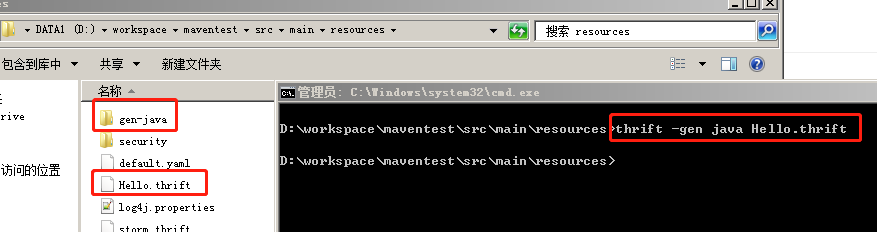
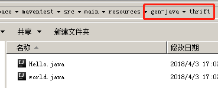
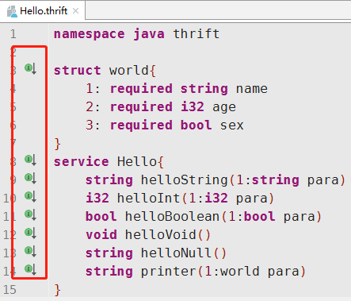
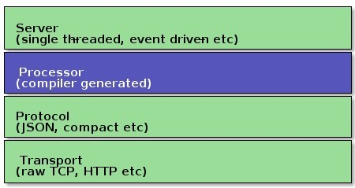
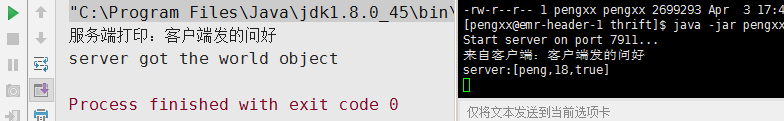

本文主要是对Thrift学习的一些总结，主要讲述了Thrift的开发、基本数据类型服务类型的介绍，然后会通过两个例子来学习如何使用Thrift进行开发，同时会介绍Thrift在大数据框架方面的应用。

# Thrift 介绍

Apache Thrift 是由 Facebook 开发的一种远程服务调用（RPC Remote Procedure Call）的框架。下面应用官网的一句话对其进行介绍：

```
The Apache Thrift software framework, for scalable cross-language services development, combines a software stack with a code generation engine to build services that work efficiently and seamlessly between C++, Java, Python, PHP, Ruby, Erlang, Perl, Haskell, C#, Cocoa, JavaScript, Node.js, Smalltalk, OCaml and Delphi and other languages.
```

简而言之，Thrift是一种支持多语言的软件框架，在各个服务之间的RPC通信领域应用非常广泛。**RPC**（远程过程调用）是一个计算机通信协议，该协议允许运行于一台计算机的程序调用另一台计算机的子程序，而程序员无需额外地为这个交互作用编程。

Thrift通过一个中间语言(IDL, 接口定义语言)来定义RPC的接口和数据类型，然后通过一个编译器生成不同语言的代码（目前支持C++,Java, Python, PHP, Ruby, Erlang, Perl, Haskell, C#, Cocoa, Smalltalk和OCaml）,并由生成的代码负责RPC协议层和传输层的实现。

# Thrift 安装

网上有很多Thrift安装的例子，即使用yum安装方法：

```shell
#安装
$ sudo yum install thrift
#查看版本
$ thrift -version
# Output： Thrift version 0.9.1
```

但是如果是要在windows机器上开发，那么其实也可以安装到windows中。[点击此处下载](http://thrift.apache.org/download)

但是如果根据官网的指引，发现要安装很多的与C++相关的辅助包。因此本文采用一种windows下快速安装方法。

1.  将官网上下载的压缩包的exe文件解压到放到【C:\Program Files\Thrift】目录下，并将名字改为【thrift.exe】。注：这里改名只是为了敲命令行方便。
2.  将目录【C:\Program Files\Thrift】添加到环境变量即可。

到此thrift安装完成。

# Thrift 数据类型

使用Thrift时，涉及到了`.thrift`文件（也就是服务）的编写，因此，需要了解一下Thrift Types，它包含了基本类型，自定义的结构体，容器，异常等。

## 基本类型（Base Types）

-   bool: 布尔变量（A boolean value, one byte）；
-   byte: 8位有符号整数（A signed byte）；
-   i16: 16位有符号整数（A 16-bit signed integer）；
-   i32: 32位有符号整数（A 32-bit signed integer）；
-   i64: 64位有符号整数（A 64-bit signed integer）；
-   double: 64位浮点数（A 64-bit floating point number）；
-   binary: byte数组（A byte array）；
-   string: 字符串（Encoding agnostic text or binary string）；

*注：thrift不支持无符号整数类型，因为很多编程语言不存在无符号类型，比如java*

## 容器类型（Containers）

-   list: 一系列由T类型的数据组成的有序列表，元素可以重复；
-   set: 一系列由T类型的数据组成的无序集合，元素不可重复
-   map: 一个字典结构，key为T1类型，value为T2类型；

*Note：这些集合中的元素可以是除了服务的任何Thrift类型（包括结构体和异常）。*

## 结构体（Struct）

结构体中包含一系列的强类型域，等同于无继承的class。可以看出struct写法很类似C语言的结构体。

```thrift
struct Example {
  1:i32 number=10,
  2:i64 bigNumber,
  3:list<double> decimals,
  4:string name="thrifty"
}
```

## 可选与必选

Thrift提供两个关键字`required`，`optional`，分别用于表示对应的字段时必填的还是可选的。例如：

```thrift
struct People {
  1: required string name;
  2: optional i32 age;
}
```

表示name是必填的，age是可选的。

## 联合(Union)

在一个结构体中，如果field之间的关系是互斥的，即**只能有一个field**被使用被赋值。在这种情况下，我们可以使用`union`来声明这个结构体，而不是一堆堆optional的field，语意上也更明确了。例如：

```thrift
union JavaObjectArg {
  1: i32 int_arg;
  2: i64 long_arg;
  3: string string_arg;
  4: bool bool_arg;
  5: binary binary_arg;
  6: double double_arg;
}
```

## 异常(Exceptions)

可以自定义异常类型，所定义的异常会继承对应语言的异常基类，例如java，就会继承 `java.lang.Exception`.

```thrift
exception InvalidOperation {
  1: i32 what,
  2: string why
}
```

## 服务(service)

Thrift定义服务相当于Java中创建Interface一样，创建的service经过代码生成命令之后就会生成客户端和服务端的框架代码。定义形式如下：

```thrift
service Hello{
  string helloString(1:string para)
  i32 helloInt(1:i32 para)
  bool helloBoolean(1:bool para)
  void helloVoid()
  string helloNull()
}
```

## 命名空间(namespace)

Thrift的命名空间相当于Java中的package的意思，主要目的是组织代码。thrift使用关键字namespace定义命名空间，如：

```thrift
namespace service.demo
```

注意末尾不能有分号，由此生成的代码，其包路径结构为`service.demo`.

## 枚举(enum)

枚举的定义形式和Java的Enum定义差不多，例如：

```thrift
enum Sex {
    MALE,
    FEMALE
}
```

# Thrift 传输

### 协议（传输格式）

-   TBinaryProtocol： 二进制格式；
-   TCompactProtocol：高效率的、密集的二进制编码格式进行数据传输；
-   TJSONProtocol：JSON格式；
-   TSimpleJSONProtocol：提供JSON只写协议, 生成的文件很容易通过脚本语言解析；
-   TDebugProtocol：使用易懂的可读的文本格式，以便于debug。

### 传输层（数据传输方式）

-   TSocket：阻塞式socker；
-   TFramedTransport：使用非阻塞方式，以frame为单位进行传输。
-   TFileTransport：以文件形式进行传输。
-   TMemoryTransport：将内存用于I/O. java实现时内部实际使用了简单的ByteArrayOutputStream。
-   TZlibTransport：使用zlib进行压缩， 与其他传输方式联合使用。当前无java实现。
-   TNonblockingTransport —— 使用非阻塞方式，用于构建异步客户端

### 服务模型

-   TSimpleServer：单线程服务器端使用标准的阻塞式 I/O，简单的单线程服务模型，常用于测试；
-   TThreadPoolServer：多线程服务模型，使用标准的阻塞式IO；
-   TNonblockingServer：多线程服务模型，使用非阻塞式IO（需使用TFramedTransport数据传输方式）。

# Thrift 使用

假设要开发java工程，引入Thrift包

```maven
<dependency>
    <groupId>org.apache.thrift</groupId>
    <artifactId>libthrift</artifactId>
    <version>${thrift.version}</version>
</dependency>
```

## Hello World

### 定义元数据文件

Hello.thrift

```thrift
namespace java thrift

struct world{
    1: required string name
    2: required i32 age
    3: required bool sex
}
service Hello{
    string helloString(1:string para)
    i32 helloInt(1:i32 para)
    bool helloBoolean(1:bool para)
    void helloVoid()
    string helloNull()
    string printer(1:world para)
}
```

namespace中要标记为java，表示使用产生java代码

定义了一个结构体和一个服务，对于java来说，将会产生一个world类和一个Hello接口。

```cmd
thrift —gen java hello.thrift
```

结果如图所示：





然后将Hello.java和world.java移动到java项目的thrift代码文件夹下。并删除resources/gen-java目录。如果使用IDEA编译器，且安装了.thrift文件解析器则会发现Hello.thrift文件中的各数据已经被实现：



观察Hello.java发现他实现了服务端和客户端所有代码，对于服务端而言，主要是实现Iface（同步）和AsyncIface（异步）接口；而对于客户端则实现Hello.Client类。

### 定义服务端逻辑

这里以实现Iface接口为例

HelloServiceImpl.java

```java
public class HelloServiceImpl implements Hello.Iface {
    @Override
    public String helloString(String para) throws TException {
        System.out.println("来自客户端：" + para);
        return "服务端打印：" + para;
    }
    @Override
    public int helloInt(int para) throws TException {
        try {
            Thread.sleep(20000);
        } catch (InterruptedException e) {
            e.printStackTrace();
        }
        return para;
    }
    @Override
    public boolean helloBoolean(boolean para) throws TException {
        return para;
    }
    @Override
    public void helloVoid() throws TException {
        System.out.println("Hello World");
    }
    @Override
    public String helloNull() throws TException {
        return null;
    }
    @Override
    public String printer(world para) throws TException {
        System.out.println("server:["+para.name+","+para.age+","+para.sex+"]");
        return "server got the world object";
    }
}
```

### 定义服务端

服务端的定义主要符合网络的流解析、处理过程。Thrift的网络栈如下所示：



-   Transport层提供了一个简单的网络读写抽象层。这使得thrift底层的transport从系统其它部分（如：序列化/反序列化）解耦。Thrift使用ServerTransport接口接受或者创建原始transport对象。正如名字暗示的那样，ServerTransport用在server端，为到来的连接创建Transport对象。
-   Protocol抽象层定义了一种将内存中数据结构映射成可传输格式的机制。换句话说，Protocol定义了datatype怎样使用底层的Transport对自己进行编解码。因此，Protocol的实现要给出编码机制并负责对数据进行序列化。
-   Processor封装了从输入数据流中读数据和向数据数据流中写数据的操作。读写数据流用Protocol对象表示。
-   与服务相关的processor实现由编译器产生。Processor主要工作流程如下：从连接中读取数据（使用输入protocol），将处理授权给handler（由用户实现），最后将结果写到连接上（使用输出protocol）。
-   Server将以上所有特性集成在一起：
    1.  创建一个transport对象
    2.  为transport对象创建输入输出protocol
    3.  基于输入输出protocol创建processor
    4.  等待连接请求并将之交给processor处理

创建HelloServiceServer类

HelloServiceServer.java

```java
public class HelloServiceServer {
    public static void main(String[] args) {
        try {
            // 1.设置服务端口为 7911
            TServerSocket serverTransport = new TServerSocket(7911);
            // 2.设置协议工厂为 TBinaryProtocol.Factory
            TBinaryProtocol.Factory proFactory = new TBinaryProtocol.Factory();
            // 3.关联处理器与 Hello 服务的实现
            TProcessor processor = new Hello.Processor<Hello.Iface>(new HelloServiceImpl());
            // 4.定义server
            TThreadPoolServer.Args args1 = new TThreadPoolServer.Args(serverTransport);
            args1.processor(processor);
            args1.protocolFactory(proFactory);
            // 5.启动server
            TServer server = new TThreadPoolServer(args1);
            System.out.println("Start server on port 7911...");
            server.serve();
        } catch (TTransportException e) {
            e.printStackTrace();
        }
    }
}
```

其中1~4的组件可以选择其他组合方式，如单线程/多线程、阻塞/非阻塞等

### 定义客户端

创建HelloServiceClient类

HelloServiceClient.java

```java
public class HelloServiceClient {
    private static final String REMOTO_HOST = "10.206.19.181";
    public static void main(String[] args) {
        try {
            // 设置调用的服务地址为本地，端口为 7911
            TTransport transport = new TSocket(REMOTO_HOST, 7911);
            transport.open();
            // 设置传输协议为 TBinaryProtocol
            TProtocol protocol = new TBinaryProtocol(transport);
            Hello.Client client = new Hello.Client(protocol);
            String resp = client.helloString("客户端发的问好");
            world person = new world();
            person.name = "peng";
            person.age = 18;
            person.sex = true;
            String printer = client.printer(person);
            System.out.println(resp);
            System.out.println(printer);
            transport.close();
        } catch (TException e) {
            e.printStackTrace();
        }
    }
}
```

例如`client.helloString()`方法是客户端向服务端的`helloString()`方法请求数据。

### 部署

将项目打包，以服务端类的main作为入口放到服务器上；本地则从客户端的main启动，请求结果如下：



## 扩展

thrift在分布式系统中被大量使用，尤其是Apache Storm，其中客户端能够以shell命令->python脚本->Nimbus服务器的控制。大量的命令语句将python和java代码联系起来，而这些控制仅仅使用storm.thrift文件就可以完全定义。


