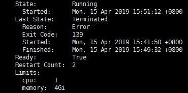

  130.28环境再次出现该问题，问题场景如下：
在将kafka的内存从2GB调整至4GB后，正常运行了5天，在第6天又报了同样的错误。
错误如下：



该错误与上次错误相同，错误返回码是139，该错误。策略仍然是调整内存，继续观察。  

docker的退出码有如下规律（dockerVersion>=1.10）：

- 125： `docker run` 服务报错
- 126：包含的命令执行失败
- 127：找不到执行命令
- 128+n：与系统信号量n有关
  - 130=（128+2） ：来自键盘的终端信号：ctrl+c---SIGINT
  - 137=（128+9） ：来自信号kill---SIGKILL
  - 139=（128+11） ：段非法错误(内存引用无效)---SIGSEGV

SIGSEGV的官方说法是：

```shell
SIGSEGV
Segment Fault. The possible cases of your encountering this error are: 
1.buffer overflow --- usually caused by a pointer reference out of range. 
2.stack overflow --- please keep in mind that the default stack size is 8192K. 
3.illegal file access --- file operations are forbidden on our judge system.
```

从以上的说法来看，主要原因是：缓存溢出/栈溢出/非法文件访问。其中溢出的发生概率较大。而bufferOverflow主要是在读写时的长度越界。对于当前的kafka而言主要是二进制字符串传输，且约束了最大长度，该问题产生的可能性较小。那么最有可能的是StackOverflow。循环太多或者线程数太多，kafka逻辑无复杂循环，因此最大可能是线程数太多造成的。结合2019年1月份的zookeeper出现达到1000客户端连接数来看，kafka的客户端连接数也可能在不断增加。但是当前从重启后的结果（运行了一天7小时）来看，内存使用量均正常。

解决方法：

1. 增加内存至6GB，再次观察；
2. 模拟打流场景，复现该问题（资源问题，暂时无法进行）

Linux系统信号量：

| **信号**    | **取值** | **默认动作** | **含义（发出信号的原因）**             |
| ----------- | -------- | ------------ | -------------------------------------- |
| *SIGHUP*    | 1        | Term         | 终端的挂断或进程死亡                   |
| *SIGINT*    | 2        | Term         | 来自键盘的中断信号                     |
| *SIGQUIT*   | 3        | Core         | 来自键盘的离开信号                     |
| *SIGILL*    | 4        | Core         | 非法指令                               |
| *SIGABRT*   | 6        | Core         | 来自abort的异常信号                    |
| *SIGFPE*    | 8        | Core         | 浮点例外                               |
| *SIGKILL*   | 9        | Term         | 杀死                                   |
| *SIGSEGV*   | 11       | Core         | 段非法错误(内存引用无效)               |
| *SIGPIPE*   | 13       | Term         | 管道损坏：向一个没有读进程的管道写数据 |
| *SIGALRM*   | 14       | Term         | 来自alarm的计时器到时信号              |
| *SIGTERM*   | 15       | Term         | 终止                                   |
| *SIGUSR1*   | 30,10,16 | Term         | 用户自定义信号1                        |
| *SIGUSR2*   | 31,12,17 | Term         | 用户自定义信号2                        |
| *SIGCHLD*   | 20,17,18 | Ign          | 子进程停止或终止                       |
| *SIGCONT*   | 19,18,25 | Cont         | 如果停止，继续执行                     |
| *SIGSTOP*   | 17,19,23 | Stop         | 非来自终端的停止信号                   |
| *SIGTSTP*   | 18,20,24 | Stop         | 来自终端的停止信号                     |
| *SIGTTIN*   | 21,21,26 | Stop         | 后台进程读终端                         |
| *SIGTTOU*   | 22,22,27 | Stop         | 后台进程写终端                         |
|             |          |              |                                        |
| *SIGBUS*    | 10,7,10  | Core         | 总线错误（内存访问错误）               |
| *SIGPOLL*   |          | Term         | Pollable事件发生(Sys V)，与SIGIO同义   |
| *SIGPROF*   | 27,27,29 | Term         | 统计分布图用计时器到时                 |
| *SIGSYS*    | 12,-,12  | Core         | 非法系统调用(SVr4)                     |
| *SIGTRAP*   | 5        | Core         | 跟踪/断点自陷                          |
| *SIGURG*    | 16,23,21 | Ign          | socket紧急信号(4.2BSD)                 |
| *SIGVTALRM* | 26,26,28 | Term         | 虚拟计时器到时(4.2BSD)                 |
| *SIGXCPU*   | 24,24,30 | Core         | 超过CPU时限(4.2BSD)                    |
| *SIGXFSZ*   | 25,25,31 | Core         | 超过文件长度限制(4.2BSD)               |
|             |          |              |                                        |
| *SIGIOT*    | 6        | Core         | IOT自陷，与SIGABRT同义                 |
| *SIGEMT*    | 7,-,7    |              | Term                                   |
| *SIGSTKFLT* | -,16,-   | Term         | 协处理器堆栈错误(不使用)               |
| *SIGIO*     | 23,29,22 | Term         | 描述符上可以进行I/O操作                |
| *SIGCLD*    | -,-,18   | Ign          | 与SIGCHLD同义                          |
| *SIGPWR*    | 29,30,19 | Term         | 电力故障(System V)                     |
| *SIGINFO*   | 29,-,-   |              | 与SIGPWR同义                           |
| *SIGLOST*   | -,-,-    | Term         | 文件锁丢失                             |
| *SIGWINCH*  | 28,28,20 | Ign          | 窗口大小改变(4.3BSD, Sun)              |
| *SIGUNUSED* | -,31,-   | Term         | 未使用信号(will be SIGSYS)             |