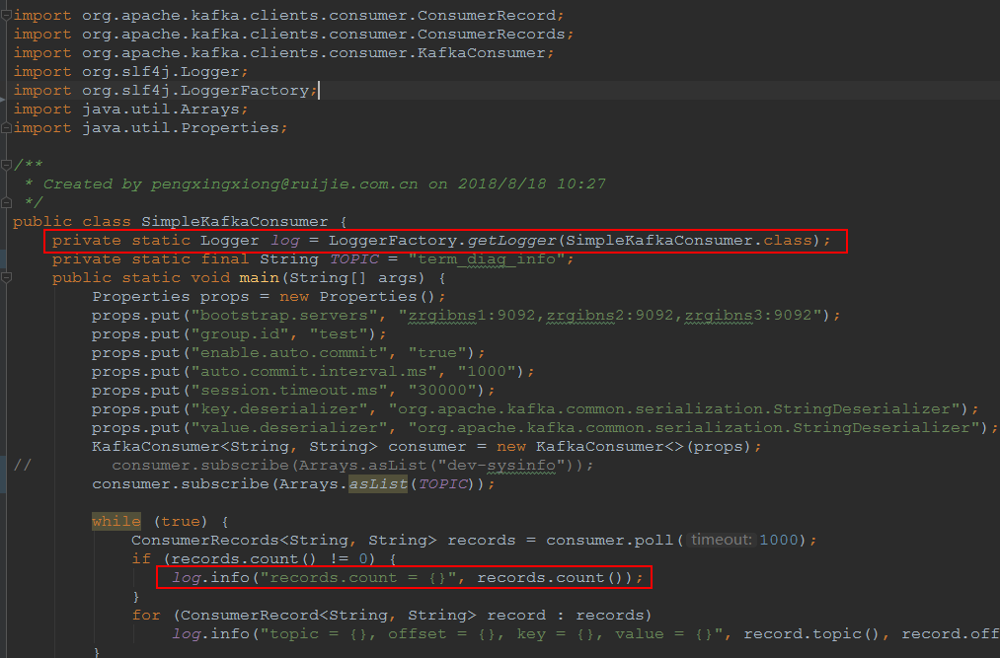
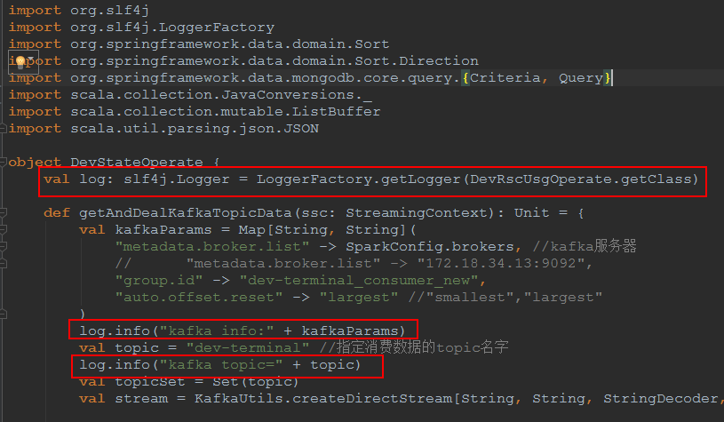

# 修改pom文件

在`<dependencies>`和`</dependencies>`标签中加入以下内容

```xml
<dependency>
  <groupId>org.apache.kafka</groupId>
  <artifactId>kafka-clients</artifactId>
  <version>1.1.1</version>
</dependency>
<dependency>
  <groupId>org.slf4j</groupId>
  <artifactId>slf4j-log4j12</artifactId>
  <version>1.7.25</version>
</dependency>
```

# 配置日志属性文件

在resources目录下配置创建log4j.properties文件，加入以下内容

```properties
log4j.rootLogger = INFO,stdout

### 输出信息到控制抬 ###
log4j.appender.stdout = org.apache.log4j.ConsoleAppender
log4j.appender.stdout.Target = System.out
log4j.appender.stdout.layout = org.apache.log4j.PatternLayout
log4j.appender.stdout.layout.ConversionPattern = %-d{yyyy-MM-dd HH\:mm\:ss} [%p]-%c %m%n
### 输出DEBUG 级别以上的日志到=E://logs/error.log ###
log4j.appender.D = org.apache.log4j.DailyRollingFileAppender
log4j.appender.D.File = E://logs/log.log
log4j.appender.D.Append = true
log4j.appender.D.Threshold = DEBUG
log4j.appender.D.layout = org.apache.log4j.PatternLayout
log4j.appender.D.layout.ConversionPattern = %-d{yyyy-MM-dd HH\:mm\:ss} [%p]-[%c] %m%n
```

首行的`log4j.rootLogger = INFO,stdout`表示输出的最小级别为INFO级别，且使用stdout方式（控制台）输出，这个stdout实际上是下面的配置中提到的stdout（名称可以任意指定）。如果要输出到控制台和文件，则是`log4j.rootLogger = INFO,stdout,D`。

# 使用日志

在需要打印日志的java/scala类中加入如下类似代码（举例）：

java举例：



scala举例：



# 注意

当前ion_center的日志包括了spark本身的日志，却没有业务日志，仅仅使用print的方式打印到控制台，这种方式是无法做到业务信息跟踪的，因此建议使用文件和控制台一起打印日志的方式。打印信息包括当前运行的业务名称，对接的kafka配置和topic，连接的monogodb等信息。这样，当报错时可以方便排错。