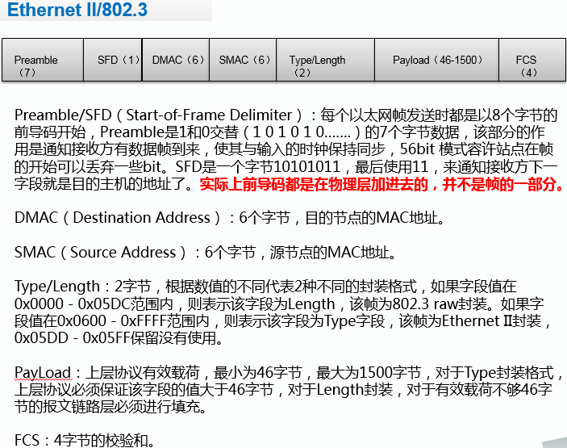
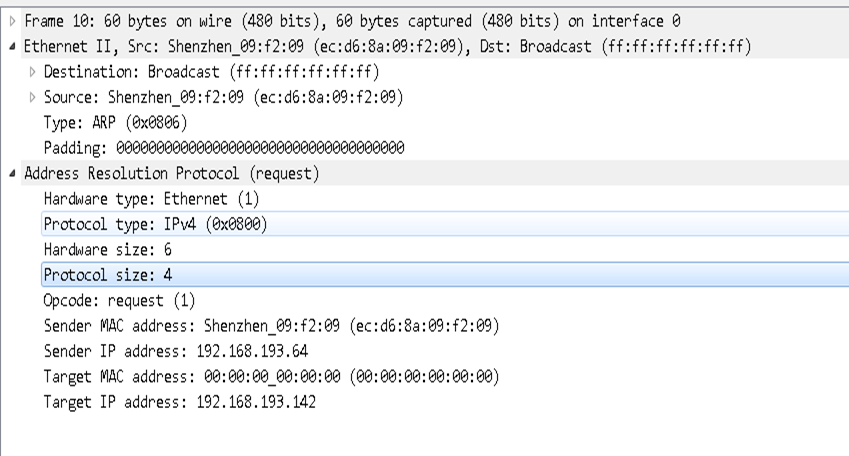
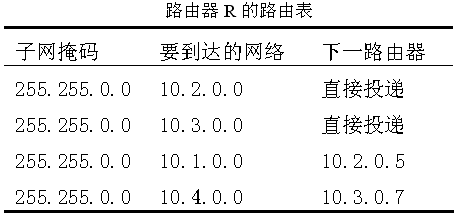
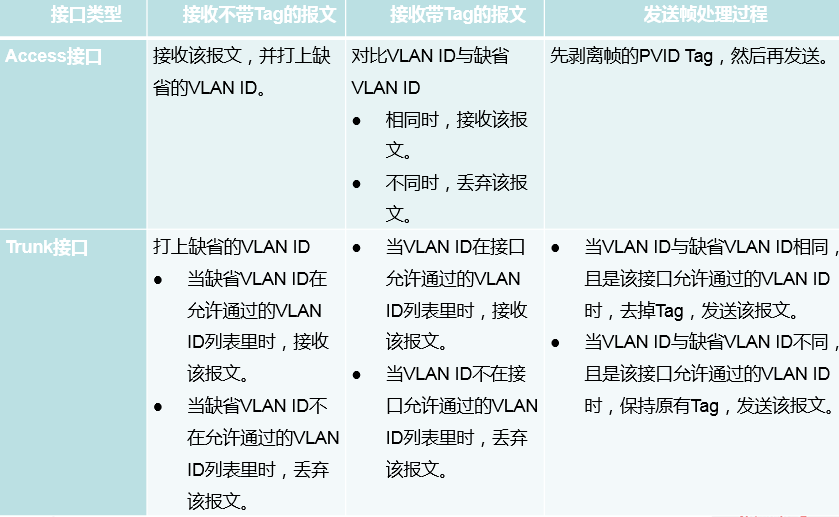
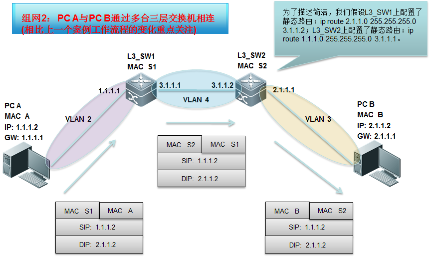
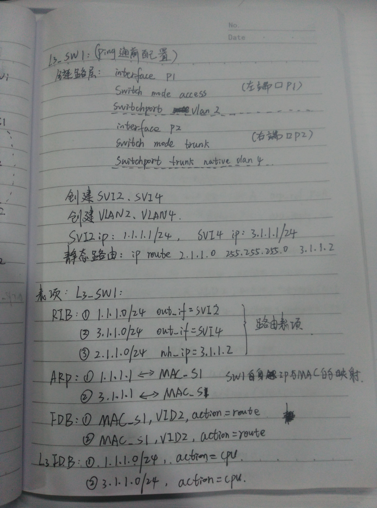
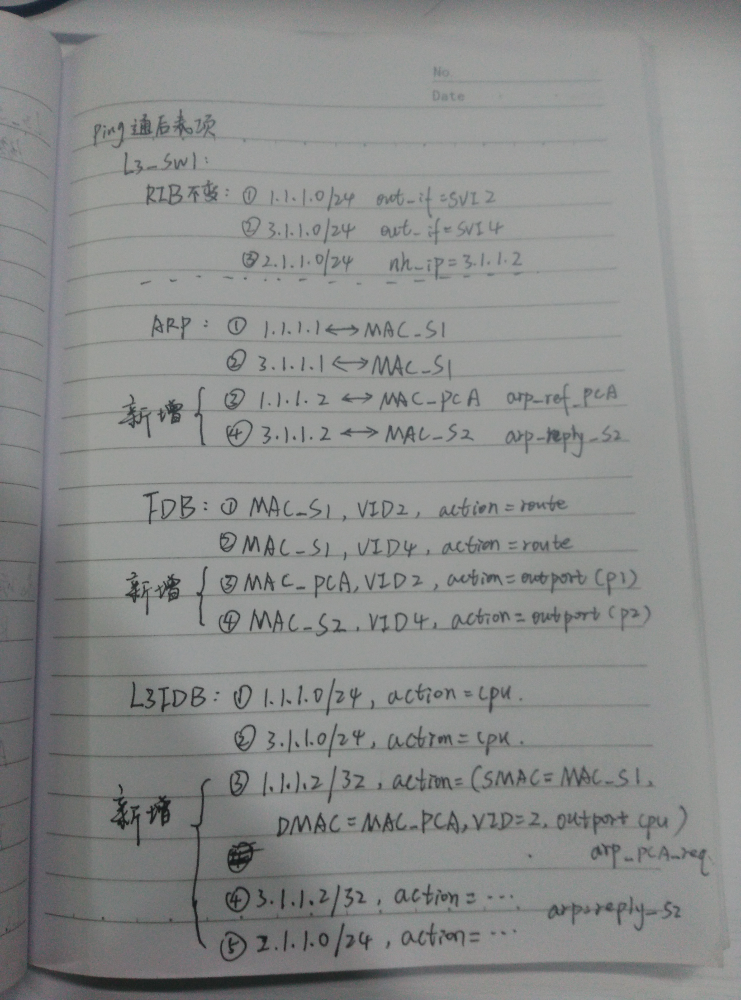
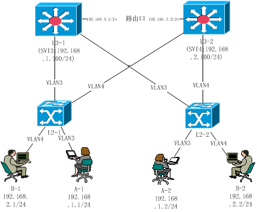

#数据结构

## 报文格式

### ARP报文


ARP报文主要用于广播，PC在第一次上网或者连接其他PC时，由于不知道对方是否在线或者正常连接中，因此先发送ARP报文进行连接。

需要关注的结构以及顺序为

```
dmac:目标MAC(第一次发送时，PC是没有其他PC的MAC地址的，因此使用广播地址，全F格式)
smac：源MAC
type：0x0806
sendMac:源MAC
sendIP：源IP
targetMac:目的MAC
targetIP:目的IP
```

### ICMP报文

icmp报文就是以太网报文，是通信的主要信息载体



其具体的例子是



需要关注的结构以及顺序为

```
dmac:目的MAC
smac：源MAC
type：IP协议类型（通常为IPv4）
dip：目的IP
sip：源IP
```

该结构为主要ping过程需要记录的数据结构。

另外前导8字节和FCS校验和4字节是会遗漏的，也作为了解。

### ARP地址表

所有的设备都有ARP地址表，表结构：

```
ip:其他设备的IP
mac:其他设备的MAC
```

### MAC地址表（FDB）

MAC地址表只有交换机才有。表结构为：

```
mac：其他设备的MAC
vid:其他交换机的VLAN ID
port:其他交换机的端口号
```

需要注意的是，如果使用了三层交换机，那么用的是svi不是vid；另外，如果使用了路由口，那么就不会产生MAC地址表，因为不经过数据链路层，没有MAC学习过程。

### 路由表（RIB）



其关键数据结构直接可以参考图中写法。这样理解：为了要到达最终的一个网络，就必须先到下一个网络。路由器只能记录下一站地址，那么很多路由器的时候，就是依靠这种下一步，组合起来到达的。这里提到的直接投递，是因为最终的网络就是路由器的下一个网络。

# VLAN 规则检查



### 数据类型

按照type字段的16进制值描述

```
0x0800:IPv4
0x0806:arp报文
0x8100:VlAN报文
```


# 案例

## 案例一







## 案例二




**网络说明：**
1) 网络中所有二层口都为ACCESS口（包括设备间互联的二层口），其对应VLAN如图中连接所示。
2）L2-1下链A-1端口为0/1，下链B-1端口为0/2；上链L3-1端口为0/23,上链L3-2端口为0/24。
L2-2下链A-2端口为0/1，下链B-2端口为0/2；上链L3-1端口为0/23,上链L3-3端口为0/24。
3) L3-1和L3-2连接L2-1的端口均为0/1，连接L2-2的端口均为0/2。
   L3-1和L3-2通过路由口相连，均为0/24口。
 L3-1是VLAN3的网关SVI3：192.168.1.100/24，L3-2是VLAN4的网关SVI4：192.168.2.100/24。终端用户PC的IP配置如图所示。

**请解答如下问题：(网络设备统指L2，L3交换机)**
1）	要支持A-1、A-2、B-1、B-2互相能ping通，在PC及网络设备上需要怎样的配置？（5分）
2）	在初始状态下（网络中未发起过任何通信），A-1 ping通B-2，过程中都有哪些报文交互？请按照时间先后顺序从序号1开始注明报文编号，并描述具体报文内容；（15分，少一个、多一个、错一个报文扣2分，下限扣到0分）
（备注：每台设备主动发出或是转发的报文，都要单独编号并描述，比如PC发出的报文编号为1，L2-1交换机收到该报文后转发出去的报文应编号为2）
3）	ping通后，4台网络设备上最终存在哪些相关表项？ （备注：表项包括MAC地址表、ARP表和路由表）（15分，三类表项分值分配如下：MAC地址表5分，少一条或错一条表项扣2分；ARP表项5分，少一条或错一条表项扣2分；路由表项5分，少一条或错一条表项扣2分）