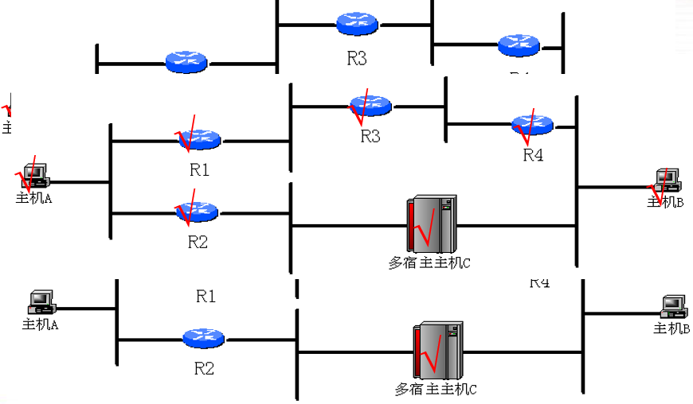
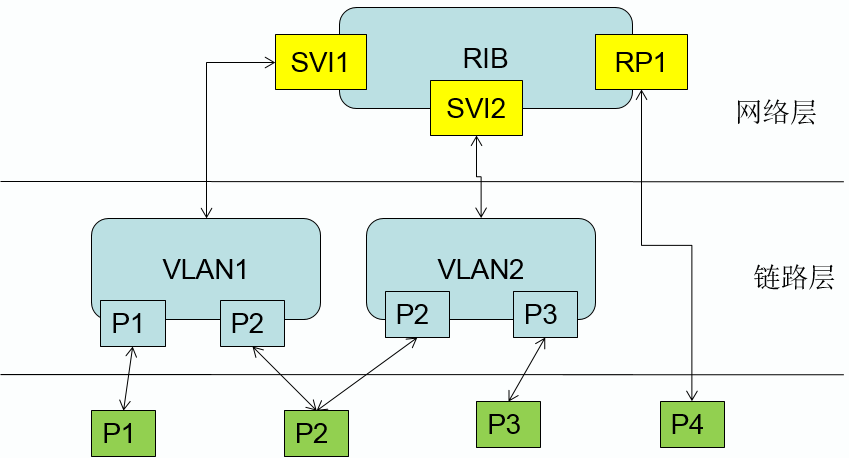
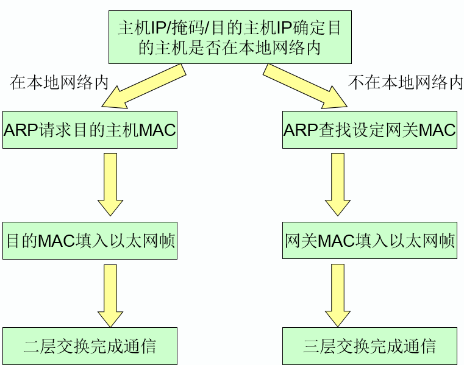
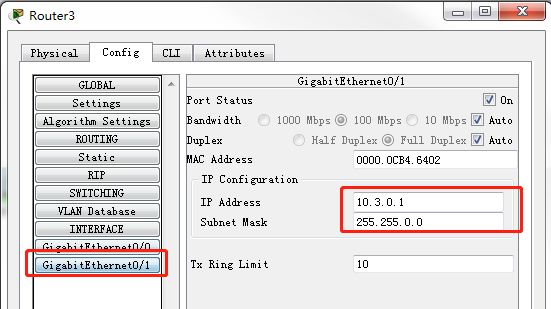

# 以太网基础

## 网络模型

### 概览

在一个网络中，各个厂商的各种网络设备、包括主机、服务器等其他终端之所以能够相互通信，协同工作，是因为所有设备都遵从相同的行为规则，这些行为规则的集合就构成了通信模型

两种主要的通信模型是国际标准化组织（ISO）制定的OSI参考模型和美国国防部制定的TCP/IP协议模型。

OSI和TCPIP模型最主要的特点就是都使用了分层设计，也就是把网络要完成的功能划分到若干个相互关联和依赖的层中。其中OSI模型分为七层，从下而上依次是物理层、数据链路层、网络层、传输层、会话层、表示层、应用层，TCPIP模型相对简洁，分为四层，对应OSI模型物理层和数据链路层的是网络访问层，然后是网络层和传输层，对应OSI模型中会话层、表示层、应用层的是应用层。


### TCP/IP模型

OSI模型只是一个参考模型，一般只是用作开发指南，实际上整个数据通信网络是建立在TCPIP协议模型之上的。

为了表述方便,把TCPIP模型中的网络访问层细分为物理层和数据链路层。

在TCPIP模型中，每一层都定义了一些网络功能，这些功能是由特定的协议实现的。

功能由协议完成，意味着一个特定的功能总是由某个协议完成的，甚至可能是由多个相互关联的协议配合完成的。在网络中部署配置某个协议，就是要实现一个特定的目的。

如果需要的某个功能没有得到正常实现，就要考虑，是不是对应的这个协议出了问题，是没有按照协议规定正常发送、接收数据包呢，还是数据包的格式不正确。我们学习协议，总是先关注这个协议的作用是什么，用在什么地方解决什么问题，协议包如何发送和接收，接收后如何处理，会产生什么结果。正常运作需要什么条件。


### 对等通讯

数据通信是由发送方、中间网络设备、接收方共同完成的。

发送方由上而下逐层产生的数据，最终在物理层变成可以在介质上传输的信号，通过网络设备的传输，接收方接收后有一个由下而上逐层上交数据的过程。这个过程是在发送方、网络设备、接收方的相同层的相同协议之间发生的，**把相同层相同协议之间协议包的交互叫做对等通信**。每层产生的协议报文有各自的名称，比如传输层叫做**TCP段**、网络层叫**IP包**，数据链路层叫**帧**，物理层叫**比特**。


### 报文封装

源主机在发送数据之前，沿协议栈自上而下传递应用程序产生的信息。**在传递的过程中，每层的协议都会把上层信息加上本协议的头部，组成一个协议数据单元—PDU,把这个加协议头部的动作叫做封装**。这个封装的动作是由上而下逐层进行的，也就是说每一层都会把上层的协议包看成一个数据，加上本协议的头部，然后再交给下一层去处理


### 报文拆封

处理有一个相反的过程。接收方从物理层收到相对于发送方，接收方对数据的一系列的比特流后，数据链路层按照协议的规则理解为帧，读取数据链路层头部的地址信息和控制信息，**如果目标地址是自己能够接收的，就会按照控制信息的规定把头部信息剥离**，把剥离后的数据部分传递给网络层，把这个剥离协议头部的过程叫做拆封。

对接收方来说，拆封这个动作是由下而上逐层进行的，每层收到下层的数据后，都会读取本协议的头部信息，并把头部信息剥离后交给上层处理。

### 网络设备 


### 数据链路层 

数据链路层通过介质在相邻节点间提供数据传输服务。由于存在种类繁多的物理介质，因此在数据链路层定义了不同的数据链路层协议，定义了帧的类型及介质访问方式。在局域网中，IEEE组织通过802.2和802.3定义了一系列协议，而网络中，则定义了HDLC，PPP、帧中继等协议。


### 网络层 

网络层提供主机到主机的传输服务，这种服务是由IP协议提供的,ICMP辅助IP工作，提供出错和控制信息，而ARP协议在以太网中提供IP地址和MAC地址之间的映射。 


### 寻址与地址映射

在协议包的头部，很重要的一个字段就是地址。

在通信模型中，通过地址来表示不同的设备或者同一个设备的不同接口，不同协议有不同的地址，这些地址的表现形式不同

我们可以把**时隙**和信道理解为物理层的地址

数据链路层中，如果是以太网协议，使用48位的mac地址，而帧中继协议使用DLCI作为地址，ATM使用VPI/VCI作为地址

网络层，现在遇到的一般是32位的IPv4地址或者是128位的IPv6地址

传输层，不管是tcp还是udp，都是使用端口号作为地址

主机名或者URL是应用层的地址

在发送方由上而下进行封装时，经常要根据一个协议的地址获得另外一个协议对应的地址，否则无法正确封装，导致通信失败。**比如我们在IE浏览器中输入www.sina.com.cn这个域名，但这个地址必须由DNS协议解析为对应的IP地址，才能封装为IP包，而IP地址又必须由arp协议解析为对应的mac地址，才能封装为以太网帧。arp、dns、wins这些辅助性协议统称为地址解析协议。**


### TCP/IP协议族

TCPIP模型由若干个相互关联的协议组成，这些协议组成了TCPIP协议族。

TCPIP模型的网络访问层包括了OSI模型中物理层和数据链路层的全部细节，典型的包括LAN中的以太网协议、WAN中的ppp、帧中继协议等，而网络层则包括IP协议和它的两个重要的辅助协议：arp协议和ICMP协议

传输层有两个协议：面向连接的tcp协议和无连接的UDP协议

应用层协议比较多，包括smtp、ftp、dns 、snmp等。


## 以太网基础概念

### MAC地址


**OUI**： Organizationally unique identifier，代表网络硬件制造商编号，他由IEEE统一分配

**24位address**：代表该制造商所制造的某个网络产品（如网卡）的系列号，它由网络制造商分别并保证每个序列号唯一。

在OUI中，其中第一位(I/G)表示此地址是单播地址还是组播地址，如果一位（LSB）=0，表示此地址为**单播**地址，如果第一位=1，表示此地址为**组播**地址。第二位(U/G)表示此地址由IEEE维护的全局地址还是局域性地址，U/G=0,表示IEEE全局维护地址，U/G=1,表示局域性维护地址。


在局域网内[交换](http://cisco.chinaitlab.com/List_7.html)机的转发模式：

1）若接收到的帧是已知目的地址的单播，则把该帧转发到与其目的地址相关联的单个接口。

2）若接收到的帧是未知目的地址的单播，则把该帧转发到除接收帧的接口之外的所有接口。

3）若接收到的帧是广播，则采取与2）类似的行为。

4）若接收到的帧是多播，则采取与2）类似的行为，除非已经配置了针对多播的优化。

### 以太网帧结构


**Preamble/SFD**（Start-of-Frame Delimiter）：每个以太网帧发送时都是以8个字节的前导码开始，Preamble是1和0交替（1 0 1 0 1 0…….）的7个字节数据，该部分的作用是通知接收方有数据帧到来，使其与输入的时钟保持同步，56bit 模式容许站点在帧的开始可以丢弃一些bit。SFD是一个字节10101011，最后使用11，来通知接收方下一字段就是目的主机的地址了。**实际上前导码都是在物理层加进去的，并不是帧的一部分。**

**DMAC**（Destination Address）：6个字节，目的节点的MAC地址。

**SMAC**（Source Address）：6个字节，源节点的MAC地址。

**Type/Length**：2字节，根据数值的不同代表2种不同的封装格式，如果字段值在0x0000－0x05DC范围内，则表示该字段为Length，该帧为802.3 raw封装。如果字段值在0x0600－0xFFFF范围内，则表示该字段为Type字段，该帧为Ethernet II封装，0x05DD－0x05FF保留没有使用。

**PayLoad**：上层协议有效载荷，最小为46字节，最大为1500字节，对于Type封装格式，上层协议必须保证该字段的值大于46字节，对于Length封装，对于有效载荷不够46字节的报文链路层必须进行填充。

**FCS**：4字节的校验和。

## VLAN

### VLAN是什么

VLAN（Virtual Local Area Network）又称虚拟局域网，是一种将局域网设备从逻辑上划分成一个个网段，从而实现虚拟工作组的新兴数据交换技术。

一个VLAN组成一个逻辑子网，即一个逻辑广播域，它可以覆盖多个网络设备，允许处于不同地理位置的网络用户加入到一个逻辑子网中。VLAN工作在OSI参考模型的第2层（数据链路层）和第3层（网络层），VLAN之间的通信是通过第3层的路由来完成的。

IEEE标准为 802.1Q

###VLAN的帧结构

####IEEE802.1Q

是经过IEEE认证的对数据帧附加VLAN识别信息的协议。所附加的VLAN识别信息，位于数据帧中“发送源MAC地址”与“类别域（Type Field）”之间。


**TPID** (Tag Protocol Identifier，也就是EtherType)

IEEE定义的新的类型，表明这是一个加了802.1Q标签的帧。TPID包含了一个固定的值0x8100。

**TCI** (Tag Control Information)

①**User Priority**：用于定义用户优先级，共有8个优先级别。IEEE 802.1P 为3比特的用户优先级位定义了操作。最高优先级为7，应用于关键性网络流量，如路由选择信息协议（RIP）和开放最短路径优先（OSPF）协议的路由表更新。优先级6和5主要用于延迟敏感（delay-sensitive）应用程序，如交互式视频和语音。优先级4到1主要用于受控负载（controlled-load）应用程序，如流式多媒体（streaming multimedia）和关键性业务流量（business-critical traffic）。优先级0是缺省值，并在没有设置其它优先级值的情况下自动启用。

②**CFI**(规范格式指示器Canonical Format Indicator)：CFI值为0说明是规范格式，1为非规范格式。它被用在令牌环/源路由FDDI介质访问方法中来指示封装帧中所带地址的比特次序信息。

 ③**VID**：该字段为12-bit， 是对 VLAN 的识别字段，在标准 802.1Q 中常被使用。支持4096(2的12次方) VLAN 的识别。在4096可能的VID 中，VID＝0 用于识别帧优先级。 4095(FFF)作为预留值，所以 VLAN 配置的最大可能值为4094。 所以有效的VLAN ID范围一般为1-4094。

### VLAN的作用

####广播风暴

采用VLAN技术，可将某个交换端口划到某个VLAN中，而一个VLAN的广播风暴不会影响其它VLAN的性能。


#### 控制网络的广播风暴


- 安全

由于VLAN 功能划分了多个广播域，不属于同一个VLAN的端口将不能进行通信，增强了安全性。例如将学生和教师用户划分到不同的VLAN中，学生则不能访问到教师网络的资源。

- 简化网络管理

网络管理员能借助于VLAN技术轻松管理整个网络。在同一个物理网络下，可以利用VLAN技术划分不同的逻辑网络，当要改变网络拓朴结构时，只需通过修改VLAN配置。

### VLAN的原理

#### VLAN的分配

####基于端口划分

根据交换机接口分配VLAN ID，若进入交换的报文本身携带有VLAN TAG，则以TAG内的VLAN ID为准。

优点: 划分简单

缺点: 是某个用户的端口连到新端口后，需要重新定义。

#### 输入规则检查

VLAN输入规则检查详细过程如下：

1. 对输的帧的VID进行检查，如果VID==0xFFF，报文将会被丢弃。
2. 帧的VID属性是否与设置一致，即端口可以使能只接收含有VLAN-TAG的帧，此时收到VID==0x0的报文则直接丢弃。
3. 在使能VLAN检查的情况下：端口不在所收到的帧的VID对应的VLAN中，则丢弃此报文。

####输出规则检查

和输入规则检查一样，输出规则检查用于在报文输出时，判定端口是否在输出报文VID所对应的VLAN中。

输出规则检查如下：

1. 输出端口不在帧VID对应的VLAN当中，报文被丢弃。
2. 如果端口要求输出UNTAG帧，但TAG中的CFI位为1，此时报文被丢弃。
3. 当报文通过输出规则检查确定可以在此端口输出时，还需要确定是tag输出还是untagged输出，也即输出报文是否带有802.1q tag，此规则也由用户指定。当确定输出报文为tag报文时，其tag中的VID即为此报文所划分的VLAN ID。

###VLAN的端口类型

- **PVID：**Port VLAN ID,指端口的却省VLAN ID。主要用于为进入交换机时不带VLAN TAG的报文分配VLAN ID。 
- **VLAN ID：**

VLAN TAG包的VLAN ID号，有效范围是1-4094，0和4095都为协议保留值。

0 表示不属于任何VLAN，但携带802.1Q的优先级标签，一般被称为Priority-only frame，其一般作为系统使用，用户不可使用和删除。

1为系统默认VLAN，即Native VLAN。

2-1001是普通的vlan。

1006-1024保留仅系统使用，用户不能查看和使用

1002-1005是支持fddi和令牌环的vlan

1025-4095是扩展的vlan。

- **Tag、untag：**

tag是指以太网数据帧中携带有4字节802.1Q信息的VLAN标签，其中vlan id，用于指名数据包属于那个vlan，untag指数据包不属于任何vlan，没有vlan标签。

- **Access端口：**Access口只能属于1个VLAN，一般用于连接计算机的端口。 


指定端口E0/2端口类型为accesss属于vlan2

指定端口E0/10类型为access属于vlan10


- **Trunk端口:**   Trunk口上可以同时传送多个VLAN的包，一般用于交换机之间的链接
- 实践练习： 

1. sw1和sw2之间相同vlan可以通信；
2. sw1和sw2之间不相同vlan不可以通信。


SW1

设置vlan并把端口加入vlan，设置e0/24为trunk。

SW2

设置vlan并把端口加入vlan，设置e0/24为trunk。

- **缺省VLAN**

Access端口只属于1个VLAN，所以它的缺省VLAN就是它所在的VLAN，不用设置； 

Trunk端口属于多个VLAN，所以需要设置缺省VLAN ID。

缺省情况下，Trunk端口的缺省VLAN为VLAN 1  

如果设置了端口的缺省VLAN ID，当端口接收到不带VLAN Tag的报文后，则将报文转发到属于缺省VLAN的端口；当端口发送带有VLAN Tag的报文时，如果该报文的VLAN ID与端口缺省的VLAN ID相同，则系统将去掉报文的VLAN Tag，然后再发送该报文。 

注：对于锐捷和思科交换机，缺省vlan被称为“native vlan”华为交换机缺省VLAN被称为“Pvid Vlan”

### VLAN的报文转发

####VLAN报文输入输出规则


###VLAN举例


同为0则不通过

## FDB

- MAC FDB ：MAC Filter Database，通常也称之为MAC地址表，用于为报文向哪个端口转发或过滤做决策。
- 查找KEY：元素MAC FDB查找KEY为**VID+MAC**。其中VID为可选KEY，如果查找KEY中不包括VID，称之为SVL查找；如果查找KEY中包括VID，则称之为为IVL查找。在我司的实现中，都是IVL查找，即查找KEY中都包括VID。

MAC FDB中除开包括查找KEY外，还包括端口MAP，是否为静态，是否老化，是否为过滤地址等属性。 

FDB table在硬件（CAM硬件表项）中通常使用Hash查找算法。


- FDB查找

交换机依据报文携带的的目的MAC和分配给报文的VID作为查找KEY找到地址表

```
IF 查找成功并且行为为Forward

  则FDB的端口MAP为报文的潜在转发端口MAP

ELSE IF查找成功并且行为为Filter

  则过滤掉报文

ELSE

  将报文在VLAN内部泛洪
```

注1：FDB查找结果仅仅作为报文的潜在转发端口列表，是否需要转发到这个端口还要依赖其他决策，例如STP

注2：上面提到的是一个转发端口MAP，这个MAP可以包括多个端口成员。


### FDB管理

#### FDB添加

FDB添加指用户可以手动的添加一个MAC，添加信息包括

1. 查找KEY：MAC+VID
2. 行为：Forward还是filter
3. 是否为静态地址
4. 是否为组播地址
5. 端口MAP

#### FDB删除

用户可以手工的删除FDB的中的MAC，其删除方法可以是删除指定的MAC，也可以是FDB中条目的某个子集，其指定方案包括：

VID+MAC：删除指定的MAC地址

VID：删除指定VLAN的MAC

Port：删除目的端口为指定端口的地址

VID+Port：删除目的端口为指定端口指定VLAN的地址

ALL：删除所有地址

上面所有方案中，只有VID+MAC方案才能删除静态地址，其他方案仅仅是删除动态地址

#### FDB学习

除开用户可以手工的添加地址外，交换机可以依据报文信息自动学习MAC地址，当满足如下条件时，MAC地址可以被学习：

- 端口的STP状态允许其学习
- 报文的源MAC不为组播MAC
- 地址表还有空闲空间供其学习
- 接收报文的端口属于报文VLAN的成员端口

当满足如上学习条件时，交换机使用报文的源MAC+VID查找MAC地址表

```
IF 查找不成功

    使用MAC+VID+接收此报文的端口添加MAC地址

ELSE

    更新老化时间
```

# IP地址

IP地址是TCP/IP网络中的主机(或称为节 点)   的惟一地址。IP地址是网络层的逻辑地址。

- IP地址的格式 
  - IP地址是一组32位长的二进制数字，  
  - 用点分十进制表示。
- IP地址的组成
  - 网络地址＋主机地址 


## 子网

子网(Subnet)是在TCP/IP网络上，用路由器连接的网段。同一子网内的IP地址必须具有相同的网络地址。


## 子网掩码

- 子网掩码(Subnet Mask)用来确定IP地址中的网络地址部分。其格式与IP地址相同，也是一组32位的二进制数。
- 子网掩码中为“1”的部分所对应是IP地址中的网络地址部分，为“0”的部分所对应是IP地址中的主机地址部分。 

把一个大的网络划分为若干个子网，这样网络地址和子网地址就构成了IP地址的前半部分，IP地址的后半部分自然就是主机地址了。如何从IP地址中区分子网和主机呢？例如：IP地址163.40.219.7是表示一个未子网化的B类网上的设备，还是一个B类网上的子网化为C类的网络设备呢，IP协议中定义了一个用来解释IP地址的子网掩码。

子网掩码是一位特殊的32位二进制数，它的格式与IP地址一样，但它用二进制中的1来代替IP地址的前半部分网络地址和子网地址），用0来替代IP地址中的主机地址。

```
例如：163.40.219.7的B类网络的子网掩码为
11111111.1111111.00000000.00000000
用十进制表示 ：255.255.0.0
而对于B类网中的C类子网，它的子网掩码用十进制表示：
255.255.255.0
```

缺省网关的作用：

网络层查找转发表失败的情况下，都将报文投递到缺省网关，由缺省网关进行网络层查表。（缺省网关相当于网络层转发代理）

# IP路由


## ARP协议

- ARP是负责将IP地址映射为物理地址的协议。 

- 为什么需要arp?

  通常所说的以太网的网卡是不识别IP地址的，而是通过识别MAC地址来判断该帧是否是给本机的。因此就需要**提供一个机制根据目的主机的IP翻译出它的MAC地址**。

1. ARP是与物理网络系统相关的吗？即是不是所有类型的网络都需要ARP协议？
2. 结合之前的以太网知识，试想一下以太网帧的封装头是怎么来的？

### ARP工作原理

- 请求者发送广播报文
- 接收者从该请求报文中提取出源主机的IP地址和物理地址的绑定，更新自己的ARP缓冲
- 接收者发回ARP应答报文给请求者。

## 表驱动IP路由选择的基本原理

### 路由选择和路由器 

1. 路由选择

   选择一条路径发送IP数据报的过程。

2. 路由器

   进行路由选择的计算机。

3. IP互联网

   1. IP互联网是由路由器将多个网络相互联接所组成的。

   2. IP互联网采用面向非连接的互联网解决方案。

      路由器逐跳转发：各个路由器独立地对待每个IP数据报。

      路由器负责为每个IP数据报选择它所认为的最佳路径。

###什么设备需要具备路由选择功能？ 

1.路由器 



### 表驱动IP选路的基本思想

- 在需要路由选择的设备中保存一张IP路由表
- IP路由表存储着有关可能的目的地址及怎样到达目的地址的信息
- 在转发IP数据报时，查询IP路由表，决定把数据报发往何处

### 路由表中的目的地址如何表示？ 

1. 大型互联网（如因特网）中有可能存在成千上万台主机
2. 路由表中不可能包括所有目的主机的地址信息
   - 内存资源占用巨大
   - 路由表搜索时间很长

3. 隐藏主机信息
   - IP地址：网络号（netid）和主机号（hostid）
   - IP路由表中保存相关的目的网络信息

### 标准的路由表

1. 下一站选路的基本思想

   路由表仅指定从该路由器到目的地路径上的下一步，而该路由器并

   不知道到达目的地的完整路径

2. 标准的IP路由表项组成元素(D,M,N）

   D：目的网络的IP地址

   M:  掩码 （N和M一起确定一个目的网络）

   N：到目的网络路径上的“下一个”路由器的IP地址

### 路由表举例


### 路由表中的特殊路由

1. 默认路由

   如果路由表没有明确指明一条到达目的网络的路由信息，就将数据报转

   发到默认路由指定的路由器。

   主要目的：缩短路由表的长度、减少路由计算时间

   形式：D=0.0.0.0 M=0.0.0.0  N=默认路由器地址

2. 特定主机路由

   对单个主机（而不是网络）指定一条特别的路径

   主要目的：增强安全性、进行网络连通性调试和判断路由表的正确性

   形式：D=主机IP M=255.255.255.255 N=到达该主机的下一跳路由器

## 路由选择算法 


注意： 上面的算法是选路的基本过程，实际实现时还要考虑最长匹配问题以及查表效率问题。

## IP数据报路由转发过程


### 主机A向主机B发送 - 主机A发送IP数据报


### 主机A向主机B发送 - 路由器R2处理和转发IP数据报


### 路由表的建立与刷新

- 静态路由

  人工指定的路由

- 动态路由

  路由器通过自己学习得到的路由

#### 静态路由 

- 静态路由是由人工建立和管理的

- 静态路由不会自动发生变化
- 静态路由必须手工更新以反映互联网拓扑结构或连接方式变化

#### 静态路由的特点 

1. 优势

   安全可靠、简单直观，避免了动态路由选择的开销。

2. 适用环境

   不太复杂的互联网结构。

3. 劣势

   不适用于复杂的互联网结构：建立和维护工作量大，容易出现路由环互联网出现故障，静态路由不会自动做出更改。

#### 动态路由 

1. 动态路由可以通过自身学习，自动修改和刷新路由表

2. 动态路由要求路由器之间不断地交换路由信息

3. 优势：更多的自主性和灵活性

4. 适用环境：拓扑结构复杂、网络规模庞大的互联网

   自动排除错误路径

   自动选择性能更优的路径


# 二三层转发

## 交换机的工作原理 

### 同一网段的互通 


### 二层交换基本原理—二层交换引擎 


二层交换机通过解析和学习以太网帧的源MAC来维护MAC地址与端口的对应关系（保存MAC与端口对应关系的表称为地址转发表即MAC表），通过其目的MAC来查找MAC表决定向哪个端口转发，基本流程如下：

1. 二层交换机收到以太网帧，将其源MAC与接收端口的对应关系写入MAC表，作为以后的二层转发依据。如果MAC表中已有相同表项，那么就刷新该表项的老化时间。MAC表表项采取一定的老化更新机制，老化时间内未得到刷新的表项将被删除掉；
2. 根据以太网帧的目的MAC去查找MAC表，如果没有找到匹配表项，那么向所有端口转发（接收端口除外）；如果目的MAC是广播地址，那么向所有端口转发（接收端口除外）；如果能够找到匹配表项，则向表项所示的对应端口转发，但是如果表项所示端口与收到以太网帧的端口相同，则丢弃该帧。

从上述流程可以看出，二层交换通过维护MAC表以及根据目的MAC查表转发，有效的利用了网络带宽，改善了网络性能。


**支持VLAN的二层交换机**

二层交换机虽然能够隔离冲突域，但是它并不能有效的划分广播域。

因为从前面介绍的二层交换机转发流程可以看出，**广播报文以及目的MAC查找失败的报文会向所有端口转发，当网络中的主机数量增多时，这种情况会消耗大量的网络带宽，并且在安全性方面也带来一系列问题**。

当然，通过路由器来隔离广播域是一个办法，但是由于路由器的高成本以及转发性能低的特点使得这一方法应用有限。**基于这些情况，二层交换中出现了VLAN技术**。

我们都知道，位于协议第2层的交换机虽然能隔离冲突域，提高每一个端口的性能，但并**不能隔离广播域，不能进行子网划分，不能层次化规划网络，更无法形成网络的管理策略，因为这些功能全都属于网络的第三层**———网络层。因此，如果只用交换机来构造一个大型计算机网络，将会形成一个巨大的广播域，结果是，网络的性能反而降低以至无法工作，网络的管理束手无策。一般来说，**广播域越小越好**，一般不应超过200个站点。那么，如何在一个交换网络中划分广播域呢？交换机借鉴了路由结构中子网的思路，得出了**虚网**的概念，即**通过对网络中的IP地址或MAC地址或交换端口进行划分，使之分属于不同的部分，每一个部分形成一个虚拟的局域网络，共享一个单独的广播域。这样就可以把一个大型交换网络划分为许多个独立的广播域，即VLAN。**

### 支持VLAN的二层交换原理—二层交换引擎


### VLAN间通信 


### 接口（抽象转发模型） 



上图是一个三层交换机的逻辑模型：

1. 包含三个三层接口，其中两个SVI（SVI1，SVI2），一个路由口；
2. 创建了两个VLAN，VLAN1和VLAN2；
3. 有3个链路层接口，P1为VLAN1的ACCESS口，P2同时属于VLAN1和VLAN2（比如为TRUNK口），P3为VLAN2的ACCESS口；
4. 有4个物理接口，其中P4用于承载路由口；

### 接口基础配置

- 网络层接口：

  1. SVI口

     A、创建VLAN；

     B、创建SVI口，注意SVI口的编号与对应VLAN相同；

     C、配置SVI口的IP地址；

  2. 路由口

     A、创建路由口，路由口编号与物理口编号相同；

     B、配置路由口的IP地址；

- 链路层接口

  1. trunk口

     A、配置接口为TRUNK口；

     B、配置接口的native vlan；

     C、配置接口的VLAN允许列表；

  2. access口

     A、配置接口模式为ACCESS口；

     B、配置接口所属VLAN；

### VLAN间通信


对应配置为：

```
Vlan 10
Vlan 20
Interface vlan 10
Ip address 10.10.0.0/24
Interface vlan 20
Ip address 10.20.0.0/24
Interface fastetbernet0/1
No switchport
Ip address 10.10.1.0/24
```

### 三层交换原理

早期的网络中一般使用二层交换机来搭建局域网，而不同局域网之间的网络互通由路由器来完成。那时的网络流量，局域网内部的流量占了绝大部分，而网络间的通信访问量比较少，使用少量路由器已经足够应付了。

​    但是，随着数据通信网络范围的不断扩大，网络业务的不断丰富，网络间互访的需求越来越大，而路由器由于自身成本高、转发性能低、端口数量少等特点无法很好的满足网络发展的需求。我们知道，**路由器主要是通过IP转发（三层转发）来实现不同网络间的互连**，后面，随着技术的发展，**交换机转发高性能的特点融入到了三层转发中，就出现了三层交换机，一种实现了高速三层转发的设备**。大多数三层交换机采用**ASIC硬件芯片来完成转发**，ASIC芯片内部集成了IP三层转发的功能，包括检查IP报文头、修改存活时间（TTL）参数、重新计算IP头校验和、IP包的数据链路封装等等。目前三层交换机的基本组网如下图所示：


<u>三层转发必备入门知识：</u> 

**不同网络的主机之间如何互访？**

（1） 源主机在发起通信之前，将自己的IP与目的主机的IP进行比较，如果两者位于同一网段（用网络掩码计算后具有相同的网络号），那么源主机直接向目的主机发送ARP请求，在收到目的主机的ARP应答后获得对方的物理层（MAC）地址，然后用对方MAC作为报文的目的MAC进行报文发送。位于同一VLAN（网段）中的主机互访时属于这种情况，这时用于互连的交换机作二层交换转发；

（2） 当源主机判断目的主机与自己位于不同网段时，它会通过网关（Gateway）来递交报文，即发送ARP请求来获取网关IP地址对应的MAC，在得到网关的ARP应答后，用网关MAC作为报文的目的MAC进行报文发送。注意，发送报文的源IP是源主机的IP，目的IP仍然是目的主机的IP。位于不同VLAN（网段）中的主机互访时属于这种情况，这时用于互连的交换机作三层交换转发。

**三层转发，你还需要了解的入门知识：** 

​    对于三层交换机而言，有CPU和ASIC芯片，那到底是靠CPU来转发三层报文还是靠ASIC芯片来转发呢？这个问题在平时也经常困扰一些三层学习入门者。

1. 我们必须明白所有的软件代码都是在CPU上跑的，千万不要认为SSP的代码是在ASIC芯片上执行的。切记。SSP（交换机底层驱动）只是起到设置ASIC硬件表项的作用。ASIC设置完三层转发表项后，从三层端口接收到的报文就可以在ASIC芯片执行三层转发了。

2.  CPU：用于转发的控制，主要维护一些软件表项（包括软件路由表、软件ARP表等等），并根据软件表项的转发信息来配置ASIC的硬件三层转发表。当然，CPU本身也可以完成软件三层转发。从三层交换机的结构和各部分作用可以看出，**真正决定高速交换转发的是ASIC中的二三层硬件表项，而ASIC的硬件表项来源于CPU维护的软件表项。**
3.   从前页的三层转发基本入门知识可以看出，配置好三层接口与IP地址后，这个时候交换机可能还没有学习到某个指定IP地址的出口信息，这个时候，协议层是不会通告SSP去设置ASIC表项的。这个时候，如果接收到对应的三层报文，在ASIC芯片上肯定查找不到出口。而查找失败的报文，通常都是送CPU处理。
4.  CPU收到报文后，按照前面说的，发出ARP等操作，最后完成报文转发，然后将对应的出口信息通告给SSP，SSP将信息设置到ASIC芯片上。设置完ASIC芯片后，三层报文就能在硬件上直接进行三层转发，就不会送CPU了。

### 交换机三层转发软硬件分工（实现层面，帮助理解）


### 三层交换引擎


这里可以发现在二层交换机的基础上又增加了一层，主要是用于网络间的通信。

### IP网络规则



### 三层交换机选择二层或三层交换 


### 路由选路---最长匹配

- 根据报文的目的地址，与路由项进行匹配操作；
- 匹配的动作是用报文目的地址与路由项的子网掩码进行“与”；如图 目的IP10.111.1.88和各表项子网掩码“与”的结果如下

```
10.111.1.88 & 255.255.0.0 ＝ 10.111.0.0
10.111.1.88 & 255.255.255.0 ＝ 10.111.1.0
10.111.1.88 & 255.255.0.0 ＝ 10.111.0.0
```

- 如果“与”的结果和路由项中网络地址相同，则认为路由匹配
- 所有匹配项中子网掩码位数最长的为最佳匹配项，报文据此进行转发（从该表项对应接口发送）
- 如果找不到匹配项，则根据缺省路由0.0.0.0/0进行转发
- 如果没有缺省路由则报文被丢弃 
- 路由表和FIB表


### 三层交换基本原理详细介绍 

以PC A  ping  PC B 来讲解三层转发流程。我们知道，三层转发的组网大概可以抽象成两种。一种是PC A发出的报文通过一台交换机就到达PC B。另一种是PC A发出的报文需要通过一台以上的交换机转发才能到达PC B。

#### 组网1： PC A与PC B连接在同一台三层交换机上 


**PC A ping PC B流程（组网1第二部分）：**

1. PC A首先检查出目的IP地址2.1.1.2（PC B）与自己不在同一网段，因此它发出请求网关地址1.1.1.1对应MAC的ARP请求；
2. L3_SW收到PC A的ARP请求后，检查请求报文发现被请求IP是自己的三层接口IP，因此发送ARP应答并将自己的三层接口MAC（MAC S）包含在其中。同时它还会把PC A的IP地址与MAC地址对应（1.1.1.2<==>MAC A）关系记录到自己的ARP表项中去（因为ARP请求报文中包含了发送者的IP和MAC）；
3. PC A得到网关（L3_SW）的ARP应答后，组装ICMP请求报文并发送，报文的目的MAC＝MAC S、源MAC＝MAC A、源IP＝1.1.1.2、目的IP＝2.1.1.2；
4. L3_SW收到报文后，首先根据报文的源MAC+VID（即VLAN ID）更新MAC地址表。然后，根据报文的目的MAC＋VID查找MAC地址表，发现匹配了自己三层接口MAC的表项。这里说明一下，三层交换机为VLAN配置三层接口IP后，会在交换芯片的MAC地址表中添加三层接口MAC＋VID的表项，并且为表项的三层转发标志置位。当报文的目的MAC匹配这样的表项以后，说明需要作三层转发，于是继续查找交换芯片的三层表项；
5. 交换芯片根据报文的目的IP去查找其三层表项，由于之前未建立任何表项，因此查找失败，于是将报文送到CPU去进行软件处理；
6. CPU根据报文的目的IP去查找其软件路由表，发现匹配了一个直连网段（PC B对应的网段），于是继续查找其软件ARP表，仍然查找失败。然后L3_SW会在目的网段对应的VLAN 3的**所有端口**发送请求地址2.1.1.2对应MAC的ARP请求；
7. PC B收到L3_SW发送的ARP请求后，检查发现被请求IP是自己的IP，因此发送ARP应答并将自己的MAC（MAC B）包含在其中。同时，将L3_SW的IP与MAC的对应关系（2.1.1.1<==>MAC S）记录到自己的ARP表中去；
8. L3_SW收到PC B的ARP应答后，将其IP和MAC对应关系（2.1.1.2<==>MAC B）记录到自己的ARP表中去，并将PC A的ICMP请求报文发送给PC B，报文的目的MAC修改为PC B的MAC（MAC B），源MAC修改为自己的MAC（MAC S）。同时，在交换芯片的三层表项中根据刚得到的三层转发信息添加表项（内容包括IP、MAC、出口VLAN、出端口），这样后续的PC A发往PC B的报文就可以通过该硬件三层表项直接转发了；
9. PC B收到L3_SW转发过来的ICMP请求报文以后，回应ICMP应答给PC A。ICMP应答报文的转发过程与前面类似，只是由于L3_SW在之前已经得到PC A的IP和MAC对应关系了，也同时在交换芯片中添加了相关三层表项，因此这个报文直接由交换芯片硬件转发给PC A；
10. 这样，后续的往返报文都经过查MAC表=>查三层转发表的过程由交换芯片直接进行硬件转发了。

#### 组网2： PC A与PC B通过多台三层交换机相连


**PC A ping PC B流程（组网2第一部分）：** 

1. PC A首先检查出目的IP地址2.1.1.2（PC B）与自己不在同一网段，因此它通过ARP解析得到网关地址1.1.1.1对应的MAC（MAC S1）。然后，PC A组装ICMP请求报文并发送，报文的目的MAC＝MAC S1、源MAC＝MAC A、源IP＝1.1.1.2、目的IP＝2.1.1.2；
2. L3_SW1收到报文后，首先根据报文的源MAC+VID更新MAC地址表。然后，根据报文的目的MAC＋VID查找MAC地址表，发现匹配了自己三层接口MAC的表项，于是继续查找芯片的三层转发表；
3. 由于之前未建立任何表项，因此三层转发表查找失败，于是将报文送到CPU去进行软件处理；
4. CPU根据报文的目的IP去查找其软件路由表，发现匹配路由2.1.1.0/24，其下一跳IP地址为3.1.1.2，于是继续查找3.1.1.2是否有对应的ARP，仍然查找失败。然后L3_SW1在下一跳地址3.1.1.2对应的VLAN 4内发起ARP请求，并得到L3_SW2的回应，从而得到IP和MAC对应关系（3.1.1.2<==>MAC S2）；
5. L3_SW1将PC A发出的ICMP请求报文转发给L3_SW2，报文的目的MAC修改为L3_SW2的MAC（MAC S2），源MAC修改为自己的MAC（MAC S1）。同时，将刚刚用到的转发信息添加到交换芯片的三层转发表中去，包括匹配的网段2.1.1.0/24、下一跳地址的MAC（MAC S2）、出口VLAN、出端口。这样，后续发往2.1.1.2的报文就可以直接通过交换芯片硬件转发了；
6. L3_SW2收到报文后，与组网1中的处理类似，经过查MAC表=>查三层转发表=>送CPU=>匹配直连路由=>ARP解析=>转发报文同时添加硬件表项的过程，将报文转发给PC B，此时报文的目的MAC修改为PC B的MAC（MAC B），源MAC修改为L3_SW2的MAC（MAC S2）。这样后续发往2.1.1.2的报文就直接由交换芯片硬件转发了；
7. PC B收到来自PC A的ICMP请求报文后进行ICMP应答。由于在ICMP请求报文转发的过程中，每个网段的两端节点都已经通过ARP解析得到了对方的IP和MAC对应关系，因此应答报文的转发完全由交换芯片完成（查MAC表=>查三层转发表=>发送）；
8. 这样，后续的往返报文都经过查MAC表=>查三层转发表的过程由交换芯片直接进行硬件转发了。

#### 不同网段的通信 

以PC1 ping PC3为例 


### IP地址的精确匹配与最长匹配 理

精确匹配即目的IP地址与路由的地址信息必须完全吻合，而最长匹配则是选择所有包含了目的地址的路由中掩码最长的一条。

早期的交换机都采用精确匹配，这样只要一有攻击或者用户数量一多，硬件表项就不够用了，报文就都走CPU转发，性能就降下来了。

目前大多数的三层交换机均能够同时支持精确匹配表项和最长匹配表项，**一般来说精确匹配表项对应于软件中的ARP表，最长匹配表项对应于软件中的直连路由和非直连路由**。

<u>支持最长匹配的交换机对于路由的处理方式</u> 

这种类型的三层交换机，一般在软件路由表建立时就将路由信息添加到硬件三层表中去，包括直连路由和非直连路由。

对于直连路由，对应的硬件三层表项的“to CPU”标志位始终置1，报文的目的IP匹配这样的表项以后被送往CPU处理，CPU软件会在直连网段发送ARP请求，并将获取的ARP信息作为主机路由添加到硬件表项中（主机路由对应的“to CPU”标志位置0），这样后续的同样目的IP的报文就直接通过新添的硬件表项转发了；

对于非直连路由，当下一跳地址的对应ARP信息还未获得时，对应的硬件三层表项的“to CPU”标志位置1，报文的目的IP匹配这样的表项以后被送往CPU处理，CPU软件会在下一跳地址对应的直连网段发送ARP请求，并使用获取的ARP信息中的下一跳MAC、出口VLAN等信息更新对应的硬件三层表项，然后将其“to CPU”标志位置0，这样后续的目的IP匹配该非直连路由的报文就能够直接通过修改后的硬件表项转发了。

# 拓扑实验

## 实验步骤

### 思科模拟器

这里主要使用【PacketTracer70_64bit_setup.exe】安装包进行安装思科模拟器（Cisco Packet Tracer）

### 拓扑结构


实验的目标是使用两台PC机和两台路由，让两台处于不同网段的PC进行连通。

### 创建模拟节点

从网络设备（Network Devices）中选择路由设备（型号可以随意）；从终端设备（End Devices）中选择PC设备。分别拖放两个节点到面板上。


再从连接线中选择自动连接线，将每个设备连接起来。


初始连接效果为：


在该图中可以看到每个点都是红色的，这是因为路由设备默认关闭了端口，只需要打开即可。

方法有两种：

1.从界面上修改


2.使用客户端命令来修改

```bash
Router#conf t
Enter configuration commands, one per line.  End with CNTL/Z.
Router(config)#int gi 0/0
Router(config-if)#no shut
Router(config-if)#no shutdown 

Router(config-if)#
%LINK-5-CHANGED: Interface GigabitEthernet0/0, changed state to up

%LINEPROTO-5-UPDOWN: Line protocol on Interface GigabitEthernet0/0, changed state to up

Router(config-if)#
Router(config-if)#exit
Router(config)#int gi 0/1
Router(config-if)#no shut
Router(config-if)#no shutdown 

Router(config-if)#
%LINK-5-CHANGED: Interface GigabitEthernet0/1, changed state to up
Router(config-if)#end
Router#
%SYS-5-CONFIG_I: Configured from console by console

Router#show ip int bri
Interface              IP-Address      OK? Method Status                Protocol 
GigabitEthernet0/0     10.1.0.1        YES manual up                    up 
GigabitEthernet0/1     10.2.0.1        YES manual up                    down 
Vlan1                  unassigned      YES unset  administratively down down
Router#
%LINEPROTO-5-UPDOWN: Line protocol on Interface GigabitEthernet0/1, changed state to up
```

最终的节点线将变成绿色，表示物理设备上已经连通：


### 配置终端IP

单击PC A，从Desktop中选择IP Configuration。


参照拓扑图进行配置


别忘记了配置默认网关。同理，PC B也是同样的配置。


### 配置路由器

#### 配置网段

路由器中主要有0/0和0/1端口。0/0表示路由器和PC组成的网段，0/1表示对外提供的IP，也表示和其他路由器组成的网段。

在拓扑图中的Net1、Net3就是PC机和路由器组成的网段，需要0/0端口；Net2是两个路由器组成的网段，需要0/1端口。

0/0和0/1的表现为：Gig0/1和Gig0/1


如下图的Router2和Router3配置：




这四张图的配置主要是将Router2的0/0和PC A放在一个网段，将Router2的0/1和Router3的0/0放在一个网段，将Router3的0/1和PC B放在一个网段。

需要注意的是，网段如Net1的Network为10.1.0.0，但是对于路由器来说需要一个IP地址，则是10.1.0.1。网段NetWork和IP不同。

####路由

在形成网段之后，则要配置路由功能，从拓扑图来看，我们希望能从PC A到PC B。那么就是说要求从Router2能够路由到Net3（10.3.0.0），而且Router2下一跳是到Router3的0/0端口。


同理，对于Router3，也做类似原理配置。


### 测试连通性

从模拟软件的右侧边栏中选择发送包


这个包可以测试整个网络的连通性，同时也可以观察网络的运转。


在上图中就可以看到包的发送整个过程。

最后使用ping命令来看丢包情况，发现从PC A 到PC B的丢包率为0，表示可连通。


同理从PC A 到PC B的丢包率为0。

