在pipelineadmin-1.0.0.jar包中

`com.cisco.ndp.pipeline.admin.FlinkPipelineManager.class`文件中有一个`submitPipeline`方法，该方法指示了装配命令行参数来运行flink任务。

其中`--class`参数指定了运行的类为`com.cisco.ndp.pipeline.common.runner.flink.PipelineMain`。现在的问题是：哪个程序调用了`submitPipeline`方法来提交任务，其中的参数是什么？

# pipelineadmin

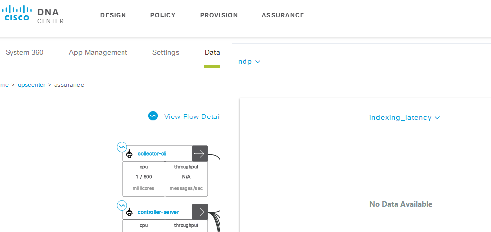

```shell
Request URL:https://172.18.137.134/api/ndp/v1/admin/metrics?metricNames=ndp.pipelineadmin.ESmetrics.ndp_docs_count&name=SEARCH&type=store&limit=30&startTime=2018-07-20T03%3A05%3A18.425Z&endTime=2018-07-20T03%3A35%3A18.425Z
```

# 仪表盘角度

核心类为com.cisco.maglev.server.services.ServiceImpl

从pipeline角度来看是AdminService类，主要方法是`oninit()`完成初始化，该方法注册了各种仪表盘和rest接口。

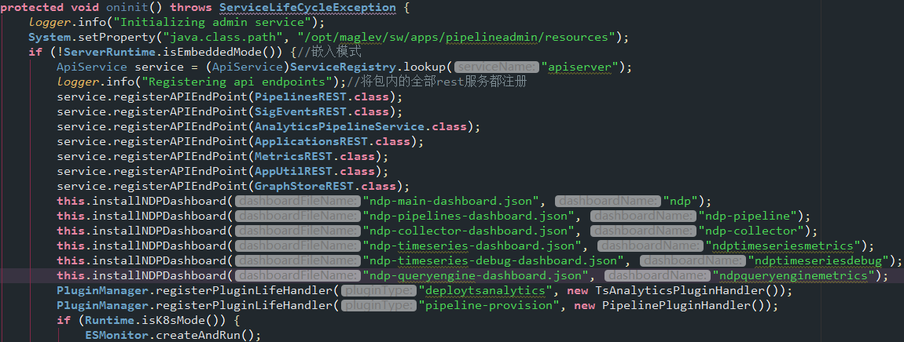

对照着Grafana界面来看正好对应。

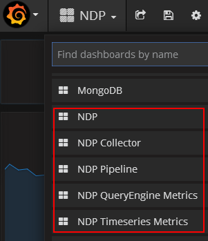

但是json文件可能是思科已经配置好了之后导出的模板。从NDP仪表盘分析来看，包括了每个子仪表盘的内容。

# DNA web角度

## pipeline

### API

在AdminConstants类中

```java
public static final String API = "/api";
public static final String PIPELINES_BASEPATH = "/ndp/admin/v1/pipelines/";
public static final String APPLICATIONS_BASEPATH = "/ndp/admin/v1/applications/";
public static final String TIMESERIESANALYTICS_BASEPATH = "/ndp/admin/v1/timeseries/pipelines";
public static final String METRICS_BASEPATH = "/ndp/admin/v1/metrics/";
public static final String SIGEVENTS_BASEPATH = "/ndp/admin/v1/sigevents/";
public static final String APP_BASEPATH = "/ndp/admin/v1/apps/";
public static final String GRAPH_STORE_BASEPATH = "/ndp/admin/v1/stores/graph/";
public static final String API_PIPELINES = "/api/ndp/admin/v1/pipelines/";
public static final String API_APPLICATIONS = "/api/ndp/admin/v1/applications/";
public static final String SERVER_UPLOAD_LOCATION_FOLDER = "/opt/maglev/share/ndp/pipelines/";
public static final String DEFAULT_TENANT_ID = "TNT0";
```

位置

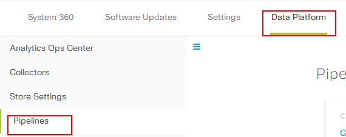

http请求

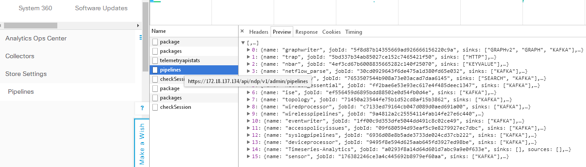

可以看到pipeline从PipelinesREST类中请求到了所有的任务列表，取出一个查看其详情

```http
https://172.18.137.134/api/ndp/v1/admin/pipelines/topology
```

该路径对应到类中表示获取的是运行时管道信息，即`PipelineDocument`

### 字段分析

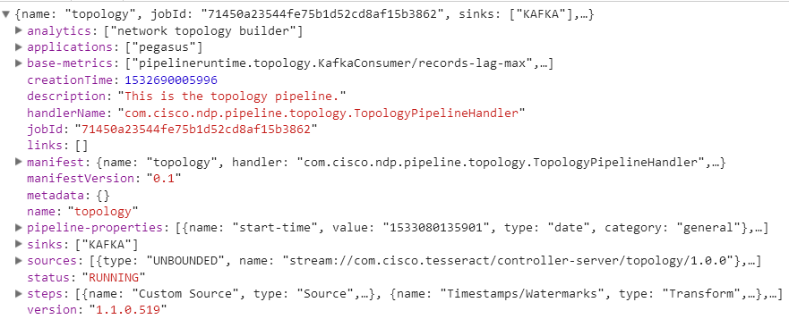

| 字段                | 类型                  | 说明                 |
| ------------------- | --------------------- | -------------------- |
| name                | `String`              | 管道名称             |
| runtime             | `String`              | 运行时间（缺失）     |
| jarLocation         | `String`              | jar包位置（缺失）    |
| jobId               | `String`              | jobID                |
| sinks               | `List<String>`        | 数据源               |
| sources             | `List<String>`        | 数据源类型           |
| manifestVersion     | `String`              | 清单版本             |
| handlerName         | `String`              | 处理器名称           |
| jobName             | `String`              | 任务名称（缺失）     |
| jobStatus           | `String`              | 任务当前状态（缺失） |
| status              | `String`              | 当前运行状态         |
| startTime           | `long`                | 任务开始时间（缺失） |
| endTime             | `long`                | 任务结束时间（缺失） |
| creationTime        | `long`                | 任务创建时间         |
| version             | `String`              | 版本号               |
| applications        | `List<String>`        | 对应DNA的应用名称    |
| analytics           | `List<String>`        | 未知，类似于功能说明 |
| pipeline-properties | `List<Property>`      | 属性                 |
| links               | `List<Link>`          | 未知（空值）         |
| description         | `String`              | 功能描述             |
| steps               | `List<PipelineStep>`  | 管道的步骤           |
| metadata            | `Map<String, String>` | 元信息（空值）       |
| baseMetrics         | `List<String>`        | 关联的统计值         |
| manifest            | `IPipelineManifest`   | 清单                 |

### 子字段说明

详细字段查看

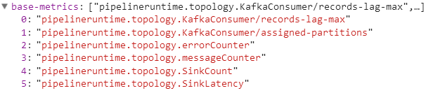

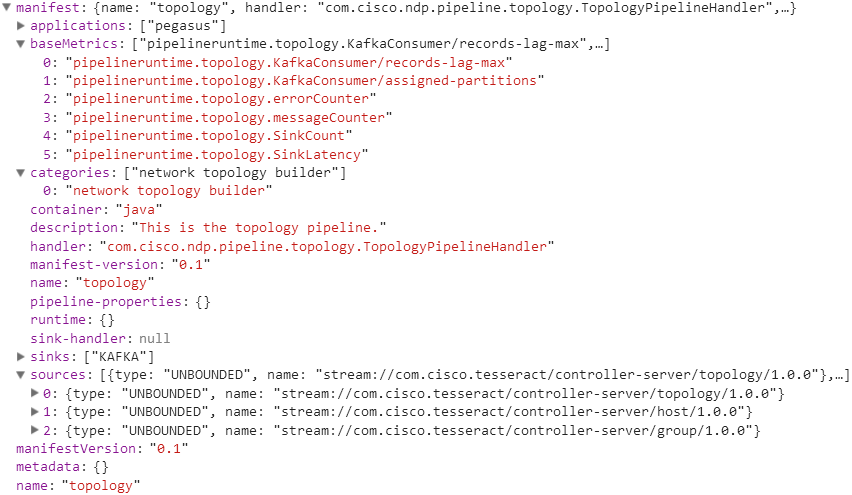

可以看到manifest的内容有部分和管道信息重复的

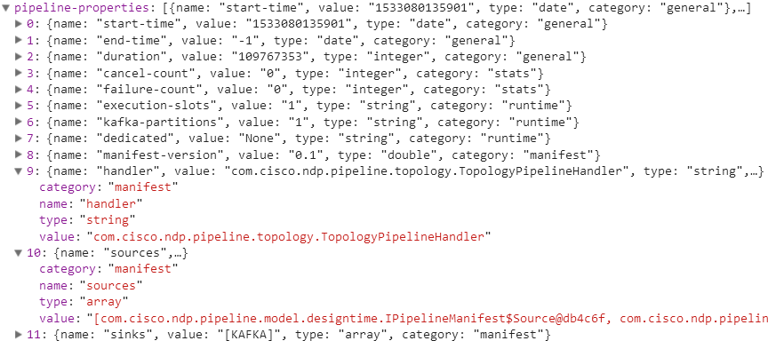

管道属性则更加丰富，具有管道的详细运行配置，有点类似于yarn的资源管理。

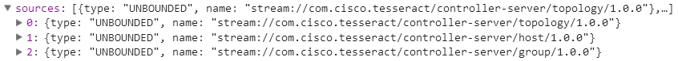

source表示数据源类型，UNBOUNDED表示流式数据，后面的地址，是用来请求并获取topic的配置。也就是说，NDP并不维护kafka的主题，而是应用程序在控制服务器中配置好，而NDP直接拉取。

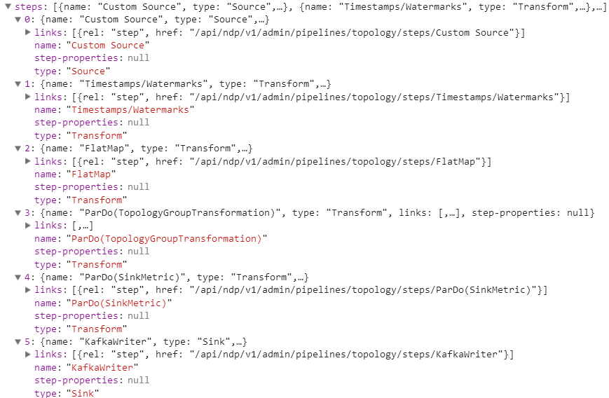

steps是比较有意思的，能够看到管道任务的详细处理流程，如果从Storm的角度来看，就会发现和Storm的Spout、Operater、State很像。这是beam做的一个优点，就是将统一的逻辑封装到一个步骤中。从用户体验角度来看，beam的风格比Spark更加友好，Spark自身也会分出步骤，不过是自动分的，beam就是一个可以自定义的方式，让用户能够充分感知到任务的运行，每一步都能够描述清楚。

### 监控信息

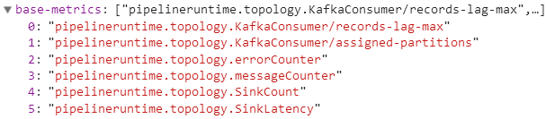

图中显示了6中监控，再看实际的web页面却有12种。

```java
ndp.pipelineruntime.topology.group.errorCounter 
ndp.pipelineruntime.topology.host.errorCounter 
ndp.pipelineruntime.topology.topology.errorCounter 
ndp.pipelineruntime.topology.group.messageCounter 
ndp.pipelineruntime.topology.host.messageCounter 
ndp.pipelineruntime.topology.topology.messageCounter 
ndp.pipelineruntime.topology.KAFKA:sinkMessageCount 
ndp.pipelineruntime.topology.SinkCount 
ndp.pipelineruntime.topology.Source:CustomSource.KafkaConsumer/assigned-partitions 
ndp.pipelineruntime.topology.Source:CustomSource.KafkaConsumer/bytes-consumed-rate 
ndp.pipelineruntime.topology.Source:CustomSource.KafkaConsumer/commit-latency-avg 
ndp.pipelineruntime.topology.Source:CustomSource.KafkaConsumer/commit-latency-max 
```

可以发现，对于web界面来说，让用户能够感知到每个管道任务的数据源发送情况和报错情况。而且报错从集群，宿主机和应用自身三方面来统计。

如果进行代码追踪，发现监控信息的取出来源是MetricsProxy类，这个类是负责从监控数据库中取出数据，关键的变量是

```java
private static String SERVICENAME = "influxdb";
private static String DEFAULT_DATABASE = "k8s";
```

其中influxdb是写死的，但是k8s却是可从外部传参数的。但是MetricsProxy类是一个专门用于取数据的类，监控的数据来源是什么呢？

### 监控数据来源

观察到有一个OpsCenterConstants类，运维中心常量

```java
public static final int HISTORY_SIZE_MINUTES = 2;
public static final String COLLECTOR_TYPE = "collector";
public static final String PIPELINE_TYPE = "pipeline";
public static final String ANALYTIC_PIPELINE_TYPE = "analytic_pipeline";
public static final String BUS_TYPE = "bus";
public static final String BOUNDED_TYPE = "bounded";
public static final String STORE_TYPE = "store";
public static final String READ_CONNECTOR = "read";
public static final String WRITE_CONNECTOR = "write";
public static final String STREAM_CONNECTOR = "stream";
public static final String COLLECTOR_SERVICE = "collector-manager";
public static final String COLLECTOR_VERSION = "0.7.0";
public static final String KAFKA = "KAFKA";
public static final String BUS_NAME = "Bus";
public static final String GRAPHSTREAM = "graphstream";
public static final String GRAPH_STORE = "GRAPH";
public static final String SEARCH_STORE = "SEARCH";
public static final String METRICS_STORE = "METRICS";
public static final String TRIGGER_STORE = "TRIGGERS";
public static final String KEY_VALUE_STORE = "KEYVALUE";
public static final int MIN_HEALTH = 0;
public static final int MED_HEALTH = 5;
public static final int MAX_HEALTH = 10;
public static final String CASSANDRA_CONTAINER = "cassandra";
public static final String ELASTICSEARCH_CONTAINER = "elasticsearch";
public static final String REDIS_CONTAINER = "redis";
public static final String MONGO_CONTAINER = "mongo";
public static final String KAFKA_CONTAINER = "kafka";
public static final HashMap<String, String> CONTAINER_MAP = new HashMap<String, String>() {
  {
    this.put("GRAPH", "cassandra"); //图表
    this.put("SEARCH", "elasticsearch"); //搜索
    this.put("METRICS", "cassandra"); //度量
    this.put("TRIGGERS", "elasticsearch"); //触发器
    this.put("KEYVALUE", "redis");
    this.put("KAFKA", "kafka");
  }
};
```

和web有关

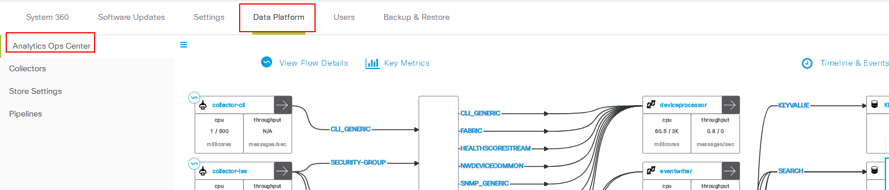

其中的Application的http请求是

```http
https://172.18.137.134/api/ndp/v1/admin/applications
```

正好是字段分析中的application字段监控目标


## package

准确说应该是接受到了package和packages两个响应

```http
https://172.18.137.134/api/system/v1/catalog/package
https://172.18.137.134/api/system/v1/maglev/packages
```

虽然请求路径不同，但是响应数据都是19个值

- **Underlying system infrastructure for DNA Center.** DNA中心的基础系统基础设施
  - System 
  - Provides underlying system infrastructure for DNA Center like application life cycle management, backup  restore,high availability, authentication, authorization, security,etc. It can be updated through system updates.
  - 为DNA中心应用程序生命周期管理、备份恢复、高可用性、认证、授权、安全等提供基础的系统基础结构，可以通过系统更新来更新。
- **UI platform for DNA Center** DNA中心的UI平台
  - DNAC UI 
  - Provides a UI platform for DNA Center.  This includes a plugin architecture with support for inter-plugin communication and extension, re-usable UI components, shared CSS styling, a common shell with support for routing between plugin views, and core services and frameworks allowing for persistence, telemetry, navigation, and customized topology and dashboard views.
  - 为DNA中心提供一个UI平台。这包括插件架构，支持插件间通信和扩展、可重用的UI组件、共享CSS样式、支持插件视图之间的路由的普通外壳、以及允许持久性、遥测、导航和定制的核心服务和框架。拓扑和仪表板视图。
- **Network Data Platform provides the core capabilities that are required for Network Analytics, such as Data Collectors, Analytics Pipeline, Correlation Engine, Temporal Datastore, etc.** 网络数据平台提供了网络分析所需的核心能力，如数据收集器、分析流水线、关联引擎、时态数据存储等。
  - Network Data Platform - Core 
- **Provides management and monitoring capabilities for Network Data Platform.** 为网络数据平台提供管理和监控能力。
  - Network Data Platform - Manager 
- **Provides services for correlated network graph.** 为关联网络图提供服务
  - Network Data Platform - Base Analytics 
- **Provides actionable insights and enables troubleshooting across switching, routing and wireless** 提供可操作的洞察力，并允许在切换、路由和无线上进行故障排除。
  - Assurance - Base 
  - Assurance Base package is a holistic network data analytics offering advanced monitoring and troubleshooting across wireless, switching and routing environments. It provides actionable insights into the health of the network, client and application, as well as resolution through enhanced visibility via analytics and leverage of industry-leading knowledge base. 
  - 保证基础包是一个整体的网络数据分析，提供先进的监测和故障诊断跨越无线，交换和路由环境。它提供了可操作的洞察网络、客户端和应用程序的健康，以及通过分析和利用行业领先的知识库的增强的可视性的解决方案。
- **Base infrastructure package to support other Network Controller Platform (NCP) components.** 
  - NCP - Base 
- **Core Services for Network Controller Platform (NCP).** 
  - NCP - Services 
  - Core Services for Network Controller Platform (NCP), such as File Service, Cache Service, Telemetry, Task and Scheduling Services. In general, all deployments of DNA Automation must include this package.  网络控制器平台（NCP）的核心服务，如文件服务、缓存服务、遥测、任务和调度服务。一般来说，DNA自动化的所有部署都必须包括这个包。 
- **A fundamental building block for all DNA Center Applications.** 所有DNA中心应用的基本构建块
  - Network Controller Platform 
  - A fundamental building block for DNA Automation, Network Controller Platform (NCP) offers capabilities such as such as Discovery, Inventory, Topology, Site and Grouping services, Site Profiles, etc.  DNA Center Applications will leverage these capabilities to interact with devices on the network, to provision, apply policies, or query the network. DNA自动化的基本构建块，网络控制器平台（NCP）提供诸如发现、库存、拓扑、站点和分组服务、站点配置文件等功能。DNA中心应用将利用这些能力与网络上的设备进行交互，提供应用策略或查询网络。
- **Automates the inspection and interrogation of flow in the network.** 网络流量自动检测与查询的自动化
  - Path Trace 
  - Path Trace package provides the capability in DNA Assurance to↵automate the inspection and interrogation of flow in the network. 路径跟踪包提供了DNA保证的能力，使网络中的流量的检查和查询自动化。
- **Manages software images and facilitates upgrades and updates on network entities.** 管理软件镜像并促进网络实体的升级和更新
  - Image Management 
  - Software Image Repository provides the ability to manage software images and facilitate upgrades and updates on physical and virtual network entities.  The capabilities of this package include maintaining an image repository of images and patches downloaded from multiple sources including cisco.com; identifying and tagging an image as the golden image per site, place-in-network,  and device family; highlighting devices which are not compliant with the golden image and providing a seamless and automatable upgrade process. 
  - 软件镜像库提供了管理软件镜像的能力，有助于物理和虚拟网络实体的升级和更新。这个包的功能包括维护从多个源下载的镜像和补丁的镜像库，包括cisco.com；识别和标记镜像作为每个站点的特别的golden、网络中的位置、设备簇；突出不符合特别镜像的设备并提供无缝和自动化的升级过程。
- **Initially configures devices using Network Plug and Play (PnP).** 使用网络即插即用功能初始化设备配置
  - Device Onboarding 
  - Device Onboarding package allows DNA Automation to enable initial↵configuration of devices using Network Plug and Play (PnP). 
  - 设备的新包允许DNA自动化，使初始配置的设备使用网络即插即用（PNP）。
- **Assigns devices to sites and provisions profiles on devices.** 给设备分配设备和设备上的配置文件
  - Automation - Base 
  - Base Automation provides functionalities that include device↵assignment to site and provisioning profiles on the network devices. 
  - 基础自动化提供功能，包括设备分配给站点和在网络设备上提供配置文件。
- **Executes read only commands on device from DNA Center.** 从DNA中心执行设备上的只读命令。
  - Command Runner 
  - Command Runner provides the capability to execute read only commands on device from DNA Center. It enhances the debugging capability of any↵network issue. User does not have to log in into the device to execute the command. 
  - 命令转接器提供从DNA中心执行设备上只读命令的能力。它增强了任何网络问题的调试能力。用户不必登录到设备来执行命令。
- **Device Onboarding UI package provides the Stand-alone PnP App UI in the Tools section of DNA-Center.** 设备上线 UI包提供了独立的即插即用的应用UI在工具包中
  - Device Onboarding UI 
- **Provisions campus fabric overlay and user access policy.** 提供园区网覆盖和用户权限校验
  - SD Access 
  - DNA Center automates SD Access, through provisioning of campus fabric overlay↵and user access policy, so organizations can make sure the right policies are↵established for any user or device with any application across the network. This package provides the SD Access automation workflows in DNA Center. 
  - DNA中心通过对园区网覆盖和用户访问策略的配置来自动化SD访问，因此机构可以确保为任何具有跨网络应用的用户或设备建立正确的策略。这个包提供了在DNA中心的SD访问自动化工作流程。
- **Automates policy-based application profiles.** 自动化基于策略的应用程序配置文件
  - Application Policy 
  - Application Policy is a central part of Cisco Digital Network Architecture. This package enables you to automate policy-based application profiles across the LAN, WAN, and Wireless aspects of your↵enterprise branch and campus. 
  - 应用策略是思科数字网络体系结构的核心部分。这个包使您能够跨企业、分支和校园的LAN、WAN和无线方面自动化基于策略的应用程序配置文件。
- **Sensor provisioning and image management features.** 传感器提供和镜像化管理特征
  - Automation - Sensor 
- **Analytics and Assurance capabilities for Sensors.** 传感器的分析和保证能力
  - Assurance - Sensor 

任意取出一个

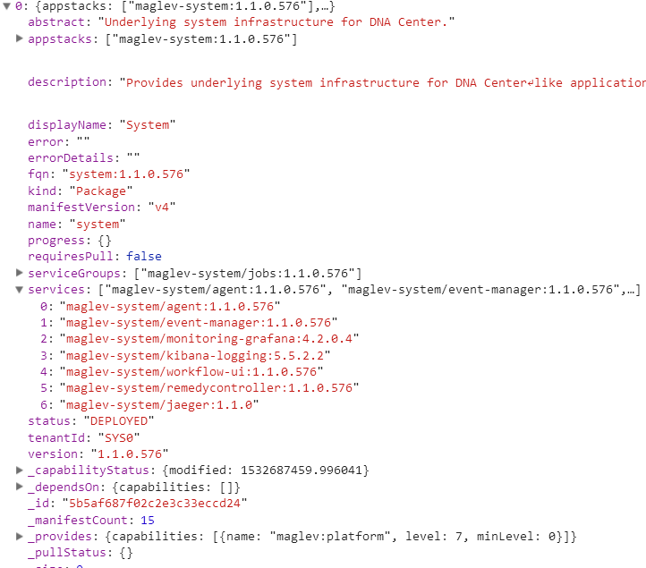

# pod

```sh
$ kubectl get pods --namespace ndp

NAME                                                  READY     STATUS    RESTARTS   AGE
broker-agent-kzxdr                                    1/1       Running   11         4d
cassandra-0                                           2/2       Running   3          4d
collector-agent-1660402592-jl86f                      1/1       Running   3          4d
collector-ise-4182723043-g3zfz                        1/1       Running   2          4d
collector-manager-3051537429-75pv1                    1/1       Running   3          4d
collector-netflow-3875400239-tmvth                    1/1       Running   4          4d
collector-snmp-2381561509-xnpqh                       1/1       Running   4          4d
collector-syslog-2423255726-45jv5                     1/1       Running   3          4d
collector-trap-3067551963-frn0k                       1/1       Running   4          4d
controller-server-1640545648-blx0k                    1/1       Running   5          4d
elasticsearch-0                                       2/2       Running   3          4d
kafka-0                                               3/3       Running   10         4d
mibs-container-4159032201-59rpp                       1/1       Running   1          4d
nls-3878266731-vq73q                                  1/1       Running   1          4d
pegasus-backend-4007026478-70jkw                      1/1       Running   1          4d
pipelineadmin-2448704045-953p9                        1/1       Running   5          4d
pipelineruntime-jobmgr-1315079752-bs0tq               1/1       Running   5          4d
pipelineruntime-taskmgr-11400242-j5pgz                1/1       Running   4          4d
pipelineruntime-taskmgr-11400242-k2vbl                1/1       Running   5          4d
pipelineruntime-taskmgr-data-1810620490-c5q70         1/1       Running   3          4d
pipelineruntime-taskmgr-large-2732540983-7qgqr        1/1       Running   3          4d
pipelineruntime-taskmgr-timeseries-3618073072-nrdqw   1/1       Running   4          4d
queryengine-135067444-ths96                           1/1       Running   2          4d
redis-0                                               1/1       Running   1          4d
schemaregistry-1015499005-88t4p                       1/1       Running   5          4d
writestore-1904045626-296rj                           1/1       Running   5          4d
```

## pipelineadmin

```sh
$ kubectl describe pod --namespace ndp pipelineadmin-2448704045-953p9
Name:		pipelineadmin-2448704045-953p9
Namespace:	ndp
Node:		172.18.137.134/172.18.137.134
Start Time:	Sat, 28 Jul 2018 16:33:13 +0000
Labels:		pod-template-hash=2448704045
		serviceName=pipelineadmin
		tier=application
		version=1.1.0.574
Annotations:	kubernetes.io/created-by={"kind":"SerializedReference","apiVersion":"v1","reference":{"kind":"ReplicaSet","namespace":"ndp","name":"pipelineadmin-2448704045","uid":"69dc4ca0-918c-11e8-9a80-28ac9ee8162...
Status:		Running
IP:		10.1.3.34
Created By:	ReplicaSet/pipelineadmin-2448704045
Controlled By:	ReplicaSet/pipelineadmin-2448704045
Containers:
  pipelineadmin:
    Container ID:	docker://b872fa1c9117590947a06e172606ef69d3a6cda781a9517505d5795f3b454355
    Image:		maglev-registry.maglev-system.svc.cluster.local:5000/ndp/pipelineadmin:1.1.0.574
    Image ID:		docker-pullable://maglev-registry.maglev-system.svc.cluster.local:5000/ndp/pipelineadmin@sha256:4cb521ff51d9c52ec1abfdee345b648a15c9e643f6aed100fc2c4bafa67e0a72
    Port:		8005/TCP
    State:		Running
      Started:		Tue, 31 Jul 2018 23:34:22 +0000
    Last State:		Terminated
      Reason:		Completed
      Exit Code:	0
      Started:		Sat, 28 Jul 2018 16:50:29 +0000
      Finished:		Tue, 31 Jul 2018 23:34:20 +0000
    Ready:		True
    Restart Count:	5
    Limits:
      cpu:	600m
      memory:	2Gi
    Requests:
      cpu:	500m
      memory:	2Gi
    Environment:
      MAGLEV_PLUGIN_CATALOG:		/var/maglev/appstack/ndp/plugin-catalog
      POD_ID:				
      POD_NAMESPACE:			ndp (v1:metadata.namespace)
      POD_SUBNET:			10.1.0.0/21
      CLUSTER_SERVICE_SUBNET:		10.2.0.0/21
      DNS_SERVICE_IP:			10.2.0.10
      POD_IP:				 (v1:status.podIP)
      POD_NAME:				pipelineadmin-2448704045-953p9 (v1:metadata.name)
      CPU_REQUESTS:			500 (requests.cpu)
      CPU_LIMITS:			600 (limits.cpu)
      MEMORY_LIMITS:			2048 (limits.memory)
      MEMORY_REQUESTS:			2048 (requests.memory)
      PROFILE_NAME:			medium
      CONTAINER_NAME:			pipelineadmin
      CONFIG_FILE:			/config/maglev.conf
      VAULT_DIR:			/vault
      CLOUD_PROVIDER:			None
      K8S:				true
      MANAGED_MONGO_STORE:		maglev-system
      HTTP_IDLE_TIMEOUT_IN_MILLIS:	200000
      JVM_OPTS:				-Dnetworkaddress.cache.ttl=120
      MEM_RATIO:			0.7
      FLINK_RECOVERY:			True
      MetaSize:				512m
      CEP_SINK_PARELLELISM:		4
      PIPELINE_RUNTIME_SERVICENAME:	pipelineruntime-jobmgr
      BYPASS_SECURITY:			True
    Mounts:
      /etc/ssl/certs from etcsslcerts (ro)
      /opt/maglev/share/ndp/pipelines from data (rw)
      /opt/maglev/srv/diagnostics from diagnostics (rw)
      /var/maglev/appstack/ndp/plugin-catalog from plugin-catalog (ro)
      /var/run/secrets/kubernetes.io/serviceaccount from default-token-wzr0b (ro)
      /vault from vault (ro)
Conditions:
  Type		Status
  Initialized 	True 
  Ready 	True 
  PodScheduled 	True 
Volumes:
  vault:
    Type:	Secret (a volume populated by a Secret)
    SecretName:	vault
    Optional:	false
  etcsslcerts:
    Type:	HostPath (bare host directory volume)
    Path:	/etc/ssl/certs
  plugin-catalog:
    Type:	HostPath (bare host directory volume)
    Path:	/mnt/glusterfs/default_vol
  diagnostics:
    Type:	HostPath (bare host directory volume)
    Path:	/data/maglev/srv/diagnostics/ndp/pipelineadmin
  data:
    Type:	HostPath (bare host directory volume)
    Path:	/mnt/glusterfs/default_vol
  default-token-wzr0b:
    Type:	Secret (a volume populated by a Secret)
    SecretName:	default-token-wzr0b
    Optional:	false
QoS Class:	Burstable
Node-Selectors:	<none>
Tolerations:	node.alpha.kubernetes.io/notReady:NoExecute for 300s
		node.alpha.kubernetes.io/unreachable:NoExecute for 300s
Events:		<none>
```

