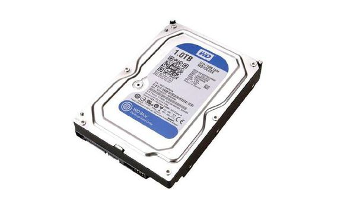
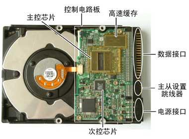
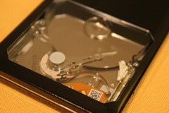
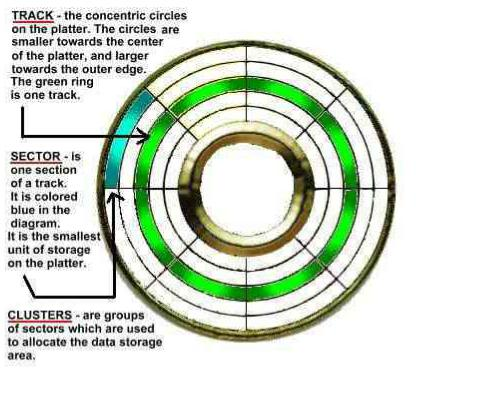
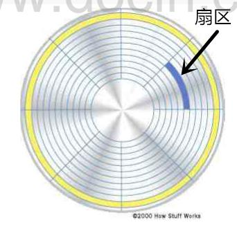
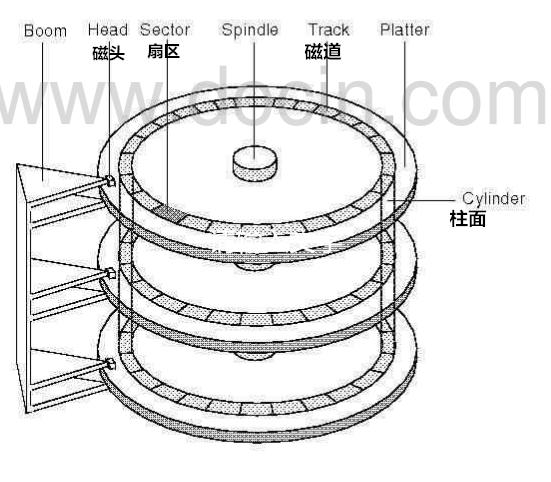
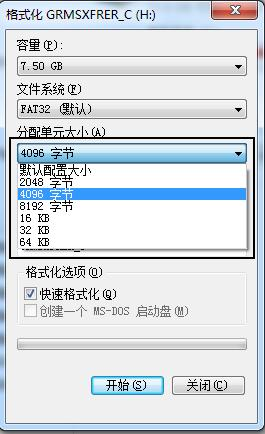

在我们的生活和工作中离不开硬盘，大家也会用它，不需要知道它的工作原理。当然，也有一些喜欢钻研的朋友有兴趣想了解它是个什么物件，比较好奇，但是由于不是从事计算机方面工作的，所以有些摸不透。不用着急，我会用尽量通俗易懂的文字来帮朋友们理解下这个有记忆功能的“板砖”——硬盘。

首先，我们都知道硬盘是这个样子的（常见的有西数WD和希捷），外行的朋友了解的也仅此而已。

其实，它的内部结构是非常的精密的，没有专业知识和设备，拆开就报废，因为内部是真空状态（为了减少摩擦，增加运转速度）。

以上是硬盘的大致结构，下面我通过几个问题分开细说。
硬盘如何运转的？

磁头：做径向运动——沿着半径来回运动，轨迹是固定的。
盘片：做圆周运动——就像DVD的光盘一样的转动。
可以想象下，只要通过这两者的运动，就可以定位到光盘的任何一块，数据是存在盘片上的，磁头则负责写和读。

磁头怎么写和读？
首先我们得有个概念就是电脑里面的所有你看到的文件其实本质上都是二进制代码组成，0和1，那么到了电路这块，我们通常就用高电位和低电位来代表0和1，那么盘片是怎么存储数据的呢？其实盘片上面是涂有磁性介质的，跟磁带一个原理，用磁极来代表二进制，我们知道磁极有S极和N极，磁头来改变盘片上磁性介质的磁极，所以我们的硬盘可以反复使用。
盘片是怎么分块的？

每个硬盘都会有多个盘片，每个盘片上分割如图，呈同心圆环状，圆圈就是磁道，每个磁道被等分为以512个字节为单位的若干个弧段，这些弧段便是磁盘的扇区，每个扇区可以存放512个字节的信息，扇区就是磁盘的最小单位了。

  这里有比较有争议的问题：每个磁道的扇区数是不是一样的？
一种说法是：每个磁道扇区数相同，磁盘以恒定的转速运转，也就是每一磁盘扇区的角速度是相同的，但不同半径的扇区的线速度是不同的。
另外一种是：每个磁道扇区数不同，外圈比内圈多。
下面是百科的说法：
在一些硬盘的参数列表上你可以看到描述每个磁道的扇区数的参数，它通常用一个范围标识，例如373～746，这表示，最外圈的磁道有746个扇区，而最里面的磁道有373个扇区，因此可以算出来，磁道的容量分别是从186.5KB到373KB(190976B--381952B)
所以，每个磁道的扇区数不一定相同，主要是因为硬盘的刻录的技术不同。

硬盘怎么计算容量？
我们都知道硬盘有500G、1T、2T等，这个大小都是可以算出来的。
计算公式为： 存储容量＝磁头数×磁道（柱面）数×每道扇区数×每扇区字节数

磁头数：每个盘片正反两面都可以写数据，所以每一片盘片都有2个磁头，磁头数=盘面数=盘片数 * 2。

磁道数：也即柱面数，每个盘的磁道由外向内，从“0”开始编号，所有盘片的相同编号或者相同半径的磁道组成的集合就是柱面，从上往下就像一个圆柱体，磁道数=柱面数。

扇区数：这个需要参考硬盘本身，扇区数越多，容量就越大。每个扇区的字节数就是512个字节。  

如何定位磁盘的每个区域？
只需要知道CHS数就能定位到数据在哪个盘面的哪个扇区。
CHS，即Cylinder（柱面）、Head（磁头）、Sector（扇区）

什么是“簇”？
簇”是DOS进行分配的最小单位。当创建一个很小的文件时，如是1个字节，则它在磁盘上并不是只占一个字节的空间，而是占有整个一簇。簇是文件系统虚拟的格式，不像扇区是实际存在的。在NTFS文件系统中，簇的大小会影响到磁盘文件的排列，设置适当的簇大小可以减少磁盘空间丢失和分区上碎片的数量。如果簇设置过大，会影响到磁盘存储 效率;反之如果设置过小，虽然会提高利用效率，但是会产生大量磁盘碎片。

注意：不同的存储介质，不同容量的硬盘，不同的DOS版本，簇的大小也不一样。 