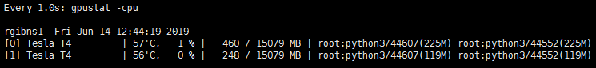

# GPU监控

##nvidia-smi

nvidia-smi是 Nvidia 显卡命令行管理套件，基于 NVML 库，旨在管理和监控 Nvidia GPU 设备。

```shell
nvidia-smi
```


这是 nvidia-smi 命令的输出，其中最重要的两个指标：

- 显存占用
- GPU 利用率

显存占用和 GPU 利用率是两个不一样的东西，显卡是由 GPU 计算单元和显存等组成的，显存和 GPU 的关系有点类似于内存和 CPU 的关系。

显示的表格中：

Fan：                     风扇转速（0%--100%），N/A表示没有风扇

Temp：                 GPU温度（GPU温度过高会导致GPU频率下降）

Perf：                    性能状态，从P0（最大性能）到P12（最小性能）

Pwr：                     GPU功耗

Persistence-M：   持续模式的状态（持续模式耗能大，但在新的GPU应用启动时花费时间更少）

Bus-Id：               GPU总线，`domain​:bus:​device.function`

Disp.A：                Display Active，表示GPU的显示是否初始化

Memory-Usage：显存使用率

Volatile GPU-Util：GPU使用率

ECC：                   是否开启错误检查和纠正技术，0/DISABLED, 1/ENABLED

Compute M.：     计算模式，0/DEFAULT,1/EXCLUSIVE_PROCESS,2/PROHIBITED

------

附加选项：

nvidia-smi –i xxx

指定某个GPU

nvidia-smi –l xxx

动态刷新信息（默认5s刷新一次），按Ctrl+C停止，可指定刷新频率，以秒为单位

nvidia-smi –f xxx

将查询的信息输出到具体的文件中，不在终端显示

##gpustat 

gpustat 基于nvidia-smi，可以提供更美观简洁的展示，结合 watch 命令，可以动态实时监控GPU 的使用情况。

```shell
pip3 install -i https://pypi.tuna.tsinghua.edu.cn/simple gpustat
watch --color -n1 gpustat -cpu
```


显存可以看成是空间，类似于内存。

- 显存用于存放模型，数据
- 显存越大，所能运行的网络也就越大

GPU 计算单元类似于 CPU 中的核，用来进行数值计算。衡量计算量的单位是 flop： the number of floating-point multiplication-adds，浮点数先乘后加算一个 flop。计算能力越强大，速度越快。衡量计算能力的单位是 flops： 每秒能执行的 flop 数量

```shell
1*2+3 # 1个flop
12+34+4*5 # 3个flop
```

在深度学习中会用到各种各样的数值类型，数值类型命名规范一般为TypeNum，比如 Int64、Float32、Double64。

- Type：有 Int，Float，Double 等
- Num: 一般是 8，16，32，64，128，表示该类型所占据的比特数目

常用的数值类型如下图所示：


其中 Float32 是在深度学习中最常用的数值类型，称为单精度浮点数，每一个单精度浮点数占用 4Byte 的显存。

举例来说：有一个 1000x1000 的 矩阵，float32，那么占用的显存差不多就是

> 1000x1000x4 Byte = 4MB

32x3x256x256 的四维数组（BxCxHxW）占用显存为：24M

# GPU加速

使用方法：tf.device(‘/cpu:0’)或tf.device(‘/gpu:0’)。

```shell
import tensorflow as tf

with tf.device('/cpu:0'):
    a = tf.constant([1.,2.,3.],shape=[3],name='a')
    b = tf.constant([2.,3.,4.],shape=[3],name='b')
with tf.device('/gpu:0'):
    c = a + b

sess = tf.Session(config=tf.ConfigProto(log_device_placement=True))
sess.run(c)
```

运行结果：

```shell
2019-06-13 17:37:10.031128: I tensorflow/compiler/xla/service/service.cc:150] XLA service 0x5c21980 executing computations on platform CUDA. Devices:
2019-06-13 17:37:10.031202: I tensorflow/compiler/xla/service/service.cc:158]   StreamExecutor device (0): Tesla T4, Compute Capability 7.5
2019-06-13 17:37:10.031226: I tensorflow/compiler/xla/service/service.cc:158]   StreamExecutor device (1): Tesla T4, Compute Capability 7.5
2019-06-13 17:37:10.036025: I tensorflow/core/platform/profile_utils/cpu_utils.cc:94] CPU Frequency: 2200205000 Hz
2019-06-13 17:37:10.044162: I tensorflow/compiler/xla/service/service.cc:150] XLA service 0x5d5fdb0 executing computations on platform Host. Devices:
2019-06-13 17:37:10.044208: I tensorflow/compiler/xla/service/service.cc:158]   StreamExecutor device (0): <undefined>, <undefined>
2019-06-13 17:37:10.044904: I tensorflow/core/common_runtime/gpu/gpu_device.cc:1433] Found device 0 with properties: 
name: Tesla T4 major: 7 minor: 5 memoryClockRate(GHz): 1.59
pciBusID: 0000:05:00.0
totalMemory: 14.73GiB freeMemory: 14.60GiB
2019-06-13 17:37:10.045397: I tensorflow/core/common_runtime/gpu/gpu_device.cc:1433] Found device 1 with properties: 
name: Tesla T4 major: 7 minor: 5 memoryClockRate(GHz): 1.59
pciBusID: 0000:84:00.0
totalMemory: 14.73GiB freeMemory: 14.60GiB
2019-06-13 17:37:10.045563: I tensorflow/core/common_runtime/gpu/gpu_device.cc:1512] Adding visible gpu devices: 0, 1
2019-06-13 17:37:10.048288: I tensorflow/core/common_runtime/gpu/gpu_device.cc:984] Device interconnect StreamExecutor with strength 1 edge matrix:
2019-06-13 17:37:10.048320: I tensorflow/core/common_runtime/gpu/gpu_device.cc:990]      0 1 
2019-06-13 17:37:10.048334: I tensorflow/core/common_runtime/gpu/gpu_device.cc:1003] 0:   N N 
2019-06-13 17:37:10.048346: I tensorflow/core/common_runtime/gpu/gpu_device.cc:1003] 1:   N N 
2019-06-13 17:37:10.049316: I tensorflow/core/common_runtime/gpu/gpu_device.cc:1115] Created TensorFlow device (/job:localhost/replica:0/task:0/device:GPU:0 with 14202 MB memory) -> physical GPU (device: 0, name: Tesla T4, pci bus id: 0000:05:00.0, compute capability: 7.5)
2019-06-13 17:37:10.049881: I tensorflow/core/common_runtime/gpu/gpu_device.cc:1115] Created TensorFlow device (/job:localhost/replica:0/task:0/device:GPU:1 with 14202 MB memory) -> physical GPU (device: 1, name: Tesla T4, pci bus id: 0000:84:00.0, compute capability: 7.5)
Device mapping:
/job:localhost/replica:0/task:0/device:XLA_GPU:0 -> device: XLA_GPU device
/job:localhost/replica:0/task:0/device:XLA_GPU:1 -> device: XLA_GPU device
/job:localhost/replica:0/task:0/device:XLA_CPU:0 -> device: XLA_CPU device
/job:localhost/replica:0/task:0/device:GPU:0 -> device: 0, name: Tesla T4, pci bus id: 0000:05:00.0, compute capability: 7.5
/job:localhost/replica:0/task:0/device:GPU:1 -> device: 1, name: Tesla T4, pci bus id: 0000:84:00.0, compute capability: 7.5
2019-06-13 17:37:10.058346: I tensorflow/core/common_runtime/direct_session.cc:317] Device mapping:
/job:localhost/replica:0/task:0/device:XLA_GPU:0 -> device: XLA_GPU device
/job:localhost/replica:0/task:0/device:XLA_GPU:1 -> device: XLA_GPU device
/job:localhost/replica:0/task:0/device:XLA_CPU:0 -> device: XLA_CPU device
/job:localhost/replica:0/task:0/device:GPU:0 -> device: 0, name: Tesla T4, pci bus id: 0000:05:00.0, compute capability: 7.5
/job:localhost/replica:0/task:0/device:GPU:1 -> device: 1, name: Tesla T4, pci bus id: 0000:84:00.0, compute capability: 7.5

add: (Add): /job:localhost/replica:0/task:0/device:GPU:0
2019-06-13 17:37:10.061066: I tensorflow/core/common_runtime/placer.cc:1059] add: (Add)/job:localhost/replica:0/task:0/device:GPU:0
a: (Const): /job:localhost/replica:0/task:0/device:CPU:0
2019-06-13 17:37:10.061099: I tensorflow/core/common_runtime/placer.cc:1059] a: (Const)/job:localhost/replica:0/task:0/device:CPU:0
b: (Const): /job:localhost/replica:0/task:0/device:CPU:0
2019-06-13 17:37:10.061118: I tensorflow/core/common_runtime/placer.cc:1059] b: (Const)/job:localhost/replica:0/task:0/device:CPU:0
```

该日志中信息如下：

- 发现服务器中有两个GPU可用，打印GPU信息；
- 将所有可见GPU都加入运算；
- 创建TensorFlow逻辑GPU和真实物理GPU的映射关系；
- 显示TensorFlow中所有的逻辑GPU和CPU；
- 开始运算：a和b的赋值操作在CPU上完成，add操作在GPU上完成。

------

在默认情况下，即使机器有多个cpu，Tensorflow也不会去区分它们，统一使用/cpu:0。

而同一台机器上不同GPU的名称是不同的，如/gpu:0，/gpu:1等。

默认情况下，Tensorflow优先使用GPU。

需要注意的是，在Tensorflow上，不是所有的操作都可以放在GPU上的，如：

```python
import tensorflow as tf

a_cpu = tf.Variable(0,name='a_cpu')
with tf.device('/gpu:0'):
    a_gpu = tf.Variable(0,name='a_gpu')

with tf.Session(config=tf.ConfigProto(log_device_placement=True)) as sess:
    sess.run(tf.initialize_all_variables())
```

则会报错如下：

```shell
InvalidArgumentError (see above for traceback): Cannot assign a device for operation a_gpu: Could not satisfy explicit device specification '/device:GPU:0' because no supported kernel for GPU devices is available.
Colocation Debug Info:
Colocation group had the following types and devices: 
Assign: CPU 
Identity: GPU CPU XLA_CPU XLA_GPU 
VariableV2: CPU 

Colocation members and user-requested devices:
  a_gpu (VariableV2) /device:GPU:0
  a_gpu/Assign (Assign) /device:GPU:0
  a_gpu/read (Identity) /device:GPU:0

Registered kernels:
  device='GPU'; dtype in [DT_INT64]
  device='GPU'; dtype in [DT_DOUBLE]
  device='GPU'; dtype in [DT_FLOAT]
  device='GPU'; dtype in [DT_HALF]
  device='CPU'

	 [[node a_gpu (defined at demo.py:5) ]]
```

为了避免这个问题，可以在生成Session时指定allow_soft_placement=True，当运算无法在GPU上执行时，会自动将运算放到CPU上。用法：

```python
sess = tf.Session(config=tf.ConfigProto(log_device_placement=True,allow_soft_placement=True))
```

------

Tensorflow会默认占用设备所有GPU以及每个GPU上的显存，如果只使用部分GPU可以：

（注：虽然占用所有GPU，但是会优先使用/GPU:0）

```python
#命令行用法
CUDA_VISIBLE_DEVICES=0,1 python demo.py
```

或者

```python
#在代码中使用
import os
os.environ['CUDA_VISIBLE_DEVICES'] = '0,1'
```

TensorFlow默认一次性占用GPU的所有显存，但是也支持动态分配GPU的显存，使得不会一开始就占满所有显存。

```python
config = tf.ConfigProto()
config.gpu_options.allow_growth = True
#也可以直接按固定的比例分配
#config.gpu_options.per_process_gpu_memory_fraction = 0.4
sess = tf.Session(config=config)
```

总结几个参数

- log_device_placement：将运行每一个操作的设备输出到屏幕上。
- allow_soft_placement：将GPU上不能运行的运算自动放到CPU上运行。
- allow_growth：动态分配GPU显存。
- per_process_gpu_memory_fraction：按比例分配GPU显存。

# 使用多GPU

也可以称为多塔式方式，其中每个塔都会分配给不同 GPU。

##指定GPU的方式

如果你想让 TensorFlow 在多个 GPU 上运行, 你可以建立 multi-tower 结构, 在这个结构 里每个 tower 分别被指配给不同的 GPU 运行. 比如:

```python
import tensorflow as tf
# 新建一个 graph.
c = []
for d in ['/gpu:0', '/gpu:1']:
  with tf.device(d):
    a = tf.constant([1.0, 2.0, 3.0, 4.0, 5.0, 6.0], shape=[2, 3])
    b = tf.constant([1.0, 2.0, 3.0, 4.0, 5.0, 6.0], shape=[3, 2])
    c.append(tf.matmul(a, b))
with tf.device('/cpu:0'):
  sum = tf.add_n(c)
# 新建session with log_device_placement并设置为True.
sess = tf.Session(config=tf.ConfigProto(log_device_placement=True))
# 运行这个op.
print(sess.run(sum))
```

在运行结果的日志中，找到关于各个操作的说明：

```shell
MatMul: (MatMul): /job:localhost/replica:0/task:0/device:GPU:0
2019-06-14 09:50:44.365093: I tensorflow/core/common_runtime/placer.cc:1059] MatMul: (MatMul)/job:localhost/replica:0/task:0/device:GPU:0
MatMul_1: (MatMul): /job:localhost/replica:0/task:0/device:GPU:1
2019-06-14 09:50:44.365131: I tensorflow/core/common_runtime/placer.cc:1059] MatMul_1: (MatMul)/job:localhost/replica:0/task:0/device:GPU:1
AddN: (AddN): /job:localhost/replica:0/task:0/device:CPU:0
2019-06-14 09:50:44.365158: I tensorflow/core/common_runtime/placer.cc:1059] AddN: (AddN)/job:localhost/replica:0/task:0/device:CPU:0
Const: (Const): /job:localhost/replica:0/task:0/device:GPU:0
2019-06-14 09:50:44.365178: I tensorflow/core/common_runtime/placer.cc:1059] Const: (Const)/job:localhost/replica:0/task:0/device:GPU:0
Const_1: (Const): /job:localhost/replica:0/task:0/device:GPU:0
2019-06-14 09:50:44.365196: I tensorflow/core/common_runtime/placer.cc:1059] Const_1: (Const)/job:localhost/replica:0/task:0/device:GPU:0
Const_2: (Const): /job:localhost/replica:0/task:0/device:GPU:1
2019-06-14 09:50:44.365214: I tensorflow/core/common_runtime/placer.cc:1059] Const_2: (Const)/job:localhost/replica:0/task:0/device:GPU:1
Const_3: (Const): /job:localhost/replica:0/task:0/device:GPU:1
2019-06-14 09:50:44.365231: I tensorflow/core/common_runtime/placer.cc:1059] Const_3: (Const)/job:localhost/replica:0/task:0/device:GPU:1
[[ 44.  56.]
 [ 98. 128.]]
```

日志和代码效果一致，a、b和c操作都在GPU上运行，sum操作在CPU上运行。

## 非指定GPU的方式

大多数时候，我们只能确定要用几个GPU，而不想一直在代码中修改GPU的名称，因此下面给出例子，讲解如何仅指定GPU数量来运行多GPU算法。

```python
import tensorflow as tf
c = []
for i in range(num_gpus):
    with tf.device("/gpu:%d" % i):
        with tf.name_scope("tower_%d" % i):
            a = tf.constant([1.0, 2.0, 3.0, 4.0, 5.0, 6.0], shape=[2, 3])
            b = tf.constant([1.0, 2.0, 3.0, 4.0, 5.0, 6.0], shape=[3, 2])
            c.append(tf.matmul(a, b))
with tf.device("cpu:0"):
    sum = tf.add_n(c)
sess = tf.Session(config=tf.ConfigProto(log_device_placement=True))
print(sess.run(sum))
```

输出结果为：

```shell
tower_0/MatMul: (MatMul): /job:localhost/replica:0/task:0/device:GPU:0
2019-06-14 10:53:24.509237: I tensorflow/core/common_runtime/placer.cc:1059] tower_0/MatMul: (MatMul)/job:localhost/replica:0/task:0/device:GPU:0
tower_1/MatMul: (MatMul): /job:localhost/replica:0/task:0/device:GPU:1
2019-06-14 10:53:24.509265: I tensorflow/core/common_runtime/placer.cc:1059] tower_1/MatMul: (MatMul)/job:localhost/replica:0/task:0/device:GPU:1
AddN: (AddN): /job:localhost/replica:0/task:0/device:CPU:0
2019-06-14 10:53:24.509286: I tensorflow/core/common_runtime/placer.cc:1059] AddN: (AddN)/job:localhost/replica:0/task:0/device:CPU:0
tower_0/Const: (Const): /job:localhost/replica:0/task:0/device:GPU:0
2019-06-14 10:53:24.509305: I tensorflow/core/common_runtime/placer.cc:1059] tower_0/Const: (Const)/job:localhost/replica:0/task:0/device:GPU:0
tower_0/Const_1: (Const): /job:localhost/replica:0/task:0/device:GPU:0
2019-06-14 10:53:24.509323: I tensorflow/core/common_runtime/placer.cc:1059] tower_0/Const_1: (Const)/job:localhost/replica:0/task:0/device:GPU:0
tower_1/Const: (Const): /job:localhost/replica:0/task:0/device:GPU:1
2019-06-14 10:53:24.509341: I tensorflow/core/common_runtime/placer.cc:1059] tower_1/Const: (Const)/job:localhost/replica:0/task:0/device:GPU:1
tower_1/Const_1: (Const): /job:localhost/replica:0/task:0/device:GPU:1
2019-06-14 10:53:24.509358: I tensorflow/core/common_runtime/placer.cc:1059] tower_1/Const_1: (Const)/job:localhost/replica:0/task:0/device:GPU:1
[[ 44.  56.]
 [ 98. 128.]]
```

在日志中我们能够看到操作都是以tower作用域划分，在不同作用域下的变量名称不同。

## 更通俗的例子

关于多gpu训练,tf并没有给太多的学习资料，比较官方的只有：tensorflow-models/tutorials/image/cifar10/cifar10_multi_gpu_train.py

但代码比较简单，只是针对cifar做了数据并行的多gpu训练，利用到的layer、activation类型不多，针对更复杂网络的情况，并没有给出指导。自己摸了不少坑之后，算是基本走通了，在此记录下

 一、思路

单GPU时，思路很简单，前向、后向都在一个GPU上进行，模型参数更新时只涉及一个GPU。多GPU时，有模型并行和数据并行两种情况。模型并行指模型的不同部分在不同GPU上运行。数据并行指不同GPU上训练数据不同，但模型是同一个（相当于是同一个模型的副本）。在此只考虑数据并行，这个在tf的实现思路如下：

模型参数保存在一个指定gpu/cpu上，模型参数的副本在不同gpu上，每次训练，提供batch_size*gpu_num数据，并等量拆分成多个batch，分别送入不同GPU。前向在不同gpu上进行，模型参数更新时，将多个GPU后向计算得到的梯度数据进行平均，并在指定GPU/CPU上利用梯度数据更新模型参数。

假设有两个GPU（gpu0,gpu1），模型参数实际存放在cpu0上，实际一次训练过程如下图所示：


二、tf代码实现

大部分需要修改的部分集中在构建计算图上，假设在构建计算图时，数据部分基于tensorflow1.4版本的dataset类，那么代码要按照如下方式编写：

```python
next_img, next_label = iterator.get_next()
image_splits = tf.split(next_img, num_gpus)
label_splits = tf.split(next_label, num_gpus)
tower_grads = []
tower_loss = []
counter = 0
for d in self.gpu_id:
    with tf.device('/gpu:%s' % d):
        with tf.name_scope('%s_%s' % ('tower', d)):
            cross_entropy = build_train_model(image_splits[counter], label_splits[counter], for_training=True)
            counter += 1
            with tf.variable_scope("loss"):
                grads = opt.compute_gradients(cross_entropy)
                tower_grads.append(grads)
                tower_loss.append(cross_entropy)
                tf.get_variable_scope().reuse_variables()

mean_loss = tf.stack(axis=0, values=tower_loss)
mean_loss = tf.reduce_mean(mean_loss, 0)
mean_grads = util.average_gradients(tower_grads)
update_ops = tf.get_collection(tf.GraphKeys.UPDATE_OPS)
with tf.control_dependencies(update_ops):
    train_op = opt.apply_gradients(mean_grads, global_step=global_step)
```

第1行得到image和对应label

第2-3行对image和label根据使用的gpu数量做平均拆分（默认两个gpu运算能力相同，如果gpu运算能力不同，可以自己设定拆分策略）

第 4-5行，保存来自不同GPU计算出的梯度、loss列表

第7-16行，开始在每个GPU上创建计算图，最重要的是14-16三行，14，15把当前GPU计算出的梯度、loss值append到列表后，以便后续计算平均值。16行表示同名变量将会复用，这个是什么意思呢？假设现在gpu0上创建了两个变量var0，var1，那么在gpu1上创建计算图的时候，如果还有var0和var1，则默认复用之前gpu0上的创建的那两个值。

第18-20行计算不同GPU获取的grad、loss的平均值，其中第20行使用了cifar10_multi_gpu_train.py中的函数。

第23行利用梯度平均值更新参数。

------

注意：上述代码中，所有变量(vars)都放在了第一个GPU上，运行时会发现第一个GPU占用的显存比其他GPU多一些。如果想把变量放在CPU上，则需要在创建计算图时，针对每层使用到的变量进行设备指定，很麻烦，所以建议把变量放在GPU上。

# 作用域

## tf.Variable与tf.get_variable()

使用tf.Variable()时，如果检测到命名冲突，系统会自己处理。使用tf.get_variable()时，系统不会处理冲突，而会报错

tf.Variable

```python
import tensorflow as tf
w_1 = tf.Variable(3,name="w_1")
w_2 = tf.Variable(1,name="w_1")
print w_1.name
print w_2.name
#输出
#w_1:0
#w_1_1:0
```

tf.get_variable()

```python
import tensorflow as tf

w_1 = tf.get_variable(name="w_1",initializer=1)
w_2 = tf.get_variable(name="w_1",initializer=2)
#错误信息
#ValueError: Variable w_1 already exists, disallowed. Did
#you mean to set reuse=True in VarScope?
```

基于这两个函数的特性，当我们需要共享变量的时候，需要使用tf.get_variable()。在其他情况下，这两个的用法是一样的

```python
import tensorflow as tf

with tf.variable_scope("scope1"):
    w1 = tf.get_variable("w1", shape=[])
    w2 = tf.Variable(0.0, name="w2")
with tf.variable_scope("scope1", reuse=True):
    w1_p = tf.get_variable("w1", shape=[])
    w2_p = tf.Variable(1.0, name="w2")

print(w1 is w1_p, w2 is w2_p)
#输出
#True  False
```

总结：由于tf.Variable() 每次都在创建新对象，所有reuse=True 和它并没有什么关系。对于get_variable()，来说，如果已经创建的变量对象，就把那个对象返回，如果没有创建变量对象的话，就创建一个新的。

## tf.name_scope()和tf.variable_scope()

TF中有两种作用域类型：命名域 (name scope)，通过tf.name_scope 或 tf.op_scope创建；变量域 (variable scope)，通过tf.variable_scope 或 tf.variable_op_scope创建；这两种作用域，对于使用tf.Variable()方式创建的变量，具有相同的效果，都会在变量名称前面，加上域名称。对于通过tf.get_variable()方式创建的变量，只有variable scope名称会加到变量名称前面，而name scope不会作为前缀。

1. tf.variable_scope有一个参数reuse默认None，当reuse为None或False时，表示在该作用域下tf.get_variable函数只能创建变量，如果创建两个相同名字的变量就会报错
2. 将reuse参数设置为True时，作用域可以共享变量，两个变量相等

```python
with tf.variable_scope("foo",reuse=True):

    v1 = tf.get_variable("v",[1])

    v2 = tf.get_variable("v",[1])

print(v1.name,v2.name,v1 == v2)

#foo/v:0 foo/v:0 True
```

总结：

1. name_scope不会作为tf.get_variable变量的前缀，但是会作为tf.Variable的前缀。
2. 在variable_scope的作用域下，tf.get_variable()和tf.Variable()都加了scope_name前缀。因此，在tf.variable_scope的作用域下，通过get_variable()可以使用已经创建的变量，实现了变量的共享，即可以通过get_variable()在tf.variable_scope设定的作用域范围内进行变量共享。
3. 在重复使用的时候, 一定要在代码中强调 scope.reuse_variables()

# 实战

## 随机森林

在各大材料中提到随机森林使用GPU加速不明显，这个我们具体看看其原理。

现在有个数据集data_per200.csv，其中共298列，前297列都是特征列，最后一列是类别列，共11个类别。现在将数据分为训练集和测试集，用训练集训练的模型来预测测试集的类别。代码如下：

```python
import time

import pandas
import tensorflow as tf
from tensorflow.contrib.tensor_forest.python import tensor_forest
from tensorflow.python.ops import resources
from sklearn.model_selection import train_test_split

# 1. 导入数据
start = time.time()
data = pandas.read_csv('./data_per200.csv')
input_x = data.iloc[:, 0:-1]
input_y = data.iloc[:, -1]
# 2. 数据切分为训练集和测试集
X_train, X_test, y_train_label, y_test_label = train_test_split(input_x, input_y, test_size=0.25, random_state=0)
class_name = list(set(y_train_label))
class_nums = len(class_name)
class_dict = {}
for idx, name in enumerate(class_name):
    class_dict[name] = idx
y_train = y_train_label.map(class_dict)
y_test = y_test_label.map(class_dict)
print("数据准备完毕")
# 3. 准备算法参数
num_steps = 300
num_classes = len(set(input_y))
num_features = len(data.columns) - 1
num_trees = 500
max_nodes = 1000
# 4. 在指定的GPU上设置数据流图
with tf.device("/gpu:0"):
    # Input and Target placeholders
    X = tf.placeholder(tf.float32, shape=[None, num_features])
    Y = tf.placeholder(tf.int64, shape=[None])
    # Random Forest Parameters
    hparams = tensor_forest.ForestHParams(num_classes=num_classes, num_features=num_features, num_trees=num_trees,
                                          max_nodes=max_nodes).fill()
    # Build the Random Forest
    forest_graph = tensor_forest.RandomForestGraphs(hparams)
    # Get training graph and loss
    train_op = forest_graph.training_graph(X, Y)
    loss_op = forest_graph.training_loss(X, Y)

    # Measure the accuracy
    infer_op, _, _ = forest_graph.inference_graph(X)
    correct_prediction = tf.equal(tf.argmax(infer_op, 1), tf.cast(Y, tf.int64))
    accuracy_op = tf.reduce_mean(tf.cast(correct_prediction, tf.float32))
    # 初始化参数
    init_vars = tf.group(tf.global_variables_initializer(),
                         resources.initialize_resources(resources.shared_resources()))
# 5. 创建数据流图的运行时会话，并配置打印详细的日志信息
sess = tf.Session(config=tf.ConfigProto(log_device_placement=True))
sess.run(init_vars)
# 6. 开始训练
for i in range(1, num_steps + 1):
    _, loss = sess.run([train_op, loss_op], feed_dict={X: X_train, Y: y_train})
    if i % 50 == 0 or i == 1:
        acc = sess.run(accuracy_op, feed_dict={X: X_train, Y: y_train})
        print('Step %i, Loss: %f, Acc: %f' % (i, loss, acc))
# 7. 模型测试
print("Test Accuracy:", sess.run(accuracy_op, feed_dict={X: X_test, Y: y_test}))
end = time.time()
print("time: ", end - start)

```

执行命令为：

```shell
python3 tf_randomforest.py > tf_randomforest.log
```

使用gpustat的监控命令查看，有一瞬间GPU使用率飙升到4%。现在查看tf_randomforest.log日志。其中有如下关键信息：

发现有两个GPU

```shell
Device mapping:
/job:localhost/replica:0/task:0/device:XLA_GPU:0 -> device: XLA_GPU device
/job:localhost/replica:0/task:0/device:XLA_GPU:1 -> device: XLA_GPU device
/job:localhost/replica:0/task:0/device:XLA_CPU:0 -> device: XLA_CPU device
/job:localhost/replica:0/task:0/device:GPU:0 -> device: 0, name: Tesla T4, pci bus id: 0000:05:00.0, compute capability: 7.5
/job:localhost/replica:0/task:0/device:GPU:1 -> device: 1, name: Tesla T4, pci bus id: 0000:84:00.0, compute capability: 7.5
```

随机森林的核心功能在GPU上进行

```shell
device_dummy_0/Initializer/random_uniform/RandomUniform: (RandomUniform): /job:localhost/replica:0/task:0/device:CPU:0
device_dummy_0/Initializer/random_uniform/sub: (Sub): /job:localhost/replica:0/task:0/device:CPU:0
device_dummy_0/Initializer/random_uniform/mul: (Mul): /job:localhost/replica:0/task:0/device:CPU:0
device_dummy_0/Initializer/random_uniform: (Add): /job:localhost/replica:0/task:0/device:CPU:0
......
```

存在少量的GPU计算

```shell
ToFloat: (Cast): /job:localhost/replica:0/task:0/device:GPU:0

stack: (Pack): /job:localhost/replica:0/task:0/device:GPU:0
ToFloat_1: (Cast): /job:localhost/replica:0/task:0/device:GPU:0
Mean: (Mean): /job:localhost/replica:0/task:0/device:GPU:0
training_loss: (Neg): /job:localhost/replica:0/task:0/device:GPU:0

ArgMax: (ArgMax): /job:localhost/replica:0/task:0/device:GPU:0
Equal: (Equal): /job:localhost/replica:0/task:0/device:GPU:0
Cast: (Cast): /job:localhost/replica:0/task:0/device:GPU:0
Mean_1: (Mean): /job:localhost/replica:0/task:0/device:GPU:0

Placeholder: (Placeholder): /job:localhost/replica:0/task:0/device:GPU:0
Placeholder_1: (Placeholder): /job:localhost/replica:0/task:0/device:GPU:0

Const: (Const): /job:localhost/replica:0/task:0/device:GPU:0

ArgMax/dimension: (Const): /job:localhost/replica:0/task:0/device:GPU:0
Const_1: (Const): /job:localhost/replica:0/task:0/device:GPU:0
```

其中空行表示中间有大量的操作是CPU完成的。从行数统计来看，大概有1.9w行都是CPU的操作，而GPU操作仅14行。从GPU的操作来看，也是和随机森林训练无关的操作。因此才会说随机森林使用GPU加速不明显。

如果将两份相同的代码都在后台执行，命令如下：

```shell
python3 tf_randomforest.py > tf_randomforest1.log &
python3 tf_randomforest.py > tf_randomforest2.log &
```

那么会发现在日志文件中显示两个都能正常完成。但是在控制台日志中却出现了OOM的异常。

```shell
2019-06-14 11:54:36.616992: E tensorflow/stream_executor/cuda/cuda_driver.cc:806] failed to allocate 13.76G (14773796864 bytes) from device: CUDA_ERROR_OUT_OF_MEMORY: out of memory
2019-06-14 11:54:36.618294: E tensorflow/stream_executor/cuda/cuda_driver.cc:806] failed to allocate 12.38G (13296416768 bytes) from device: CUDA_ERROR_OUT_OF_MEMORY: out of memory
2019-06-14 11:54:36.621591: E tensorflow/stream_executor/cuda/cuda_driver.cc:806] failed to allocate 11.14G (11966774272 bytes) from device: CUDA_ERROR_OUT_OF_MEMORY: out of memory
2019-06-14 11:54:36.624942: E tensorflow/stream_executor/cuda/cuda_driver.cc:806] failed to allocate 10.03G (10770096128 bytes) from device: CUDA_ERROR_OUT_OF_MEMORY: out of memory
2019-06-14 11:54:36.628375: E tensorflow/stream_executor/cuda/cuda_driver.cc:806] failed to allocate 9.03G (9693086720 bytes) from device: CUDA_ERROR_OUT_OF_MEMORY: out of memory
2019-06-14 11:54:36.639852: E tensorflow/stream_executor/cuda/cuda_driver.cc:806] failed to allocate 8.12G (8723777536 bytes) from device: CUDA_ERROR_OUT_OF_MEMORY: out of memory
2019-06-14 11:54:36.642044: E tensorflow/stream_executor/cuda/cuda_driver.cc:806] failed to allocate 7.31G (7851399680 bytes) from device: CUDA_ERROR_OUT_OF_MEMORY: out of memory
2019-06-14 11:54:36.644030: E tensorflow/stream_executor/cuda/cuda_driver.cc:806] failed to allocate 6.58G (7066259456 bytes) from device: CUDA_ERROR_OUT_OF_MEMORY: out of memory
2019-06-14 11:54:36.646217: E tensorflow/stream_executor/cuda/cuda_driver.cc:806] failed to allocate 5.92G (6359633408 bytes) from device: CUDA_ERROR_OUT_OF_MEMORY: out of memory
2019-06-14 11:54:36.647268: E tensorflow/stream_executor/cuda/cuda_driver.cc:806] failed to allocate 5.33G (5723670016 bytes) from device: CUDA_ERROR_OUT_OF_MEMORY: out of memory
2019-06-14 11:54:36.648343: E tensorflow/stream_executor/cuda/cuda_driver.cc:806] failed to allocate 4.80G (5151302656 bytes) from device: CUDA_ERROR_OUT_OF_MEMORY: out of memory
2019-06-14 11:54:36.649380: E tensorflow/stream_executor/cuda/cuda_driver.cc:806] failed to allocate 4.32G (4636172288 bytes) from device: CUDA_ERROR_OUT_OF_MEMORY: out of memory
2019-06-14 11:54:36.650417: E tensorflow/stream_executor/cuda/cuda_driver.cc:806] failed to allocate 3.89G (4172555008 bytes) from device: CUDA_ERROR_OUT_OF_MEMORY: out of memory
2019-06-14 11:54:36.651460: E tensorflow/stream_executor/cuda/cuda_driver.cc:806] failed to allocate 3.50G (3755299328 bytes) from device: CUDA_ERROR_OUT_OF_MEMORY: out of memory
2019-06-14 11:54:36.652493: E tensorflow/stream_executor/cuda/cuda_driver.cc:806] failed to allocate 3.15G (3379769344 bytes) from device: CUDA_ERROR_OUT_OF_MEMORY: out of memory
2019-06-14 11:54:36.653525: E tensorflow/stream_executor/cuda/cuda_driver.cc:806] failed to allocate 2.83G (3041792256 bytes) from device: CUDA_ERROR_OUT_OF_MEMORY: out of memory
2019-06-14 11:54:36.654559: E tensorflow/stream_executor/cuda/cuda_driver.cc:806] failed to allocate 2.55G (2737613056 bytes) from device: CUDA_ERROR_OUT_OF_MEMORY: out of memory
2019-06-14 11:54:36.655600: E tensorflow/stream_executor/cuda/cuda_driver.cc:806] failed to allocate 2.29G (2463851776 bytes) from device: CUDA_ERROR_OUT_OF_MEMORY: out of memory
2019-06-14 11:54:36.656648: E tensorflow/stream_executor/cuda/cuda_driver.cc:806] failed to allocate 2.06G (2217466624 bytes) from device: CUDA_ERROR_OUT_OF_MEMORY: out of memory
2019-06-14 11:54:36.657680: E tensorflow/stream_executor/cuda/cuda_driver.cc:806] failed to allocate 1.86G (1995719936 bytes) from device: CUDA_ERROR_OUT_OF_MEMORY: out of memory
2019-06-14 11:54:36.658711: E tensorflow/stream_executor/cuda/cuda_driver.cc:806] failed to allocate 1.67G (1796147968 bytes) from device: CUDA_ERROR_OUT_OF_MEMORY: out of memory
2019-06-14 11:54:36.659752: E tensorflow/stream_executor/cuda/cuda_driver.cc:806] failed to allocate 1.50G (1616533248 bytes) from device: CUDA_ERROR_OUT_OF_MEMORY: out of memory
2019-06-14 11:54:36.660790: E tensorflow/stream_executor/cuda/cuda_driver.cc:806] failed to allocate 1.35G (1454880000 bytes) from device: CUDA_ERROR_OUT_OF_MEMORY: out of memory
2019-06-14 11:54:36.661836: E tensorflow/stream_executor/cuda/cuda_driver.cc:806] failed to allocate 1.22G (1309392128 bytes) from device: CUDA_ERROR_OUT_OF_MEMORY: out of memory
2019-06-14 11:54:36.662891: E tensorflow/stream_executor/cuda/cuda_driver.cc:806] failed to allocate 1.10G (1178452992 bytes) from device: CUDA_ERROR_OUT_OF_MEMORY: out of memory
2019-06-14 11:54:36.663929: E tensorflow/stream_executor/cuda/cuda_driver.cc:806] failed to allocate 1011.47M (1060607744 bytes) from device: CUDA_ERROR_OUT_OF_MEMORY: out of memory
2019-06-14 11:54:36.664989: E tensorflow/stream_executor/cuda/cuda_driver.cc:806] failed to allocate 910.33M (954546944 bytes) from device: CUDA_ERROR_OUT_OF_MEMORY: out of memory
2019-06-14 11:54:36.666038: E tensorflow/stream_executor/cuda/cuda_driver.cc:806] failed to allocate 819.29M (859092224 bytes) from device: CUDA_ERROR_OUT_OF_MEMORY: out of memory
2019-06-14 11:54:36.667086: E tensorflow/stream_executor/cuda/cuda_driver.cc:806] failed to allocate 737.36M (773182976 bytes) from device: CUDA_ERROR_OUT_OF_MEMORY: out of memory
2019-06-14 11:54:36.668152: E tensorflow/stream_executor/cuda/cuda_driver.cc:806] failed to allocate 663.63M (695864832 bytes) from device: CUDA_ERROR_OUT_OF_MEMORY: out of memory
2019-06-14 11:54:36.669192: E tensorflow/stream_executor/cuda/cuda_driver.cc:806] failed to allocate 597.27M (626278400 bytes) from device: CUDA_ERROR_OUT_OF_MEMORY: out of memory
2019-06-14 11:54:36.670226: E tensorflow/stream_executor/cuda/cuda_driver.cc:806] failed to allocate 537.54M (563650560 bytes) from device: CUDA_ERROR_OUT_OF_MEMORY: out of memory
```

发现申请的空间逐渐缩小。这是因为如果没有设定GPU使用的显存大小，那么TensorFlow任务默认占用一个GPU的全部显存。而实际上该任务却没有使用那么多的显存，因此第二个任务也能够完成，这里的解决方法是限定每个任务对GPU的显存使用量。方法如下：

```python
gpu_options = tf.GPUOptions(per_process_gpu_memory_fraction=0.333)
sess = tf.Session(config=tf.ConfigProto(log_device_placement=True, gpu_options=gpu_options))
```

结果如下：


在该图中可以发现GPU使用量就比较低，而且不会出现OOM异常。另外，设定的显存也会出现不够用的情况，还可以指定动态显存占用量。方法如下：

```python
config = tf.ConfigProto()
config.gpu_options.allow_growth=True
sess = tf.Session(config=config)
```

当allow_growth设置为True时，分配器将不会指定所有的GPU内存，而是根据需求增长。可以发现下图中实际使用的GPU比预期的还要少。


但是在任务运行要结束的时候，并不会主动释放显存，官方表示不释放显存是为了防止显存出现碎片化导致其他正在运行的任务无法合理利用。



当限定GPU时，例如限定使用ID为1的GPU，方法是：

```python
os.environ["CUDA_VISIBLE_DEVICES"] = "1"
```

代码中指定使用gpu:1，输出的控制台日志为：

```shell
InvalidArgumentError (see above for traceback): Cannot assign a device for operation ToFloat: node ToFloat (defined at tf_randomforest.py:51) was explicitly assigned to /device:GPU:1 but available devices are [ /job:localhost/replica:0/task:0/device:CPU:0, /job:localhost/replica:0/task:0/device:GPU:0, /job:localhost/replica:0/task:0/device:XLA_CPU:0, /job:localhost/replica:0/task:0/device:XLA_GPU:0 ]. Make sure the device specification refers to a valid device.
	 [[node ToFloat (defined at tf_randomforest.py:51) ]]
```


但是在代码中指定使用gpu:0，就会出现以下情况：

输出的控制台日志为：

```shell
2019-06-14 12:50:58.717355: I tensorflow/core/common_runtime/gpu/gpu_device.cc:1512] Adding visible gpu devices: 0
2019-06-14 12:50:58.718891: I tensorflow/core/common_runtime/gpu/gpu_device.cc:984] Device interconnect StreamExecutor with strength 1 edge matrix:
2019-06-14 12:50:58.718919: I tensorflow/core/common_runtime/gpu/gpu_device.cc:990]      0 
2019-06-14 12:50:58.718941: I tensorflow/core/common_runtime/gpu/gpu_device.cc:1003] 0:   N 
2019-06-14 12:50:58.719444: I tensorflow/core/common_runtime/gpu/gpu_device.cc:1115] Created TensorFlow device (/job:localhost/replica:0/task:0/device:GPU:0 with 14202 MB memory) -> physical GPU (device: 0, name: Tesla T4, pci bus id: 0000:84:00.0, compute capability: 7.5)
```

日志中表示使用了ID为0的GPU，而从GPU的监控来看，却是使用了ID为1的GPU


因此这里的gpu会仅使用一个，然后会映射到TensorFlow的逻辑ID=0

这里再进行第二个实验，限定使用ID为0的GPU，方法是：

```python
os.environ["CUDA_VISIBLE_DEVICES"] = "0"
```

代码中指定使用gpu:0，输出的控制台日志为：


代码中指定使用gpu:1，输出的控制台日志为：

```shell
InvalidArgumentError (see above for traceback): Cannot assign a device for operation ToFloat: node ToFloat (defined at tf_randomforest.py:51) was explicitly assigned to /device:GPU:1 but available devices are [ /job:localhost/replica:0/task:0/device:CPU:0, /job:localhost/replica:0/task:0/device:GPU:0, /job:localhost/replica:0/task:0/device:XLA_CPU:0, /job:localhost/replica:0/task:0/device:XLA_GPU:0 ]. Make sure the device specification refers to a valid device.
	 [[node ToFloat (defined at tf_randomforest.py:51) ]]
```

可以发现同样报错。因此限定GPU语句：

```python
os.environ["CUDA_VISIBLE_DEVICES"] = "0"
```

规则如下：

- 指定使用物理的GPU的ID作为候选GPU集合；
- 物理GPU的ID会映射为TensorFlow的逻辑ID，且逻辑ID从0开始。

## 长短期记忆

对于本文，我们将使用在kaggle上发布的信用卡欺诈数据集。我们将使用此数据集来训练我们的LSTM模型，以便对交易是欺诈性交易还是正常交易进行分类。

您可以在此处(https://www.kaggle.com/mlg-ulb/creditcardfraud/version/2)获取数据集表单的csv文件。下载后，将其放入项目中以方便使用。如果您可以在开始使用数据之前浏览数据并阅读并理解每列数据所代表的内容，将会很有帮助。

注意：如果您在机器学习算法（如“随机森林分类器”）上测试，此数据集将提供更好的分数，但我们可以使用此数据集作为构建LSTM模型的起点。此外，您应该记住，此数据集具有非常高的类不平衡。

### Python代码

首先，让我们导入所需Python库。

```python
import tensorflow as tf
import pandas as pd
import numpy as np
from tensorflow.contrib import rnn
from sklearn.model_selection import train_test_split
from sklearn.metrics import f1_score, accuracy_score, recall_score, precision_score
```

现在，我们必须将所有数据加载到我们的程序中。我们可以使用Pandas来做到这一点

```python
data = pd.read_csv('creditcard.csv', skiprows=[0], header=None)  epochs = 8
n_classes = 1
n_units = 200
n_features = 29
batch_size = 35
```

上面的Python代码将加载来自csv文件的所有数据，从而省略带有标题的行，因此加载的数据现在看起来像这样：


前5行数据

接下来，我们将加载的数据分成标签和特征。

```python
features = data.iloc[:, 1:30]
labels = data.iloc[:, -1]
```

如果您浏览了信用卡数据，您会注意到其中有31列。第1行代码将数据从第1列(第0列)加载到第30列，作为“特征”。

如kaggle所述，最后一列是指定交易是否存在欺诈行的列。因此，在第二行代码中，我们将最后一列中的数据作为标签加载。

注意：我们正在排除第0列，因为它只提供有关交易顺序的信息，并没有为我们的训练增加实际价值。我们可以根据数据的发生顺序来保留数据的顺序。

我们现在拥有标签和特征，我们需要将这些标签和特征划分为训练集和测试集。我们可以使用scikit-learn的'train test split function'。

```python
X_train,X_test,y_train,y_test = train_test_split(
  features, labels, test_size=0.2, shuffle=False, random_state=42) 
```

此功能自动将特征和标签分为测试和训练集。“X_train”和“X_test”是特征的训练和测试集，“y_test”和“y_train”是标签的训练和测试集。参数“test_size”指定测试集应该是整个数据集的20％。“shuffle”参数指定在将数据拆分为测试和训练集之前是否应该对数据进行混洗。这里我们将其设置为false以保留事务的发生顺序。我们使用“random_state”参数，以便每次运行此函数时获得相同的输出。

我们现在要指定我们的超参数

```python
epochs = 8  
n_classes = 1  
n_units = 200  
n_features = 29  
batch_size = 35 
```

- epochs：epochs对应于我们将通过模型运行数据集的迭代次数。
- n_classes：这对应于我们为此分类所做的类的数量。在我们的例子中，我们有一个二元分类，如果它是正常的事务我们分配0，如果它是欺诈性事务则分配1。在一个非常基础的层面，如果我们采用一列，我们可以非常容易地表示0和1的欺诈和正常交易。因此，我们可以将类的数量设为1。
- n_units：这对应于LSTM隐藏状态的大小（c和h）。
- n_features：如名称所指定，这表示数据集中的特征数。
- batch_size：这是指您要输入模型的每批数据的大小。每批次将进行一次反向传播。
- 接下来，我们将为我们将要提供给机器学习模型的批数据定义place-holders。

'xplaceholder'占位符包含一批特征数据，'yplaceholder'包含相应批次的标签数据。'xplaceholder'的shape 已被指定为（<batch_size>，n_features），因为“None”值允许长度灵活到插入占位符的长度，但是fed矩阵应该具有代码中指定的相同数量的特征。由于没有为'yplaceholder'明确指定shape，它将是一个向量，但它的长度将取决于送入占位符的内容。在我们的例子中，y将是一个长度为batch_size的向量。

我们已完成大部分准备工作，因此，我们现在将设计，训练和测试我们的LSTM模型

```python
def recurrent_neural_network_model():
    layer = {'weights': tf.Variable(tf.random_normal([n_units, n_classes])),
             'bias': tf.Variable(tf.random_normal([n_classes]))}
    x = tf.split(xplaceholder, n_features, 1)
    print(x)
    lstm_cell = rnn.BasicLSTMCell(n_units)
    outputs, states = rnn.static_rnn(lstm_cell, x, dtype=tf.float32)
    output = tf.matmul(outputs[-1], layer['weights']) + layer['bias']
    return output
```

让我们理解代码。我将首先解释`recurrent_neural_network_model()`函数内部的代码正在做什么，逐行解释Python代码如下：

1. 在这一行中，我们手动定义权重和偏差的shapes。我们分别使用`shape[rnn_size，n_classes]`和`[n_classes]`的随机值赋予TensorFlow变量`weight`和`bias`。
2. 现在我们将数据作为序列分配给`x`。为此，我们将特征批处理沿着它的垂直维度（维度：1）分成29个切片，这是一个二维张量。每个切片是作为LSTM层的输入给出的序列的元素。（序列的一个元素的形状将是：（<batch_size>，1））
3. 然后我们正在创建LSTM层。该函数实例化所有门的变量。
4. `outputs`变量包含每个时间步长的LSTM层的所有输出，`state`包含两个隐藏状态（h和c）的最后状态的值。
5. 这里我们只使用`outputs [-1]`获取LSTM层的最后一个输出，并将它与先前定义的权重矩阵相乘，并将偏差值添加到它。结果值是前向传播的logit值。
6. 最后，我们将logit值返回给调用函数`train_neural_network()`。

```python
def train_neural_network():
    #1
    logit = recurrent_neural_network_model()
    logit = tf.reshape(logit, [-1])
    #3
    cost = tf.reduce_mean(tf.nn.sigmoid_cross_entropy_with_logits(logits=logit, labels=yplaceholder))
    optimizer = tf.train.AdamOptimizer().minimize(cost)
    with tf.Session() as sess:
    #6
    tf.global_variables_initializer().run()
    tf.local_variables_initializer().run()
    #7
    for epoch in range(epochs):
    epoch_loss = 0 #8
    i = 0
    for i in range(int(len(X_train) / batch_size)): #10
    #11
    start = i
    end = i + batch_size
    #13
    batch_x = np.array(X_train[start:end])
    batch_y = np.array(y_train[start:end])
    #15
    _, c = sess.run([optimizer, cost], feed_dict={xplaceholder: batch_x, yplaceholder: batch_y})
    epoch_loss += c
    i += batch_size
    #18
    print('Epoch', epoch, 'completed out of', epochs, 'loss:', epoch_loss)
    pred = tf.round(tf.nn.sigmoid(logit)).eval({xplaceholder: np.array(X_test), yplaceholder: np.array(y_test)})
    #20
    f1 = f1_score(np.array(y_test), pred, average='macro')
    accuracy=accuracy_score(np.array(y_test), pred)
    recall = recall_score(y_true=np.array(y_test), y_pred= pred)
    precision = precision_score(y_true=np.array(y_test), y_pred=pred)
    #24
    print("F1 Score:", f1)
    print("Accuracy Score:",accuracy)
    print("Recall:", recall)
    print("Precision:", precision)
    train_neural_network()
```

现在让我们了解'train_neural_network（）'函数中的代码是做什么的，逐行解释Python代码如下：

- 1.这里我们将接收的logit值分配给变量。logit值是激活的倒数。
- 2.然后我们将矩阵重reshaping 为一个向量，因为当将它提供给损失函数时，标签的shape和logits 应该相等。
- 3.我们在这里定义了损失函数。使用“sigmoid_cross_entropy_with_logits”函数是因为我们正在进行二元分类。如果这是一个多类分类，我们应该使用像'softmax_cross_entropy_with_logits'这样的损失函数。
- 4.我们使用“AdamOptimizer（）”优化器，因为它具有相当好的性能。

直到这一点，我们讨论的所有代码都不在Tensorflow会话中。从这里开始，所有讨论的代码都将在TensorFlow会话中。

在调用“train_neural_network（）”以启动程序之后，Tensorflow会话的起点将是执行开始的位置。

我们正在初始化到目前为止我们已声明的所有全局变量。

- 然后我们正在初始化项目中的所有局部变量。
- 7.在这里，我们定义一个循环，直到满足我们定义的迭代次数（epoch）。
- 8.在每个epoch开始时将epoch loss重置为0。
- 9.定义变量以在将数据拆分为批次时跟踪开始和结束计算
- 10.在这里，我们再次定义一个循环，直到batches 达到计算阈值为止。
- 11.和12.我们使用'start'和'end'变量来跟踪数据在每次迭代中的分割位置。
- 13.和14.在每次迭代中，将分别为“batch_x”和“batch_y”变量分配一批特征和标签。
- 15.在这一行中，我们告诉Tensorflow运行必要的子图来计算优化器和成本，方法是将'batch_x'和'batch_y'变量中的值提供给前面提到的占位符。结果，将计算优化器的值和成本，并分别分配给“throw-away”变量和“c”变量。
- 16.当前批处理的损失将添加到“epoch_loss”变量中。
- 17.此行有助于遍历每批数据（特征和标签）。
- 18.打印那个epoch的总损失

到目前为止我们讨论的是模型的训练方面。训练将持续到epochs数达到阈值。

接下来的几行代码用于测试模型。

注意：理想情况下，我们将数据集划分为3组，即训练，验证和测试。我们将保留测试集并使用验证集来查看模型的性能并更改超参数以实现更好的性能。当我们认为模型已经足够改进时，我们只会采用测试集来了解模型的表现。对于本文，我们只使用了两套训练集和测试集来保持简单。

- 19.这是我们将测试数据集提供给模型并告诉Tensorflow运行计算logit所需的子图的地方。然后我们通过sigmoid激活传递logit值来获得预测。四舍五入该值以删除预测值的小数位。
- 20.我们在这里计算F1得分。F1 Score是Precision和Recall的加权平均值。您可以从这里阅读更多相关信息。
- 21.然后我们计算准确度分数。
- 22.这次召回正在计算中。召回是正确预测的阳性观察与所有阳性观察的比率。
- 23.我们也在计算精度。精确度是正确预测的阳性观察值与总预测阳性观察值的比率。
- 24.至27.打印出所有计算得分。

所以，我们终于完成了代码。

## 模型的保存和读取

在本教程中，我将会解释：

1. TensorFlow模型是什么样的？
2. 如何保存TensorFlow模型？
3. 如何恢复预测/转移学习的TensorFlow模型？
4. 如何使用导入的预先训练的模型进行微调和修改?

这个教程假设你已经对神经网络有了一定的了解。如果不了解的话请查阅相关资料。

### 什么是TensorFlow模型？

训练了一个神经网络之后，我们希望保存它以便将来使用。那么什么是TensorFlow模型?Tensorflow模型主要包含我们所培训的网络参数的网络设计或图形和值。因此，Tensorflow模型有两个主要的文件:

a) Meta graph：
     这是一个协议缓冲区，它保存了完整的Tensorflow图形;即所有变量、操作、集合等。该文件以.meta作为扩展名。

b) Checkpoint file：

​    这是一个二进制文件，它包含了所有的权重、偏差、梯度和其他所有变量的值。这个文件有一个扩展名.ckpt。然而，Tensorflow从0.11版本中改变了这一点。现在，我们有两个文件，而不是单个.ckpt文件:

```python
mymodel.data-00000-of-00001
mymodel.index
```

.data文件是包含我们训练变量的文件，我们待会将会使用它。

与此同时，Tensorflow也有一个名为checkpoint的文件，它只保存的最新保存的checkpoint文件的记录。

因此，为了总结，对于大于0.10的版本，Tensorflow模型如下:


在0.11之前的Tensorflow模型仅包含三个文件:

```python
inception_v1.meta
inception_v1.ckpt
checkpoint
```

现在我们已经知道了Tensorflow模型的样子，接下来我们来看看TensorFlow是如何保存模型的。

### 保存TensorFlow模型

比方说，你正在训练一个卷积神经网络来进行图像分类。作为一种标准的练习，你要时刻关注损失和准确率。一旦看到网络已经收敛，我们可以暂停模型的训练。在完成培训之后，我们希望将所有的变量和网络结构保存到一个文件中，以便将来使用。因此，在Tensorflow中，我们希望保存所有参数的图和值，我们将创建一个tf.train.Saver()类的实例。

```python
saver = tf.train.Saver()
```

请记住，Tensorflow变量仅在会话中存在。因此，您必须在一个会话中保存模型，调用您刚刚创建的save方法。

```python
saver.save(sess, 'my-test-model')
```

这里，sess是会话对象，而'my-test-model'是保存的模型的名称。让我们来看一个完整的例子:

```python
import tensorflow as tf
w1 = tf.Variable(tf.random_normal(shape=[2]), name='w1')
w2 = tf.Variable(tf.random_normal(shape=[5]), name='w2')
saver = tf.train.Saver()
sess = tf.Session()
sess.run(tf.global_variables_initializer())
saver.save(sess, 'my_test_model')
 
# This will save following files in Tensorflow v >= 0.11
# my_test_model.data-00000-of-00001
# my_test_model.index
# my_test_model.meta
# checkpoint
```

如果我们在1000次迭代之后保存模型，我们将通过通过global_step来调用save:

```python
saver.save(sess, 'my_test_model',global_step=1000)
```

这将会将'-1000'追加到模型名称，并创建以下文件:

```python
my_test_model-1000.index
my_test_model-1000.meta
my_test_model-1000.data-00000-of-00001
checkpoint
```

比方说，在训练时，我们在每次1000次迭代后都保存模型，所以.meta文件是第一次创建的(在第1000次迭代中)，我们不需要每次都重新创建.meta文件(我们在2000，3000次没有保存.meta文件)。我们仅为进一步的迭代保存模型，因为图不会改变。因此，当我们不想保存meta-graph时，我们用这个:

```python
saver.save(sess, 'my-model', global_step=step,write_meta_graph=False)
```

如果你希望仅保留4个最新的模型，并且希望在训练过程中每两个小时后保存一个模型，那么你可以使用max_to_keep和keep_checkpoint_every_n_hours这样做。

```python
#saves a model every 2 hours and maximum 4 latest models are saved.
saver = tf.train.Saver(max_to_keep=4, keep_checkpoint_every_n_hours=2)
```

注意，如果我们在tf.train.Saver()中没有指定任何东西，它将保存所有的变量。如果，我们不想保存所有的变量，而只是一些变量。我们可以指定要保存的变量/集合。在创建tf.train。保护程序实例，我们将它传递给我们想要保存的变量的列表或字典。让我们来看一个例子:

```python
import tensorflow as tf
w1 = tf.Variable(tf.random_normal(shape=[2]), name='w1')
w2 = tf.Variable(tf.random_normal(shape=[5]), name='w2')
saver = tf.train.Saver([w1,w2])
sess = tf.Session()
sess.run(tf.global_variables_initializer())
saver.save(sess, 'my_test_model',global_step=1000)
```

这可以用于在需要时保存特定的Tensorflow图。

### 导入训练好的模型

如果你想用别人预先训练好的模型来进行微调，你需要做以下两件事:

**a)创建网络**

你可以通过编写python代码创建网络，以手工创建每一层，并将其作为原始模型。但是，如果你考虑一下，我们已经在.meta文件中保存了这个网络，我们可以使用tf.train.import()函数来重新创建这个网络：

```python
saver = tf.train.import_meta_graph('my_test_model-1000.meta')
```

记住，import_meta_graph将在.meta文件中定义的网络附加到当前图。因此，这将为你创建图形/网络，但是我们仍然需要加载我们在这张图上训练过的参数的值。

**b)载入参数**

我们可以通过调用这个保护程序的实例来恢复网络的参数，它是tf.train.Saver()类的一个实例。

```python
with tf.Session() as sess:
new_saver = tf.train.import_meta_graph('my_test_model-1000.meta')
new_saver.restore(sess, tf.train.latest_checkpoint('./'))
```

在此之后，像w1和w2这样的张量的值已经恢复并且可以被访问:

```python
with tf.Session() as sess:    
    saver = tf.train.import_meta_graph('my-model-1000.meta')
    saver.restore(sess,tf.train.latest_checkpoint('./'))
    print(sess.run('w1:0'))
##Model has been restored. Above statement will print the saved value of w1
```

因此，现在你已经了解了如何为Tensorflow模型保存和导入工作。在下一节中，我描述了上面的实际使用，以加载任何预先训练过的模型。

### 使用导入的模型

现在你已经了解了如何保存和恢复Tensorflow模型，让我们开发一个实用的例子来恢复任何预先训练的模型，并使用它进行预测、微调或进一步训练。当您使用Tensorflow时，你将定义一个图，该图是feed examples(训练数据)和一些超参数(如学习速率、迭代次数等)，它是一个标准的过程，我们可以使用占位符来存放所有的训练数据和超参数。接下来，让我们使用占位符构建一个小网络并保存它。注意，当网络被保存时，占位符的值不会被保存。

```python
import tensorflow as tf
 
#Prepare to feed input, i.e. feed_dict and placeholders
w1 = tf.placeholder("float", name="w1")
w2 = tf.placeholder("float", name="w2")
b1= tf.Variable(2.0,name="bias")
feed_dict ={w1:4,w2:8}
 
#Define a test operation that we will restore
w3 = tf.add(w1,w2)
w4 = tf.multiply(w3,b1,name="op_to_restore")
sess = tf.Session()
sess.run(tf.global_variables_initializer())
 
#Create a saver object which will save all the variables
saver = tf.train.Saver()
 
#Run the operation by feeding input
print sess.run(w4,feed_dict)
#Prints 24 which is sum of (w1+w2)*b1 
 
#Now, save the graph
saver.save(sess, 'my_test_model',global_step=1000)
```

现在，当我们想要恢复它时，我们不仅要恢复图和权重，还要准备一个新的feed_dict，它将把新的训练数据输入到网络中。我们可以通过graph.get_tensor_by_name()方法来引用这些保存的操作和占位符变量。

```python
#How to access saved variable/Tensor/placeholders 
w1 = graph.get_tensor_by_name("w1:0")
 
## How to access saved operation
op_to_restore = graph.get_tensor_by_name("op_to_restore:0")
```

如果我们只是想用不同的数据运行相同的网络，您可以简单地通过feed_dict将新数据传递给网络。

```python
import tensorflow as tf
 
sess=tf.Session()    
#First let's load meta graph and restore weights
saver = tf.train.import_meta_graph('my_test_model-1000.meta')
saver.restore(sess,tf.train.latest_checkpoint('./'))
 
 
# Now, let's access and create placeholders variables and
# create feed-dict to feed new data
 
graph = tf.get_default_graph()
w1 = graph.get_tensor_by_name("w1:0")
w2 = graph.get_tensor_by_name("w2:0")
feed_dict ={w1:13.0,w2:17.0}
 
#Now, access the op that you want to run. 
op_to_restore = graph.get_tensor_by_name("op_to_restore:0")
 
print sess.run(op_to_restore,feed_dict)
#This will print 60 which is calculated 
#using new values of w1 and w2 and saved value of b1. 
```

如果你希望通过添加更多的层数并对其进行训练，从而向图中添加更多的操作，可以这样做

```python
import tensorflow as tf
 
sess=tf.Session()    
#First let's load meta graph and restore weights
saver = tf.train.import_meta_graph('my_test_model-1000.meta')
saver.restore(sess,tf.train.latest_checkpoint('./'))
 
 
# Now, let's access and create placeholders variables and
# create feed-dict to feed new data
 
graph = tf.get_default_graph()
w1 = graph.get_tensor_by_name("w1:0")
w2 = graph.get_tensor_by_name("w2:0")
feed_dict ={w1:13.0,w2:17.0}
 
#Now, access the op that you want to run. 
op_to_restore = graph.get_tensor_by_name("op_to_restore:0")
 
#Add more to the current graph
add_on_op = tf.multiply(op_to_restore,2)
 
print sess.run(add_on_op,feed_dict)
#This will print 120.
```

但是，你是否可以在之前图的结构上构建新的网络?当然，您可以通过graph.get_tensor_by_name()方法访问适当的操作，并在此基础上构建图。这是一个真实的例子。在这里，我们使用元图加载一个vgg预训练的网络，并在最后一层中将输出的数量更改为2，以便对新数据进行微调。

```python
......
......
saver = tf.train.import_meta_graph('vgg.meta')
# Access the graph
graph = tf.get_default_graph()
## Prepare the feed_dict for feeding data for fine-tuning 
 
#Access the appropriate output for fine-tuning
fc7= graph.get_tensor_by_name('fc7:0')
 
#use this if you only want to change gradients of the last layer
fc7 = tf.stop_gradient(fc7) # It's an identity function
fc7_shape= fc7.get_shape().as_list()
 
new_outputs=2
weights = tf.Variable(tf.truncated_normal([fc7_shape[3], num_outputs], stddev=0.05))
biases = tf.Variable(tf.constant(0.05, shape=[num_outputs]))
output = tf.matmul(fc7, weights) + biases
pred = tf.nn.softmax(output)
 
# Now, you run this with fine-tuning data in sess.run()
```

希望这能让你清楚地了解如何保存和恢复Tensorflow模型。

### 参考

> 1. [A quick complete tutorial to save and restore Tensorflow models](https://cv-tricks.com/tensorflow-tutorial/save-restore-tensorflow-models-quick-complete-tutorial/)

## 卷积神经网络在MNIST分类器中的应用

这里直接通过代码和注释来讲解

```python
#!/usr/bin/env python3
# -*- coding: utf-8 -*-
import tensorflow as tf

from tensorflow.examples.tutorials.mnist import input_data

mnist = input_data.read_data_sets('MNIST_data', one_hot=True)
sess = tf.InteractiveSession()


def weight_variable(shape):
    initial = tf.truncated_normal(shape, stddev=0.1)
    return tf.Variable(initial)


def bias_variable(shape):
    initial = tf.constant(0.1, shape=shape)
    return tf.Variable(initial)


def conv2d(x, W):
    return tf.nn.conv2d(x, W, strides=[1, 1, 1, 1], padding='SAME')


def max_pool_2x2(x):
    return tf.nn.max_pool(x, ksize=[1, 2, 2, 1],
                          strides=[1, 2, 2, 1], padding='SAME')


x = tf.placeholder(tf.float32, [None, 784])
y_ = tf.placeholder(tf.float32, [None, 10])
x_image = tf.reshape(x, [-1, 28, 28, 1])
# TODO 第一个卷积层
W_conv1 = weight_variable([5, 5, 1, 32])  # 卷积核大小为：5*5，1个输入通道，32个输出通道（卷积核）
b_conv1 = bias_variable([32])  # 偏置变量：32个元素，每个输出通道配备一个偏置
# 使用卷积函数conv2d()完成图像和权值之间的卷积，卷积结果加上偏置，其结果在ReLU激活函数的作用下，返回第一层的卷积效果h_conv1
h_conv1 = tf.nn.relu(conv2d(x_image, W_conv1) + b_conv1)
# 为了防止过拟合，对卷积效果做max_poll_2x2的最大值池化操作。
h_pool1 = max_pool_2x2(h_conv1)

# TODO 第二个卷积层
# 卷积核大小仍然为：5*5，由于前一层的输出作为后一层的输入，因此有32个输入通道，为了有所区别，这里设置64个输出通道（卷积核）
W_conv2 = weight_variable([5, 5, 32, 64])
b_conv2 = bias_variable([64])

h_conv2 = tf.nn.relu(conv2d(h_pool1, W_conv2) + b_conv2)
h_pool2 = max_pool_2x2(h_conv2)
# TODO 全连接层
# 经过两次池化后28*28变成了7*7,同时第二个卷积层的输出通道为64。
# 因此这里也设置全连接层的输入通道数量为64，而输出通道数量则是按经验设置。
# 此时权值数达到了7*7*64=3136个，数量是比较可观的。
W_fc1 = weight_variable([7 * 7 * 64, 1024])
# 偏置要与权值一致，所以神经元个数也是1024
b_fc1 = bias_variable([1024])
# 由于第二个卷积层输出形状为4D矩阵，而全连接层是一个1D向量，为了方便两者对接，需要将第二个卷积层的输出h_pool2拉平
# h_pool2拉平后为h_pool2_flat，其中-1表示不限制样本数
h_pool2_flat = tf.reshape(h_pool2, [-1, 7 * 7 * 64])
# 在全连接后，加上偏置，最后进行激活
h_fc1 = tf.nn.relu(tf.matmul(h_pool2_flat, W_fc1) + b_fc1)
# TODO Dropout层
# 在全连接层后面再加上一个Dropout层，用于稀释神经元数量，防止过拟合
# 在训练时，可以设置小于1的保留概率keep_prob，以减轻过拟合。
# 但训练完成后进行预测时，通常将keep_prob设置为1，让所有的神经元一起作用，以提高预测准确率。
keep_prob = tf.placeholder(tf.float32)
h_fc1_drop = tf.nn.dropout(h_fc1, keep_prob)
# TODO Readout层
# 可以认为是Softmax回归层，最后得到分类的概率。
# 1024是和全连接层对应，10则是采用10个神经元分布输出每个数字的概率。
W_fc2 = weight_variable([1024, 10])
b_fc2 = bias_variable([10])

y_conv = tf.matmul(h_fc1_drop, W_fc2) + b_fc2

W_fc2 = weight_variable([1024, 10])
b_fc2 = bias_variable([10])
# 最终的分类结果
y_conv = tf.matmul(h_fc1_drop, W_fc2) + b_fc2
# 使用交叉熵作为损失函数，计算完各个y_的损失后，再取得平均损失
cross_entropy = tf.reduce_mean(tf.nn.softmax_cross_entropy_with_logits(labels=y_, logits=y_conv))
# 使用Adam算法作为优化器，该算法根据损失函数对每个参数的梯度的一阶矩估计和二阶矩估计，动态调整对每个参数的学习率。
# 本质上Adam算法工作也是基于梯度下降。但在迭代过程中，学习率都在一个确定的范围内，不会因为梯度大就导致学习率高，参数的取值比较稳定。
train_step = tf.train.AdamOptimizer(1e-4).minimize(cross_entropy)
correct_prediction = tf.equal(tf.argmax(y_conv, 1), tf.argmax(y_, 1))
accuracy = tf.reduce_mean(tf.cast(correct_prediction, tf.float32))

sess.run(tf.global_variables_initializer())
for i in range(20000):
    batch = mnist.train.next_batch(50)
    if i % 100 == 0:
        train_accuracy = accuracy.eval(feed_dict={
            x: batch[0], y_: batch[1], keep_prob: 1.0})
        print('step %d, training accuracy %g' % (i, train_accuracy))
    train_step.run(feed_dict={x: batch[0], y_: batch[1], keep_prob: 0.5})

print('test accuracy %g' % accuracy.eval(feed_dict={
    x: mnist.test.images, y_: mnist.test.labels, keep_prob: 1.0}))

sess.close()
```

## LSTM在文字识别中的应用

首先下载[PTB数据集](http://www.fit.vutbr.cz/~imikolov/rnnlm/simple-examples.tgz)，PTB是非常流行的语料库，来源于1989年的华尔街日报，语料库规模为100万个单词，累计收录2499篇文章。该数据集常被用作衡量语言模型的性能基准。

该数据集已经预先处理过，并且包含了10 000个不同的词语，其中包括语句结束标记符以及标记稀有词语的特殊符号。在其data文件夹下有7个文件，我们需要用到其中三个：ptb.test.txt、ptb.train.txt、ptb.valid.txt。

接下来，从tensorflow/models/tree/master/tutorials/rnn/ptb中下载reader.py文件用于读取和处理PTB数据集。其中读取数据的函数为ptb_raw_data(DATA_PATH)，而ptb_producer(raw_data,batch_size,num_steps)的功能是将数据切割为大小为batch_size，长度为num_steps的块。此外，该函数工作时，需要开启多个线程。

```python
import numpy as np
import tensorflow as tf

# import reader
from lstm import reader

DATA_PATH = 'E:/data/deepLeaning/simple-examples[ptb]/simple-examples/data/'  # 数据存放路径
# 在reader.py读取单词时，已经将它们做了预处理，让所有词语都有唯一的整型标识符，相当于实施了独热编码
VOCAB_SIZE = 10000  # 设置单词表中的单词数量，虽然总共100万，但是这里仅取部分测试
# lstm网络结构参数
HIDDEN_SIZE = 200  # LSTM隐含层神经元规模
NUM_LAYERS = 2  # LSTM结构的层数为2
LEARNING_RATE = 1.0  # LSTM 学习率为1.0
KEEP_PROB = 0.5  # 节点Dropout的保留概率为0.5
MAX_GRAD_NORM = 5  # 控制梯度膨胀
# 训练数据参数
TRAIN_BATCH_SIZE = 20  # 训练数据的batch大小，包含的数据量
TRAIN_NUM_STEP = 35  # 训练数据的截断长度
# 测试数据参数
EVAL_BATCH_SIZE = 1  # 测试数据的batch大小
EVAL_NUM_STEP = 1  # 测试数据的截断长度，在测试时不需要使用截断，可将数据看做一个超长的序列
NUM_EPOCH = 2  # 使用训练数据的轮数


class PTBModel(object):
    def __init__(self, is_training, batch_size, num_steps):

        self.batch_size = batch_size  # 批大小
        self.num_steps = num_steps  # 截断长度（时间步）
        # 构建张量
        """
        文本数据本身是超长的一维向量
        时间步表示每隔长度为num_steps就截取一次
        假设文本数据被分成2批，时间步为m,那么有点像滑动窗口，每右移一步就截取m个单词
        """
        # 输入一定长度的“单词串”，预测随后出现的“单词”，这里的单词已经被处理过，因此是整型的
        # 输入
        self.input_data = tf.placeholder(tf.int32, [batch_size, num_steps])
        # 预期目标输出
        self.targets = tf.placeholder(tf.int32, [batch_size, num_steps])
        # 基本LSTM单元结构，集成了遗忘门、输入门、候选门和输出门的基本记忆单元。
        # 该单元是封装了HIDDEN_SIZE个隐含层神经元的单层网络结构
        lstm_cell = tf.nn.rnn_cell.BasicLSTMCell(num_units=HIDDEN_SIZE, state_is_tuple=True)
        # 训练、测试和验证阶段的参数配置有所不同，因此要分别配置
        if is_training:
            # 使用Dropout正则化技术提升模型的泛化能力，其他阶段不需要
            # Wrapper（包裹器）在lstm_cell的外层包了一层Dropout功能
            lstm_cell = tf.contrib.rnn.DropoutWrapper(lstm_cell, output_keep_prob=KEEP_PROB)
        # 构建多层的RNN网络单元，以lstm_cell为模板，复制若干次，形成多层LSTM网络
        cell = tf.nn.rnn_cell.MultiRNNCell([lstm_cell] * NUM_LAYERS, state_is_tuple=True)
        # 初始化网络状态，将输出状态全部初始化为0
        self.initial_state = cell.zero_state(batch_size, tf.float32)
        # 嵌入向量表，VOCAB_SIZE为单词个数，HIDDEN_SIZE表示每个单词向量
        """
        tf.get_variable()和tf.Variable()都可以创建变量
        tf.Variable()在遇到重名变量时，会自动处理冲突，例如 a_0,a_1等；
        tf.get_variable()在遇到重名变量时，会报错。如果要复用（共享），则设置reuse=True。
        """
        embedding = tf.get_variable("embedding", [VOCAB_SIZE, HIDDEN_SIZE])
        # 将输入数据转化为词嵌入向量
        inputs = tf.nn.embedding_lookup(embedding, self.input_data)

        if is_training:
            # 只在训练时，对输入数据进行Dropout
            inputs = tf.nn.dropout(inputs, KEEP_PROB)
        # 定义输出层
        outputs = []
        state = self.initial_state
        with tf.variable_scope("RNN"):  # 使用作用域，这里是为了和前面的tf.get_variable相互配合，进行变量共享
            # 在时间维度上展开网络
            """
            LSTM网络从初始状态开始运行，最终的输出为cell_output，并根据这个输出状态得到新的状态。
            这里需要注意的是，由于是在作用域RUN中，如果想在for循环中多次调用，就必须让cell_output和state可以被复用，否则会产生同名节点而报错
            """
            for time_step in range(num_steps):
                if time_step > 0:
                    tf.get_variable_scope().reuse_variables()  # 历史数据复用
                # 按照顺序向LSTM网络输入文本数据，并使用state当做历史信息
                cell_output, state = cell(inputs[:, time_step, :], state)
                # 把LSTM的输出结果cell_output按照时间步的顺序添加到输出对里。
                outputs.append(cell_output)
        # output的每个元素都是LSTM的一次独立输出，各个元素彼此是孤立的。这里将列表转化为张量
        """
        # 这里是在第1维度（维度从0开始）上实施元素合并，并进行重新塑型
        # 注意第1维度表示要在两层括号级别合并
        # 如[[1,2,3],[4,5,6]]和[[7,8,9],[10,11,12]]
        第0维度合并结果为：[[1,2,3],[4,5,6],[7,8,9],[10,11,12]]
        第1维度合并结果为：[[1,2,3,4,5,6],[7,8,9,10,11,12]]
        """
        output = tf.reshape(tf.concat(outputs, 1), [-1, HIDDEN_SIZE])

        # 定义softmax层，并进行全连接
        softmax_weight = tf.get_variable("softmax_w", [HIDDEN_SIZE, VOCAB_SIZE])
        softmax_bias = tf.get_variable("softmax_b", [VOCAB_SIZE])
        logits = tf.matmul(output, softmax_weight) + softmax_bias
        # 定义损失函数
        # loss = tf.nn.seq2seq.sequence_loss_by_example(
        loss = tf.contrib.legacy_seq2seq.sequence_loss_by_example(
            [logits],  # 预测分类置信度
            [tf.reshape(self.targets, [-1])],  # 预期目标为独热编码类型的张量
            [tf.ones([batch_size * num_steps], dtype=tf.float32)])  # 各类损失权重均为1，即“损失”一律平等
        # 由于损失是在整个批数据上累加的，因此需要计算平均损失
        self.cost = tf.reduce_sum(loss) / batch_size
        self.final_state = state  # 更新网络状态
        # 如果是在验证或者测试阶段，计算出损失就停止任务，但训练阶段还要执行随后的反向传播操作
        if not is_training:
            return
        # 得到整个模型中所有trainable=True的变量，实际上得到的结果是一个列表，在其中存有所有需要训练的变量
        trainable_variables = tf.trainable_variables()
        # 控制梯度大小
        # tf.gradients()求梯度，tf.clip_by_global_norm()控制梯度，实施梯度剪裁，让网络权重的更新限制在一个合适范围，防止梯度爆炸。
        grads, _ = tf.clip_by_global_norm(tf.gradients(self.cost, trainable_variables), MAX_GRAD_NORM)
        # 使用优化器：最常用的是梯度下降优化器和Adam优化器
        optimizer = tf.train.GradientDescentOptimizer(LEARNING_RATE)
        # 把设置的优化器应用到指定的变量上
        self.train_op = optimizer.apply_gradients(zip(grads, trainable_variables))


def run_epoch(session, model, data, train_op, output_log, epoch_size):
    """
    实施训练，并返回训练的混乱度指标（perplexity）
    """
    total_costs = 0.0  # 整体代价
    iters = 0  # 迭代次数
    state = session.run(model.initial_state)  # 初始化模型状态，需要显式地方在会话的run()方法内运行
    # 每个epoch都会把训练集上的所有数据在模型上运行一遍，因为数据量有限，一遍可能欠佳。
    # 一般epoch大于1，但具体值以经验为准
    for step in range(epoch_size):
        x, y = session.run(data)  # 将训练数据拆分为特征和标签
        # 把当前批次的数据放到模型上去训练（train_op）,并计算损失代价。
        cost, state, _ = session.run([model.cost, model.final_state, train_op],
                                     {model.input_data: x, model.targets: y, model.initial_state: state})
        total_costs += cost
        iters += model.num_steps

        if output_log and step % 100 == 0:
            print("After %d steps, perplexity is %.3f" % (step, np.exp(total_costs / iters)))
    # e的幂次方，为计算混乱度做准备
    return np.exp(total_costs / iters)


def main():
    # 读取数据，返回了训练数据，验证数据，测试数据和词汇表大小，词汇表大小暂时无用
    train_data, valid_data, test_data, _ = reader.ptb_raw_data(DATA_PATH)

    train_data_len = len(train_data)  # 训练数据集的大小
    train_batch_len = train_data_len // TRAIN_BATCH_SIZE  # batch个数，
    train_epoch_size = (train_batch_len - 1) // TRAIN_NUM_STEP  # 该epoch的个数，训练数据被使用的次数

    valid_data_len = len(valid_data)
    valid_batch_len = valid_data_len // EVAL_BATCH_SIZE
    valid_epoch_size = (valid_batch_len - 1) // EVAL_NUM_STEP

    test_data_len = len(test_data)
    test_batch_len = test_data_len // EVAL_BATCH_SIZE
    test_epoch_size = (test_batch_len - 1) // EVAL_NUM_STEP
    # 辅助生成均匀分布的随机数，更好的初始化各个参数
    initializer = tf.random_uniform_initializer(-0.05, 0.05)
    # 将初始化的随机数函数用于language_model作用域的变量初始化
    with tf.variable_scope("language_model", reuse=None, initializer=initializer):
        train_model = PTBModel(True, TRAIN_BATCH_SIZE, TRAIN_NUM_STEP)  # 训练时模型

    with tf.variable_scope("language_model", reuse=True, initializer=initializer):
        eval_model = PTBModel(False, EVAL_BATCH_SIZE, EVAL_NUM_STEP)  # 评估时模型

    with tf.Session() as session:
        tf.global_variables_initializer().run()
        # 使用reader.ptb_producer()函数，分别生成数据序列，并且会产生特征和标签
        train_queue = reader.ptb_producer(train_data, train_model.batch_size, train_model.num_steps)
        eval_queue = reader.ptb_producer(valid_data, eval_model.batch_size, eval_model.num_steps)
        test_queue = reader.ptb_producer(test_data, eval_model.batch_size, eval_model.num_steps)
        # 创建协调器，以便管理多线程。这些多线程以异步的方式读入训练、评估和测试数据，并将其压入队列
        coord = tf.train.Coordinator()
        # 启动多线程，这样可以并发生成train_queue、eval_queue和test_queue，提高数据序列的生成速度。
        threads = tf.train.start_queue_runners(sess=session, coord=coord)
        # 使用训练数据训练模型
        for i in range(NUM_EPOCH):
            # 训练模型
            print("In iteration: %d" % (i + 1))
            run_epoch(session, train_model, train_queue, train_model.train_op, True, train_epoch_size)
            # 评估模型
            valid_perplexity = run_epoch(session, eval_model, eval_queue, tf.no_op(), False, valid_epoch_size)
            print("Epoch: %d Validation Perplexity: %.3f" % (i + 1, valid_perplexity))
        # 测试模型
        test_perplexity = run_epoch(session, eval_model, test_queue, tf.no_op(), False, test_epoch_size)
        print("Test Perplexity: %.3f" % test_perplexity)
        # 停止多线程
        coord.request_stop()
        # 线程同步，一直等待，直到所有的指定线程都停止
        coord.join(threads)


if __name__ == "__main__":
    main()

```


