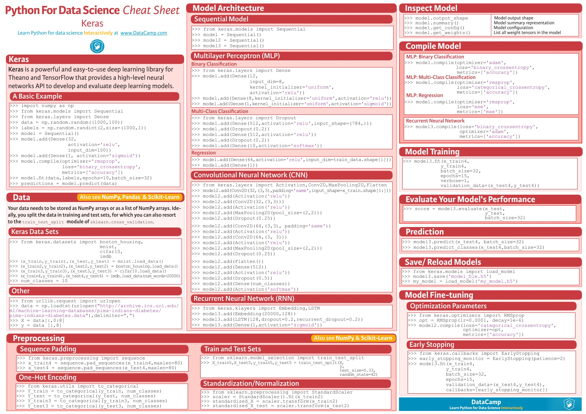
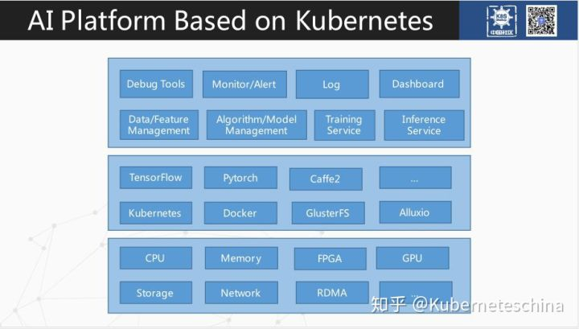

> by pengxingxiong@ruijie.com.cn
>
> 2019-04-23

# top5 deep learning tool

虽然说这五项在排名次序上有所不同，但是已经得到了频繁出现在各大博客，比赛(kaggle)官网。

> [Top 5 Deep Learning Frameworks Tutorial](https://www.kaggle.com/mjbahmani/top-5-deep-learning-frameworks-tutorial)
>
> [Top 5 Deep Learning Frameworks for 2019](https://www.springboard.com/blog/deep-learning-frameworks/)
>
> [Top 5 Deep Machine Learning Frameworks](https://softmedialab.com/blog/deep-machine-learning-frameworks/)

当前spark、Kubernetes集群也主要尝试对以上五种AI框架进行支持。

# Ranking Popular Deep Learning Libraries for Data Science

# 10 Best Frameworks and Libraries for AI

> by Anton Shaleynikov  ·  Jan. 10, 18 · AI Zone · Opinion

### Look at some high-quality libraries that are used for artificial intelligence, their pros and cons, and some of their features.

[Artificial intelligence](https://dashbouquet.com/blog/web-development/machine-learning-and-ai-trends-for-2018-what-to-expect) has existed for a long time. However, it has become a buzzword in recent years due to huge improvements in this field. AI used to be known as a field for total nerds and geniuses, but due to the development of various libraries and frameworks, it has become a friendlier IT field and has lots of people going into it.

In this article, we will be looking at top-quality libraries that are used for artificial intelligence, their pros and cons, and some of their features. Let's dive in and explore the world of these AI libraries!

## 1. TensorFlow

> "Computation using data flow graphs for scalable machine learning."

**Language**: C++ or Python.

When getting into AI, one of the first frameworks you'll hear about is Google's TensorFlow.

TensorFlow is an open-source software for carrying out numerical computations using data flow graphs. This framework is known for having an architecture that allows computation on any CPU or GPU, be it a desktop, a server, or even a mobile device. This framework is available in the Python programming language.

TensorFlow sorts through data layers called nodes and makes decisions with whatever information it gets. [Check it out](https://www.tensorflow.org/)!

**Pros**:

- Uses an easy-to-learn a language (Python).
- Uses computational graph abstraction.
- Availability of TensorBoard for visualization.

**Cons**:

- It's slow, as Python is not the fastest of languages.
- Lack of many pre-trained models.
- Not completely open-source.

## 2. Microsoft CNTK

> "An open source-deep learning toolkit."

**Language**: C++.

We could call this Microsoft's response to Google's TensorFlow.

Microsoft's Computational Network ToolKit is a library that enhances the modularization and the maintenance of separating computation networks, providing learning algorithms and model descriptions.

CNTK can take advantage of many servers at the same time in a case where lots of servers are needed for operations.

It is said to be close in functionality to Google's TensorFlow; however, it is a bit speedier. [Learn more here](https://github.com/Microsoft/CNTK).

**Pros**:

- It is very flexible.
- Allows for distributed training.
- Supports C++, C#, Java, and Python.

**Cons**:

- It is implemented in a new language, Network Description Language (NDL).
- Lack of visualizations.

## 3. Theano

> "A numerical computation library."

**Language**: Python.

A strong competitor to TensorFlow, Theano is a powerful Python library that allows for numerical operations involving multi-dimensional arrays with a high level of efficiency.

The library's transparent use of a GPU for carrying out data-intensive computations instead of a CPU results in high efficiency in its operations.

For this reason, Theano has been used in powering large-scale computationally intensive operations for about a decade.

However, in September 2017, it was announced that major developments of Theano would cease after the 1.0 release, which was released in November 2017.

This doesn't mean it is a less powerful library in any way. You can still carry out deep learning research with it any time. [Learn more here](https://github.com/Theano/Theano).

**Pros**:

- Properly optimized for CPU and GPU.
- Efficient for numerical tasks.

**Cons**:

- Raw Theano is somewhat low-level compared to other libraries.
- Needs to be used with other libraries to gain a high level of abstraction.
- A bit buggy on AWS.

## 4. Caffe

> "Fast, open framework for deep learning."

**Language**: C++.

Caffe is a powerful deep learning framework.

Like the other frameworks on this list, it is very fast and efficient for deep learning research.

With Caffe, you can very easily build a convolutional neural network (CNN) for image classification. Caffe works well on GPU, which contributes to its great speed during operations. Check out the [main page for more information](http://caffe.berkeleyvision.org/).

Caffe main classes:

**Pros**:

- Bindings for Python and MATLAB are available.
- Great performance.
- Allows for the training of models without writing code.

**Cons**:

- Bad for recurrent networks.
- Not great with new architectures.

## 5. Keras

> "Deep learning for humans."

**Language**: Python.

Keras is an open-source neural network library written in Python.

Unlike TensorFlow, CNTK, and Theano, Keras is not meant to be an end-to-end machine learning framework.

Instead, it serves as an interface and provides a high level of abstraction, which makes for easy configuration of neural networks regardless the framework it is sitting on.

Google's TensorFlow currently supports Keras as a backend, and Microsoft's CNTK will do the same in little or no time. [Learn more here](https://keras.io/).

**Pros**:

- It is user-friendly.
- It is easily extensible.
- Runs seamlessly on both CPU and GPU.
- Works seamlessly with Theano and TensorFlow.

**Cons**:

- Can't be efficiently used as an independent framework.

## 6. Torch

> "An open-source machine learning library."

**Language**: C.

Torch is an open-source machine learning library for scientific and numerical operations.

It's a library based on — no, not Python — the Lua programming language.

By providing a large number of algorithms, it makes for easier deep learning research and improved efficiency and speed. It has a powerful N-dimensional array, which helps with operations such as slicing and indexing. It also offers linear algebra routines and neural network models. [Check it out](http://torch.ch/).

**Pros**:

- Very flexible.
- High level of speed and efficiency.
- Lots of pre-trained models available.

**Cons**:

- Unclear documentation.
- Lack of plug-and-play code for immediate use.
- It's based on a not-so-popular language, Lua.

## 7. Accord.NET

> "Machine learning, computer vision, statistics, and general scientific computing for .NET."

**Language**: C#.

Here is one for the C# programmers.

The Accord.NET framework is a.NET machine learning framework that makes audio and image processing easy.

This framework can efficiently handle numerical optimization, artificial neural networks, and even visualization. Aside from this, Accord.NET is powerful for computer vision and signal processing and also makes for an easy implementation of algorithms. Check the [main page](http://accord-framework.net/).

**Pros**:

- It has a large and active development team.
- Very well-documented framework.
- Quality visualization.

**Cons**:

- Not a very popular framework.
- Slow compared to TensorFlow.

## 8. Spark MLlib

> "A scalable machine learning library."

**Language**: Scala.

Apache's Spark MLlib is a very scalable machine learning library.

It is very usable in languages such as Java, Scala, Python, and even R. It is very efficient, as it interoperates with the numpy in library Python and R libraries.

MLlib can easily be plugged into Hadoop workflows. It provides machine learning algorithms such as classification, regression, and clustering.

This powerful library is very fast when it comes to processing of large-scale data. Learn more [on the website](https://spark.apache.org/mllib/).

**Pros**:

- Very fast for large-scale data.
- Available in many languages.

**Cons**:

- Steep learning curve.
- Plug-and-play available for Hadoop only.

## 9. Sci-kit Learn

> "Machine learning in Python."

**Language**: Python.

Sci-kit learn is a very powerful Python library for machine learning that is majorly used in building models.

Built using other libraries such as numpy, SciPy, and matplotlib, it is very efficient for statistical modeling techniques such as classification, regression, and clustering.

Sci-kit learn comes with features such as supervised learning algorithms, unsupervised learning algorithms, and cross-validation. [Check it out](http://scikit-learn.org/).

**Pros**:

- Availability of many of the main algorithms.
- Efficient for data mining.

**Cons**:

- Not the best for building models.
- Not very efficient with GPU.

## 10. MLPack

> "A scalable C++ machine learning library."

**Language**: C++.

MLPack is a scalable machine learning library implemented in C++. Because it's in C++, you can guess that it is great for memory management.

MLPack runs with great speed, as quality machine learning algorithms come along with the library. This library is novice-friendly and provides a simple API for use. [Check it out](http://mlpack.org/).

**Pros**:

- Very scalable.
- Python and C++ bindings available.

**Cons**:

- Not the best documentation.

## Wrapping It Up

The libraries discussed in this article are very efficient and have proven over time to be of high quality. Big companies like Facebook, Google, Yahoo, Apple, and Microsoft make use of some of these libraries for their deep learning and machine learning projects — so why shouldn‘t you?

# AI Deep Learning Framework Rankings - Power Scores - 2018

# OrionX AI & Machine Learning Customer Survey

> survey was produced by DanOlds in Q2-Q3 of 2017

# AI platform on kubernetes

## 基于 Kubernetes 的 AI 平台

在英伟达的官网能够找到标题为"Kubernetes For AI Hyperparameter Search Experiments"的博文，该博文内容是如何使用k8s进行大规模超参数搜索实验。

在Kubernetes本身存在能够使用gpu的场景

通过GPU配置来完成GPU资源调度。

算法的训练则是通过pod内置的AI算法引擎实现。目前，Kubernetes主要负责GPU资源的检测和调度，真正跟NVIDIA Driver通信的还是docker，因此整个逻辑结构图如下：

利用Kubernetes能够调用GPU的方案，做出简易的架构如下图所示：

核心想法是用一个很小的只有 CPU 的 master 节点来控制一组 GPU worker 节点。参考：[如何使用 Kubernetes GPU 集群自动化深度学习训练](https://www.infoq.cn/article/kubernetes-gpu-cluster-to-automate-deep-learning-training)

以该方案能够形成较为简单的深度学习框架，然后各个节点中的GUP/CPU等资源由Kubernetes调度，深度学习算法在节点中的pod里运行。

## TensorFlow 与原生 Kubernetes 的整合方案

我们在企业里做 AI 平台，都会按照以下的结构进行构建。**首先是最底层的硬件资源**，比如说 CPU、GPU、FPGA、内存、存储、网络等，**再往上面是深度学习的框架或容器的编排框架**，包括 Kubernetes、TensorFlow、Pytorch、Caffe2、Gluster FS、分布式内存系统 Alluxio 等。

在上层，我们需要提供用户端的能力入口，包括给数据科学家提供 Debug Tools，数据管理能力，特征值存储和管理、算法管理、模型管理、Training 服务、Inference 及灰度上线等服务。

还需要给 Trainning 和 Inference 服务提供日志、监控、告警等配套服务。所有这些能力，都需要在一个 Dashboard 中提供给用户。**将所有这些能力整合起来、提供 Pipeline 能力，这就是一个相对完整的 AI 平台需要具备的能力。**

我们为什么把 TensorFlow 和 Kubernetes 整合在一起？

TensorFlow 从 0.8 版本开始提供分布 TensorFlow 的特性。但当你直接用分布TensorFlow 时，会遇到一些困难。比如它没有任务级别的资源隔离，也不提供资源调度，更缺乏 GPU 调度能力。当你创建一个大规模的分布式 TensorFlow 训练时，你会发现要做很多事情。比如，你要先规划好整个集群的 ClusterSpec。

如果集群较大时，是比较困难的。训练任务运行后，需要考虑大规模的任务管理，每个任务的生命周期都需要明确，用户还需要看每个任务的训练日志。当然，TensorFlow 现在已经具备这些能力，但大规模底层资源管理并不是 TensorFlow 想做的事情。

对于 Inference 服务，会涉及类似 PaaS CD 的需求，需要有持续布署能力、弹性伸缩能力，所有这些都是 TensorFlow 等深度学习框架所不具备的。而这恰恰又是Kubernetes 最擅长的场景。因此把 TensorFlow 和 Kubernetes 放在一块，利用 Kubernetes 提供计算资源管理日志、监控、高可用部署等能力，利用 TensorFlow 提供 Convenient、Scaleable、 High Available、High efficiency 的任务管理能力。

对于 PS 的部署，我们也可以用 Deployment 或者 Job 方式进行布署，创建一个 Headless Service。整个 PS 模式分布式 TensorFlow 集群内的 Worker、PS 之间的相互通信都是基于这个 Headless Service 进行的，通过注册 HeadlessService Name 到 KubeDNS 内进行解析。**所以在改构造 TensorFlow ClusterSpec 时，你只需要把它们对应的 Headless Service 名字写进去，不需要写它们的 IP。**

我们继续看 MPI 模式的分布式 TensorFlow 训练集群，比较常用的做法是使用 Deployment 或者使用 StatefulSet 来布署 Worker。通常情况下，我们的 Worker 都需要挂载远程训练数据，训练数据会通过 PV 或者 PVC 方式进行挂载，所以我们会使用 StatefulSet 去布署一个 MPI 模式下的 Worker。

MPI 模式下还有一个 Launcher Job 角色，它跟 Worker 责任不相同，Launcher Job 是要负责整个集群任务提交的一个入口点，**所以通常情况下会使用 Job 进行布署。除了训练，我们还需要提供 TensorFlow Serving、Tensorboard、 TensorProfile 等服务。**

对于这种原生的 TensorFlow 和 Kubernetes 方案，我们需要注意一些问题。比如，利用 Job 去布署一个有问题的 TensorFlow Worker 时，Pod 会一直重启，产生很多死亡容器。在 Kubernetes1.7 以及 1.7 之前的版本中，因为这种 Job 无限重启的问题会将你节点的磁盘撑爆。但在 Kubernetes 1.8 及 1.8 之后的版本，Job 里存在默认的 backoffLimit field，默认值是 6。

去年 9 月，我们开始做大规模训练时，TensorFlow 1.3 无论怎么测都不能把单个分布式 TensorFlow 集群调到 1000 个 Worker 的训练规模。最后发现，主要原因是 TensorFlow 内置的 GRPC 版本很低。在 TensorFlow 1.3 时，它对应的是 GRPC 1.0 预发布版本。后来我们把 TensorFlow 升级到当时最新的 1.5 版本，对应到 GRPC 1.8 版本，基本能达到我们 1000 Workers 的需求了。

当我们Kubernetes 集群内任务训练规模比较大时，比如有十几万个 Worker， 集群内的 kube-dns 性能会有一些问题。它的性能问题导致偶发性的解析 IP 异常，影响 TensorFlow 各个 Task 之间 Session 的建立。有时侯也会阻碍整个 TensorFlow 集群的运行，在任务日志中能看到 GRPC Session。**为了解决这个问题，我们利用 kube-proportion 根据集群的规模对 kube-dns 组件进行弹性伸缩。**

比如，这个集群有 100 个节点时，我就会有一个 kube-dns。当我们的集群扩展到 500 个节点时，自动就把这个 kube-dns 的数量变成 5 个。除此之外，我们还做了些增强，根据集群内的 Headless Service 数量进行 kube-dns 的 AutoScale。

做好集群防雪崩保护措施，一定要给这个节点的系统和 Kubernetes 组建预留一些 CPU 和内存，不然节点上比较重量级的训练会把这个节点压垮，压垮了后这个任务又重新调度到别的节点，又将别的节点压垮，周而复始整个集群就会雪崩。

还需要注意，一定要去清理历史的训练任务。在定时训练场景，整个集群里会有非常多的定时训练项目，每隔五分钟、十分钟就会启动一次训练，这样一天积累下来会有超过50 万个 Dead Pod 和无用 Namespace 在里面。如果不去做清理，那些全局的 API 性能就会很差。

**我们在启动一个 TensorFlow 训练时，一定要注意检查集群的可用剩余资源。**比如，我现在要提交 100 个 Worker 训练，但这个集群剩余的资源只够 50 个 Worker 训练。如果你不去检查就直接把任务提交下去，会导致只有一部分 Worker 跑起来，剩下的 Worker 在 pending 的状态。

这时，TensorFlow 是无法训练的，但是这部分已经跑起来的 Worker 占用的资源会被浪费。所以我后面会提到如何去做一个 Gang scheduling。

**gRPC 分布式通信损耗是不可忽视的。**我们要合理去规划一个 TensorFlow 训练的 PS 数量和 Worker 数量，并不是说我把一个训练拆分成越多的 Worker 或越多的 PS 越好；恰恰相反，这一块的性能损耗会越来越大。

###认识KubeFlow

利用 Kubeflow 的目标就是方便大家很轻松地布署一个端到端的 AI workflow。它是基于 ksonnet 进行环境布署和配置，中间就是 Kubeflow 的一些主要的核心组件。包括 tf-operator ：用来布署 TensorFlow 的 operator，以及 MPI-Operator、Caffe2-operator、Pytorch-operator 等。

这张图像相信大家不止在一个地方看过，数据科学家在进行整个端到端的模型开发到布署上线这个过程，写算法代码占用的时间很少，很大一部分时间是在做一些数据的预处理、特征工程、数据打标、大规模训练，以及发现性能问题并进行调优。

###[Arena-Alibaba Cloud DL Tools for Kubernetes](https://github.com/kubeflow/arena)

我们为什么要做 Arena？Kubeflow 已经相对方便大家去布署 TensorFlow 的训练或者 Caffe2 的训练，但是它还缺什么呢？**深色部分是 Kubeflow 现在不能提供的能力，但是作为数据科学家或者用户，我们平台是需要具备这些能力。**比如，它要一个客户端去提交 TensorFlow 的训练，去布署一个模型或者灰度上线。

这些是 Arena 是想做的一部分事情。但 Arena 的定位远远不止这些，它也是我们去整合业界最佳实践的一个输出，真正去做一个端到端的 AI 工作流，包括数据管理、模型管理、模型上线、灰度流量控制等。

大家在使用 Kubeflow 时，还是需要数据科学家对 Kubernetes 有一定的了解，Arena 希望屏敝 Kubernetes、Tensorflow、Caffe，只去关注算法本身，Arena 负责提供业界最佳实践。**Arena 是一个高效的工具，支持 AI 作业的运维，比如说我现在要支持 GPU 的监控，整个集群里面 GPU 的分配情况、任务使用情况、任务和训练日志的查看。**

从 Arena架构图来说，Arena 提供了一个客户端可以支持 Tensorflow、Caffe2，Pytorch 这些比较主流的框架。后端我们会对接 Kubeflow 的 CRD 和 operator，通过这些 CRD/operator 跟 Kubernetes 进行整合。底层资源支持异构，可以异构CPU、GPU、阿里云神龙服务器等。

我们的 Arena 现在能做些什么？**我们通过 Arena submit 命令就可以提交一个分布式训练的作业请求。**你提交的分布式训练模式 mode 支持 Horovod 和 TensorFlow。还可以指定需要有多少个 Worker。每个 Worker 要分配多少个 GPU、CPU、Memory 等。可以给容器内注入环境变量，定制启动脚本等。通过这么一个简单的命令就可以完成分布式训练任务的提交，数据科学家完全不需要去关心后面到底发生了什么。

### 落地方案

参考[如何落地TensorFlow on Kubernetes](https://my.oschina.net/jxcdwangtao/blog/1554472)将TensorFlow跑在Kubernetes集群中，并且能创建Distributed TensorFlow集群启动训练。

# references

> - [Ranking Popular Deep Learning Libraries for Data Science](https://blog.thedataincubator.com/2017/10/ranking-popular-deep-learning-libraries-for-data-science/)
> - [10 Best Frameworks and Libraries for AI](https://dzone.com/articles/progressive-tools10-best-frameworks-and-libraries)
>
> - [AI Deep Learning Framework Rankings - Power Scores - 2018](https://www.turingtribe.com/story/ai-deep-learning-framework-rankings-power-scores-2018-LjyrrHeF7sXjwGzD4)
>
> - [OrionX AI & Machine Learning Customer Survey](https://www.slideshare.net/insideHPC/orionx-ai-machine-learning-customer-survey?from_action=save)
>
> - [AI platform on kubernetes](https://zhuanlan.zhihu.com/p/45116265)
>
> - [Kubernetes For AI Hyperparameter Search Experiments](https://devblogs.nvidia.com/kubernetes-ai-hyperparameter-search-experiments/)
>
> - [如何落地TensorFlow on Kubernetes](https://my.oschina.net/jxcdwangtao/blog/1554472)
>
> - [如何使用 Kubernetes GPU 集群自动化深度学习训练](https://www.infoq.cn/article/kubernetes-gpu-cluster-to-automate-deep-learning-training)
>
>   