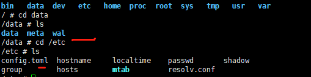

# influxdb简介

influxdb 为时续数据库，使用GO语言开发，适合用于处理和分析资源监控数据这种时序相关的数据。InfluxDB自带的各种特殊函数如求标准差，随机取样数据，统计数据变化比等，使数据统计和实时分析变得十分方便。influxdb 的操作语法为 InfluxQL，与SQL基本一致。InfluxDB本身是支持分布式部署多副本存储的。

## 数据存储

目前我们部署采用的是EmptyDir，同一个pod内的容器都能读写EmptyDir中的同一个文件，与pod的生命周期相同，当pod删除时，数据也删除(/var/lib/kubelet/pods/3bd963da-e96b-11e8-8408-704d7b3debdc/volumes/kubernetes.io~empty-dir/influxdb-storage)。

可以在docker内部 /data目录下查看到相关数据，配置文件默认在docker内部目录/etc/config.toml。



- meta 用于存储数据库的一些元数据，meta 目录下有一个 meta.db 文件。
- wal 目录存放预写日志文件，以 .wal 结尾。
- data 目录存放实际存储的数据文件，以 .tsm 结尾。

详细格式和内容可参看官网

## 数据结构

简单列举一个要存入的数据，格式如下：

cpu_usage,host=server01,region=us-west  value1= 0.8,value2=0.64  1434055562000000000

用图表展示更直观。

influxdb基本数据结构

| 数据结构           | 含义                                                         |
| ------------------ | ------------------------------------------------------------ |
| database           | 数据库,不同数据库中的数据文件是隔离存放的，存放在磁盘上的不同目录 |
| measurement        | 测量指标名（数据库中的表）,如cpu_usage 表示 cpu 的使用率     |
| retention   policy | 保存策略：用于设置数据保留的时间，每个数据库刚开始会自动创建一个默认的存储策略 autogen，数据保留时间为永久，之后用户可以自己设置，例如保留最近2小时的数据。插入和查询数据时如果不指定存储策略，则使用默认存储策略，且默认存储策略可以修改。InfluxDB 会定期清除过期的数据。 |
| points             | 表里面的一行数据                                             |

point数据结构介绍：

| 数据结构 | 含义                                                         |
| -------- | ------------------------------------------------------------ |
| time     | 每个数据记录时间，是数据库中的主索引(会自动生成)（1434055562000000000） |
| fields   | 各种记录值（value1、value2）支持一条数据中插入多个   field，这其实是一个语法上的优化，在实际的底层存储中，是当作多条数据来存储 |
| tags     | 各种有索引的属性（例如host=server01,region=us-west）         |
| series   | 相当于是 InfluxDB 中一些数据的集合，在同一个 database 中，retention   policy、measurement、tag sets 完全相同的数据同属于一个 series，同一个 series 的数据在物理上会按照时间顺序排列存储在一起。 |

补充：

**Series**

series 相当于是 InfluxDB 中一些数据的集合，在同一个 database 中，retention policy、measurement、tag sets 完全相同的数据同属于一个 series，同一个 series 的数据在物理上会按照时间顺序排列存储在一起。

series 的 key 为 measurement + 所有 tags 的序列化字符串，这个 key 在之后会经常用到。

代码中的结构如下：

```c
type Series struct {
    mu          sync.RWMutex
    Key         string              // series key
    Tags        map[string]string   // tags
    id          uint64              // id
    measurement *Measurement        // measurement
}
```

**Shard**

shard 在 InfluxDB 中是一个比较重要的概念，它和 retention policy 相关联。每一个存储策略下会存在许多 shard，每一个 shard 存储一个指定时间段内的数据，并且不重复，例如 7点-8点 的数据落入 shard0 中，8点-9点的数据则落入 shard1 中。每一个 shard 都对应一个底层的 tsm 存储引擎，有独立的 cache、wal、tsm file。

创建数据库时会自动创建一个默认存储策略，永久保存数据，对应的在此存储策略下的 shard 所保存的数据的时间段为 7 天，计算的函数如下：

```c
func shardGroupDuration(d time.Duration) time.Duration {
    if d >= 180*24*time.Hour || d == 0 { // 6 months or 0
        return 7 * 24 * time.Hour
    } else if d >= 2*24*time.Hour { // 2 days
        return 1 * 24 * time.Hour
    }
    return 1 * time.Hour
}
```

如果创建一个新的 retention policy 设置数据的保留时间为 1 天，则单个 shard 所存储数据的时间间隔为 1 小时，超过1个小时的数据会被存放到下一个 shard 中。

**fields** 

值只能是四种基本数据类型(int、float、boolean、string)，使用string需要使用双引号。

注意：

1、time 相当于表的主键，当一条数据的time和tags完全相同时候，新数据会替换掉旧数据，旧数据则丢失（线上环境尤其要注意）。

2、tags 和time可以作为排序字段，field则不可以。如：ORDER BY time DESC

3、设置了保存策略后，若此保存策略为设置成默认保存策略（一个库可以有多个保存策略），则在查询时，表名（measurement）前，要加上保存策略。

举例：

保留策略为two-hour不是默认保存策略，则查询时候，需要指定其保存策略。

select * from two-hour.measure where time > now() -10

4、fields和tags的字段类型是由存入的第一条记录值决定的。

举例：

- 如第一条记录fieldA的值为2，想插入一条记录，fieldA字段值为3.14的值，就会报错。因为该字段已经被初始化为整型了。
- 如第一条记录fieldB存储的是3,想插入一条记录，fieldB字段值为hello,则也会报错，该字段已被初始化成整型，不能再写入字符串了。