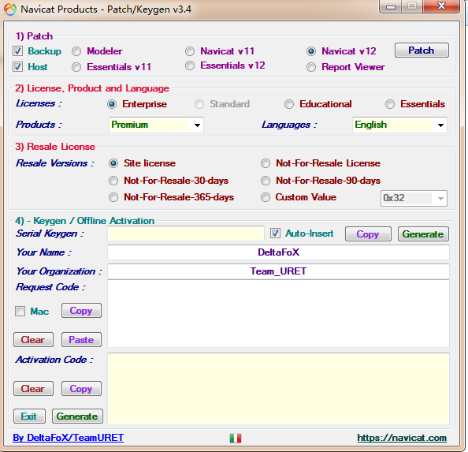
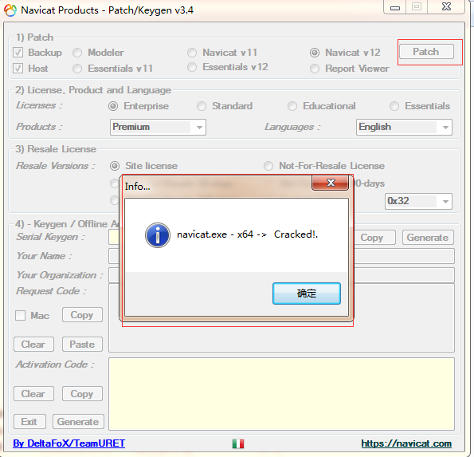
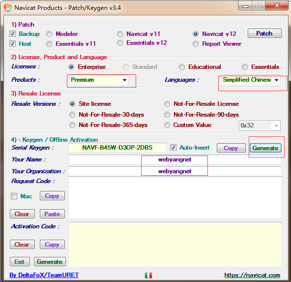
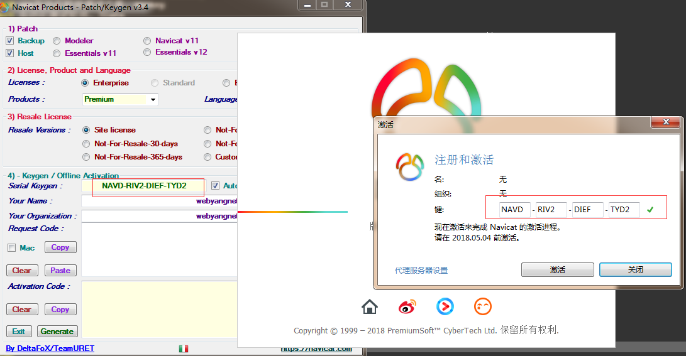
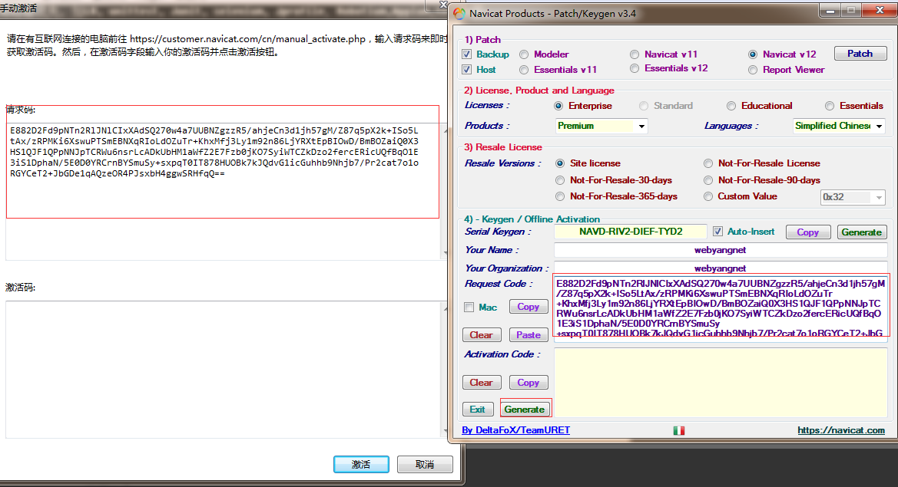
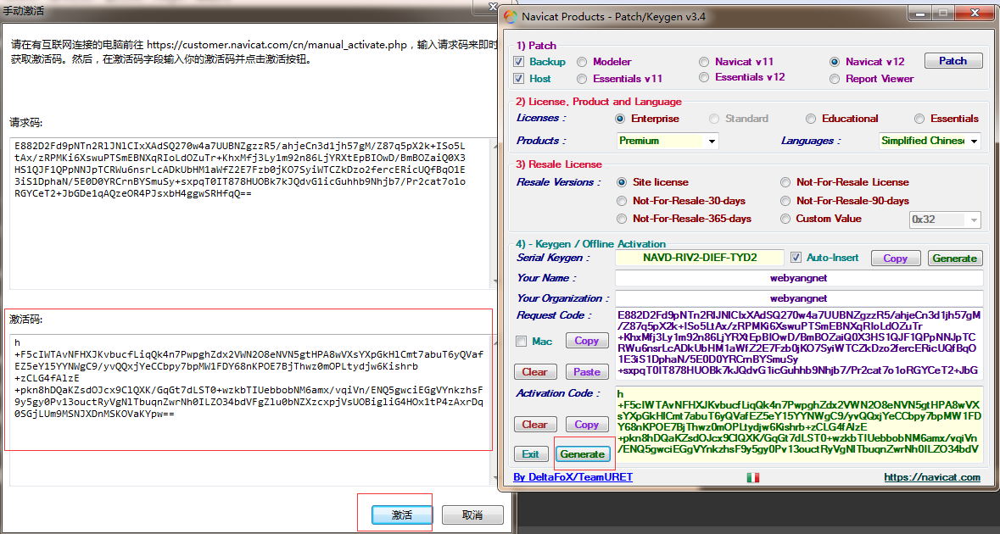

快速方式：[CSDN下载安装破解大礼包](https://download.csdn.net/download/tqs314/10490634)（2019-2-27更新，Error on Decrypt Request Code破解修复，见文章末尾！）

一、下载

Navicat官方下载地址：[点击打开链接](https://www.navicat.com/en/download/navicat-premium)

或者：链接：[点击打开链接](https://pan.baidu.com/s/1hVdalkCR2AgPmlLDmEcOQg) 密码：26i8

百度网盘为64位，如需其他可取官网自行下载。

破解工具：链接：[点击打开链接](https://pan.baidu.com/s/1rzsskC0INfb51p1wz1YP0w)  密码：ruzf

二、破解步骤

 

来自 ：<http://www.webyang.net/Html/web/article_378.html>

1、将工具放到navicat的安装目录，打开破解工具：
 

2、点击右上角的patch，选择到你安装路径的navicat.exe，点击确定，提示 navicat.exe - x64 -> Cracked.
 

3、选择你自己安装的语言版本，修改你的名字和组织，然后点击生成。
 

4、把生成的key输入到navicat.exe的激活码里面去，这一步有可能会提示秘钥不对。如果不对，在注册机重新生成一个即可。（这一步最好断网执行）
 

5、点击激活，选择手动激活。
 

6、把请求码复制到弄到注册机里面去，点击右下角的生成。
 

7、生成之后，navicat会自动同步生成之后的激活码，再次点击确定。
 

至此，navicat会提示已被激活。

本文为AndyYang原创，转载请注明出处！ 

如果你能正常破解成功使用，请举起你的小手点个赞，搜集资料不容易哦！！！！

 

2019-2-27更新，Error on Decrypt Request Code破解修复

据说Navicat12.1.12破解不了，以下是破解的工具Navicat_Keygen-4.8，亲测有效！

[Navicat_Keygen-4.8下载地址](https://download.csdn.net/download/tqs314/10979501)