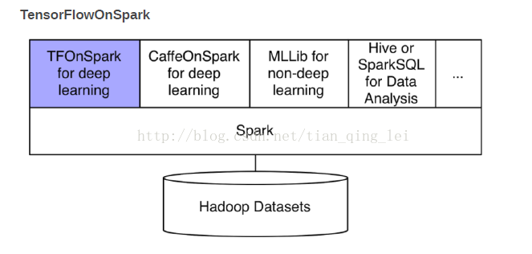
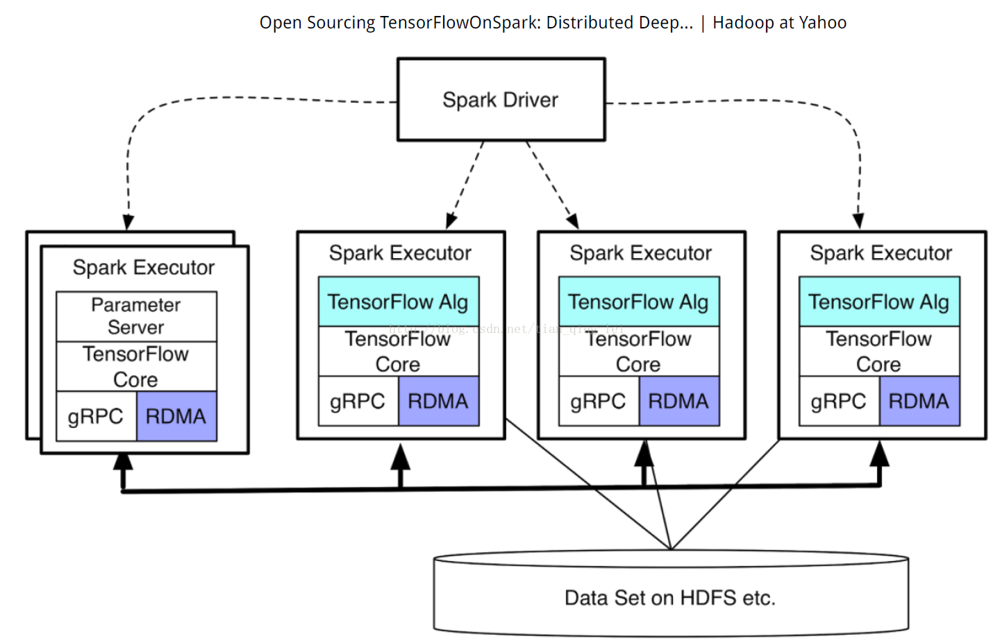

# keras

Keras 是一个高级的 Python 神经网络框架，其文档详见 https://keras.io/。 Keras 已经被添加 到 TensorFlow 中，成为其默认的框架，为 TensorFlow 提供更高级的 API 。如果将 TensorFlow 比喻为编程界的 Java 或 C++，那么 Keras 就是编程界的 Python。它作为TensorFlow 的高层封装，可以与 TensorFlow 联合使用，用它很速搭建原型。另外， Keras 兼容两种后端，即 Theano 和 TensorFlow，并且其接口形式和 Torch 有几分相像。掌握 Keras 可以大幅提升对开发效率和网络结构的理解。 

Keras 是高度封装的，非常适合新手使用，代码更新速度比较很，示例代码也比较多，文档和讨论区也比较完善。最重要的是， Keras 是 TensorFlow 官方支持的。当机器上有可用的 GPU时，代码会自动调用 GPU 进行并行计算。Keras 官方网站上描述了它的几个优点，具体如下。

- 模块化：模型的各个部分，如神经层、成本函数、优化器、初始化、激活函数、规范
- 化都是独立的模块，可以组合在一起来创建模型。
- 极简主义：每个模块都保持简短和简单。
- 易扩展性：很容易添加新模块，因此 Keras 适于做进一步的高级研究。
- 使用 Python 语言：模型用 Python 实现，非常易于调试和扩展。  

问题：Keras怎么调用GPU资源，能够调用到什么粒度。

# TensorFlow

## TensorFlow集群概念

>A TensorFlow “cluster” is a set of “tasks” that participate in the distributed execution of a TensorFlow graph. Each task is associated with a TensorFlow “server”, which contains a “master” that can be used 
>to create sessions, and a “worker” that executes operations in the graph.
从上面的定义可以看出，所谓的TensorFlow集群就是一组任务，每个任务就是一个服务。每个服务由两个部分组成，第一部分是master，用于创建session，第二部分是worker，用于执行具体的计算。

TensorFlow一般将任务分为两类job：一类叫参数服务器，parameter server，简称为ps，用于存储tf.Variable；一类就是普通任务，称为worker，用于执行具体的计算。

>即：distributed tensorflow 包含两类job: ps server 和 worker server, 每类job 可以包含多个 task, 每个task 是1个server,而每个server 包含两部分： master 和 worker, master用于创建session, worker用于执行具体的计算。
### 参数服务器概念

首先来理解一下参数服务器的概念。一般而言，机器学习的参数训练过程可以划分为两个类别：

- 第一类： 根据参数算算梯度。
- 第二类：根据梯度更新参数。

对于小规模训练，数据量不大，参数数量不多，一个CPU就足够了，两类任务都交给一个CPU来做。

对于普通的中等规模的训练，数据量比较大，参数数量不多，计算梯度的任务负荷较重，参数更新的任务负荷较轻，所以将第一类任务交给若干个CPU或GPU去做，第二类任务交给一个CPU即可。

对于超大规模的训练，数据量大、参数多，不仅计算梯度的任务要部署到多个CPU或GPU上，而且更新参数的任务也要部署到多个CPU。

如果计算量足够大，一台机器能搭载的CPU和GPU数量有限，就需要多台机器来进行计算能力的扩展了。参数服务器是一套分布式存储，用于保存参数，并提供参数更新的操作。

### 创建一个集群

一个tensorflow“集群”是一套“任务”，参加一个tensorflow图的分布式执行。每个任务都与一个tensorflow“服务器”相关，其中包含一个“master”，可以用来创建会话，和“worker”，执行操作的图。集群也可以分为一个或多个“作业”，其中每个作业包含一个或多个任务。

创建一个集群，你开始在每一tensorflow服务器集群的任务。每项任务通常运行在不同的机器上， 但是你可以运行多个任务在同一台机器上（例如，控制不同的GPU设备）。在每个任务中，做以下操作：

1. 创建一个` tf.train.ClusterSpect`描述集群中的所有任务。对于每一个任务，这应该是相同的。
2. 创建一个` tf.train.Server`, 通过 `tf.train.ClusterSpec` 的构造函数，确定本地任务的工作名称和任务index。

创建一个 `tf.train.ClusterSpec` 描述集群

把列表传给 `tf.train.ClusterSpec `的构造函数.例如:


**在每个任务里，创建一个 tf.train.Server 的实例**

一个tf.train.server对象包含一组本地设备，一组连接在tf.train.clusterspec其他任务， 和一个“会话”的目标，可以使用它们来执行分布式计算。 每个服务器都是一个特定的命名作业的成员，并在该作业中有一个任务索引。 服务器可以与集群中的任何其他服务器进行通信。

例如，有两个服务器在本地运行启动一个集群：localhost:2222，localhost:2223，在本地机器运行下面的两个不同进程的代码：

任务1

```python
# In task 0:  
cluster = tf.train.ClusterSpec({"local": ["localhost:2222", "localhost:2223"]})  
server = tf.train.Server(cluster, job_name="local", task_index=0)  
```

任务2

```python
# In task 1:  
cluster = tf.train.ClusterSpec({"local": ["localhost:2222", "localhost:2223"]})  
server = tf.train.Server(cluster, job_name="local", task_index=1) 
```

> 注：手动指定这些集群规格可以是繁琐的，特别是对于大集群。

我们来看一下怎么创建一个TensorFlow集群。每个任务用一个**ip:port**表示。TensorFlow用`tf.train.ClusterSpec`表示一个集群信息，举例如下：

```python
import tensorflow as tf
Configuration of cluster

ps_hosts = [ "xx.xxx.xx.xxxx:oooo", "xx.xxx.xx.xxxx:oooo" ]
worker_hosts = [ "xx.xxx.xx.xxxx:oooo", "xx.xxx.xx.xxxx:oooo", "xx.xxx.xx.xxxx:oooo" ]
cluster = tf.train.ClusterSpec({"ps": ps_hosts, "worker": worker_hosts})
```

上面的语句提供了一个TensorFlow集群信息，集群有两类任务，称为job，一个job是ps，一个job是worker；ps由2个任务组成，worker由3个任务组成。

定义完集群信息后，使用`tf.train.Server`创建每个任务：

```python
tf.app.flags.DEFINE_string("job_name", "worker", "One of 'ps', 'worker'")
tf.app.flags.DEFINE_integer("task_index", 0, "Index of task within the job")

FLAGS = tf.app.flags.FLAGS

def main(_):
    server = tf.train.Server(cluster,
                             job_name=FLAGS.job_name,
                             task_index=FLAGS.task_index)
    server.join()

if __name__ == "__main__":
    tf.app.run()
```

<font color="red">对于本例而言，我们需要在**ip:port**对应的机器上运行每个任务，共需执行五次代码，生成五个任务。</font>

```shell
python worker.py --job_name=ps --task_index=0
python worker.py --job_name=ps --task_index=1
python worker.py --job_name=worker --task_index=0
python worker.py --job_name=worker --task_index=1
python worker.py --job_name=worker --task_index=2
```

我们找到集群的某一台机器，执行下面的代码：

```python
# -*- coding=utf-8 -*-

import tensorflow as tf
import numpy as np

train_X = np.random.rand(100).astype(np.float32)
train_Y = train_X * 0.1 + 0.3

# 选择变量存储位置和op执行位置，这里全部放在worker的第1个task上
with tf.device("/job:worker/task:0"):
    X = tf.placeholder(tf.float32)
    Y = tf.placeholder(tf.float32)
    w = tf.Variable(0.0, name="weight")
    b = tf.Variable(0.0, name="reminder")
    y = w * X + b
    loss = tf.reduce_mean(tf.square(y - Y))

    init_op = tf.global_variables_initializer()
    train_op = tf.train.GradientDescentOptimizer(0.01).minimize(loss)

# 选择创建session使用的master
with tf.Session("grpc://xx.xxx.xx.xxxx:oooo") as sess:
    sess.run(init_op)
    for i in range(500):
        sess.run(train_op, feed_dict={X: train_Y, Y: train_Y})
        if i % 50 == 0:
            print i, sess.run(w), sess.run(b)

    print sess.run(w)
    print sess.run(b)
```

执行结果如下：

```shell
0 0.00245265 0.00697793
50 0.0752466 0.213145
100 0.0991397 0.279267
150 0.107308 0.30036
200 0.110421 0.306972
250 0.111907 0.308929
300 0.112869 0.309389
350 0.113663 0.309368
400 0.114402 0.309192
450 0.115123 0.308967
0.115824
0.30873
```

其实ps和worker本质上是一个东西，就是名字不同，我们将上例中的`with tf.device("/job:worker/task:0"):`改为`with tf.device("/job:ps/task:0"):`，一样能够执行。之所以在创建集群时要分为两个类别的任务，是因为TensorFlow提供了一些工具函数，会根据名字不同赋予task不同的任务，ps的用于存储变量，worker的用于计算。

### 标注模型中的分布式设备

为了将某个操作放在某个特殊的处理过程上,在分布式环境下依然可以使用`tf.device()`函数，之前是用来指明是放在CPU还是GPU上的。譬如:

```python
with tf.device("/job:ps/task:0"):
  weights_1 = tf.Variable(...)
  biases_1 = tf.Variable(...)

with tf.device("/job:ps/task:1"):
  weights_2 = tf.Variable(...)
  biases_2 = tf.Variable(...)

with tf.device("/job:worker/task:7"):
  input, labels = ...
  layer_1 = tf.nn.relu(tf.matmul(input, weights_1) + biases_1)
  logits = tf.nn.relu(tf.matmul(layer_1, weights_2) + biases_2)
  # ...
  train_op = ...

with tf.Session("grpc://worker7:2222") as sess:
  for _ in range(10000):
    sess.run(train_op)
```

在上面的例子中，Variables在job ps的两个task上被创建，然后计算密集型的部分创建在job work上。TensorFlow会自动地在不同的job之间传输数据。（从job到work是前向传递，而从worker到ps是梯度应用）。另外，tensorflow 提供了`tf.train.replica_device_setter`函数，帮我们自动执行分配。

```python
# 通过tf.train.replica_device_setter函数来指定执行每一个运算的设备
# tf.train.replica_device_setter函数会自动将所有的参数分配到参数服务器上，
# 而计算分配到当前的计算服务器上
# Between-graph replication
with tf.device(tf.train.replica_device_setter(
        worker_device="/job:worker/task:%d" % FLAGS.task_index,
        cluster=cluster)):
```

### 术语

####Cluster 
一个TensorFlow集群会包含一个或者多个TensorFlow的服务端，被切分为一系列命名的job，而每个job又会负责一系列的tasks。一个集群一般会专注于一个相对高层的目标，譬如用多台机器并行地训练一个神经网络。

####Job 
一个job会包含一系列的致力于某个相同目标的task。譬如，一个叫ps（意思是参数服务）的job会用于处理存储与更新Variables相关的工作。而一个叫worker的job会用于承载那些用于计算密集型的无状态节点。一般来说一个job中的tasks会运行在不同的机器中。

####Task 
一个Task一般会关联到某个单一的TensorFlow服务端的处理过程，属于一个特定的job并且在该job的任务列表中有个唯一的索引。

####TensorFlow server 
用于运行grpc_tensorflow_server的处理过程，是一个集群中的一员，并且向外暴露了一个Master Service与一个Worker Service。

####Master service 
Master Service是一个RPC服务用于与一系列远端的分布式设备进行交互。Master Service实现了`tensorflow::Session` 接口, 并且用来协调多个worker service。

####Worker service 
一个执行部分TensorFlow图部分内容的RPC服务。

####Client 

一个典型的客户端一般会构建一个TensorFlow的图并且使用`tensorflow::Session`来完成与集群的交互。客户端一般会用Python或者C++编写，一般来说一个客户端可以同时与多个服务端进行交互，并且一个服务端也可以同时服务于多个客户端。

总的来说，举个例子说明

下面的代码展示了分布式训练程序的框架 实现了`between-graph replication`和`asynchronous training`。它包括参数服务器和worker任务的代码。

```python
import tensorflow as tf

# Flags for defining the tf.train.ClusterSpec
tf.app.flags.DEFINE_string("ps_hosts", "",
                           "Comma-separated list of hostname:port pairs")
tf.app.flags.DEFINE_string("worker_hosts", "",
                           "Comma-separated list of hostname:port pairs")

# Flags for defining the tf.train.Server
tf.app.flags.DEFINE_string("job_name", "", "One of 'ps', 'worker'")
tf.app.flags.DEFINE_integer("task_index", 0, "Index of task within the job")

FLAGS = tf.app.flags.FLAGS


def main(_):
  ps_hosts = FLAGS.ps_hosts.split(",")
  worker_hosts = FLAGS.worker_hosts.split(",")

  # Create a cluster from the parameter server and worker hosts.
  cluster = tf.train.ClusterSpec({"ps": ps_hosts, "worker": worker_hosts})

  # Create and start a server for the local task.
  server = tf.train.Server(cluster,
                           job_name=FLAGS.job_name,
                           task_index=FLAGS.task_index)

  if FLAGS.job_name == "ps":
    server.join()
  elif FLAGS.job_name == "worker":

    # Assigns ops to the local worker by default.
    with tf.device(tf.train.replica_device_setter(
        worker_device="/job:worker/task:%d" % FLAGS.task_index,
        cluster=cluster)):

      # Build model...
      loss = ...
      global_step = tf.Variable(0)

      train_op = tf.train.AdagradOptimizer(0.01).minimize(
          loss, global_step=global_step)

      saver = tf.train.Saver()
      summary_op = tf.merge_all_summaries()
      init_op = tf.initialize_all_variables()

    # Create a "supervisor", which oversees the training process.
    sv = tf.train.Supervisor(is_chief=(FLAGS.task_index == 0),
                             logdir="/tmp/train_logs",
                             init_op=init_op,
                             summary_op=summary_op,
                             saver=saver,
                             global_step=global_step,
                             save_model_secs=600)

    # The supervisor takes care of session initialization, restoring from
    # a checkpoint, and closing when done or an error occurs.
    with sv.managed_session(server.target) as sess:
      # Loop until the supervisor shuts down or 1000000 steps have completed.
      step = 0
      while not sv.should_stop() and step < 1000000:
        # Run a training step asynchronously.
        # See `tf.train.SyncReplicasOptimizer` for additional details on how to
        # perform *synchronous* training.
        _, step = sess.run([train_op, global_step])

    # Ask for all the services to stop.
    sv.stop()

if __name__ == "__main__":
  tf.app.run()
```

**代码说明**

- ClusterSpec的定义，需要把你要跑这个任务所有的ps和worker的节点的ip和端口信息都包含进去，所有的节点都要执行这段代码，大家就互相知道了，这个集群里都有哪些成员，不同成员的类型是什么，是ps节点还是worker节点
- tf.train.Server定义开始，每个节点就不一样了。根据执行的命令参数不同，决定了这个任务是哪个任务。如果任务名字是ps的话，程序就join到这里，作为参数更新的服务，等待其他worker节点给他提交参数更新的数据。如果是worker任务，就继续执行后面的计算任务。
- replica_device_setter，根据TensorFlow的文档对这个的解释，在这个with语句之下定义的参数，会自动分配到参数服务器上去定义（根据job名，将`with`内的`Variable` op放到ps tasks，将其他计算op放到worker tasks。默认分配策略是轮询。），如果有多个参数服务器，就轮流循环分配。
- Supervisor，类似于一个监督者，因为分布式了，很多机器都在运行，像参数初始化、保存模型、写summary，这个supervisor帮你一起弄起来了，就不用自己手动去做这些事情了，而且在分布式的环境下涉及到各种参数的共享，其中的过程自己手工写也不好写，于是TensorFlow就给大家包装好这么一个东西。这里的参数is_chief比较重要。
- is_chief: If True, create a chief supervisor in charge of initializing and restoring the model. If False, create a supervisor that relies on a chief supervisor for inits and restore. 在所有的计算节点里还是有一个主节点的，这个主节点来负责初始化参数，模型的保存，summary的保存。logdir就是保存和装载模型的路径。不过这个似乎启动后会去这个logdir的目录去看有没有checkpoint的文件，有的话就自动装载了，没用就用init_op指定的初始化参数，好像没有参数指定不让它自动load的
- 主worker节点负责模型参数初始化等工作，在这个过程中，其他worker节点等待主节点完成初始化工作，等主节点初始化完成后，就可以跑数据了。
- 这里的global_step的值，是可以所有计算节点共享的，在执行optimizer的minimize的时候，会自动+1， 虽有可以通过这个可以知道所有的计算节点一共计算了多少步了。

### 同步更新与异步更新

CPU负责梯度平均、参数更新，不同GPU训练模型副本(model replica)。基于训练样例子集训练，模型有独立性。

不同GPU分别定义模型网络结构。

单个GPU从数据管道读取不同数据块，前向传播，计算损失，计算当前变量梯度。

所有GPU输出梯度数据转移到CPU，梯度求平均操作，模型变量更新。重复，直到模型变量收敛。 
数据并行，提高SGD效率。SGD mini-batch样本，切成多份，模型复制多份，在多个模型上同时计算。多个模型计算速度不一致，CPU更新变量有同步、异步两个方案。

下面举例分析分布式随机梯度下降法在同步和异步下的表现形式，模型参数分布式存储在不同参数服务上，工作节点并行训练数据，和参数服务器通信获取模型参数。

####<font color="red">同步随机梯度下降法(Sync-SGD，同步更新、同步训练)</font>

原理：训练时，每个节点上工作任务读入共享参数，执行并行梯度计算，同步需要等待所有工作节点把局部梯度处好，将所有共享参数合并、累加，再一次性更新到模型参数，下一批次，所有工作节点用模型更新后参数训练。

即：各 worker 计算出各自部分的梯度；当每个 worker 梯度计算完成后，收集到一起算出总梯度，然后在求总梯度平均值，用梯度平均值去更新参数。同步更新模式下，每次都要等各 worker 的梯度计算完后才能进行参数更新操作，处理速度取决于计算梯度最慢的那个 worker，其他 worker 存在大量的等待时间浪费；

- 优势：每个训练批次考虑所有工作节点训练情部，损失下降稳定。
- 劣势：性能瓶颈在最慢工作节点。异楹设备，工作节点性能不同，劣势明显

#### <font color="red">异步随机梯度下降法(Async-SGD，异步更新、异步训练)</font>

原理：每个工作节点任务独立计算局部梯度，异步更新到模型参数，不需执行协调、等待操作。

即： 异步更新模式下，所有 worker 只需要算自己的梯度，根据自己的梯度更新参数，不同 worker 之间不存在通信和等待。

- 优势：性能不存在瓶颈。
- 劣势：每个工作节点计算梯度值发回参数服务器有参数更新冲突，影响算法收剑速度，损失下降过程抖动较大。

>- 同步更新、异步更新实现区别于更新参数服务器参数策略。
>- 数据量小，各节点计算能力较均衡，用同步模型。
>- 数据量大，各机器计算性能参差不齐，用异步模式。

### 数据并行

**同步更新、异步更新有图内模式(in-graph pattern)和图间模式(between-graph pattern)，独立于图内(in-graph)、图间(between-graph)概念。**

in-graph和between-graph模式都支持同步更新和异步更新。

#### 图内复制(in-grasph replication)

所有操作(operation)在同一个图中，用一个客户端来生成图，把所有操作分配到集群所有参数服务器和工作节点上。图内复制和单机多卡类似，扩展到多机多卡，数据分发还是在客户端一个节点上。

即：in-graph模式下数据分发在一个节点上。这种方式配置简单，其他结算节点只需join操作，暴露一个网络接口，等在那里接受任务就好。但坏处就是训练数据的分发在一个节点上，要把训练数据分到不同的机器上，严重影响了并发的训练速度。

- 优势：计算节点只需要调用join()函数等待任务，客户端随时提交数据就可以训练。

- 劣势：训练数据分发在一个节点上，要分发给不同工作节点，严重影响并发训练速度。

#### 图间复制(between-graph replication)

每一个工作节点创建一个图，训练参数保存在参数服务器，数据不分发，各个工作节点独立计算，计算完成把要更新参数告诉参数服务器，参数服务器更新参数。

即： between-graph模式下，训练的参数保存在参数服务器，数据不用分发，数据分片的保存在各个计算节点，各个计算节点自己算自己的，算完后把要更新的参数告诉参数服务器，参数服务器更新参数。这种模式的优点是不用进行训练数据的分发，尤其数据量在TB级的时候，节省了大量的时间，所以大数据深度学习推荐使用between-graph模式。

- 优势：不需要数据分发，各个工作节点都创建图和读取数据训练。
- 劣势：工作节点既是图创建者又是计算任务执行者，某个工作节点宕机影响集群工作。大数据相关深度学习推荐使用图间模式。

### 模型并行

切分模型，模型不同部分执行在不同设备上，一个批次样本可以在不同设备同时执行。TensorFlow尽量让相邻计算在同一台设备上完成节省网络开销。

模型并行、数据并行，TensorFlow中，计算可以分离，参数可以分离。可以在每个设备上分配计算节点，让对应参数也在该设备上，计算参数放一起。


### 集群运行

启动一个分布式算法的提交方式是：

```shell
python trainer.py \
--ps_hosts=192.168.0.203:2222 \
--worker_hosts=192.168.0.205:2222,192.168.0.206:2222 \
--job_name=ps \
--task_index=0
```

以上代码表示tensorflow需要手动指定集群的ps和worker的地址。另外，手工启动每个task，不提供一个界面可以对集群进行维护。

### 分布式TensorFlow与Spark对比

- 分布式的级别不同：TensorFlow的Tensor、Variable和Op不是分布式的，分布式执行的是subgraph. Spark的op和变量都是构建在RDD上，RDD本身是分布式的。
- 异步训练：TensorFlow支持同步和异步的分布式训练；Spark原生的API只支持同步训练
- 分布式存储：Spark在底层封装好了worker和分布式数据之间的关系；TensorFlow需要自行维护。
- Parameter Server：TensorFlow支持，Spark暂不支持。
- TF分布式部署起来还是比较繁琐的，需要定义好每个任务的ip:port，手工启动每个task，不提供一个界面可以对集群进行维护。


##TensorFlowOnSpark设计目的

TensorFlowOnSpark（https://github.com/yahoo/TensorFlowOnSpark）项目是由Yahoo开源的一个软件包，能将TensorFlow（https://github.com/tensorflow/tensorflow）与Spark结合在一起使用，为ApacheHadoop和ApacheSpark集群带来可扩展的深度学习功能。使Spark能够利用TensorFlow拥有深度学习和GPU加速计算的能力。传统情况下处理数据需要跨集群（深度学习集群和Hadoop/Spark集群）,Yahoo为了解决跨集群传递数据的问题开发了TensorFlowOnSpark项目。TensorFlowOnSpark目前被用于雅虎私有云中的Hadoop集群，主要进行大规模分布式深度学习使用。



TensorFlowOnSpark在内部实现了与Tensorflow集群类似的可扩展性。在下图中可以看出，SparkDriver端程序并不会参与TensorFlow内部相关的计算和处理，其设计思路像是一个TensorFlow集群运行在了Spark上，在每个Sparkexecutor中启动TensorFlow组件，然后通过gRPC或RDMA 方式进行数据传递与交互。



TensorFlowOnSpark程序运行时会通过如下步骤创建并管理TensorFlow集群（Spark程序会创建一个TensorFlow集群，TensorFlow的相关组件运行在Sparkexecutor内）：

- Reservation –为每个TensorFlowexecutor预留端口，并启动“数据/控制消息”的监听程序。
- Startup –启动TensorFlow的主程序
- Data ingestion
- Readers &QueueRunners –利用TensorFlow的Reader机制直接从HDFS读取数据文件。
- Feeding -使用HadoopInputFormat/OutputFormat 访问HDFS上的TFRecords数据，然后利用feed_dict机制将SparkRDD数据发送到TensorFlow节点。
- Shutdown -关闭executor上的Tensorflowworker上的线程和ParameterServer节点。

官方给出TensorFlowOnSpark目前支持的特性如下：

- 轻松迁移所有现有的TensorFlow程序，修改代码小于10行;
- 支持所有TensorFlow功能：同步/异步训练，模型/数据并行，inferencing和TensorBoard;
- Server端到Server端直接通信提升处理速度（RDMA启用时）;
- 允许由Spark分发或由TensorFlow拉取HDFS和其他资源上的数据;
- 轻松整合现有的数据处理流程和机器学习算法（如MLlib，CaffeOnSpark）;
- 轻松在云或内部部署：CPU& GPU, Ethernet and Infiniband（网络通信协议，具体技术表现为RDMA）.

通过实验验证，也能得到一些特性：

- Spark程序部分和TensorFlow程序部分耦合性较低，完全可以由算法开发者和工程开发者各自完成。
- 一个完整的Spark任务可以创建多个Executor，但是每个Executor的CPU仅能够设置为1核，即创建了N个Executor，那么意味着使用了N个CPU核。
- 支持Spark的RDD和DataFrame两种数据结构开发风格。
- TensorFlow可以将结果直接输出到Spark的堆栈，再减少存储量的同时，无缝对接Spark的后续业务逻辑。
- 在需要保证算法的故障重连时，需要开启checkPoint机制，将数据缓存到文件系统。从官方给出的API接口来看，该文件系统只能是本地磁盘或者HDFS这种类型的分布式文件存储系统。

我们可以使用两种方法来提取训练数据和预测：

**TensorFlowQueueRunners：**TensorFlowOnSpark利用TensorFlow的文件读取器和QueueRunners直接从HDFS文件读取数据。Spark不涉及访问数据。

**Spark Feeding：**通过SparkRDD将数据传输到每个Sparkexecutor，然后通过feed_dict将数据传输到TensorFlowgraph中。

开发的TFoS（TensorFlowOnSpark）程序可以直接使用Spark的Spark-submit命令提交到集群上，在提交时程序时，用户可以指定Sparkexecutor的个数，每个executor上有几个GPU，“参数服务器（ParameterServer）”的个数。另外用户还可以指定TensorBoard和RDMA是否使用,命令如下：

```shell
sparksubmit
–master${MASTER} \
${TFoS_HOME}/examples/slim/train_image_classifier.py \
–model_nameinception_v3 \
–train_dir hdfs://default/slim_train \
–dataset_dir hdfs://default/data/imagenet \
–dataset_name imagenet \
–dataset_split_name train \
–cluster_size ${NUM_EXEC} \
–num_gpus ${NUM_GPU} \
–num_ps_tasks ${NUM_PS} \
–sync_replicas\
–replicas_to_aggregate ${NUM_WORKERS} \
–tensorboard \
–rdma
```

从[TensorFlowOnSpark官方FAQ](https://github.com/yahoo/TensorFlowOnSpark/wiki/Frequently-Asked-Questions#why-use-only-one-coretask-per-executor)中可以看到提到的几个例子都能够使用GPU

>- cifar10 - single-node, multi-gpu
>- mnist - multi-node, single-gpu-per-node
>- imagenet - multi-node, single-gpu-per-node
>- slim - single-node, multi-gpu OR multi-node, single-gpu-per-node

## 优缺点

###优点

Apache Spark 作为一套高性能的分布式大规模数据处理框架，已在大数据领域得到了广泛的应用 。 Sp创·k 的架构设计注重易用性与通用性，因此其生态系统也随着计算模式的发展变化而不断壮大。 除了经典的有向无环图（ DAG ）迭代计算框架， Spark 平台还支持接人交互式处理（ SparkSQL ） 、流计算（ Streaming ）、 机器学习（ MLlib ）、图计算（ GraphX ）、 统计分析（ SparkR ） 等多种模式的计算引擎。 TensorFlow 等面向深度学习的计算引擎同  Spark结合自然成为一个有价值的工作方向 。 

相比大数据生态中的其他平台软件， TensorFlow 尚存在两点不足 ：

-  从 Google 内部分布式计算框架中剥离出来的 TensorFlow 开源版本核心组件只是一套开发库和l计算引擎，尚缺乏系统而完善的运行时管理机制和透明的分布式资源管理能力 。 例如，它没有提供作业和任务的排队调度框架，其分布式应用也需要在运行时显式指定集群 IP 地址和 GPU 资源 。
-  TensorFlow支持的数据源与输入 、输 出数据结构并不完全兼容以 Apache 社区软件为代表的大数据生态 。 尽管 TensorFlow 已经支持 HDFS 等分布式文件系统访问 ，然而它仍不能支持大数据平台中的一些内存数据结构，这对于多种计算引擎协同处理同一数据集的应用场景并不友好。 TensorFlow 若能与 Spark 对接，恰恰可以通过 Spark 的资源调度框架和 RDD ( Resilient Distributed Dataset ）数据结构弥补这两点不足 。 最重要的是，假设使用其他的算法框架，那么Spark的RDD数据能够快速切换到Python的高性能数据结构Pandas.DataFrame，即在工程侧仅需要1~2行代码改动即可兼容多种类型的算法框架。
- 机器学习的主要步骤之一是特征工程，虽然TensorFlow提供了一些用于特征工程的API，但是无论是粗粒度还是细粒度级别，都难以超过SparkML和SparkSQL的丰富。

### 缺点

- 具备一定学习门槛，要同时掌握PySpark/SparkDataFrame/TensorFlow知识点。

- 如果使用Spark Standalone模式，那么TensorFlow的GPU资源调度，无法由Spark管理；如果使用Spark On K8s/Yarn，虽然能够调度到GPU资源，但是有两个风险点：

  - Spark On K8s模式目前处于实验阶段，官方表示未来可能会变更。

    >**The Kubernetes scheduler is currently experimental. In future versions, there may be behavioral changes around configuration, container images and entrypoints.**

  - Spark On Yarn模式，Hadoop3.x已经支持在Yarn中调度GPU资源，但是从Hadoop来看，并没有给出兼容K8s的方案。如果需要运行在K8s平台，则需要开发出容器方案，或者直接使用物理机部署。

- TensorFlowOnSpark的文档较少，主要原因是雅虎官方认为该框架主要是一个扮演一个桥梁角色，结构简单，代码量较少，主要功能还是在TensorFlow和Spark。因此当框架本身出现问题时，具有较大的解决代价。

### 适用场景

1. 数据量巨大，或者数据分布在不同的服务器上。
2. 具有复杂的业务逻辑（特征工程）。
3. 需要无缝对接Spark应用。
4. 未来存在基于Spark来扩展其他算法框架。

###综合考虑

综上所述，从工程开发角度，以及算法库兼容性来看，使用TensorFlowOnSpark是个较好的方案，主要原因是：Spark在大数据处理领域具有良好的生态，不仅兼容各种大数据处理中间件，而且也能够很容器在Spark平台上搭建多种机器学习/深度学习框架。

但是在需要使用GPU的前提下，从底层资源调度来看，主要有基于K8s和基于Yarn的方案

#### TensorFlow+Spark+K8s

IBNS项目的底层资源调度平台是K8s，因此采用K8s能够节省资源开销。虽然Spark + K8s目前处于实验阶段，但是从Spark的历次会议来看，K8s调度是下一代Spark的的重点目标之一。同时相比于Spark的Yarn模式和Standalone模式而言，不需要预设定Spark集群使用的全部资源，具有更大的资源调度弹性，在非热点情况下K8s能够将资源分配到其他容器。

同时也存在风险：

1. Spark + K8s目前处于实验版
2. K8s + GPU 目前处于实验版

#### TensorFlow + Spark + Yarn

从Hadoop3.1描述来看，并未提到GPU On Yarn是实验版本，因此可以放心使用。从容器角度来看，yarn虽然能够支持调度容器资源。但是Yarn本身具备调度功能，这个和K8s的功能重合，且不兼容。风险点：

1. Yarn目前在Hadoop官方网站没有容器化方案，需要手动创建。
2. Yarn和K8s存在功能重复。
3. Yarn集群需要预分配资源，尽管集群空载，但资源依然占用。

#### 分布式文件系统

TensorFlowOnSpark的故障恢复中有checkpoint机制，意味着必须有临时文件存放点，而Spark的分布式特性则需要该存放点是分布式的，从雅虎官方推荐使用HDFS作为文件存储组件。但是由于Hadoop官方未提供HDFS的容器化版本，因此需要自己实现容器化或者物理机部署。风险如下：

1. HDFS目前在Hadoop官方网站没有容器化方案，需要手动创建。
2. 从源码分析来看，使用其他的K8s友好型分布式文件系统如Glusterfs，似乎也能够运行，但Glusterfs在进行Shuffle操作时性能较HDFS差30%~50%左右。
3. 不推荐物理机部署方案，因为必须预设定全部的硬件资源。

### 硬件资源

从TensorFlowOnSpark任务提交来看，至少要1个Executor作为计算服务器使用（此时可以不需要参数服务器），也就是说最低使用1个CPU核，另外需要约1GB作为Spark Driver的调度，512MB作为数据存储。因此运行一个TensorFlowOnSpark任务至少需要：1个CPU核+1.5GB内存+1个GPU核。